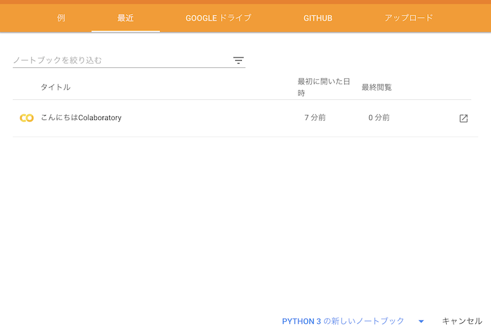

# ゼロから学ぶPython

## この記事について

プログラム初学者がPythonを学ぶための資料にする予定。とりあえず書きなぐってあとで整形する？

## 目的

Pythonをゼロから学び、簡単な機械学習ができるようになることを目指す。Google Colabを使うことで環境構築をせず、ブラウザだけで実習形式で学ぶ。プログラミング言語としてはPythonを用いるが、適宜他のプログラミング言語を参照することで「ある言語の常識は他の言語の非常識」であり、やりたいことが同じでも実現方法はいろいろあること、プログラミング言語にはそれぞれ固有の哲学があることなどを実感する。読者としてはプログラムをほとんど触ったことがない学生を想定する。

## なにを書こうかな

とりあえず思いつくままに。

* REPLについて
  * ipythonにも触れておく
* プログラムはどのように解釈され、実行されているか (disやastでVMや抽象構文木を見せる)
* コーディングスタイル
  * PEP8の簡単な説明
  * よいプログラムを書くために
  * VCSの説明も軽くしておきたい
* 基本型と文法
  * 型」について
  * 変数とはなんだろう？
    * 変数は箱?名札?
    * 浅いコピー、深いコピー
    * エイリアス
    * for i in は、「i」じゃなくて良い
    * 変数の問題はリストやタプルの時に再訪したほうが良さそう。
  * 制御構造(if文とか)
* データ構造
  * リスト、タプル、セット、辞書
  * ここで内包表記もやる？
* 繰り返し処理
  * ロジスティックマップ
  * マンデルブロ集合
* 関数とスコープ
  * 再帰処理
  * 入れ子構造になったリストの数値の合計(ディレクトリの処理を例に)
* オブジェクト指向
  * クラスとインスタンス
  * どこまで深入りするかなぁ。継承もやるべき？
* ファイル入出力、文字列処理
  * コンテキストマネージャ
  * 迷路を作る、解く
    * 与えられた迷路を解釈する
    * 迷路を解く
    * Union Findアルゴリズムを使った迷路の自動生成
* Pillowを使った画像処理
  * SVDを使った画像の近似
* 例外処理はどうしようかな
* 参照の値渡しもどこかで触れたい
* 浅いコピーと深いコピー
* なんかアニメーション的な、動くものもやりたいなぁ。
* 画像分類
* Chainerやっちゃう？
* pyenvやpipその他は触れるだけにするか

## 第一講

### 本講の目的

* Google ColabでPythonのコードに触れる。
* プログラムはどのように実行されているのか、実感する。

### Google Colabの設定

本稿では、Google Colaboratory、略してGoogle Colab(グーグル・コラボ)を使ってPythonを学ぶ。
Google ColabはGoogleによるクラウドに用意されたJupyterノートブーク環境であり、ブラウザさえあればPythonが実行できる。
この環境が完全に無料で使えるというのだから恐れ入る。まずはGoogle Colabの簡単な使い方を学ぼう。

以下、Googleアカウントは持っているものと仮定する。

まず、Googleにログインした状態で、[Google Colabのウェブサイト](https://colab.research.google.com)にアクセスする。Googleアカウントの優先言語が日本語になっていれば日本語で表示されると思うが、もし英語で表示されたら、アカウント設定で日本語に設定する。稀に日本語に設定してもGoogle ColabやGoogle Driveのメニューが日本語にならない場合がある。その際は一度、英語などの別の言語に設定してから日本語に戻すとうまく設定されるようだ。

正しくアクセスできると、以下のようなウェルカムメニューが表示される。

ここで「PYTHON 3の新しいノートブック」をクリックしよう。Untitled0.ipynbという名前のファイルが作成され、入力待ちとなる。

この三角の矢印のある行に、なにか入力してみよう。たとえば「3+5」と入力し、「三角ボタンをクリック」するか、「シフトキーを押しながらリターン」を入力する。以下、この動作を「実行する」と呼ぶ。

矢印がしばらくくるくる回ってから、\[1\]という表記に変わり、答えである8が表示されたと思う。これは

* 「3+5」というPythonのコードがクラウドに送信され
* クラウドでPythonが実行され
* その結果である8が表示された

ということが起きている。

Jupyterノートブックは、「セル」と呼ばれる単位で編集を行う。先程入力した「3+5」と、結果の「8」がまとめて一つのセルである。実行後、新たな「セル」が作られ、入力待ちになっている。そこに「a = 12345」と入力して、また実行してみよう。

こんどは何も実行結果が出力されない。これは「aという変数を作成し、そこに12345という値を代入せよ」という意味だ。これにより「a」という変数に「12345」という整数の値が記憶されている。これを表示してみよう。次のセルに「print(a)」と入力して実行せよ。

「12345」という表示が得られたはずである。変数の値を表示するだけなら、「print」は不要である。左上の「+ コード」と書かれたところをクリックし、出てきたセルに「a」とだけ入力して実行せよ。やはり「12345」という表示が得られたはずである。

さて、ここまでで5つのセルができたはずである。これらは自由に編集、再実行することができる。\[2\]の「a=12345」を修正し、「a=6789」として実行してみよう。その後、4番の「print(a)」や5番の「a」のセルを実行し、出力が変わることを確認せよ。

不要なセルは削除することができる。セルの右側のメニューから「セルの削除」を選ぶとセルが削除できる。また、上段のメニューの「↑ セル」や「↓ セル」で、セルの順番を入れ替えることもできる。

### より実践的なPythonコード例

TODO: 画像処理やるのが面白いかな？

### 余談：タッチタイピングについて

今後どうなるかはわからないが、少なくとも現時点において最速の情報入力デバイスはキーボードであろう。今後もしばらく重要な入力インターフェースとしてキーボードが使われる見込みである。さて、キーボードを使って情報を入力するためには、指でキーを叩かなければならない。この時、キーボードを見ないでキーを叩くことを「タッチタイピング」と呼ぶ。この講義を受けている人で、もしまだタッチタイピングができない人がいたら、絶対にマスターしたほうが良い。よく誤解されるが、タッチタイピングは「キーをすばやく叩く」ためのものではない。もちろんキー入力は早いに越したことはないが、それより重要な役目は **キー入力で肩が凝らないようにする** ことである。今後、どのような職業につくにせよ、その多くはパソコンを使った作業を伴うであろう。この時、正しくない姿勢で打鍵したり、ディスプレイとキーボードの間を忙しく視線移動しながら打鍵していると、そのうちひどい肩凝りに悩まされるようになる。肩凝りに悩まされながら知的作業を行うのはかなり困難である。キーボードの「F」と「J」のキーを見よ。小さな突起があり、手で触ってわかるようになっているであろう。左右の人差し指を「F」と「J」のキーに置くことを「ホームポジション」という。そこから様々なキーを「見ないで」打鍵するのがタッチタイピングである。早く打鍵するのではなく、ゆっくり正確に、手の重さを机に逃がすことを意識しながら打鍵するように心がけよう。一週間も練習すればタッチタイピングできるようになり、一生その恩恵を受けることができる。タッチタイピングは絶対にマスターする価値がある技術の一つである。

### プログラムが実行される仕組み

今、ブラウザ上で入力したプログラムが実行され、その結果を受け取った。Pythonのプログラムはクラウド上で実行されたが、そのブラウザを実行しているのはローカルなPCである。では、そもそもプログラムとはどうやって動いているのだろうか？せっかくプログラミングを覚えるのだから、計算機がどういう仕組みで動いているのか知っておいた方が良いだろう。なお、渡しは古い人間なので、コンピュータのことをどうしても「計算機」と呼んでしまう。以後、パソコンやCPUなどを指して「計算機」と呼ぶのでそのつもりでいて欲しい。

いま、目の前にある計算機は、ディスプレイ(表示装置)、キーボードやマウス(入力装置)、CPU(計算装置)、メモリ(記憶装置)などから構成されている。ディスクなどのストレージやネットワークなどの通信装置については今は忘れよう。このうちCPUがもっとも重要な装置であるが、やっていることは非常に単純で、

* メモリから命令とデータを取ってくる
* 命令を解釈し、データを演算器に投げる
* 演算器から返ってきた結果をメモリに書き戻す

ということをひたすら繰り返しているに過ぎない。「命令」も一種のデータであり、メモリに置いてあることに注意しよう。さて、計算機が解釈できるのは数字だけである。したがって、人間が計算機に命令するためには、機械語(マシン語)と呼ばれる数字の羅列を使う必要がある。しかし、機械語を手で書くのは非常に面倒なので、人間が理解できる形式でプログラムを書き、それを計算機が理解できる形式に変換してやる必要がある。その「人間が理解できる形式」がプログラム言語と呼ばれるものである。

プログラム言語には、大きく分けてコンパイル言語とインタプリタの二種類がある。C++などはコンパイル言語の代表格的な言語である。コンパイラと呼ばれるプログラムが、人間の書いたプログラムをあらかじめ全て機械語に翻訳してから実行する。インタプリタとは、人間の書いたコードを逐次的に解釈しながら実行する方式であり、Pythonもインタプリタに属す。しかし、プログラムをそのまま解釈、実行すると遅いため、Pythonは「バイトコード」と呼ばれる中間形式を出力し、それを実行することで高速化を図る。バイトコードを実行するプログラムを仮想マシン(Virtual Machine, VM)と呼ぶ。

TODO: VMの説明。Javaとの比較など

TODO: dis.disによるバイトコードの確認

TODO: レジスタマシン、スタックマシンの説明もする？高度すぎか？

## 参考文献

昨今、ウェブに大量に情報があるため、本など買わなくてもプログラムは独習できると思うかもしれない。しかし、ある程度わかってから見ると、いかにウェブに転がっている情報がいい加減で、薄いかがわかるようになる。特にプログラム言語に関しては誤り、誤解、意味のない文章が大量にあり、それらガラクタをかき分けて重要な情報にたどり着く努力をするよりは、さっさと数千円〜1万円ほど払って古典的名著を購入したほうが早いし有用だ。もちろん本にも当たり外れはあるが、以下は筆者が良いと思った本なので、一つの参考にしてほしい。

### 初学者向け

まったくPythonなどを触ったことが無い人が読む本。

* [入門Python3 Bill Lubanovic (著), 斎藤 康毅  (監修), 長尾 高弘  (翻訳)](https://www.amazon.co.jp/dp/4873117380) プログラムに限らずなにかを学ぶ際、最初は「軽い、薄い」本を読みたくなるが、真面目にやろうとすると、どこかで「重い、厚い」本を読む必要が出てくる。とりあえずオライリーの本を買っておけば間違いない。
* [15時間でわかるPython 集中講座 小田切 篤 (著), 露木 誠  (著)](https://www.amazon.co.jp/dp/4774178926) 全体の構成の参考にした。

### 中級者向け

Pythonでだいたいプログラムが書けるようになった、もしくは複数のプログラム言語が書けるようになってきた人が読む本。

* [コーディングを支える技術 ~成り立ちから学ぶプログラミング作法 (WEB+DB PRESS plus) 西尾 泰和著](https://www.amazon.co.jp/dp/477415654X) プログラムを構成する要素について、様々な言語にまたがって説明することで「なぜその文法が導入されたのか、廃止されたのか」などを紐解く。一つの言語があらかたマスターできたあたりで読むといろいろ発見があるだろう。

* [リーダブルコード ―より良いコードを書くためのシンプルで実践的なテクニック (Theory in practice)](https://www.amazon.co.jp/dp/4873115655) 文法がわかり、とりあえず「動く」プログラムがかけるようになったら、次は「どのように書くべきか」を気にするべき。この本は読みやすいコード(リーダブルコード)を書くためのテクニックが詰まった古典的名著。手元において、たまに読んでみよう。その度に新たな発見があることだろう。

### 上級者向け

上級者といっても、別にプログラムがバリバリかけるという意味ではなく、たとえばプログラム書いてご飯を食べるようになっているとか、そういう感じの人が読むと面白いかな、と思う本。

* [闘うプログラマー G パスカル ザカリー (著), 山岡 洋一 (翻訳)](https://www.amazon.co.jp/dp/B00GSHI04M) マイクロソフトでWindows NTを開発した伝説のプログラマー「デイヴィッド・カトラー」の伝記のような本。Windows NTは、文字通りマイクロソフトの命運をかけたプロジェクトだった。「デスマーチ」と気軽に呼ぶのもおぞましい強行軍の描写に、僕は最初吐きそうになった。複数人である程度大きなプロジェクトに携わったことがある人は必読。

### その他参考にしたサイト

* [オブジェクト指向と20年戦ってわかったこと @Qiita](https://qiita.com/shibukawa/items/2698b980933367ad93b4) 「オブジェクト指向」について改めて考える良いきっかけになった。
* [「例外」がないからGo言語はイケてないとかって言ってるヤツが本当にイケてない件  @Qiita](https://qiita.com/Maki-Daisuke/items/80cbc26ca43cca3de4e4) 「例外」について改めて考える良いきっかけになった。

* [Pythonの処理系はどのように実装され，どのように動いているのか？ 我々はその実態を調査すべくアマゾンへと飛んだ． @Slideshare](https://www.slideshare.net/utgw/python-73389442) PythonのVMについて参考にした。