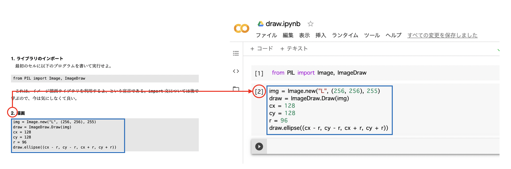

# 本書の使い方

本書は、これまでプログラミングにほとんど触れたことがない学生向けのプログラミングの講義のノートとして書かれたものだ。Google Colaboratory (以下、Google Colab)を使うことで、ネットワークにつながったPCとブラウザさえあればすぐに始められるようになっている。言語としてはPythonを用いるが、Pythonを学ぶことそのものを目的とせず、プログラミングの考え方や、計算機の仕組み、代表的なアルゴリズムなどに触れることを目的としている。

本書は14章から構成され、各章が1回の講義に対応している。最初に30分程度「今回は何を学ぶか」の説明をして、その後60分程度を実習にあてる。各章の前半は、その回の講義で学ぶことが記載されており、後半には実習のための課題がある。最初の30分の説明のための講義スライドが[オンライン上に公開されている](https://kaityo256.github.io/python_zero/)ので、適宜参照されたい。

課題は、

1. 新しいノートブックを開き、名前をつける
2. 各セルの内容を入力し、実行する (穴埋め問題がある場合もある)
3. 結果について考察する

という形式で進む。課題では、既に用意されているプログラムを入力する、いわゆる「写経」がメインとなる。写経は敬遠されることも多いのだが、よく使うイディオムを覚えることができるし、また入力ミスをした場合にエラーメッセージを見て修正する練習にもなるため、全くプログラムを触ったことがない初学者が最初に行うには悪くない学習方法である。

課題は、各セルごとに別れており、セルの番号が付与してある。例えば課題に「2. 描画」などとあったら、これは上から2番目のセルに入力する内容であることを意味する。なお、実行の順序や繰り返し実行等により、実際のセルに表示される番号は変わる場合があることに注意してほしい。課題には穴埋め問題が用意されている場合があるが、ヒントを見れば何をすればよいかはわかるようになっている。

各章には発展課題も用意されている。これは講義時間中には取り組まなくても良いもので、課題が早く終わった人や、講義中には終わらなかったが、興味があって講義後にも学びたい人向けに用意されている。発展課題は、その章までの知識では解けない問題が含まれている場合もあるので、わからない場合は飛ばして、後から取り組むと良いであろう。どうしてもわからない問題があれば、Web上に略解があるので参照されたい。

本書でプログラムを自習する場合でも、必ずプログラムを入力し、実行してみてほしい。プログラムは座学では身につかないし、なにより動くのを見ないと面白くない。本書の課題の多くは結果がグラフや画像、アニメーション等で表示されるように工夫されており、ただ実行してみるだけでも面白いと思う。

Pythonを使って実際に何か作業をする場合は、Google Colabではなく、ローカルにインストールされたPythonを使いたくなるであろう。そのために、付録としてPythonのインストール方法も用意した。

本書により「プログラムは面白い」と思う人が増えたならば望外の喜びである。
