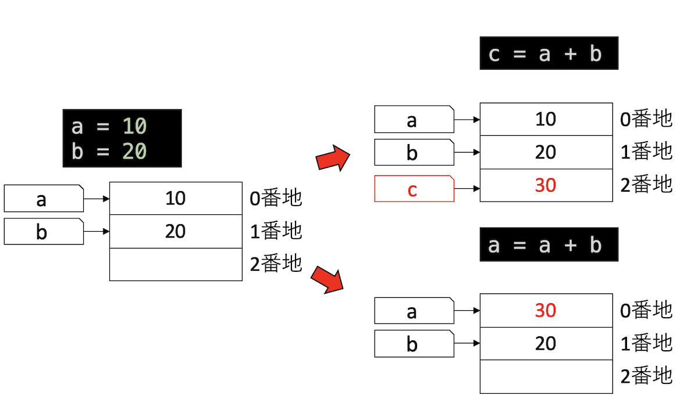
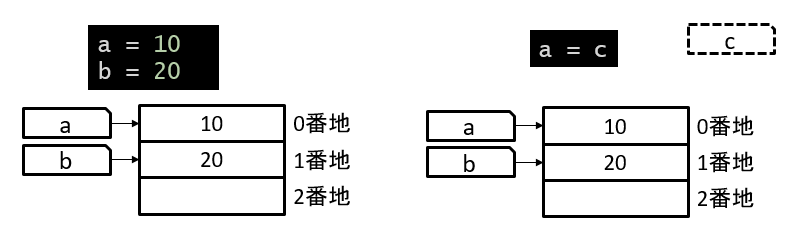
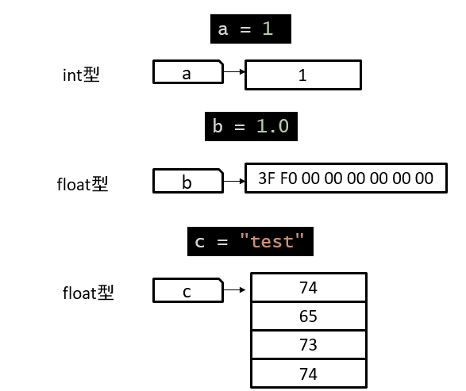
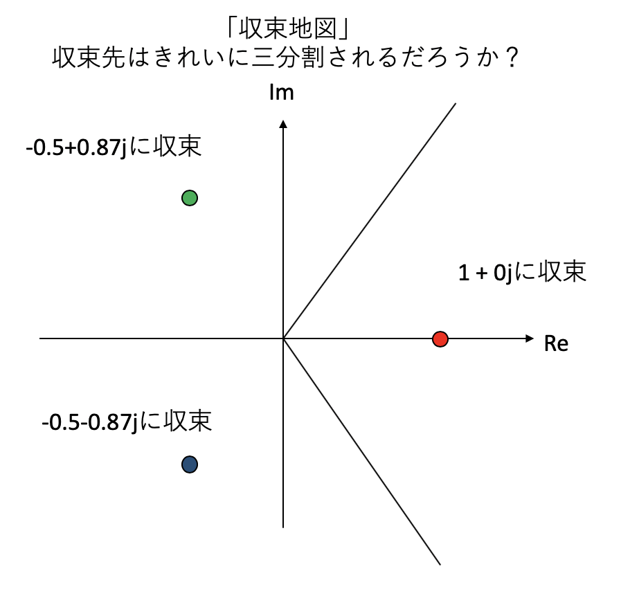

# 条件分岐と繰り返し処理

## 本講で学ぶこと

* for文による繰り返し処理
* if文による条件分岐

## 変数と型

### 変数

Pythonに限らず、プログラミング言語には **変数(Variable)** という概念が出てくる。変数は簡単なように見えて、意外に理解が難しい概念である。ここで例え話を多用すると一見理解しやすいように見えて後で混乱する原因になるため、ここでは変数の実装に近いところから説明する。ただし、簡略化してあり、実装そのものではないので注意して欲しい。

計算機とは、メモリにあるデータをCPUで処理して、またメモリに書き戻す機械である。メモリには「番地」という通し番号がついており、例えば足し算なら「0番地と1番地のデータを読み込んで足してから2番地に書き込め」といったことを指示する。しかし、いちいちどの値がどこにあるか番地で覚えるのは面倒だ。そこで変数というラベルを使うことにする。以下のプログラムを見てみよう。

```py
a = 10
```

これは、`a`という変数を用意し、そこに`10`という値を代入せよ、という意味だ。実際には、メモリ上に`a`というラベルを貼り、そこに`10`を書き込む、という処理をする。同様に`b = 20`とすると、`b`というラベルが作られ、そこに`20`が書き込まれる。

```py
a = 10
b = 20
```

`print`という命令を使うと、変数が指す値を確認することができる。

```py
print(a) # => 10
```

今後、`# =>`という記号は、「左を実行すると、右の結果が得られるよ」という意味だと約束する。

Jupyter Notebookでは、変数名だけを含む、もしくはセルの最後に変数名だけを含むセルを実行すると、その値を確認することができる。

```py
a # => 10
```

さて、この状態で`c = a + b`を実行してみよう。まず、右の`a+b`が評価される。その結果得られた値`30`を`c`の指す場所に書きこもうとするが、まだ`c`という変数は作られていないので、まず`c`の場所が作られてからそこに値が書き込まれる。一方、`a = a + b`を実行した場合は、`a`の場所はすでに存在するので、その値が更新される。



このようにPythonでは、代入文があった時、その左辺にある変数が未定義なら作成され、定義済みなら値を更新する。

定義されていない変数を使おうとするとエラーになる。

```py
a = 10
b = 10
a = c # => NameError: name 'c' is not defined
```

上記の例では、`a`と`b`だけ定義された状態で、`a`に`c`というラベルの指す内容を代入せよと指示しているが、この時点では`c`というラベルがないためにエラーになっている。



### 型

変数とは、メモリにつけられた「ラベル」である。メモリには整数しか保存できないが、プログラムでは小数点を含む数や文字列なども表現したい。そこで、「このメモリの値をどう解釈するか」を指定する必要がでてくる。これが **型(Type)** である。全ての値や変数には型がある。

例えば、`1`が代入された変数は **整数 (int)**の型を持っている。変数の型は`type`という命令で知ることができる。

```py
a = 1
type(a) # => int
```

小数点を含む数字は **浮動小数点数 (float)** になる。

```py
b = 1.0
type(b) # => float
```

ダブルクォーテーションマーク`" "`やシングルクォーテーションマーク`' '`で囲まれた文字は **文字列 (str)** として扱われる。

```py
c = "test"
type(c) # => str
```

例えば文字列の場合、メモリに`0x74`という数値(以後、頭に`0x`がついていたら16進数表記)があった場合、それをアルファベット小文字の`t`と解釈しましょう、という約束を決めておく。変数`c`の`str`という型は、`c`が指す先のメモリを「文字列として解釈する」という意味を持つ。すると、変数`c`が指している`0x74,65,73,74`という数値列が`test`という文字列として解釈される。

同様に、例えば`1.0`という浮動小数点数は、メモリ上では`0x3FF0000000000000`という8バイトの数字で表現されている。これをある約束(IEEE754という規格)に従って解釈すると`1.0`という数値となる。



整数や浮動小数点数は四則演算が可能である。同じ型同士の演算は原則としてその型になる。

```py
type(1+2) # => int
type(1.0+2.0) # => float
```

ただし、整数の割り算だけ注意を要する。Pythonでは、整数同士の割り算は、たとえ割り切れる場合でも、値は浮動小数点数になる。

```py
4 / 2 # => 2.0
```

割り算のあまりを切り捨てた整数値が欲しければ`//`と、`/`記号を二つ続けた演算子を用いる。

```py
5//2 # => 2
```

整数型と浮動小数点数型の演算結果は浮動小数点数型になる。

```py
print(1+1.0) # => 2.0
type(1+1.0) # => float
```

文字列同士は足し算ができる。

```py
"Hello " + "World!" # => "Hello World!"
```

文字列と数値の演算はできない。

```py
"1" + 2  # => Type Error
```

`int`や`float`で囲むと文字列から整数や浮動小数点数に変換できるので、演算も可能になる。

```py
int("1") # => 1
int("1") + 2 # => 3
float("1") + 2 # => 3.0
```

### 真偽値

**真偽値(bool)** とは **真(True)** であるか **偽(False)** であるかの二値だけを取る型で、条件分岐などで使われる。

値を比較すると真偽値になる。条件分岐や、ループの終了条件等に用いる。

```py
1 == 1 # => True
1 == 2 # => False
1 != 1 # => False
1 != 2 # => True
1 < 2  # => True
1 > 2  # => False
1.0 < 2.0 # => True
```

文字列の比較もできる。

```py
"test" == "test" # => True
"hoge" < "piyo" # => True
```

真偽値は、`not`をつけると真偽値が反転する。

```py
not True # => False
not False # => True
```

二つの真偽値を使って論理演算もできる。`and`は「かつ」、`or`は「または」を意味する。例えば「真かつ偽」は「偽」に、「真または偽」は「真」となる。

```py
True and False # => False
True or False # => True
```

### 浮動小数点数

浮動小数点数は「0.1」「123.45」といった、整数ではない値を表現する。整数と同様に四則演算や比較ができる。

```py
0.5 + 0.5 # => 1.0
0.5 * 0.5 # => 0.25
0.5 < 1.0 # => True
```

ただし、浮動小数点数は内部的には **その数値に最も近い近似値** を扱っているため、誤差を持つ。例えば0.1を3回足しても0.3にならないことに注意。

```py
0.1 + 0.1 + 0.1 # => 0.30000000000000004
0.1 + 0.1 == 0.2 # => True
0.1 + 0.1 + 0.1 == 0.3 # => False
```

したがって、**浮動小数点数同士の等号比較は信頼できない**。浮動小数点数同士の等号比較は、意図通りに動作しない場合がある。慣れていないプログラマがよく入れるバグなので注意すること。

### 複素数

Pythonは複素数も扱うことができる。虚数単位が`i`ではなく`j`なので注意。実部、虚部は`real`、`imag`で取り出すことができる。また、複素数は整数で記述しても浮動小数点数として扱われることに注意。複素数の宣言は`1+2j`のように書くか、`complex(1,2)`のように書く。

```py
1 + 2j # => (1+2j)
complex(1,2) # => (1+2j)
(1+2j) + (2+4j) # => (3+6j)
(1+2j)*(1-2j) # => (5+0j)
(1+2j).real # => 1.0
(1+2j).imag # => 2.0
```

## 条件分岐と繰り返し

### forによる繰り返し処理

繰り返し処理は以下のように書ける。

```py
for i in range(10):
    print(i)
```

これは、iの値を0から9まで変化させながら、`print(i)`を実行しなさい、という意味である。この繰り返し文を **ループ (loop)** と呼び、ループ中に値が変わりながら繰り返し実行される変数を **ループカウンタ (loop counter)** と呼ぶ。`for`がある文の最後に「コロン」があるが、Pythonは「コロン」の後にブロックを伴う。`for`文では、続くブロックの中身を繰り返し処理する。

ループで繰り返し処理するブロックは何行でも良い。ただし、同じブロックは同じ幅のインデントをしなければならない。

```py
for i in range(10):
    j = i * 2
    print(j)
```

ループカウンタに用いる変数には何を使っても良い。例えば以下のよう`i`の代わりに`j`を用いても同じ結果となる。

```py
for j in range(10):
    print(j)
```

ループカウンタには長い変数名を使っても良い。

```py
for abracadabra in range(10):
    print(abracadabra)
```

また、ループカウンタが不要である場合(現在何回目かが必要ない場合)には`_`を使う。

```py
for _ in range(10):
    print("Hello") # Helloが10回表示される
```

### 条件分岐

「もし〜なら」という処理を条件分岐と呼び、`if`文で書く。`if`の後ろには真偽値を与えるような式を書く。

```py
if 5 > 3:
    print("5>3")
```

`if`文に書かれた条件が成立した場合に、後に続くブロックを実行する。

「もし〜ならAをせよ、そうでなければBをせよ」という場合には`else:`を使う。

```py
if 5 < 3:
    print("A") # 実行されない
else:
    print("B") # => B
```

「もし〜ならAをせよ、そうでない場合で〜ならBをせよ」という場合には`elif`を使う。

```py
a, b = 1, 2
if a == b:
    print("a == b")
elif a > b:
    print("a > b")
else:
    print("a < b")
```

if文は入れ子構造にできる。例えば、変数`a`が、「5以下」「5より大きく10未満」「10以上」の3つの領域のどこに存在するか知りたい場合、以下のようなコードを書けばよい。

```py
if a > 5:
    if a < 10:
        print("5 < a < 10")
    else:
        print("10 <= a")
else:
    print("a <= 5")
```

条件分岐においては、「どのような入力が来ても、必ずいずれかのブロックが実行されるか」に注意してプログラムを組んで欲しい。例えば、変数`a`が正か負かで処理を判定したい場合、

```py
if a > 0:
  # 正の時の処理
if a < 0:
  # 負の時の処理
```

と、２つの`if`文で書いてしまうと、`a`がゼロの時にどちらもすり抜けてしまい、見つけづらいバグの原因となる。これを

```py
if a > 0:
  # 正の時の処理
else:
  # そうでない場合 (負と0の可能性がある)
```

最後に`else`節をつけておけば、`a`にどのような値が来ても「どちらか」は必ず実行される。複雑な条件分岐を書く場合は、「Xであるか、そうでないか」に分けて`if`と`else`で分解していくと「条件漏れ」が発生しづらく安全である。

## ニュートン法

以上の知識で、何かコードを書いてみよう。ある方程式を解きたいが、その解が厳密にはわからないとする。この解を数値的に求める場合によく用いられるのがニュートン法である。

いま、

$$
f(x) = 0
$$

という方程式を解きたいとする。もし、真の解を$x$として、それに近い値$\tilde{x} = x+\epsilon$があったとする。$f(x)$を$\tilde{x}$の周りでテイラー展開すると、

$$
f(\tilde{x} - \varepsilon) = f(\tilde{x}) - \varepsilon f'(\tilde{x}) + O(\varepsilon^2)
$$

$\varepsilon$の2次の項を無視した状態で、$f(\tilde{x} - \varepsilon)$が0となるように$\varepsilon$の値を選ぶと、

$$
\varepsilon = \frac{f(\tilde{x})}{f'(\tilde{x})}
$$

$\tilde{x} = x + \varepsilon$であったから、$\varepsilon$を引けば、より真の値に近づくはずである。以上から、

$$
x_{n+1} = x_n - \frac{f(x_n)}{f'(x_n)}
$$

という数値列を得る。これは、

* 現在の解候補$x_n$の場所で接線を引き
* 接線と$x$軸との交点を次の解候補$x_{n+1}$とする

という手続きになっている。

この数列が収束するということは$x_{n+1} = x_n$なので、$f(x_n)=0$が満たされなければならず、それはすなわち$x_n$が解に収束したことを示す。これを確認してみよう。

いま、$x^3 = 1$の解を知りたいとする。この時、$f(x) = 0$の形に書きたいので、$f(x) = x^3 - 1$である。$f'(x) = 3 x^2$であるから、対応するニュートン法のアルゴリズムは、

$$
x_{n+1} = x_n - \frac{x_n^3 -1}{3 x_n^2}
$$

である。

さて、$x^3 -1 = 0$という方程式の解は、実数の範囲なら$x=1$の一つしかないが、複素数まで考えれば三つ存在し、それぞれ$x=1, -1/2 \pm \sqrt{3}/2 i$である。では、複素平面上でニュートン法を実行したら、三つの解を見つけることができるだろうか？おそらくそれぞれの解に近いところからスタートすればその解に収束すると考えられるが、遠いところからスタートしたらどうなるだろう？単純に考えると、複数の解がある場合は初期値に一番近い解に収束すると期待されるが、そうなるだろうか？課題では、複素平面上の様々な場所を「初期値」としてニュートン法を実行し、どこに収束したかで色分けして「収束地図」を作ってみよう。



## 条件分岐と繰り返し処理：課題

### 課題1 ニュートン法の実装

新しいノートブックを開き、`newton.ipynb`という名前をつけよ。

#### 1. 関数`newton`の実装

最初のセルに以下のように入力し、実行せよ。

```py
def newton(x):
    for _ in range(10):
        x = x - (x**3 - 1) / (3 * x**2)
        print(x)
```

ここで`def newton(x):`とあるのは、「`newton`という関数を定義し、`x`という名前で値を受け入れるよ」という宣言である。関数については次回紹介するが、ここでは

* `def 関数名(入力):`という形で関数が宣言できる
* 定義した`関数名(入力)`という形で呼び出すことができる
* 関数内で`return 値`とすると、値を返すことができる

ということを覚えておけば良い。

#### 2. 関数`newton`の動作確認

初期値として2.0を入れてみよう。2つ目のセルに、以下のように入力、実行せよ。

```py
newton(2.0)
```

実行結果が解である1.0に近づいていくことがわかるだろう。実際、ニュートン法の収束は非常に早く、一度繰り返すごとに精度が倍になっていく。

#### 3. 複素数の入力(実数解)

$x^3 -1 = 0$の解は、実数の範囲では$x=1$しかないが、複素数まで考えれば三つ存在し、それぞれ$x=1, -1/2 \pm \sqrt{3}/2 i$である。複素数の場合にもニュートン法が機能することを確認しよう。
3つ目のセルに、以下の入力し、実行せよ。

```py
newton(2+0j)
```

先程と同じ値だが、複素数として入力している。1.0に収束するが、表示が複素数になることを確認せよ。

#### 4. 複素数の入力(複素数解)

次は`-1 + 1j`を入力してみよう。4つ目のセルに以下のように入力し、実行せよ。

```py
newton(-1+1j)
```

$x=-1/2 + \sqrt{3}/2 i$に収束するはずである。

#### 5. 複素数の入力(複素数解の別解)

同様に、5つ目のセルに初期値として`-1-1j`を入力してみよう。

```py
newton(-1-1j)
```

今度は$x=-1/2 - \sqrt{3}/2 i$に収束するはずである。

### 課題2 ニュートン法の収束地図

先程、ニュートン法が複素数の場合にも機能し、$x^3 - 1 = 0$の解を三つとも見つけられることを確認した。
ナイーブに考えると、複数の解がある場合、初期値に近い解に収束すると考えられる。では、複素平面のどこからスタートしたらどこに収束するだろうか？単純に三分割になるだろうか？

複素平面の様々な場所を初期値として、

* `1+0j`に収束したら赤
* `-0.5+0.87j`に収束したら緑
* `-0.5-0.s87j`に収束したら青

に塗ることで、「どの場所からスタートしたらどこに収束するか」という「収束地図」を作ってみよう。

新しいノートブックを開き、`newton_map.ipynb`という名前をつけて保存してから、以下のプログラムを4つのセルに分けて入力せよ。

#### 1. ライブラリのインポート

最初のセルで、必要なライブラリをインポートしよう。入力したら実行するのを忘れないこと。

```py
from PIL import Image, ImageDraw
```

#### 2. 関数`newton`の実装

2つ目のセルに、関数`newton`を実装しよう。先ほどと異なり、ニュートン法による反復を10回繰り返したのちに、収束した値を返す。

```py
def newton(x):
    for _ in range(10):
        x = x - (x**3 - 1) / (3 * x**2)
    return x
```

ここで、`return x`のインデントに注意。`x = x - (x**3-1)/(3*x**2)`ではなく、`for`と同じ高さにしなければならない。

#### 3. プロット用の関数`plot`の実装

3つ目のセルに、以下を入力せよ。

```py
def plot(draw, s):
    hs = s // 2
    red = (255, 0, 0)
    green = (0, 255, 0)
    blue = (0, 0, 255)
    for x in range(s):
        for y in range(s):
            z = complex(x - hs + 0.5, -y + hs + 0.5) / s * 4
            z = newton(z)
            # ここを埋めよ
            draw.rectangle([x, y, x + 1, y + 1], fill=c)
```

ただし、上記の「ここを埋めよ」の箇所に

* `z`の実部が正なら`c = red`
* `z`の実部が負かつ虚部が正なら`c = green`
* `z`の実部が負かつ虚部も負なら`c = blue`

を実行するようにプログラムを書くこと。

ヒント1： `z`の実部は`z.real`で、虚部は`z.imag`で得ることができる。

ヒント2： `if`文は以下のように書ける

```py
if 条件:
    条件が成立した時に実行したいこと
else:
    条件が成立していない時に実行したいこと
```

例えば、`a`が正かどうかで処理を分けたいなら、

```py
if a > 0:
    print("aは正です")
else:
    print("aは負か0です")
```

と書ける。

ヒント3： `if`文は多段にできる。

例えば、条件Aと条件Bがあった場合、以下のように書ける。

```py
if A:
    print("条件Aが成立")
else:
    if B:
        print("条件Aが不成立かつ条件Bが成立")
    else:
        print("条件Aが不成立かつ条件Bも不成立)
```

#### 4. 画像の表示

ここまで入力したプログラムを用いて、収束地図を作ってみよう。4つ目のセルに以下を入力せよ。

```py
size = 512
img = Image.new("RGB", (size, size))
draw = ImageDraw.Draw(img)
plot(draw, size)
img
```

正しく入力できていれば、上記を実行した際に「収束地図」が描けたはずだ。どのような地図になっただろうか？

ニュートン法の繰り返し数が10だと原点付近の収束が甘い。20くらいにして再実行してみよ。逆に5に減らすとどうなるだろうか？

### 発展課題：四次方程式の収束地図

先程は$x^3 - 1 = 0$の解を考えた。次は$x^4 - 1 = 0$の解を考えてみよう。この方程式には$x = \pm 1$、$x = \pm i$の4つの解が存在する。この解をニュートン法で探し、「収束地図」を描け。

ヒント1：$x^4-1$の時のニュートン法の手続きは以下の通り。

$$
x_{n+1} = x_n - \frac{x_n^4-1}{4x_n^3}
$$

ヒント2：以下の2つの条件による、合計4つの場合分けが必要になる。

* `z`の実部と虚部の和が正か負か
* `z`の実部と虚部の差が正か負か

ヒント3：色がもう一色必要になる。何色でも良いが、例えば

```py
    purple = (255, 0 ,255)
```

を追加せよ。

## 余談：バグについて

プログラムが何か意図しない動作をする場合、その原因となる箇所をバグと呼ぶ。バグの語源については諸説あるようだ。「i」と「l」と「1」など、似ている文字を誤入力してしまったり、考慮すべきケースを忘れていたり、バグの原因は様々である。単純なバグについては、コンパイラや検査ツールの充実、テスト手法の向上などにより事前に検出できるようになってきた。そんななか、未だによく見かけるバグにオーバーフローバグがある。コンピュータが扱える数字には上限がある。たとえば整数は32ビットで表現されることが多い。符号無し整数の場合、表現できる最大の数は4294967295、つまり43億ちょっとである。符号付きの場合は、符号に1ビット使うので最大の数はその半分になる。この数字を超える、すなわち最大値を取っている変数に1を足すと、またゼロに戻ってしまう。オーバーフローバグは、よくタイマー周りに潜む。例えば、ボーイング787という飛行機の電源制御システムが、連続して248日動作させると不具合を起こすことが報告された。慣れたプログラマなら、「248日」と聞いた瞬間に「あ、オーバーフローやったな」と気がつく。248日とは21427200秒である。31ビットで表現できる最大の数は2147483647であるから10ミリ秒を単位に動作する31ビットのクロックが、248日でオーバーフローしたと考えられる。同根のバグに「497日問題」とか「49.7日問題」があるので、興味があれば調べられたい。

値があふれるのとは逆に、値が0になってるのに引き算をすることで値が大きくなるバグもあり、こちらもオーバーフローバグと呼ばれている。有名なのは「突然キレるガンジー」であろう。Civilizationという、文明を発展させるゲームがある。歴史上の有名人をプレイヤーとして選び、世界制覇などを目指すゲームである。この中のプレイヤーにガンジーがいた。ガンジーは「非暴力、不服従」の提唱者であり、平和主義者なのであるが、文明がある程度発展すると突如として核攻撃をしかけてくるようになる。原因はオーバーフローバグであった。Civilizationでは各プレイヤーには攻撃性が設定されており、文明が民主主義を採用すると攻撃性が2下がる、という仕組みがあった。さて、ガンジーの攻撃性は最低の1なのだが、インド文明が民主主義を採用し2を引くと-1になる。しかし、攻撃性は「符号なし8ビット整数」で表現されていたため、1から2を引くと攻撃性最大の255になってしまった。こうして「突然キレるガンジー」が誕生したのである。

整数の表現できる数値に最大値があることに起因するバグは根深く、発見が難しい。かくいう私も、4294967295回に一度意図しない動作をするというバグを入れたことがある。43億回に一度発生するため、研究室のPCでは再現せず、スパコンを使った時にだけ稀に発生したため、原因究明に時間がかかった。バグという概念が生まれてかなりの時間がたったが、まだ人類はバグを根絶できていない。

参考：[オーバーフローが引き起こした面白いバグの話](https://note.mu/ruiu/n/n89d18450b1bb)
