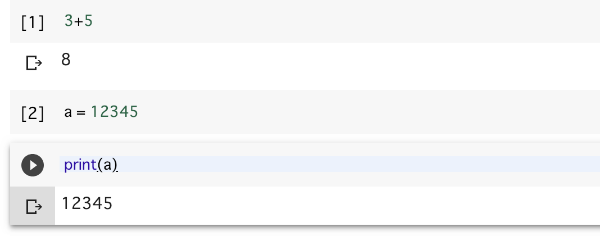

# 第一講

## 本講の目的

* Google Colabの使い方に慣れる
* Pythonに触れてみる

## Google Colabの設定

本稿では、Google Colaboratory、略してGoogle Colab(グーグル・コラボ)を使ってPythonを学ぶ。
Google ColabはGoogleによるクラウドに用意されたJupyterノートブーク環境であり、ブラウザさえあればPythonが実行できる。この環境が完全に無料で使えるというのだから恐れ入る。まずはGoogle Colabの簡単な使い方を学ぼう。以下、Googleアカウントは持っているものと仮定する。

まず、Googleにログインした状態で、[Google Colabのウェブサイト](https://colab.research.google.com)にアクセスする。Googleアカウントの優先言語が日本語になっていれば日本語で表示されると思うが、もし英語で表示されたら、アカウント設定で日本語に設定する。稀に日本語に設定してもGoogle ColabやGoogle Driveのメニューが日本語にならない場合がある。その際は一度、英語などの別の言語に設定してから日本語に戻すとうまく設定されるようだ。

正しくアクセスできると、以下のようなウェルカムメニューが表示される。


ここで「PYTHON 3の新しいノートブック」をクリックしよう。Untitled0.ipynbという名前のファイルが作成され、入力待ちとなる。


この三角の矢印のある行に、なにか入力してみよう。たとえば「3+5」と入力し、「三角ボタンをクリック」するか、「シフトキーを押しながらリターン」を入力する。以下、この動作を「実行する」と呼ぶ。


矢印がしばらくくるくる回ってから、\[1\]という表記に変わり、答えである8が表示されたと思う。これは

* 「3+5」というPythonのコードがクラウドに送信され
* クラウドでPythonが実行され
* その結果である8が表示された

ということが起きている。

Jupyterノートブックは、「セル」と呼ばれる単位で編集を行う。先程入力した「3+5」と、結果の「8」がまとめて一つのセルである。実行後、新たな「セル」が作られ、入力待ちになっている。そこに「a = 12345」と入力して、また実行してみよう。


こんどは何も実行結果が出力されない。これは「aという変数を作成し、そこに12345という値を代入せよ」という意味だ。これにより「a」という変数に「12345」という整数の値が記憶されている。これを表示してみよう。次のセルに「print(a)」と入力して実行せよ。



「12345」という表示が得られたはずである。変数の値を表示するだけなら、「print」は不要である。左上の「+ コード」と書かれたところをクリックし、出てきたセルに「a」とだけ入力して実行せよ。やはり「12345」という表示が得られたはずである。

さて、ここまでで5つのセルができたはずである。これらは自由に編集、再実行することができる。\[2\]の「a=12345」を修正し、「a=6789」として実行してみよう。その後、4番の「print(a)」や5番の「a」のセルを実行し、出力が変わることを確認せよ。

不要なセルは削除することができる。セルの右側のメニューから「セルの削除」を選ぶとセルが削除できる。また、上段のメニューの「↑ セル」や「↓ セル」で、セルの順番を入れ替えることもできる。

## 簡単な描画プログラム

Google Colab上で、簡単な描画プログラムを作成、実行してみよう。現在開いているノートブックに上書きしても良いが、現在開いているノートを閉じて、新たに作成しよう。
まず、「ファイル」メニューの「ゴミ箱に移動」をクリックする。「ノートブックをゴミ箱に移動」というダイアログが出てくるので「COLABORATORY に戻る」を選ぶ。するとまたメニュー画面が出てくるので「PYTHON3の新しいノートブック」をクリックしよう。新しいノートブックが開かれるはずである。今後、ノートが混乱してどうにもならなくなったら、この手順で新しいノートブックを作成すること。

新しいノートブックができたら、最初のセルに以下のプログラムを書いて実行しよう。

```py

```


## 余談：タッチタイピングについて

今後どうなるかはわからないが、少なくとも現時点において最速の情報入力デバイスはキーボードであろう。今後もしばらく重要な入力インターフェースとしてキーボードが使われる見込みである。さて、キーボードを使って情報を入力するためには、指でキーを叩かなければならない。この時、キーボードを見ないでキーを叩くことを「タッチタイピング」と呼ぶ。この講義を受けている人で、もしまだタッチタイピングができない人がいたら、絶対にマスターしたほうが良い。よく誤解されるが、タッチタイピングは「キーをすばやく叩く」ためのものではない。もちろんキー入力は早いに越したことはないが、それより重要な役目は **キー入力で肩が凝らないようにする** ことである。今後、どのような職業につくにせよ、その多くはパソコンを使った作業を伴うであろう。この時、正しくない姿勢で打鍵したり、ディスプレイとキーボードの間を忙しく視線移動しながら打鍵していると、そのうちひどい肩凝りに悩まされるようになる。肩凝りに悩まされながら知的作業を行うのはかなり困難である。キーボードの「F」と「J」のキーを見よ。小さな突起があり、手で触ってわかるようになっているであろう。左右の人差し指を「F」と「J」のキーに置くことを「ホームポジション」という。そこから様々なキーを「見ないで」打鍵するのがタッチタイピングである。早く打鍵するのではなく、ゆっくり正確に、手の重さを机に逃がすことを意識しながら打鍵するように心がけよう。一週間も練習すればタッチタイピングできるようになり、一生その恩恵を受けることができる。タッチタイピングは絶対にマスターする価値がある技術の一つである。