# 『ゼロから学ぶPythonプログラミング』第1刷 正誤表

<!-- 
pandocでHTMLを作成した後、tableのwidth指定を削除しなければならない(sedにより自動化されている)。
-->

注意深く執筆したつもりですが、現時点で[第1刷](https://www.amazon.co.jp/dp/4065218837/)に以下のミスや修正点が見つかっております。ご迷惑をおかけして申し訳ありません。

他に誤りや修正すべき点を見つけた方は、[GitHubのIssue](https://github.com/kaityo256/python_zero/issues)にてご指摘いただければ幸いです。

最終更新日：2021年6月11日

以下の誤植は[Kindle版](https://www.amazon.co.jp/dp/B08Y8N7C11)でも未修正のものです。

| ページ番号 | 誤 | 正 |
| ---  | --- | --- |
| p.21  | 数式の右辺に添字$n$が抜けている。 $x_{n+1} = x_n - \frac{x^3 - 1}{3x^2}$ | $x_{n+1} = x_n - \frac{x_n^3 - 1}{3x_n^2}$ |
| p.26  | 2.4.3発展課題の数式の右辺に添字$n$が抜けている。 $x_{n+1} = x_n - \frac{x^4 - 1}{4x^3}$ | $x_{n+1} = x_n - \frac{x_n^4 - 1}{4x_n^3}$ |
| p. 206| 2行目 「したがって、極限すれば物理学とは微分方程式を解く学問である。」| 「したがって、**極言**すれば物理学とは微分方程式を解く学問である。」|
| p. 93 | 一番下の`Archive: popmap.zip`の記載されたボックスの色が入力を意味する青色 | ボックスの色は出力を意味するベージュ|
| p. 140| 9.3.2の2つ目のボックスの以下の記述  `data = np.array([1,2,3])` | `a = np.array([1,2,3])`|
| p. 140| 9.3.2の下から二つ目のボックスの以下の記述  `print(data)` |  `print(a)`|
| p. 141| 9.3.3の最初のボックスの以下の記述   `data.shape # => (2,2)` |   `a.shape # => (2,2)`|
| p. 177| 「4. 貪欲法の実装」の`greedy`関数の11行目 `print(f"{names[i]} {price[i]} Yen {cals[i]} kcal")` | (`price`→`prices`)  `print(f"{names[i]} {prices[i]} Yen {cals[i]} kcal")`

以下の誤植については[Kindle版](https://www.amazon.co.jp/dp/B08Y8N7C11)では修正されています。

| ページ番号 | 誤 | 正 |
| ---  | --- | --- |
| p. ix  | Numpy | NumPy (Pは大文字)|
| p. 10 | 「2. 五芒星の描画」のコードの2行目  `draw = ImageDraw.raw(im)` |   `draw = ImageDraw.raw(img)`|
| p. 34 | 図3.2の「関数が作る」のが「ローカルグループ」「中から外を見ることはできない」「右側の矢印が右向き」  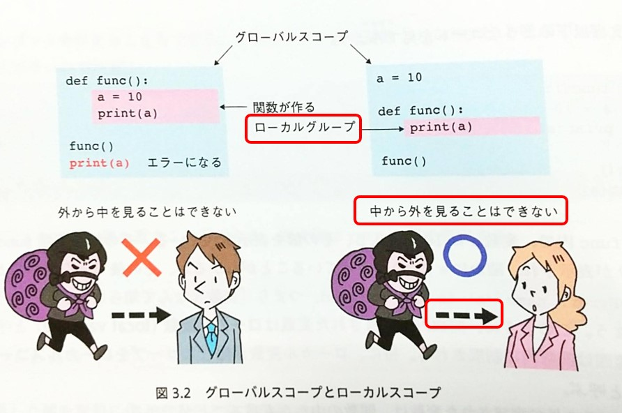|「関数が作る」のは「ローカル**スコープ**」「中から外を見ることは**できる**」「右側の矢印は**左向き**」 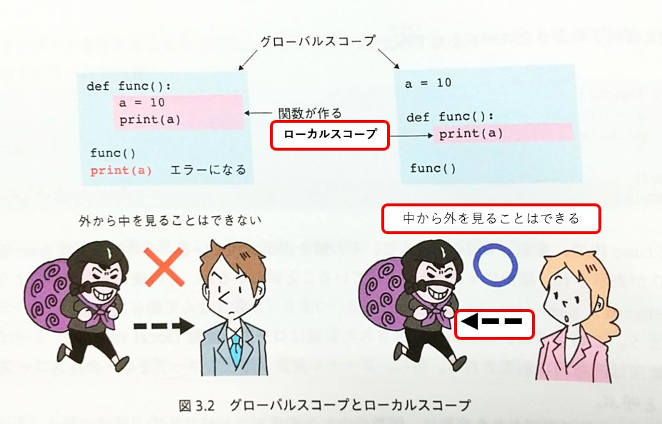|
| p. 41 |とすると、生成するイメージを大きくすると見やすくなる。| とすると、生成されるイメージが大きくなるため見やすくなる。|
| p. 61 | できたリストをb返せ | できたリストをb**に**返せ|
| p. 66 | 12行目  「8ビットが0でない」 |  「8ビット**目**が0でない」 |
| p. 124| 図8.3のクラスのコードのインデントが不正。   | 正しいインデントは以下の通り。  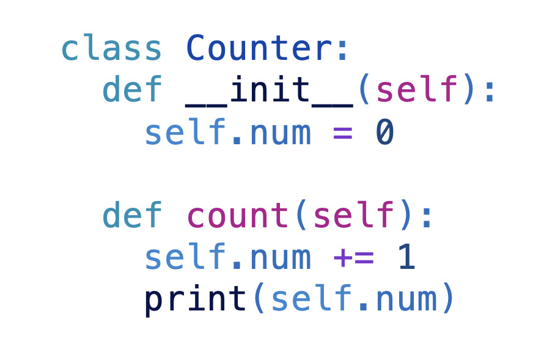|
| p. 124| 図8.4のメッセージが「`c = Counter()`」   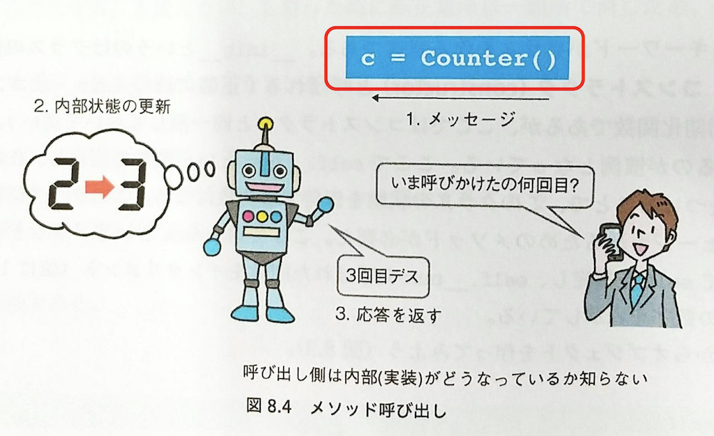| 正しくは`c.count()`   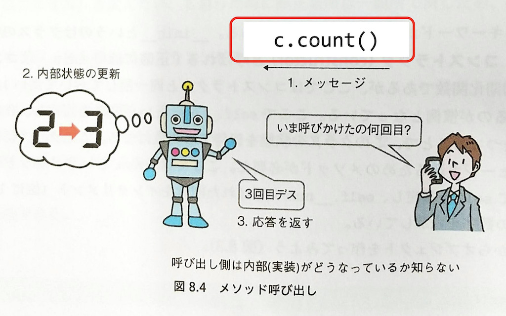|
| p. 140  | Numpy | NumPy (Pは大文字)|
| p. 141  | `np.zeros((2,2)))` | `np.zeros((2,2))` (右側の閉じカッコが一つ多い)|
| p. 156| 8行目 「一方、プログラミング言語を逐次的に解釈して実行するのがスクリプト言語であり」|「一方、プログラミング言語を逐次的に解釈して実行するのが**インタプリタ言語**であり」|
| p. 156 | 9行目 「多くのスクリプト言語はバイトコード（bytecode）と呼ばれる」 | 「多くの**インタプリタ言語**はバイトコード（bytecode）と呼ばれる」|
| p. 161| 図10.7のBINARY_MULTIPLYの箱のラベルが誤っている  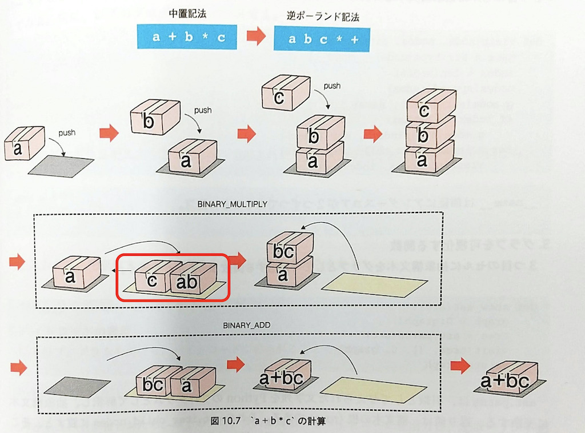 | 正しくは以下の通り。  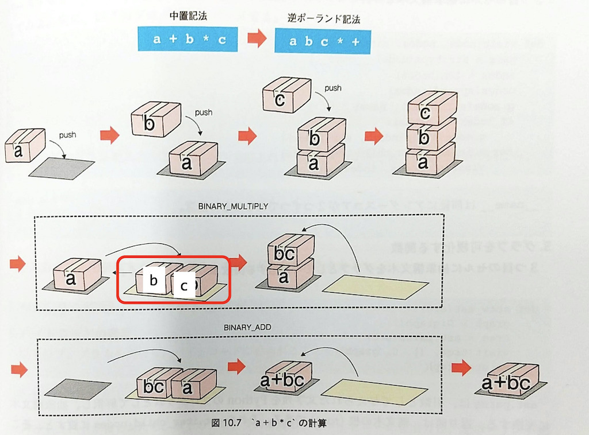 |
| p. 174| 図11.6のAとCの間のコストが2 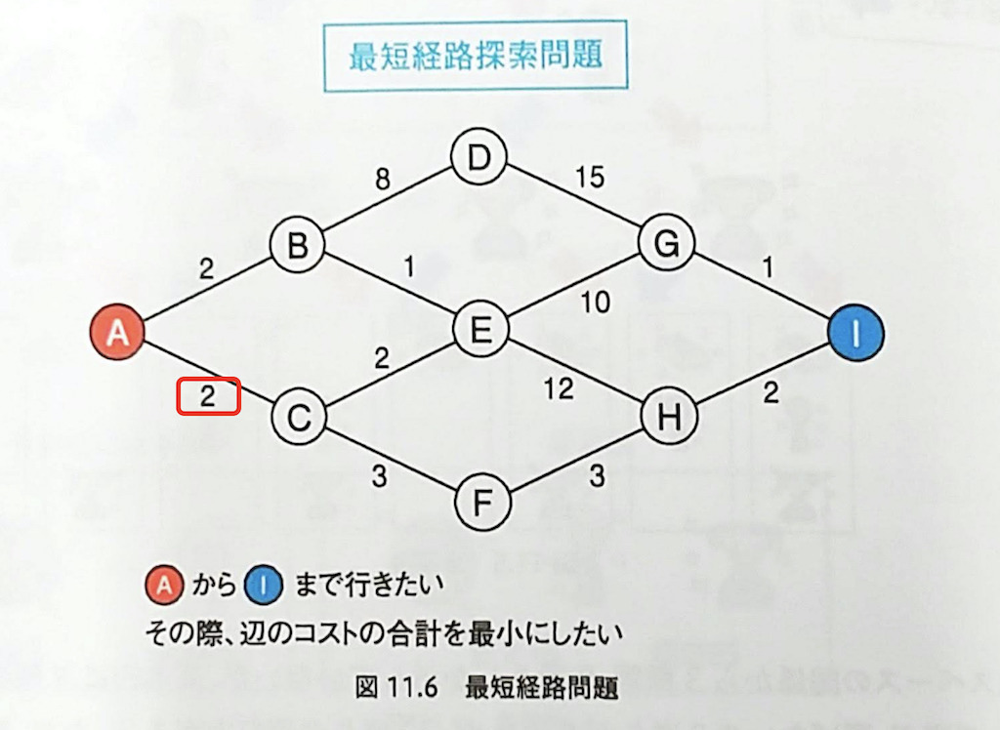 |AとCの間のコストは7 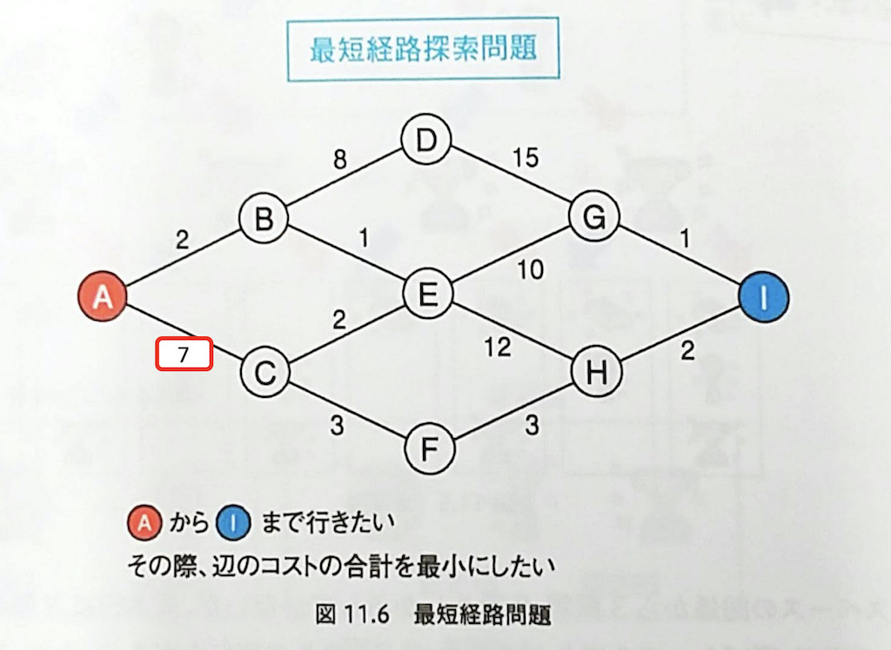  |
| p. 174| 図11.7のAとCの間のコストが2 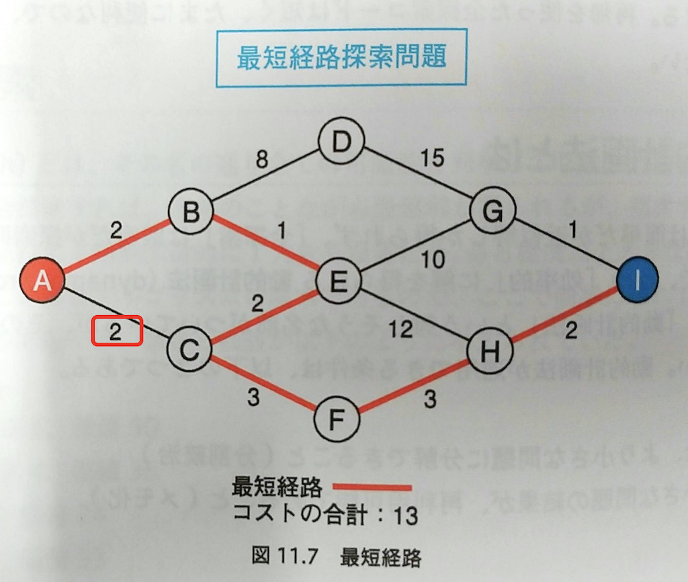 |AとCの間のコストは7 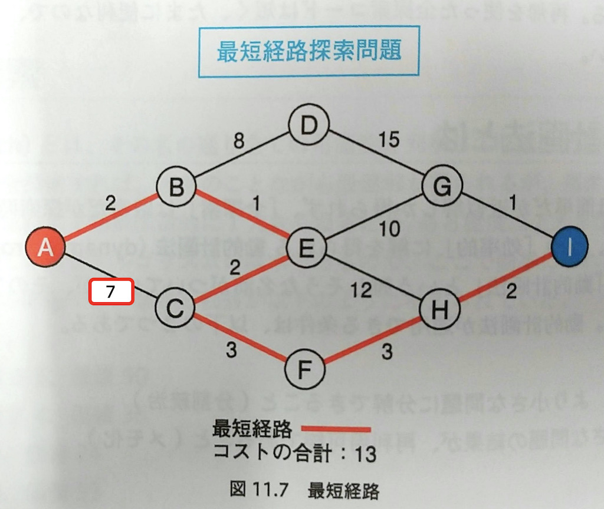  |
| p.184 | アッペルとハーケンは、四色問題問題を四色問題**問題**を | アッペルとハーケンは、四色問題四色問題を  |
| p. 188| 「random.randint」から2行目 「これは6面サイコロを10回ふることを」|  「これは6面サイコロを**5**回ふることを」|
| p. 197 | 6行目「いま、先ほどの図で3の所属する会社と5の所属する会社を」|「**図12.6の下の図で**3の所属する会社と5の所属する会社を」 |
| p. 209| 「優位に立つため**ため**に必要」 | 「優位に立つために必要」|
| p. 240| 「言われるの注意」 | 「言われるの**で**注意」|
