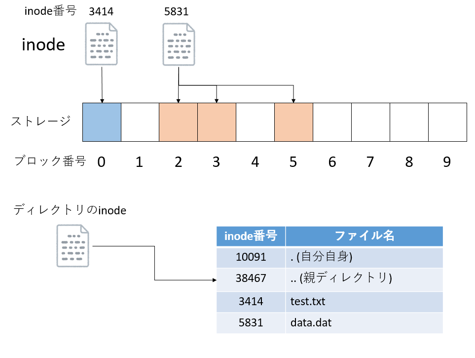

# ファイル操作

## 本講で学ぶこと

* ファイルシステムについて
* Pythonでのファイル操作
* CSVファイルの扱い
* データ解析

## ファイルシステム

### ファイルとは何か

Pythonなどのスクリプト言語を使えるようになると、使えない場合に比べて飛躍的に作業効率が上がる。特に、大量のファイルを解析、変換したいといったケースで、一つ一つエクセルで開いては作業する人に比べて、Pythonその他スクリプト言語とシェルスクリプト等を組み合わせて処理できる人は、生産性に圧倒的な差が出る。そこで、今回はPythonでCSVファイルを開いて、データの解析を行う。しかし、まずその前に「そもそもファイルとは何か」を知っているだろうか？

我々がコンピューターを使う際、何気なくファイルを触っている。スマートフォンで以前撮影した写真を見てみたり、ダウンロードした音楽を聞いたりしている時、意識はしていないかもしれないが、裏ではアプリケーションが写真ファイルや音楽ファイルを開いて読み込み、再生している。また、パソコンで、デスクトップにあるファイルをダブルクリックして開いたり、「あのファイルどこにやったかな」とディレクトリを探し回ったりしたことがあるだろう。スマホでもパソコンでも、何かデータにアクセスする際は、ほとんどの場合においてファイルの読み書きという形をとっている。ファイルの実体は、例えばハードディスクやSDカードに記録されたデータであり、両者は物理的には全く異なるアクセスをしているにも関わらず、保存先がハードディスクであってもSDカードであっても、同じようにアクセスすることができ、我々はその裏で何が起きているのかを意識することはほとんどない。それは、オペレーティングシステムが、「ファイルを管理する」という面倒な作業を代わりにやってくれているからだ。このファイルを管理する仕組みを「ファイルシステム」と呼ぶ。

おそらく、今後の人生でファイルシステムの知識が必要になることはほとんどないであろう。必要になるとしても、せいぜい「SDカードやUSBメモリをフォーマットする時に、ファイルシステムの種類に気を付けないとWindowsとMacで互換性の問題が起きる」といった程度で、ファイルシステムの仕組みや動作について知っていても役に立つことはないと思われる。しかし、役に立つ、立たないは別として、普段使っているパソコンやスマホの裏で、「ファイル」や「フォルダ」がどのような仕組みで管理されているか知っておいても良いであろう。それが教養というものである。

### ファイルシステムとは

我々が普段使うスマホのデータは主にSDカードに保存されている。また、パソコンのデータはハードディスク、もしくはSSDに保存されている。SDカード、ハードディスク、SSDなどを総称してストレージ(storage)と呼ぶ。ストレージは、外部補助記憶装置とも呼ばれ、計算機のデータを長期間保存するためのデバイスである。

これらストレージは、「ブロック」もしくは「クラスタ」と呼ばれる単位でデータを読み書きする。ブロックのサイズはデバイスによって異なるが、おおむね4KB程度である。ストレージには、ブロック単位で通し番号がつけられており、「12番のブロックからデータを読み込む」「488番と489番のブロックにデータを書き込む」といった形でデータの読み書きを行う。もし、これらのストレージを「生のまま」使うならば、ユーザが「どのブロックに何を書き込んだか」をすべて覚えておかなければならない。これは面倒なので、ブロックに「ラベル」をつけたくなるであろう。例えば「0番のブロックにはtest.txtというラベル」、「1番のブロックにはhoge.cppというラベル」といった具合である。この、ブロックに対するラベルの役割をするのがファイル名である。また、ファイルが増えてくると、それをグループ単位で管理したくなる。これがフォルダである。

データが大きい時には、1つのブロックには収まりきらない。例えばブロックのサイズが4KBの時、10KBのデータを保存するには3つのブロックが必要となる。この時、いちいち空いているブロックを探して「4,5,6番のブロックに保存」などと指定するのは面倒である。しかも、ブロック単位で書いたり消したりしているうちに、「空いている(使って良い)ブロック」が不連続になってくる。この時に大きなデータを書き込むためには、一つのファイルをバラバラのデータに分けて保存しなければならない。さらに、そのデータの一部を修正するためには、そのデータのその場所がどのブロックに保存されているかを調べる必要がある。これをすべてが覚えておくのは大変だし、計算機側に自動で管理して欲しいと思うであろう。

このように、ストレージにブロック単位で保存されているデータに、ファイル名やフォルダといった構造を与え、人間にとって扱いやすくするのがファイルシステムである。ファイルシステムには数多くの種類があるが、Linux系ならext4やxfs、WindowsはNTFS、USBメモリなどにはexFATなどがよく使われている。このうち、いま使っているGoogle Colabでも採用されているext4について簡単に説明しよう。なお、WindowsやMacではファイルをまとめて管理する仕組みを「フォルダ」と呼ぶが、Linuxでは「ディレクトリ」と呼ぶため、以後、ディレクトリと呼ぶことにする。細かいことを言い出すときりがないが、とりあえず「フォルダ」と「ディレクトリ」は同じものだと思っておいてよい。また、簡単のため、以下ではかなり説明を省くことに注意(例えばジャーナルの説明や特別なブロックの説明はしない)。

### inode

すでに述べたように、ストレージは「ブロック」という単位でデータの読み書きをする。一つもしくは複数のブロックにまたがって保存されているデータにつけた別名が「ファイル」である。「どのブロックが、どのファイルに所属するか」を記録しているのがinodeと呼ばれるデータだ。全てのファイルには一意なinode番号が割り振られる。inodeには、inode番号、どのブロックを使っているか、ファイルサイズはどれくらいか、所有者は誰かなどの情報が保存されている。inode番号には上限があり、もし使い切った場合は、たとえストレージ容量に余裕があっても新たにファイルを作ることはできない。



ディレクトリもinode番号を持っており、inodeデータとして管理されている。実はinodeはファイル名を保持しておらず、ファイル名はディレクトリが管理している。ディレクトリは、自身が管理するファイルとinode番号の対応表を持っている。Linux系のファイルシステムでは、ディレクトリは「.(ドット)」と「..(ドットドット)」という二つの特別なディレクトリを持つ。それぞれ「自分自身」と「親ディレクトリ」を指している。

なぜファイルを管理するinodeがファイル名を持たず、ディレクトリがファイル名を管理しているのかについては、いくつか理由がある。まず、一つのinodeに複数のファイル名が対応する場合があり、inode番号だけでは、どのファイル名に対応するかがわからない。つまり「ファイル名」から「inode番号」は一意に決まるが、「inode番号」から「ファイル名」は一意には決まらない。この仕組みをハードリンクと呼ぶが、本講義では詳細は扱わない。

もう一つの理由は、素早い検索のためと思われる。WindowsでもMacでも、あるフォルダをダブルクリックするとそのフォルダが開き、中にあるファイル一覧を見ることができる。もし、inodeがファイル名を管理していると、まずそのフォルダ(ディレクトリ)の直下にあるinode一覧をリストアップし、そのinodeデータそれぞれについてファイル名を読み込みにいかなければならない。つまり、ファイル数の分だけinodeデータにアクセスしなければならず、レスポンスが極めて遅くなる。もしディレクトリがinode番号とファイル名のリストを持っていれば、ディスクアクセス一発で「現在のディレクトリの直下にあるファイル一覧」を得ることができる。

なお、inodeが管理するようなファイル名や所有者情報、ファイルサイズなどは「メタデータ」と呼ばれる。あるディレクトリ以下にあるファイルをすべて再帰的にリストアップする場合や、名前でファイルを検索する場合など、ファイル操作では「ファイルの中身までは見なくても良い」処理が多い。例えばネットサーフしているときに「ネットが重い」と大変不快なのと同様に、フォルダを開いて中身が表示されるまでに時間がかかると大変不快である。普段あまり意識することは少ないが、メタデータの検索速度はパソコンの「使い勝手」に直結する。

そこで、多くのファイルシステムでは、メタデータを管理する場所とファイルの中身を管理する場所を別々に分け、効率的にメタデータを扱えるように工夫がしてある。スパコンなどで使われるLustreなどの並列ファイルシステムは、メタデータとファイルの中身は別のサーバで管理されており、高速なメタデータアクセスを実現している。

### ファイルのオープン・クローズ

Pythonに限らず、プログラムからファイルを読み書きするには、まずファイルを開く必要がある。「ファイルを開く」とは、「ファイルシステムにファイルの場所を問い合わせて、プロセスからファイルを扱えるように回線をつなぐ」ことである。プログラムは、「プロセス」という形でOSに管理されている。プロセスからOSにファイルへの接続要求があると、OSはファイルシステムにその場所を問い合わせて、プロセスとファイルシステムの間に特別な回線を作って接続する。この回線は「ファイルディスクリプタ」という、内線番号のようなもので管理される。0番から2番までのファイルディスクリプタは特別な回線となっており、それぞれ標準出力、標準出力、標準エラー出力として予約されている。一度ファイルが開かれたら、プロセスはこのファイルディスクリプタを使ってデータを読み書きする。プロセスは同時に複数の回線を保持できるが、回線の数には上限があるため、不要になったら解放する必要がある。そこで、ファイルへの接続が不要になったら、「ファイルを閉じる」必要がある。ファイルを閉じると、回線を破棄し、内線番号(ファイルディスクリプタ)もOSに返却する。その後でファイルを開くと、ファイルディスクリプタは再利用される。


なお、この図では省略されているが、実際にはファイル名(test.txt)から、対応するinodeを調べ、そのinodeが指しているブロックを調べ、そのブロックの場所を覚えて、以後の読み書きはそのブロックに対して行う、ということが行われている。

### 遅延書き込み

直接意識することはあまり無いが、せっかくファイルシステムについて学んだので、遅延書き込みについても知っておくとよいだろう。一般にストレージへの書き込みは遅いため、書き込みを指示してから書き込み完了までは長い時間待たされることになる。しかし、書き込みに成功したかどうかわからないまま次の作業に移ることはできない。そこで、書き込みを指示された時に空き容量などを調べて書き込みが可能どうかを調べ、書き込み可能ならその内容をメモリに預かる方法が採用された。これを **遅延書き込み(Lazy Write Back)** と呼ぶ。当然、メモリに保持している情報をストレージに書き込む前にストレージが外されてしまうと、データを失うことになる。そこで、USBメモリなど抜き差しするタイプの外部ストレージには「安全な取り外し」が用意されている。「安全な取り外し」を指定するか、Macならゴミ箱にドロップすることで、もしメモリに預かっていたデータがあればストレージに書き出し、データが失われないことを保証する。

## Pythonでのファイル操作

### Google Colab上でのファイル操作

通常、ファイルの読み書きは、「現在操作している計算機の中」にあるファイルについて行う。この環境を「ローカル環境」、ローカル環境にあるファイルを「ローカルファイル」と呼ぶ。しかし我々は今Google Colabというクラウドサービスを使っているため、「ファイルがどこにあるか」「どのファイルを操作しているか」がわかりにくい。Pythonでのファイル操作の説明の前に、まずGoogle Colab上でのファイル操作のイメージについて説明しておこう。

いま、目の前にあるPCはブラウザを実行しており、このブラウザがGoogleのサーバに接続している。そのサーバ上で何かファイルを扱うためには、なんとかしてGoogleのサーバにファイルをダウンロードする必要がある。


そこで、`wget`というLinuxのコマンドを用いる。`wget`は、URLを指定するとそのファイルを「`wget`を実行した計算機にとってのローカル」にダウンロードする。これにより、Google Colabの実行環境の「ローカル」にファイルがダウンロードされる。

以後、Google Colabでファイルを開いたり、読み込んだりする際、「そのプログラムが実行される環境にとってのローカル」にあるファイルに対して読み書きが実行される。

将来、必要になってPythonでローカルファイルを操作する場合は上記のようなことを意識する必要はなく、「いまPythonスクリプトを実行している計算機にとってのローカル環境」にあるファイルを読み書きすれば良い。

### ファイルを開く、閉じる

Pythonでファイルを開くには`open`関数を用いる。ファイルを開く際、読み込み用として開くのか、書き込み用として開くのか、追記用として開くのかを指示しなければならない。また、扱うのがテキストデータなのか(テキストモード)、それともバイナリデータなのか(バイナリモード)も指定する必要がある。何も指示しない場合にはテキストかつ読み込み用となる。
オプションは以下の文字の組み合わせで指定する。

* 'r' 読み込み用に開く(デフォルト)
* 'w' 書き込み用に開く
* 'a' 追記用に開く
* 't' テキストモード(デフォルト)
* 'b' バイナリモード

以下は例だ。

```py
f = open("filename") # テキストモードかつ読み込み用に開く
f = open("filename","rt") # テキストモードかつ読み込み用に開く(オプションを明示的に指定)
f = open("filename","w") # テキストモードかつ書き込み用に開く
f = open("filename","a") # テキストモードかつ追記用に開く
```

とりあえず本講義ではテキストの読み書きしかしないので、バイナリモードについては説明をしない。

`open`関数はオープンに成功するとファイルオブジェクトを返す。とりあえずこれはファイルディスクリプタを抽象化したものだと思っておけば良い。以後、このファイルオブジェクトを通じてデータの読み書きをするのだが、開いたファイルはいつか閉じる必要がある。開いたファイルを閉じるには、ファイルオブジェクトの`close`を呼び出せばよい。

```py
f = open("filename") # ファイルを開く
f.close() # ファイルを閉じる
```

なお、ファイルを明示的に閉じなかった場合、そのファイルオブジェクトが不要となり、ガーベジコレクタ(GC)に回収されたタイミングでファイルが閉じられる。プログラムやGCの実装にもよるが、多くの場合、プログラムの終了時にファイルが閉じられることになるだろう。通常はあまり意識しなくても良いが、同時に開くことができるファイル数には上限があり、それにひっかかるとエラーでプログラムが失敗する。ファイル操作に失敗すると想定外の問題(惨事ともいう)が起きることが多いので、ファイルを開いたら閉じる癖をつけておいた方が良い。

### ファイルの書き込み

ファイルに何か書き込むには、ファイルを書き込み用に開いてから、ファイルオブジェクトの`write`を用いる。

```py
f = open("test.txt","w") # ファイルを開く
f.write("Hello World\n") # 文字列を書き込む
f.close()
```

上記のコードで、「Hello World」と記述された`test.txt`という名前のテキストファイルが作成される。`print`と異なり、`write`は改行が追加されないので、必要な場合は明示的に改行コード`\n`を追加する必要がある。

既に存在するファイルにデータを追記したい場合は、追記モードで開く必要がある。

```py
f = open("test.txt","a") # ファイルを追記用に開く
f.write("This is the second line.\n") # 文字列を書き込む
f.close()
```

上記を実行すると、`test.txt`の内容は以下のようになる。

```txt
Hello World
This is the second line.
```

なお、既に存在するファイルを書き込みモードで開いた場合、その**ファイルを開いただけで内容が消去される**ことに注意。先ほど二行書き込まれたファイルを、ただ書き込みモードで開いて閉じてみよう。

```py
f = open("test.txt","w") # ファイルを書き込み用に開く
f.close() # 閉じる
```

上記を実行すると、`test.txt`の内容は消去され、サイズ0のファイルになる。これは実は書き込み用にファイルを開くと、メタデータの処理によってファイルを削除してしまうからなのだが、ここでは詳細には立ち入らない。ただ、「ファイルを書き込み用に開くと、開いた瞬間にファイルの内容が消える」ということだけ覚えておくと良い。

### ファイルの読み込み

既存のテキストファイルを読み込む場合は、オプションなしの`open`を使えばよい。

```py
f = open("test.txt")
```

その後、`open`が返してきたファイルオブジェクトを使って、ファイル全てを一括して一つの文字列として読み込む`read`、ファイルを全てを一括して読み込み、一行ごとに分割された文字列のリストとして取得する`readlines`、呼び出す度に一行ずつ読み込む`readline`などを使うことでファイルの内容を読むことができるが、各行ごとに何か処理をする場合はファイルオブジェクトに対して`for`文を回すのが一番てっとりばやい。

```py
f = open("test.txt")
for line in f: # ファイルから一行ずつlineに読み込む
    print(line)
```

なお、この形で取得した`line`は、改行コードが含まれているため、それをそのまま`print`で出力すると改行が二つつながり、出力としては「一行おき」に表示されてしまう。それを防ぐには、`line`の末尾の改行を含む空白文字を削除する`rstrip()`を使えばよい。

```py
f = open("test.txt")
for line in f: # ファイルから一行ずつlineに読み込む
    print(line.rstrip())
```

### with構文

ドアを開けたら閉めるように、ファイルを開いたら閉じなければならない。実際には開いたままのファイルはプログラム終了時に閉じてくれるため、ちゃんと閉じなくても問題が起きることは少ないのだが、ファイルを多数開いて、ファイル数の上限に達してしまったり、うっかり開いたままのファイルを別の場所で変にいじっておかしなことになったりと、後々嫌らしい感じの問題を起こすことがあるので、「開いたら閉じる」癖をつけておきたい。といっても、人間のやることなので、ファイルの閉じ忘れを完全に防ぐのは難しい。そこで、Pythonは自動でファイルを閉じてくれる`with`構文、というものがある。

`with`は以下のように使う。

```py
with open("test.txt") as f:
    # ファイルに関する処理
```

`with`の後にファイルを開き、そのファイルオブジェクトを`as`の後の変数で受ける。このファイルオブジェクトは、その後のブロックでのみ有効で、ブロックを抜けるときに自動的にファイルは閉じられる。例えば、テキストファイルを開いて、一行ずつ読み込んでただ表示するだけのコードは以下のように書ける。

```py
with open("test.txt") as f:
    for line in f:
        print(line.rstrip())
```

上記のプログラムでは明示的に`f.close()`は呼び出されていないが、`with`が作るブロックを抜けるときに自動的に`f.close()`が呼ばれ、ファイルが閉じられる。

とりあえず「ファイルを開く時には`with`構文を使う」癖をつけておけば、ファイルの閉じ忘れを防ぐことができるであろう。

なお、`with`構文はファイルだけでなく、例えばデータベースへの接続など「何か定型の前処理や後始末が必要なもの」一般に使うことができる。今後`with`が出てきたら、「ブロックが始まる前に何か前処理をして、ブロックを抜ける時に何か後始末をしているんだな」と思えばよい。

## CSVファイルの扱い

CSVファイルとはComma-separated valuesの略で、主にコンマ「,」でデータが区切られたテキストファイルの総称である。コンマではなくタブ文字で区切られたファイルもCSVファイルと呼ぶことがある。今後の人生で、Pythonを知っていてもっとも役に立つのはテキストファイル、特にCSVファイルの扱いであろう。大量のデータを処理する際、スクリプト言語でCSVファイルを扱えると作業効率が桁違いに上がるので是非覚えておいて欲しい。

まず、CSVファイルは以下のような形をしている。

```txt
学籍番号,名前,成績
1, 成績太郎, B
2, 成績花子,A
3, 落第次郎,D
4,出木杉英才,S
...
```

各行にコンマで区切られたデータが並んでいる。この例では「学籍番号、名前、成績」の順番である。まず、これを一行ごとに切り出す。先程の例と同様に、ファイルを開いて`for`文を回すのが一番手っ取り早い。

```py
with open("data.csv") as f:
    for line in f:
        # ここでlineにデータ行が入ってくる
```

さて、`for`文の中で渡される`line`には、CSVファイルのデータが一行ずつ入ってくる。これを`split`を使って配列にバラしてやる。

```py
line = "1, 成績太郎, B"
line.split(",") #=> ['1', ' 成績太郎', ' B\n']
```

最後に改行が入っていることに注意。削除しておきたければ、`line = line.rstrip()`としておこう。さて、バラされた要素は文字列のリストになっているため、必要に応じて整数や浮動小数点数に変換してやろう。

```py
line = "1, 成績太郎, B"
id, name, grade = line.split(",") #=> ['1', ' 成績太郎', ' B\n']
id = int(id)
```

これで名前と学籍番号を得ることができた。

次に、二つのCSVファイルを読み込んで、一つのグラフなどを作りたいときに便利な方法も紹介しておこう。いま、どこにどれだけの人が住んでいるかの「人口地図」を作りたいとする。人口地図を作るのに必要なのは「座標と人口」の組だが、我々がアクセスできるのは「どの都市にどれだけの人口があるか」と「どの都市がどこにあるか」の情報だけだ。この二つを組み合わせて「人口地図」を作る。

まず、市区町村の人口データ`population.csv`は以下のような形をしている。

```txt
...
01100,札幌市,1884939
01101,札幌市中央区,206252
01102,札幌市北区,273577
01103,札幌市東区,252688
01104,札幌市白石区,203579
...
```

左から順番に、都市コード(CITY CODE)、地名、人口である。

また、市役所、区役所の位置データ`position.csv`は以下のような形をしている。

```txt
...
01100,札幌市役所,43.06197200,141.35437400
01202,函館市役所,41.76871200,140.72910800
01203,小樽市役所,43.19075267,140.99460538
01204,旭川市役所,43.77079900,142.36479800
01205,室蘭市役所,42.31520400,140.97378400
...
```

左から順番に、都市コード、役所の名前、緯度、経度である。この二つを組み合わせて「経度、緯度、人口」という情報を作り出したい。

そのためには、まず辞書を使って「都市コード」と「人口」の対応表を作ってしまうのが楽である。`population.csv`を読み込んで、都市コードをキー、人口を要素に持つ辞書は以下のようにして作ることができる。

```py
d_pop = {}
with open("population.csv") as f:
    for line in f:
        code, _, pop = line.split(",")
        d_pop[int(code)] = int(pop)
```

次に位置データを読み込むと、位置と都市コードの対応が得られる。この時、既に都市コードと人口の対応表ができているので、位置と人口を出力することができる。

このように、複数のデータファイルに共通して含まれる項目をキーとしてデータを集計する、という作業は日常業務で頻出するため、やり方を知っておいて損はない。なお、今回は二つのファイルであったので、エクセル等で作業してもさほど時間はかからないが、例えばこれが都道府県別に47個にファイルにわかれていたら大変である。しかし、Python(に限らずプログラミング言語)を使えば、複数のファイルを一気に読み込んで解析するのが容易であるのは想像できるだろう。

## ファイル操作：課題

### 課題1:人口地図の作成

都市の人口データと都市の位置データを使って、どの場所にどれくらいの人が住んでいるか、「人口地図」を作成してみよう。データはそれぞれ以下のサイトから入手し、加工したものを利用した。

* 総務省参考資料4 市区町村別の人口及び世帯数
  * [http://www.soumu.go.jp/menu_news/s-news/17216_1.html](http://www.soumu.go.jp/menu_news/s-news/17216_1.html)
* 国土交通省国土政策局国土情報課、国土数値情報　市区町村役場データ 平成26年
  * [http://nlftp.mlit.go.jp/ksj/gml/datalist/KsjTmplt-P34.html](http://nlftp.mlit.go.jp/ksj/gml/datalist/KsjTmplt-P34.html)

新しいノートブックを開き、`popmap.ipynb`として保存せよ。

#### 1. ライブラリのインポート

まずは必要なライブラリをインポートしておこう。

```py
import matplotlib.cm as cm
import matplotlib.pyplot as plt
```


#### 2. データのダウンロード

まずデータをダウンロードしよう。以下を実行せよ。

```py
!wget https://kaityo256.github.io/python_zero/file/popmap.zip
```

実行後、`saved [42400/42400]`と表示されれば正しくダウンロードされている。

#### 3. データの展開

ダウンロードしたファイルはZIPで圧縮されているため、展開しよう。

```py
!unzip -o popmap.zip
```

`-o`オプションは、既に同名のファイルが存在する場合でも上書きするオプションである。

```txt
Archive:  popmap.zip
  inflating: population.csv
  inflating: position.csv
```

と表示されていれば正しく展開されている。このファイルには人口データ`population.csv`と、位置データ`position.csv`が含まれている。

#### 4. 人口データの確認

まず、`head`コマンドで人口データ`population.csv`の内容を確認しよう。

```py
!head population.csv
```

以下のような表示が出れば成功である。

```txt
01000,北海道,5543556
01100,札幌市,1884939
01101,札幌市中央区,206252
01102,札幌市北区,273577
01103,札幌市東区,252688
01104,札幌市白石区,203579
01105,札幌市豊平区,208476
01106,札幌市南区,147397
01107,札幌市西区,209883
01108,札幌市厚別区,129604
```

左から順番に、都市コード(CITY CODE)、都道府県もしくは都市名、人口である。

`head`はファイルの先頭を表示するコマンドである。大きなテキストファイルに何が書いてあるか、いちいちエディタを開かずにチェックするのに便利だ。ファイルの末尾を表示する`tail`コマンドと一緒に覚えておきたい。

#### 5. 役所の位置データ確認

市役所、区役所の位置データ`position.csv`の中身を確認しよう。

```py
!head position.csv
```

以下のような表示が出れば成功である。

```txt
01100,札幌市役所,43.06197200,141.35437400
01202,函館市役所,41.76871200,140.72910800
01203,小樽市役所,43.19075267,140.99460538
01204,旭川市役所,43.77079900,142.36479800
01205,室蘭市役所,42.31520400,140.97378400
01206,釧路市役所,42.98485600,144.38167000
01207,帯広市役所,42.92401400,143.19619500
01208,北見市役所,43.80782300,143.89438400
01209,夕張市役所,43.05681400,141.97406900
01210,岩見沢市役所,43.19616900,141.77585700
```

左から、都市コード(CITY CODE)、市役所/区役所名、緯度、経度である。

ダウンロードしたデータを用いてどこにどれだけの人が住んでいるかの「人口地図」を作成しよう。

#### 6. 人口データの辞書作成

`population.csv`を読み込み、都市コードをキー、人口を値に持つ辞書を作成する。

```py
d_pop = {}
with open("population.csv") as f:
    for line in f:
        code, _, pop = line.split(",")
        d_pop[int(code)] = int(pop)
```

#### 7. 位置データの作成

位置データ`position.csv`を読み込み、もし人口データが存在する都市であれば、「経度、緯度、人口」の形の「タプルのリスト」にまとめる。

```py
data = []
with open("position.csv") as f:
    for line in f:
        a = line.strip().split(",")
        code, _, y, x = a
        code = int(code)
        x, y = float(x), float(y)
        if code in d_pop:
            data.append((x, y, d_pop[code]))
```

#### 8. データのソート

人口が多い場所ほど後から描画するように、データを人口でソートする。

```py
data = sorted(data, key=lambda x: x[2])
```

#### 9. 人口地図の描画

得られたデータから人口地図を描画する。

```py
nx, ny, nn = [], [], []
for x, y, n in data:
    nx.append(x)
    ny.append(y)
    nn.append(n ** 0.5 * 0.3)
plt.figure(figsize=(15, 15), dpi=50)
plt.scatter(nx, ny, c=nn, s=nn, cmap=cm.seismic)
```

「人口地図」が表示されただろうか？日本のどこにどれくらいの人が住んでいるかが、なんとなくわかるであろう。

### 課題2：カラーテレビと平均寿命

カラーテレビの普及率と、男性の平均寿命の関係を調べてみよう。データはそれぞれ以下のサイトから入手し、加工したものを利用した。

* カラーテレビの普及率データ(内閣府の消費動向調査)
  * [https://www.esri.cao.go.jp/jp/stat/shouhi/shouhi.html](https://www.esri.cao.go.jp/jp/stat/shouhi/shouhi.html)
* 平均余命データ (厚生労働省の参考資料２　平均余命の年次推移)
  * [https://www.mhlw.go.jp/toukei/saikin/hw/life/life10/sankou02.html](https://www.mhlw.go.jp/toukei/saikin/hw/life/life10/sankou02.html)

新しいノートブックを開き、`tvlife.ipynb`として保存せよ。

#### 1. ライブラリのインポート

最初のセルに以下のプログラムを書いて実行せよ。

```py
import numpy as np
from matplotlib import pyplot as plt
```

#### 2. テレビの普及率データのダウンロード

ウェブから、「カラーテレビの普及率データ」のCSVファイルをダウンロードしよう。

```py
!wget https://kaityo256.github.io/python_zero/file/colortv.csv
```

上記を実行すると、ファイルがダウンロードされる。`‘colortv.csv’ saved [162/162]`と表示されたら正しくダウンロードできている。

#### 3. テレビの普及率データの確認

`head`コマンドでダウンロードしたファイルの内容を確認しよう。

```py
!head colortv.csv
```

以下のような表示になれば成功である。

```txt
1966,0.3
1967,1.6
1968,5.4
1969,13.9
1970,26.3
1971,42.3
1972,61.1
1973,75.8
1974,85.9
1975,90.3
```

それぞれの行に、西暦とカラーテレビの普及率の関係が「カンマ」で区切られて記録されている。

#### 4. テレビの普及率のプロット

ダウンロードしたデータを読み込んで、横軸を西暦、縦軸をカラーテレビの普及率としてプロットしてみよう。

4つ目のセルに以下を入力、実行せよ。

```py
tv_year = []
tv_data = []
with open("colortv.csv") as f:
    for line in f:
        y, d = line.split(",")
        tv_year.append(int(y))
        tv_data.append(float(d))
plt.scatter(tv_year, tv_data)
```

これは、

* ファイルを一行ごとに`line`という変数に取り込み、
* `split(",")`によりカンマで分離したリストにして
* `y, d =`という形で、リストの最初と二番目の要素を受け取り、
* それぞれを「西暦」「普及率」のリストに`append`する

という処理をしている。

上記を実行すると、1966年から1980年までのカラーテレビの普及率の推移が表示されるはずである。

#### 5. 平均寿命データのダウンロード

次に5つ目のセルで「男性の平均寿命データ」のダウンロードをしよう。

```py
!wget https://kaityo256.github.io/python_zero/file/lifespan.csv
```

実行後に`‘lifespan.csv’ saved [178/178]`と表示されれば正しくダウンロードできている。

#### 6. 平均寿命データの確認

先ほどと同様に、`head`コマンドでダウンロードしたデータの中身を確認しよう。

```py
!head lifespan.csv
```

以下のように、カンマで区切られた西暦と平均寿命が記録されているはずである。

```txt
1966,68.35
1967,68.91
1968,69.05
1969,69.18
1970,69.31
1971,70.17
1972,70.5
1973,70.7
1974,71.16
1975,71.73
```

#### 7. 平均寿命のプロット

先ほどと同様に、横軸を西暦、縦軸を平均寿命としてプロットしてみよう。

```py
life_year = []
life_data = []
with open("lifespan.csv") as f:
    for line in f:
        y, d = line.split(",")
        life_year.append(int(y))
        life_data.append(float(d))
plt.scatter(life_year, life_data)
```

寿命が年々伸びている様子がわかるはずだ。

### 発展課題:テレビの普及率と寿命の関係

#### 8. テレビの普及率と寿命の関係

カラーテレビの普及率、平均寿命のデータは、それぞれ1966年から1980年までの同じ15年間のデータに揃えてある。そこで、横軸をカラーテレビの普及率、縦軸を平均寿命としてプロットしてみよう。以下を実行せよ。

```py
plt.xlabel("TV")
plt.ylabel("Lifespan")
plt.scatter(tv_data, life_data)
```

このグラフから、カラーテレビの普及率と平均寿命にどのような関係が見て取れるか論ぜよ。

#### 9. テレビの普及率と寿命の相関係数

カラーテレビの普及率と寿命には何かしら強い関係がありそうであった。そこで、両者の相関を調べてみよう。相関とは、お互いに完全に比例している場合に1、完全に反比例している時に-1、完全に無関係である時に0となるような量である。

相関は`numpy`の`corrcoef`で調べることができる。以下を実行せよ。

```py
np.corrcoef(tv_data, life_data)
```

2行2列の行列が表示されたはずだ。対角成分は「自分自身との相関」なので1である。非対角成分が「テレビと寿命」の関係だ。1に近い値が表示されているはずだ。このデータから「テレビの普及率と平均寿命は、ほぼ比例している」ということが示される。

以上の解析結果をもって、例えば「テレビを見るほど寿命が伸びる」と結論してよいか考察せよ。もしそう結論できない場合は、どんな可能性があるだろうか？

## 余談：消えていくアイコンのオリジナルたち

パソコンを使っていると、ファイルを管理するのにフォルダを使ったことがあるだろう。Windowsであれば、右クリックのメニューで「新規作成」から「フォルダ」を作ることができる。また、iPadやiPhoneなどのスマホでも、アイコン長押しからドラッグでまとめてフォルダを作ることができる。もともと「フォルダ」とは厚紙でできており、書類をまとめて挟んで引き出しに入れる文房具である。上部にはラベルがあり、どんな書類をまとめているかが一目でわかるようになっている。「フォルダ」のアイコンはその文房具を模したものだが、おそらくいまこれを読んでいる人で「フォルダ」の実物を見たことがある人は少ないであろう。

WordやPowerPointを使ったことがある人は多いと思われるが、「ファイルを保存する」ボタンにはフロッピーディスクをデザインしたアイコンが使われることが多い。これは昔、データの保存に主にフロッピーディスクを使っていたことの名残なのだが、現在フロッピーディスクはほぼ使われていないため、これも実物を見たことがある人は少ないと思われる。もしかしたらフロッピーディスクそのものを知らないかもしれない。筆者は高校生時代、友人と一緒にゲームを作っていたのだが、お互い家で作成したデータをフロッピーディスクに入れ、休み時間に交換していたのを思い出す。

携帯電話がスマホとなり、主に通話以外の用途に使われるようになって久しい。今時の若い人は、携帯電話が純粋に「電話」だった時代を知らないであろう。もともと「電話」であったはずのスマホにおいて、通話機能は数多くのアプリの一つに甘んじている。この通話機能を表すアイコンは固定電話の「受話器」を模したものであり、いまでこそ「これは電話を意味する」とわかるかもしれないが、特に若い世代で受話器を持つ固定電話を使うことが稀になったため、フロッピーディスク同様、このアイコンの意味も失われていくことであろう。

フォルダ、フロッピーディスク、電話の受話器……もはや失われつつある古(いにしえ)のデバイスが、現在のデバイスに「シンボル」として生き残っているのは興味深い。
