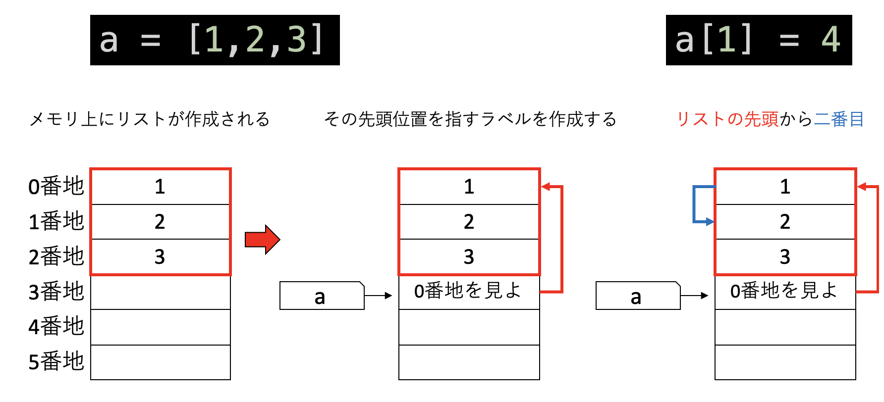
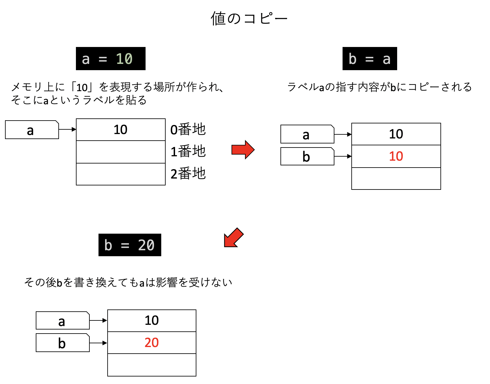
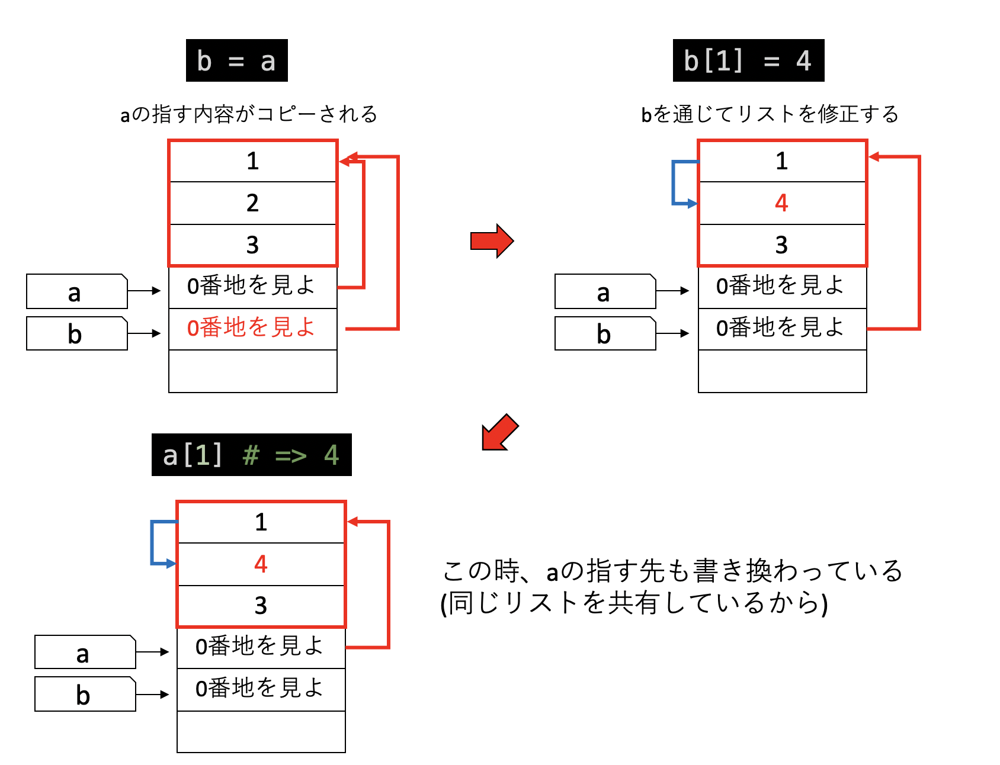
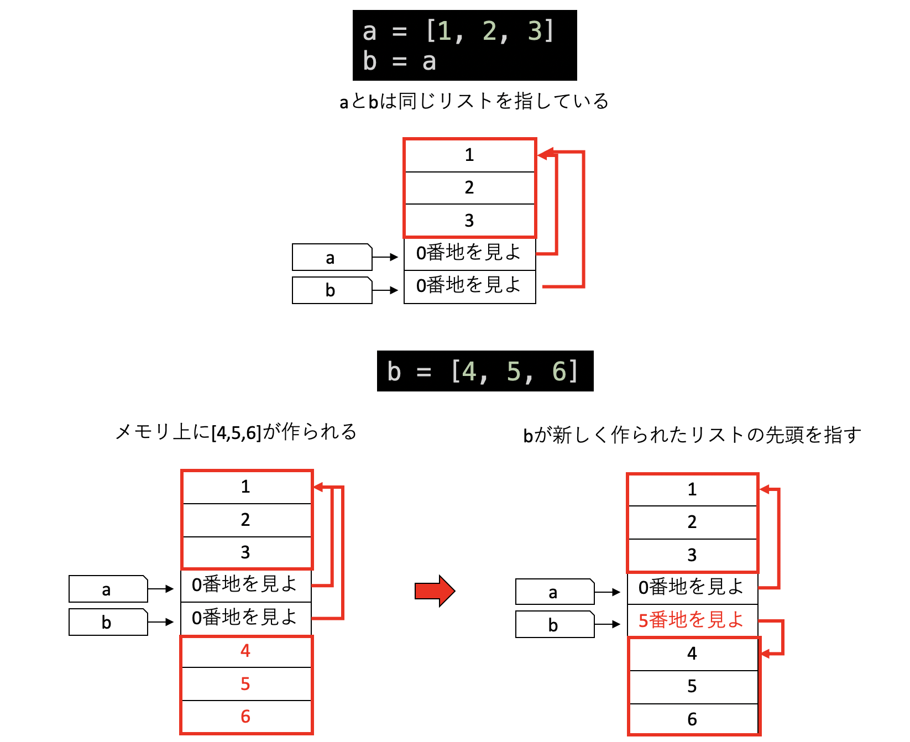
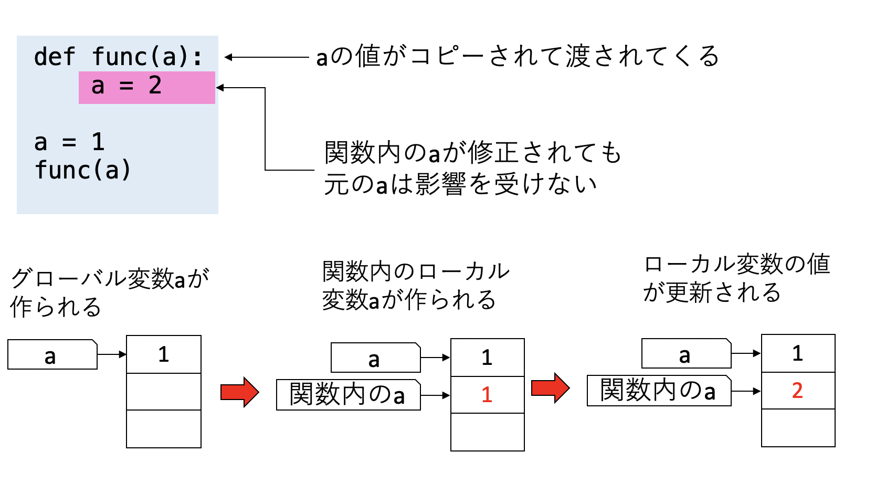
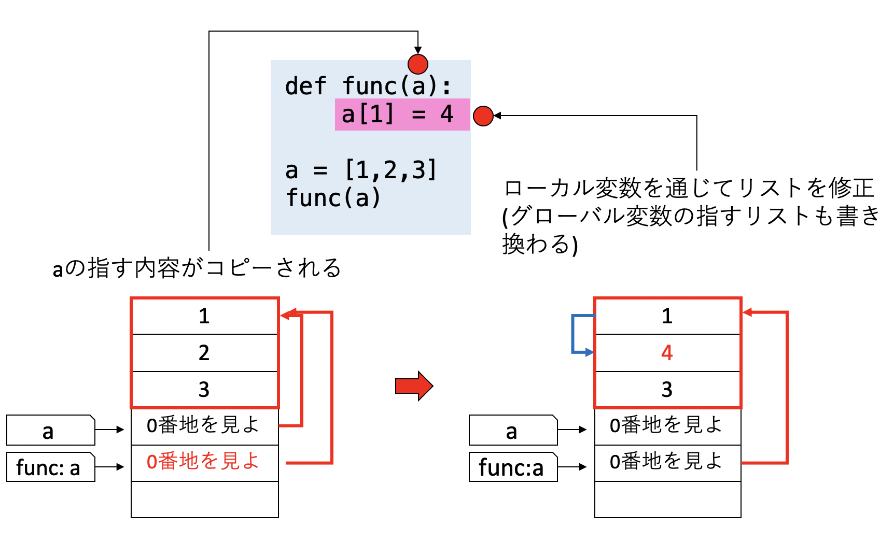
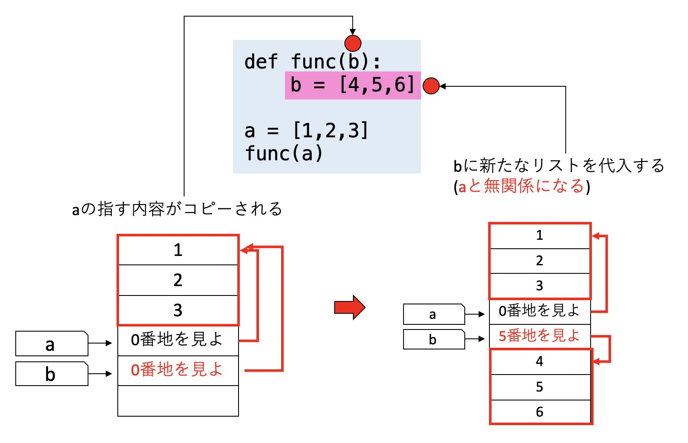
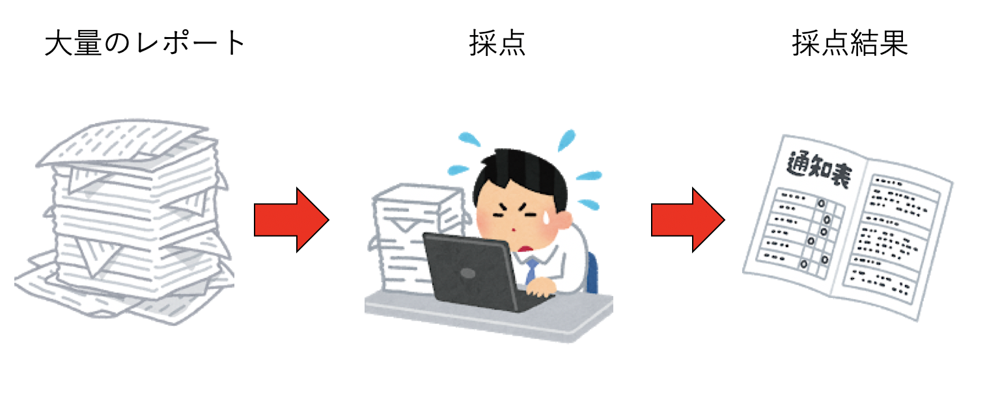
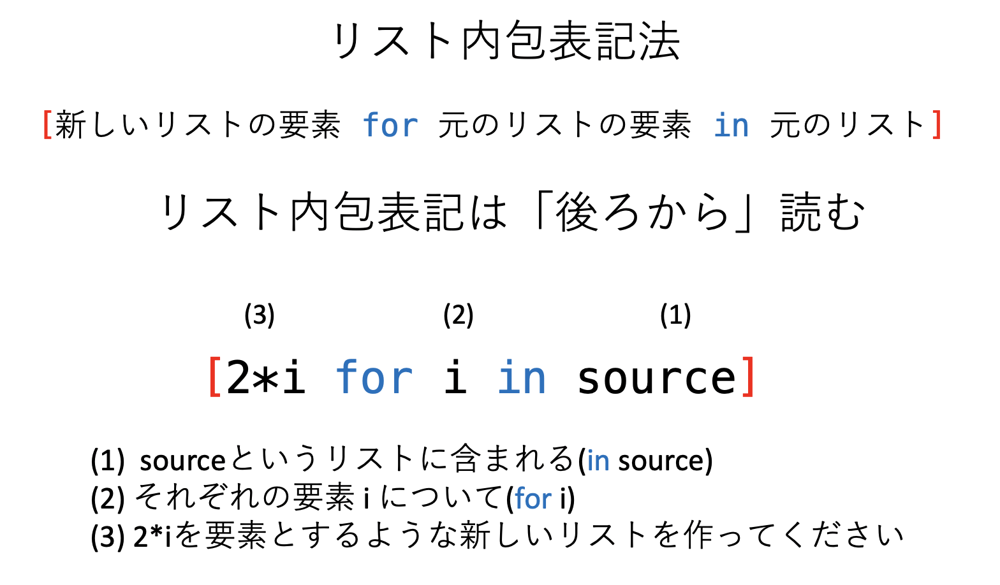

# [リストとタプル](https://kaityo256.github.io/python_zero/list/)

## 本講で学ぶこと

* リスト
* タプル
* 値のコピーとリストのコピーの違い
* 参照の値渡し
* リスト内包表記
* コッホ曲線

## リスト

プログラムを組んでいると、何かひとまとまりのデータをまとめて保持し、処理したい場合がある。
そのようなデータ構造を表現するのがリスト(list)である。他の言語では配列(array)と呼ぶことが多い。

リストは`[]`の中に、カンマで区切って表現する。例えば、

```py
[1,2,3]
```

とすると、整数の1,2,3を含むリストができる。

また、

```py
["A","B","C"]
```

とすると、文字列のリストができる。リストにはどんなものも入れることができる。また、異なる種類のものを混ぜて入れることもできる。

```py
["A", 1, 1.0]
```

変数にリストを代入することもできる。

```py
a = [1, 2, 3]
```

リストの要素には、`[]`でアクセスできる。例えば`a`の最初の要素が欲しい場合は`a[0]`とする。カッコの中の数字を **添え字(index)** と呼ぶ。言語によって、添え字が0始まりの場合と1始まりの場合がある。Pythonは0始まりである。

```py
a = [1,2,3]
a[0] # => 1
```

要素に値を代入することができる。

```py
a = [1,2,3]
a[1] = 4
a # => [1,4,3]
```

リストは入れ子にすることもできる。

```py
a = [[1,2],[3,4],5]
```

入れ子になったリストは、添え字を複数指定することで要素を得ることができる。

```py
a = [[1,2],[3,4],5]
a[0] #=> [1,2]
a[0][1] #=> 2
```

リストの長さは`len`という関数で取得できる。

```py
a = [1,2,3]
len(a) # => 3
```

二つのリストを結合することができる。

```py
[1,2] + [3,4,5] # => [1,2,3,4,5]
```

要素を追加する場合は`append`を使う。

```py
a = [1,2]
a.append(3)
a # => [1,2,3]
```

リストを`append`する場合には注意が必要である。

```py
a = []
b = [1,2]
a.append(b)
a.append(b)
```

とすると、見かけ上`a`は二行二列の行列のように見える。

```py
print(a) #=> [[1, 2], [1, 2]]
```

しかし、要素に含まれる二つのリストは同じものであるから、一方を修正するともう一方も影響を受ける。

```py
a[0][0] = 4
print(a) #=> [[4, 2], [4, 2]]
```

なぜこうなるかは、後述する「リストのメモリ上での表現」を知れば理解できるであろう。

リストに要素が含まれるかどうかは、`in`で調べることができる。

```py
a = [1,2,3]
1 in a # => True
4 in a #=> False
```

リストの要素を順番に取り出しながら、すべての要素について処理をしたい場合、`for`と`in`を使う。

```py
a = ["A","B","C"]
for i in a:
  print(i)
```

## タプル

タプル(tuple)は、複数の値の組を表現するデータ構造である。タプルはカンマで区切られた値で表現されるが、紛らわしいときには丸カッコ`()`で囲む。

```py
a = 1, 2, 3
a #=> (1, 2, 3)
```

タプルはリストと同様に`len`で長さを得たり、添え字で要素を得ることができる。

```py
a = 1, 2, 3
a[0] #=> 1
len(a) #=> 3
```

タプルの結合もできる。

```py
(1,2) + (3,4) # => (1,2,3,4)
```

このようにタプルはリストに似ているが、一度作成されたタプルは修正できない。

```py
a = (1, 2, 3)
a[1] = 4 #=> 'tuple' object does not support item assignment
```

タプルは関数で複数の値を返したい場合によく使われる。

```py
def func():
  return 1,2

func() #=> (1,2)
```

タプルを使って、複数の変数を一度に初期化することができる。

```py
a, b = 1, 2
a #=> 1
b #=> 2
```

以下のようにすると、変数の値の交換ができる。

```py
a, b = b, a
```

タプルのリストを作ることもできる。

```py
a = [(1,2), (3,4)]
```

その場合、例えば0番目の要素を以下のように変数に代入できる。

```py
a = [(1,2), (3,4)]
x, y = a[0] # x = 1, y = 2になる
```

## enumerate

`for x in a:`という構文で、リスト`a`のそれぞれの要素`x`について処理をすることができる。しかし、たまに「要素の値」と、「その要素がリストの何番目にあるか」の情報が両方欲しい場合がある。その時に使うのが`enumerate`だ。

リスト`a`について、`enumerate(a)`とすると、要素のインデックスと要素の内容をペアで受け取ることができる。

例えば、こんなことができる。

```py
a = ["A","B","C"]
for i, x in enumerate(a):
  print(i, x)
```

ここでは、インデックスを`i`で、要素を`x`で受け取っている。

実行結果はこうなる。

```txt
0 A
1 B
2 C
```

リストとタプルについて覚えて起きたいことは他にもいろいろあるが、それは必要に応じて説明していくことにしよう。

## メモリ上でのリストの表現

さて、リストがメモリ上でどのように表現されているか見てみよう。すでに、「変数とはラベルである」と学んだ。これはリストにおいても変わらないが、リストは複数の要素を含むため、リストを表すラベルは「リストの先頭位置」を指す。



例えば、`a = [1, 2, 3]`という命令を見てみよう。これは、

* メモリ上に`[1, 2, 3]`というリストを作成し、
* その先頭位置を指す場所を作成して、そこに`a`というラベルをつける

という操作から構成される。ここで、`a`が「リストの先頭そのもの」ではなく、「リストの先頭を指す場所」を指していることに注意。この仕様から、リストをコピーする際には注意が必要となる。



まず、普通の変数のコピーを見てみよう。例えば`10`という値を指す変数`a`を`b`にコピーし、その後`b`に`20`を代入する操作を考える。

```py
a = 10
b = a
b = 20
```

この時、

* `a = 10`：メモリ上に「10」を表現する場所が作られて、そこに`a`というラベルを貼る
* `b = a` ：`a`の指す値をコピーしてから、そこに`b`というラベルを貼る
* `b = 20` : `b`の指す値を`20`に書き換える

という操作が行われている。

次に、リストのコピーを見てみよう。`[1, 2, 3]`というリストを指す変数`a`を`b`にコピーし、その後`b[1] = 4`と、リストを修正する操作を考える。すると、実際にはコピー元の`a`が指すリストも修正されている。この操作のメモリ上での表現を見てみよう。

まず、`b = a`として他の変数にリストをコピーすると、整数等の場合と同様に、「ラベルの指している場所の値をコピーして、そこにラベルを貼る」という操作が行われる。この時コピーされるのは「リストの先頭の場所」という情報であるから、`a`と`b`のラベルは同じリストを指すことになる。したがって、`b`を通じてリストを修正すると、`a`が指すリストも修正されることになる。



さて、同じリストを指している変数`a`、`b`がある時、`b`に異なるリストを代入する。

```py
a = [1, 2, 3]
b = a
b = [4, 5, 6]
```

以後、`a`と`b`は異なるリストを指すようになるため、`b`を修正しても`a`は影響を受けなくなる。

これは`b = a`を実行した時点では`a`と`b`は同じリストを指しているが、`b = [4, 5, 6]`を実行すると、まずメモリ上に`[4, 5, 6]`を表現するデータが作られ、その後`b`の指す内容が新しく作られたリストの先頭の場所となるため、`a`と`b`が無関係となるためである。



リストを指す変数は、リストそのものではなく、リストの先頭の場所を記録した情報を指している。このように、値そのものではなく、「この場所を見よ」というような情報を **参照(reference)**  と呼ぶ。

## 参照の値渡しについて

前回「関数」を学び、今回「リスト」を学んだ。これにより、関数の引数としてリストを受け渡せるようになった。この時、注意すべきことがある。

まず、関数の引数は、関数が作るブロック内だけで有効なローカル変数である。グローバル変数と同じ名前をつけても、別の変数として扱われる。

こんなコードを見てみよう。

```py
def func(a):
  a = 2

a = 1
func(a)
print(a) #=> 1
```

関数`func`は、引数として変数`a`を受け取る。この時、`a`の値がコピーされ、「関数内のローカル変数`a`」が作成される。この変数`a`は関数内だけで有効なので、関数内で値を変更しても、外部の変数である`a`に影響は与えない。このような情報の渡し方を **値渡し (call by value)** と呼ぶ。



このように、関数の引数としてグローバル変数と同じ名前を使ったり、関数内でグローバル変数と同じ名前のローカル変数を宣言しても、グローバル変数とは別の変数として扱われる(バグの元なのでやってはならない)。また「関数の引数は値がコピーされてから渡される」ことは覚えておいて欲しい。

次に、関数の引数としてリストを渡してみよう。リストを表す変数は、リストの「先頭」を指していることは既に説明した。それ以外は先程と同じで、関数の引数は、値がコピーされて渡される。

```py
def func(a):
    a[1] = 4

a = [1,2,3]
func(a)
print(a) #=> [1,4,3]
```



先程説明した、リストのコピーをした時とまったく同じことが起きて、関数内でリストを修正すると、関数の外部でもリストが修正される。

また、引数として受け取ったリストに、あらたにリストを代入すると、それは関数ローカルだけで有効になり、外部のリストに影響を与えなくなるのも理解できるであろう。

```py
def func(b):
    b = [4,5,6] # bにあらたなリストを代入

a = [1,2,3]
func(a)
print(a) #=> [1,2,3] aは影響を受けない
```



このように、関数の引数に値をコピーして渡す方法を「**値渡し(call by value)**」と呼ぶ。Pythonは関数には値がコピーして渡されるため、値渡しとなる。

また、リストを指す変数は、リストの値そのものではなく、リストの先頭の場所を指している。このような値の持ち方を「**参照(reference)**」と呼ぶ。

リストを指す変数を関数に渡す時、「リストの先頭の場所」という「参照」の「値」をコピーして渡すので、「**参照の値渡し**」と呼ばれる。いずれにせよ、やっていることは変数の値をコピーして渡しているだけであるが、その変数が参照であるかどうかによって挙動が変わって見える。より正確にはミュータブルかイミュータブルかなのだが、ここでは深入りしない。

この仕組みをきっちりと覚えておく必要はない。しかし、将来プログラムでこの問題にハマった時に、「あ、参照の値渡しか」と思い出せると、問題解決が早いであろう。ここではぼんやりと「そういう問題もある」と覚えておけばよい。

## リスト内包表記



日常業務において、何かまとまったデータを受け取り、それに何か処理をして、まとまったデータとして返す、という処理は非常に多い。例えば講義でレポートを出したら、全員分のレポートを受け取り、それを採点して、それぞれに成績をつける、という処理をしなければならない。

同様に、プログラムでも、何かリストを受け取り、そのリストに何か処理をして、新しいリストを作成する、という処理をすることが多い。

簡単な例として、整数のリストを受け取って、要素をすべて二倍にしたリストを作成するようなコードを書こう。普通にループを回すとこんな感じに書けるであろう。

```py
source = [0,1,2]
result = []
for i in source:
    result.append(i*2)
```

Pythonには、「**リスト内包表記 (List Comprehension)**」という表記法があり、上記のコードは以下のように書ける。

```py
source = [0,1,2]
result = [2*i for i in source]
```

リスト内包表記は

```py
[新しいリストの要素 for 元のリストの要素 in 元のリスト]
```

という書き方をする。リスト内包表記は「後ろから」読むのがコツである。

つまり、

```py
[2*i for i in source]
```

という内包表記は、

* `source`というリストに含まれる
* それぞれの要素`i`について
* `2*i`を要素とするような新しいリストを作ってください

という意味となる。



もちろん`source`のところに直接リストを入れてしまって、

```py
result = [2*i for i in [0,1,2]]
```

としてもかまわない。また、`range`を使って

```py
result = [2*i for i in range(3)]
```

と書くこともできる。リスト内包表記は「Pythonらしい」書き方で、使い方によってはスマートに書けるが、使いすぎると逆に可読性を損なうこともあるため、バランスよく使って欲しい。

## コッホ曲線

リストやタプルについて学んだので、それを利用して「コッホ曲線」を描画してみよう。

コッホ曲線を知っているだろうか。こんな図形である。


名前を知らなくても、その形は見たことがあるかと思う。この曲線は、以下のような手続きで作成される。

1. まず線分を用意する
2. 線分を三等分する
3. 中央の線分を、正三角形の形に盛り上げる

この手続きをすると、一本の線分が4本の線分に変換される。こうしてできた4本の線分のそれぞれに同様な手続きを繰り返すと、コッホ曲線ができあがる。


コッホ曲線は、再帰を使って描画するのが自然だが、今回はリストとタプルを駆使してコッホ曲線を描くプログラムを組んでみよう。

コッホ曲線とは、すべてつながった線分から構成されている。したがって、ある点から、次の点へのベクトルの集合とみなすことができる。さて、あるベクトルが与えられたとき、それをどのように変換したいかを表現したベクトルのリストを与えて変換することを考える。


コッホ曲線では、最初にx方向に伸びた長さ1の線分がある。これを二次元ベクトル$(1,0)$で表現する。これを入力したら$(1/3, 0), (1/6, \sqrt{3}/6), (1/6, -\sqrt{3}/6), (1/3,0)$の4つのベクトルに変換したい。ここで、最初に与えたベクトルと、変換で与えたベクトルの始点から終点の長さが等しいことに注意せよ。ただ、変換リストを、長さを考えながら与えるのは面倒だ。変換リストとして$(1, 0), (1/2, \sqrt{3}/2), (1/2, -\sqrt{3}/2), (1,0)$を与えたら、長さを自動調節するようにしよう。
また、傾いたベクトルを入力したら、傾いた4つのベクトルにする。

このような変換プログラムを書いたら、最初にタプルのリスト`[(1,0)]`を入力すると、それを変換した4つのタプルのリストに変換され、さらにそれを変換したら16個のタプルのリストに変換され・・・と、この処理を繰り返すことでコッホ曲線を表現するベクトルのリストを作ることができる。以下、そのプログラムを少しずつ作っていこう。

# リストとタプル：課題

## 課題1：コッホ曲線

### 課題1-1：コッホ曲線の描画

新しいノートブックを開き、`koch.ipynb`という名前にせよ。

最初と次のセルに以下を入力せよ。

#### 1. ライブラリのインポート

1つ目のセルでは、必要なライブラリをインポートする。ここでは`math`ライブラリの平方根`sqrt`と、描画に必要なライブラリをインポートしている。

```py
from math import sqrt
from PIL import Image, ImageDraw
from IPython.display import display
```

#### 2. ベクトルの和の長さ

長さの自動調節のため、変換ベクトルのリストが与えられたら、始点と終点を結ぶベクトルの長さを求めよう。変換ベクトルリストは、タプルのリストとして与える。例えば`[(1,0),(0,1)]`のようなリストが与えられた時に、$\sqrt{2} \sim 1.414$を返すような関数`length`を実装したい。

これは要するにベクトルのリストを受けとって、そのベクトルの和を計算してから、得られたベクトルの長さを返す関数を作ればよい。2つ目のセルに以下を入力せよ。

```py
def length(a):
    x, y = 0, 0
    for (dx, dy) in a:
        x += dx
        y += dy
    return sqrt(x**2 + y**2)
```

ここで`a`は、タプルのリスト、例えば`[(1,0),(0,1)]`のような入力を想定している。`for (dx, dy) in a:`は、リスト`a`に含まれるタプルを直接`(dx, dy)`というタプルで受け取るという意味で、冗長に書けば

```py
for ai in a:
  dx, dy = ai
```

と同じ意味である。

入力したら、3つ目のセルを使って動作確認をしよう。以下を実行してみよ。

```py
a = [(1,0),(0,1)]
length(a)
```

次のような表示がなされれば正しく入力されている。

```txt
1.4142135623730951
```

確認が終わったら、3つ目のセルを削除すること。

#### 3. タプルからリストを作成

次に、入力ベクトルを、変換ベクトルリストに基づいて変換することを考えよう。処理は以下の通りである。

* 入力ベクトルの長さと変換ベクトルリストの長さの比`scale`を求める
* 入力ベクトルの傾き角度$\theta$の$sin$と$cos$の値を求める
* 変換ベクトルリストに含まれるベクトルそれぞれについて、`scale`倍して$\theta$だけ傾けたものをリストに追加する

以上を実現する以下のコードを、3つ目のセルに入力せよ。

```py
def convert(a, b):
    ax, ay = a
    alen = sqrt(ax**2+ay**2)
    c = ax/alen
    s = ay/alen
    scale = alen/length(b)
    b = [(scale*x, scale*y) for (x, y) in b]
    b = [(c * x - s* y, s *x + c * y) for (x, y) in b]
    return b
```

上記を実装したら、4つ目のセルで動作確認をしよう。

例えば入力として`(0,1)`というベクトルを、変換リストとして`[(1,1),(1,-1)]`というリストを与えたら、`[(-0.5, 0.5), (0.5, 0.5)]`という出力が得られなくてはならない。

入力

```py
a = (0,1)
b = [(1,1),(1,-1)]
convert(a,b)
```

出力

```txt
[(-0.5, 0.5), (0.5, 0.5)]
```

正しい動作が確認できたら、テスト用のセルを削除しておこう。

#### 4. タプルのリストそれぞれに適用

今、「ベクトルをタプルとして与えられたら、変換ベクトルリストに従って、タプルのリストに変換する関数」を`convert`として実装した。これを使えば、「タプルのリスト」が与えられたとき、それぞれのタプルに`convert`を適用した結果をまとめたリストを作る関数`apply`は簡単に実装できる。以下を4つ目のセルに入力せよ。

```py
def apply(a, b):
    r = []
    for i in a:
        r += convert(i, b)
    return r
```

入力したら動作確認しよう。5つ目のセルに以下を実行し、結果が正しいことを確認せよ。

入力

```py
a = [(1,0),(0,-1)]
b = [(1,1),(1,-1)]
apply(a,b)
```

出力

```txt
[(0.5, 0.5), (0.5, -0.5), (0.5, -0.5), (-0.5, -0.5)]
```

動作確認ができたら、テスト用のコード(5つ目のセル)は削除してよい。

#### 5. 線の描画

ベクトルのリストが与えられたら、描画するのは難しくない。与えられたベクトルの通りに線を描画すればよい。ただし、線を描画したら、次に描画する始点を、現在の終点に取り直す必要がある。

以下のプログラムを、5つ目のセルに入力せよ。

```py
def draw_line(draw, a, size):
    x1, y1 = 0, 0
    for (dx, dy) in a:
        x2 = x1 + dx
        y2 = y1 + dy
        draw.line((x1, size/2- y1, x2, size/2 - y2), fill=(255, 255, 255))
        x1, y1 = x2, y2
```

これは、ベクトルのリストを受け取り、そのベクトルの通りに線を描画する関数である。

#### 6. 画像の表示

では、最後に描画してみよう。以下のコードを7つ目のセルに入力せよ。

```py
size = 512
N = 1
im = Image.new("RGB", (size, size))
draw = ImageDraw.Draw(im)
a = [(size, 0)]
b = [(1, 0), (0.5, sqrt(3.0)/2), (0.5, -sqrt(3.0)/2), (1, 0)]
for _ in range(N):
  a = apply(a, b)
draw_line(draw, a, size)
display(im)
```

ここまで正しく入力できていれば、上向きの三角形が一つ表示されたはずだ。これはコッホ曲線の一段階目の変換をした画像である。

できていたら、`N`の数字を一つずつ増やしてみよ。最大でも5くらいにとどめておくこと。

### 課題1-2：オリジナルのフラクタル曲線

6つ目のセルの`b`のリストに好きなベクトル列を入れて、オリジナルのフラクタル曲線を作成せよ。

例えば、繰り返し数を`N=1`としてから、

```py
b = [(1,0),(0,1),(1,0),(0,-1),(1,0)]
```

として描画し、繰り返し数を増やした場合にどんな図形になるか想像してみよ。想像した後に`N=5`に変えて描画し、想像と合致していたか確認せよ。

### 発展課題

コッホ曲線の線分に色を塗るプログラムを組んでみよう。まずは一色で塗るプログラムを書く。

#### 7. 線に色を塗る

7つ目のセルに、色付きの線を塗る関数`draw_line_color`を入力せよ。

```py
def draw_line_color(draw, a, colors, size):
    x1, y1 = 0, 0
    for i, (dx, dy) in enumerate(a):
        x2 = x1 + dx
        y2 = y1 + dy
        c = colors[0]
        draw.line((x1, size/2- y1, x2, size/2 - y2), fill=c)
        x1, y1 = x2, y2
```

これは、色のリスト`colors`を受け取るが、その最初の要素`colors[0]`だけを使って色を塗るコードになっている。

#### 8. 色付きのフラクタル図形

8つ目のセルに、`draw_line_color`を使った描画プログラムを書いてみよう。

```py
size = 512
N = 1
im = Image.new("RGB", (size, size))
draw = ImageDraw.Draw(im)
a = [(size, 0)]
b = [(1, 0), (0.5, sqrt(3.0)/2), (0.5, -sqrt(3.0)/2), (1, 0)]
c = [(255, 0, 0), (0, 255, 0), (0, 0, 255)]
for _ in range(N):
    a = apply(a, b)
draw_line_color(draw, a, c, size)
display(im)
```

成功したら、赤一色になったはずである。ここから、線を一本書くたびに色を変えながら描画するコードに修正せよ。

* ヒント1： 修正するのは`draw_line_color`関数である
* ヒント2： リスト`colors`のサイズは`len(colors)`で取得できる
* ヒント3： ループカウンタ`i`を、リスト`colors`のサイズで割った余りを活用せよ

完成したら、オリジナルのフラクタル図形も色付きにしてみよ。

### 内包表記

リスト内包表記を使うとコードを簡潔に書くことができる。先程書いた`convert`関数を見てみよう。

```py
def convert(a, b):
    ax, ay = a
    alen = sqrt(ax**2+ay**2)
    c = ax/alen
    s = ay/alen
    scale = alen/length(b)
    b = [(scale*x, scale*y) for (x, y) in b]
    b = [(c * x - s* y, s *x + c * y) for (x, y) in b]
    return b
```

`b`に関してリスト内包表記を使っている部分がある。

```py
    b = [(scale*x, scale*y) for (x, y) in b]
    b = [(c * x - s* y, s *x + c * y) for (x, y) in b]
    return b
```

これは、

* タプルのリスト`b`の要素`(x,y)`それぞれについて、まず`(x,y)`をそれぞれ`scale`倍したリストを作成せよ
* そうしてできた新しいリスト`b`の要素`(x,y)`それぞれについて、`(c * x - s* y, s *x + c * y)`という変換(回転行列の演算)をしたリストを作成せよ
* できたリストを`b`返せ

という意味だ。毎回`b`に上書き代入していることに注意。

これを、`for`文で書くとこのようになるだろう。

```py
    r = []
    for (bx, by) in b:
        bx *= scale
        by *= scale
        nx = c * bx - s * by
        ny = s * bx + c*by
        r.append((nx, ny))
    return r
```

これは

* `r`という空リストを作成しておく
* `b`の要素を`(bx, by)`というタプルで受け取る
* `bx, by`の要素をそれぞれ`scale`倍する
* `nx = c * bx - s * by、ny = s * bx + c*by`という変換(回転行列の演算)をして
* 得られた`(nx, ny)`というタプルを`r`に追加し
* `r`を返す

という処理をしている。リスト内包表記を使うと、`for`文が消え、かつ「リストにどのような処理を施しているのか」が明確になったのがわかるであろう。しかし、なんでも内包表記を使いすぎると、逆に何をやっているかの手続きがわかりづらくなる場合もある。リスト内包表記を使った方が良いか、素直に`for`で回した方が良いかは場合によるので、なんでもかんでも内包表記を使おうとせず、どちらが良いか毎回考えながら決めること。

## 余談：機械がやるべきこと、やるべきでないこと

今でこそ「面倒な単純作業は人間ではなく機械にやらせるべき」という考えが(たぶん)浸透しているが、昔は計算機は非常に高価であり、その計算時間は貴重な資源であった。アセンブリを機械語、つまり数字の羅列に変換するのを「アセンブル」と呼ぶが、それを人間が手で行うことを「ハンドアセンブル」と言う。計算機が使われ始めた当初は、もちろんアセンブラなどなかったから、みんなハンドアセンブルをしていた。さて、世界で初めてアセンブラを作ったと思われているのはドナルド・ギリース(Donald B. Gillies)である。1950年代、ギリースは、フォン・ノイマンの学生だった時、アセンブリを機械語に自動で翻訳するプログラムを書いていた。ギリースがアセンブラを書いているのをフォン・ノイマンが見つけたときのことを、ダグラス・ジョーンズという人が以下のように紹介している。

> John Von Neumann's reaction was extremely negative.  Gillies quotes his boss as having said "We do not use a valuable scientific computing instrument to do clerical work!" (I wish I could reproduce Gillies' imitation of Von Neumann's Hungarian accent, he was very good at it!)

(適当な訳)

>ノイマンの反応は極めてネガティブだった。ギリースはボス(ノイマンのこと)の口真似をしながらこう言った「我々は貴重な科学計算機をそのようなつまらない仕事に使うべきでない！」 (ギリースの口真似を再現できたらと思う。彼はフォン・ノイマンのハンガリー訛りの英語の真似がすごく上手いんだ)

現在、「AIが人間を超える(シンギュラリティ)」とか「AIにより人間の仕事が奪われる」とかいった、一種の終末思想が盛んに喧伝されている。私はAIの専門家ではないので、将来どうなるかはわからない。しかし、AIは人間が作るものである。自動車ができたら、運転手という職業ができたように、「AIが人間の可能性を奪う」という「引き算の考え」よりは、「AIと人間の組み合わせで新たな可能性が生まれる」と「足し算の考え」でポジティブに考えたい。おそらくそのほうが生産的であろう。

参考URL:

[https://groups.google.com/forum/#!msg/alt.folklore.computers/2fdmW2PU8dU/OJ_-6BjoP0YJ](https://groups.google.com/forum/#!msg/alt.folklore.computers/2fdmW2PU8dU/OJ_-6BjoP0YJ)
