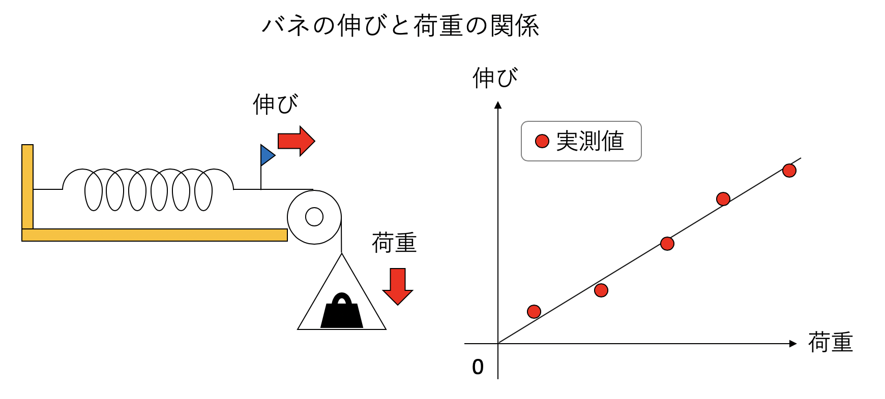
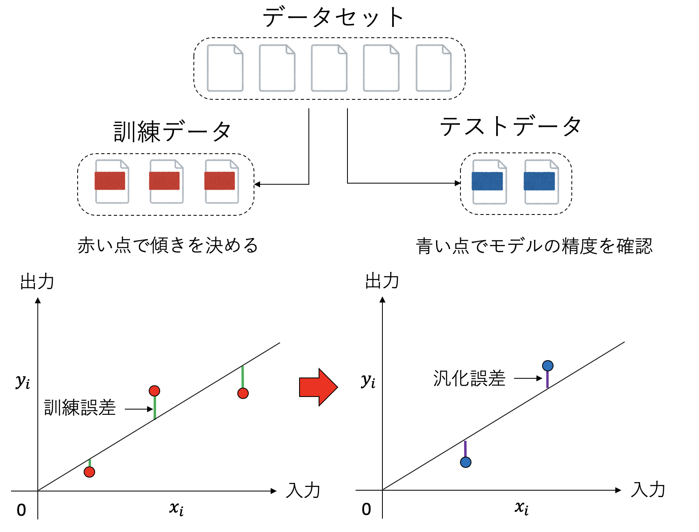

# 簡単な機械学習

## 本講で学ぶこと

* 機械学習の概要
* 回帰
* DCGAN

## 機械学習の概要

昨今、「機械学習」「ディープラーニング」「AI」といった言葉をよく聞く。TensorFlowやPyTorchなど、広く使われている機械学習のフレームワークの多くがPythonで記述されていることもあり、機械学習をする上でPythonが事実上の共通語になりつつある。機械学習による派手な結果を目にすることも多いだろう。せっかく本書でPythonを学んだのであるから、最後は機械学習を体験してみよう。今回は、ざっと機械学習の概要について触れてから、機械学習で注目されている技術の一つ、GANによる画像生成を体験してみる。

### 機械学習の種類

一口に「機械学習」と言っても、機械学習がカバーする範囲は広い。現在も様々な技術が提案されているため、その全てを厳密に分類するのは難しいが、よく言われるのは以下の三種類の分類である。

1. 教師あり学習
2. 教師なし学習
3. 強化学習

**教師あり学習(supervised learning)** とは、「問題と解答のセット」を与えて、それで学習させる方法である。例えば、予め大量の写真を用意し、それぞれに「ネコ」や「イヌ」といったラベルをつけておく。それを学習させることで、「学習に用いたデータセットに含まれていない、初めて見る写真」に対しても正しく「ネコ」や「イヌ」と判定できるようにさせるのが典型的な教師あり学習である。

**教師なし学習(unsupervised learning)** とは、データだけを与えて、データを分類したり、似ているものを探したりさせる方法である。例えば物品の売上データを解析し、「ある商品Aを購入した人は、次は商品Bを購入する可能性が高い」といった関係を見つければ、商品Aを購入した人に「Bはいかがでしょうか？」と勧めることができ、売上向上につながる。オンラインショップなどでよく見る「この商品を買った人はこんな商品も買っています」というアレである。

**強化学習(reinforcement learning)** とは、何かエージェントに行動をさせて、その結果として報酬を与えることで、「うまく」行動できるように学習させていく手法である。典型的な応用例はチェスや囲碁、将棋などのボードゲームのAIであろう。ある局面において、多数ある合法手の中から「次の一手」を選ばなければならない。この時、とりあえず(現在の知識で)適当に指してみて、勝負が決まってから振り返り、「最終的に勝利につながった手」に正の報酬を、「敗北につながった手」に負の報酬を与えることで、それぞれの局面において「これは良い手だった」「これは悪手だった」と学習していく。

これらはどれも面白く、それぞれ奥が深いのだが、本章では教師あり学習を学ぶことにしよう。「教師あり学習」が扱う問題は、さらに「分類」と「回帰」にわけることができる。分類とは、入力に対して有限のラベルのどれかを当てる問題である。例えば「ネコ」「イヌ」「ゾウ」「パンダ」のどれかが写っている写真を見せられ、何が写っているかを答えるのが典型的な分類問題である。特に、ラベルが「Yes」か「No」の二種類である時、これを **二値分類(binary classification)** と呼ぶ。回帰問題とは、入力に対して何か連続な値を返す問題である。例えば家の広さ、築年数、駅からの距離や周りの条件等から家賃を推定するのが典型的な回帰問題である。

### 学習と最適化

機械学習では、よく「学習」という言葉が出てくる。学習とは、ある量を最適化することだ。その最適化の簡単な例として、線形回帰を見てみよう。

回帰とは、何かしらの入力$x$に対して、出力$y$が得られる時、その間の関係$y = f(x)$を推定する問題である。例えば片方を固定されたバネに荷重をかけ、どのくらい伸びるかを調べる実験を考える。この場合の入力$x$は荷重、出力$y$はバネの伸びである。とりあえずいくつか重りを乗せてみて、荷重と伸びの観測値をグラフにプロットしてみたら以下のようになったとしよう。



ここから、バネ定数を推定するには最小二乗法を使えば良いことは知っているであろうが、簡単におさらいしておこう。いま、$N$回異なる荷重をかける実験を行い、荷重とバネの伸びの観測値の組$(x_i, y_i)$が得られたとする。さて、フックの法則から$y = a x$が予想される。$x_i$の荷重がかかった時、このモデルによる予想値は$a x_i$だが、観測値は$y_i$だ。そのズレ$y_i - a x_i$を残差と呼ぶ。この残差の二乗和は$a$の関数であり、以下のように表すことができる。

$$
C(a) = \sum_i^N (a x_i - y_i)^2
$$

$C(a)$はモデルと観測値の誤差を表している。$a$が大きすぎても小さすぎても$C(a)$は大きくなるので、どこかに最適な$a$があるだろう。$C(a)$を最小化するような$a$の値は、$C(a)$を$a$で微分してゼロになるような点であるはずだ。微分してみよう。

$$
\frac{dC}{da} = \sum_i^N (2 a x_i^2 - 2a x_i y_i) = 0
$$

これを$a$について解けば、

$$
a = \frac{\sum_i^N x_i y_i}{\sum_i^N x_i^2}
$$

を得る。

さて、実はこれは最も単純な機械学習の例となっている。我々は、$y = a x$というモデルを仮定し、$N$個の観測値の組$(x_i, y_i)$を使ってモデルパラメタ$a$を決定した。このパラメタを決定するプロセスを「学習」と呼ぶ。「学習」では、$C(a)$を最小化するようにモデルのパラメタ$a$を決定した。この最小化する関数を **目的関数 (cost function)**と呼ぶ。目的関数を最小化するために使われた観測データを「トレーニングデータ」と呼ぶ。トレーニングデータに対する誤差を**訓練誤差**と呼ぶ。



さて、我々の目的はあくまで「バネの伸び」という物理現象を記述することであって、「観測データを再現するモデルの構築」は、その手段に過ぎなかった。したがって、こうして得られた$y = ax$というモデルは、未知の入力$x$に対して、良い予想値$y$を与えなくてはならない。トレーニングデータに含まれない入力$x$に対して、我々が構築したモデルがどれくらい良いかを調べることを **テスト(test)** と呼ぶ。

具体的には、モデルを決める時に使ったトレーニングデータとは別のデータセットを用意しておき、そのデータについてモデルがどれくらいよく予想できるかを確認する、ということがよく行われる。このような目的に使われるデータを「テストデータ」と呼び、テストデータに対する誤差を**汎化誤差**と呼ぶ。

訓練誤差は小さいのに、汎化誤差が大きい場合、トレーニングデータに最適化され過ぎており、応用が効かない「頭でっかち」なモデルになっていることを示唆する。これを **過学習(overfitting)** と呼ぶ。データの数に比べてモデルパラメタが多い時によく起きる。


今回の講義で用いるTensorFlowをはじめとして、機械学習は高度に完成されたライブラリやフレームワークが多数存在する。その内部で用いられている理論やアルゴリズムは難しいものが多く、それらのフレームワークを「ブラックボックス」として用いるのはある程度やむを得ないところもある。しかし、機械学習に限らないことだが、基本的な概念、用語については、簡単な例でしっかり理解しておいた方が良い。「機械学習は最小二乗法のお化けのようなものだ」というと語弊があるのだが、学習、目的関数、訓練誤差、汎化誤差、過学習といった機械学習で頻出する単語のイメージを、中身がよくわかる単純な例、例えば線形モデルの最小二乗法で理解しておく、ということは非常に重要なことである。

機械学習に限らないことだが、「何かよくわからない概念が出てきたら、簡単な例で考えてみる」癖をつけておきたい。

## 重回帰分析

回帰とは、何か入力から出力を予想することである。入力となる変数を説明変数、予想したい出力を目的変数と呼ぶ。例えば、ある人の「賃金」を予想したいとしよう。日本は(まだ)年功序列を採用している会社が多いため、年齢が増えるほど賃金が増えると期待される。そこで、年齢を説明変数、賃金を目的変数に取ってみよう。予想の仕方だが、もっとも簡単には、年齢を$x$、賃金を$y$として、

$$
y = a x + b
$$

と線形の関係を仮定したくなる。このような形による回帰を線形回帰と呼び、説明変数が一つしかない場合を特に単回帰分析と呼ぶ。しかし、賃金を決める要因は他にもある。例えば学歴や、企業規模も関係するであろう。そこで、年齢だけでなく、学歴や企業規模も含めて賃金を予想したい。このように、複数の説明変数から目的変数を予想することを重回帰分析と呼ぶ。説明変数が$x_1, x_2, \cdots$とある時、重回帰分析では目的変数は説明変数を使って

$$
y = a_1 x_1 + a_2 x_2 + \cdots + b
$$

と予想される。

さて、年齢のような変数ならこれで良いが、学歴を説明変数にするにはどうすればよいだろうか？先のように式に落とすためには、なんらかの方法で学歴を数値化しなければならない。この時、ラベルごとに「ダミー変数」と呼ばれる変数を使うことがよく行われる。ダミー変数とは、ある条件を満たしている時に1、そうでない時に0となるような変数である。

例えば、大学卒であるかないかが賃金に与える影響を重回帰分析したいとしよう。この時、年齢を$x$、大学卒であるかどうかのダミー変数を$z$として、賃金$y$を

$$
y = a x + c z + b
$$

と予想する。$z$は大卒であるときに$1$、そうで無い時に$0$となる。すなわち、係数$c$は「大卒」であるときに期待される賃金の増加分と解釈できる。ラベルが複数ある時、例えば学歴を「中卒」「高卒」「大卒」に区別したい時には、ダミー変数を$z_1$、$z_2$、$z_3$と三つ用意し、中卒の時には$z_1 = 1, z_2 = 0, z_3 = 0$、高卒の時には$z_1 = 0, z_2 = 1, z_3 = 0$などとすることで学歴を変数として表現することができる。課題では、学歴に加えて企業規模が賃金に与える影響も重回帰分析で調べてみよう(課題1)。

## GANとは

通常よく使われる機械学習、例えば「植物の写真を見せて名前を答えるモデル」や「人間の写真を見せて年齢を推定するモデル」などでは、モデルは入力となるデータに対して何かしら「答え」を返すことが目的である。しかし、そういう分類や回帰ができるようになってくると、もっと難しい作業、例えば「有名な画家の絵を多数模写させることで、その画家のタッチでオリジナルの絵が書けるモデル」や、「テーマを伝えただけで映画やドラマの脚本を書けるモデル」などをやらせてみたくなるのが人情である。ここではそんな例として、GANを取り上げる(課題2)。**GAN (generative adversarial networks)** とは、直訳すると **敵対的生成ネットワーク**であり、二つのモデルを競わせることで画像を生成する手法である。

GANでは、GeneratorとDiscriminatorの二つのモデルを用意する。これらはよく「偽造者」「鑑定者」にたとえられる。まず、本物のデータセット(例えば有名な画家の絵)を用意する。その後、ランダムに「本物のデータ」と「偽造者」が生成した「偽物のデータ」を「鑑定士」に見せ、それを本物か、偽物か判定させる。鑑定者から見れば、これは二値分類問題になっている。ラベルは「本物」か「偽物」である。鑑定者は大量に見せられるデータをどんどん鑑定することで「鑑定士」としての観察眼を磨いていく。

逆に、偽造者は、自分が提出したデータが「偽物」と見破られたら失敗、「本物」と鑑定されたら成功であり、そのフィードバックを受けながら「偽造者」としての腕を磨いていく。


こうして「偽造者」と「鑑定者」がお互いに切磋琢磨しながら学習していくと、最終的に「本物と見紛うばかりのデータを生成できる偽造者が誕生するだろう」というのがGANの要諦である。今回の課題では、適当なデータセットを用意し、偽造者と鑑定者を学習させることで、最終的に偽造者が用意したデータセットを真似た絵を生成できるようになるプロセスを観察しよう。

## 簡単な機械学習：課題

### 課題1：重回帰分析

年齢や学歴が給与に与える影響を重回帰分析で調べて見よう。なお、データは[厚生労働省の平成30年賃金構造基本統計調査](https://www.mhlw.go.jp/toukei/itiran/roudou/chingin/kouzou/z2018/index.html)による。

新しいノートブックを開き`salary.ipynb`として保存せよ。

#### 1. ライブラリのインポート

最初にライブラリのインポートをしておこう。Pandasはデータ解析を支援するためのライブラリだ。

```py
import matplotlib.pyplot as plt
import pandas as pd
from sklearn.linear_model import LinearRegression
```

#### 2. 給与データのダウンロード

次に、給与データ(CSVファイル)をダウンロードしよう。

```py
!wget https://kaityo256.github.io/python_zero/ml/salary.csv
```

#### 3. データの読み込み

CSVファイルをPandasで読み込んで見よう。

```py
df = pd.read_csv("salary.csv")
df
```

`age`や`education`、`company_size`、`salary`といったデータが読み込まれたはずだ。これらはそれぞれ年齢、学歴、企業規模、給与(千円)である。学歴と企業規模のラベルはそれぞれ以下の通り。

* 学歴(`education`)
  * `middle`: 中卒
  * `high`: 高卒
  * `tech`: 高専・短大卒
  * `university`: 大学・大学院卒
* 企業規模(`company_size`)
  * `small`: 小企業(従業員数10〜99人)
  * `medium`: 中企業(従業員数100〜999人)
  * `large`: 大企業(従業員数1000人以上)

#### 4. 大企業のみのデータ

後でプロットするため、大企業のみのデータを抽出しよう。

```py
large = df[df['company_size'] == 'large']
large
```

`company_size`が`large`のデータのみが抽出されたはずだ。

#### 5. データのピボット

学歴別の収入を見るため、年齢を行、学歴を列とした2次元のデータに整形しよう。

```py
large = large.pivot(index='age', columns='education', values='salary')
large
```

それぞれの年齢に対して、学歴別に収入が並んだデータになったはずである。

#### 6. データのプロット

大企業に務める人の収入を学歴別にプロットしてみよう。

```py
large.plot()
```

年齢を横軸とし、学歴別に賃金(月収、単位千円)がプロットされたはずだ。

#### 7. 回帰用データの作成

先程のデータを見ると、55歳を超えると賃金が下がるのがわかる。これでは線形近似がしづらいので、55歳以下のデータに限定してフィッティングすることにしよう。

```py
df = df[df['age'] < 55]
inputs = df.drop('salary', axis=1)
inputs
```

年齢が55歳以下のデータのみを抽出した後、説明変数として`salary`以外のデータを`input`として取得している。年齢(`age`)、最終学歴(`education`)、企業規模(`company_size`)が並んだはずだ。これらから給与(`salary`)を推定するのが今回の目的である。

#### 8. ダミー変数の作成

現在、企業規模が`small`、`medium`、`large`と「ラベル」になっている。これを「数値」にしないとフィッティングができない。そこで、これらのラベルをダミー変数に変換しよう。Pandasは`get_dummies`という命令一発でダミー変数に変換することができる。

```py
inputs = pd.get_dummies(inputs)
inputs
```

学歴を表すために、`education_middle`や`education_high`といったダミー変数が導入された。例えば最終学歴(`education`)が高卒(`high`)だった場合は`education_high=1`、大学・大学院卒なら`education_university=1`(それ以外の`education`由来のダミー変数はゼロ)といった具合である。

#### 9. 重回帰分析

ではこのデータを重回帰分析してみよう。といっても、scikit-learnの線形回帰の`fit`関数を呼ぶだけだ。

```py
lr = LinearRegression()
lr.fit(inputs.values,df['salary'])
```

#### 10. 係数の表示

決定された回帰係数を表示してみよう。以下を実行せよ。

```py
labels = inputs.columns
pd.DataFrame({"Name":labels, "Coefficients": lr.coef_})
```

それぞれのラベル(例えば`education_high`)に対して、係数(`Coefficents`)が表示されたはずだ。このうち、年齢(`age`)は「年齢が一つ増える毎に、どれだけ賃金が増えるか(単位：千円)」を表している。ダミー変数は、例えば「高卒である」ならば、`education_high`に対応する賃金が増加(マイナスなら減少)することを表している。

このデータを見て、中卒と大卒で賃金がどれだけ変わるか計算せよ。大企業と小企業ではどうか？

#### 11.フィッティング結果のプロット

せっかく回帰分析により「年齢」「学歴」「企業規模」から賃金が予想できるようになったはずなので、予想結果を実際のデータに重ねてプロットしてみよう。以下を実行せよ。

```py
dic = dict(zip(labels, lr.coef_))
X = [i for i in range(22,55)]
a = dic["age"]
e1 = dic["education_university"]
e2 = dic["education_middle"]
s = dic["company_size_large"]
c = lr.intercept_
Y1 = [x * a + e1 + s + c for x in X]
Y2 = [x * a + e2 + s + c for x in X]
ax = large.plot()
ax.plot(X,Y1, marker='o')
ax.plot(X,Y2, marker='*')
```

正しく実行されていれば、大企業に務める人の賃金のグラフに、回帰による予測値(中卒と大学・大学院卒)が重ねてプロットされたはずである。どのくらい正確に予想できているだろうか？もし実際のデータとずれているなら、その原因は何か考察せよ。

### 課題2：GAN

機械学習の手法の一つ、敵対的生成ネットワーク、GAN (Generative Adversarial Networks)を体験してみよう。これは、偽造者(Generator)と鑑定者(Discriminator)がお互いに切磋琢磨させることで、偽造者に本物そっくりの画像を生成させるようにする手法である。ここでは、DCGAN (Deep Convolutional Generative Adversarial Network)と呼ばれる手法を用いる。

新しいノートブックを開き`dcgan.ipynb`として保存せよ。また、今回の計算はかなり重いため、CPUだけでは時間がかかりすぎてしまう。そこで、GPUを使って計算することにしよう。メニューの「ランタイム」から「ランタイムのタイプを変更」をクリックせよ。ハードウェアアクセラレータが「None」になっているので、そこを「GPU」に変更して「保存」をクリックする。このとき「このノートブックを保存する際にコードセルの出力を除外する」にはチェックを入れなくて良い。その後、右上にある「接続」をクリックする。その際、「あなたはロボットですか？」と、人間であるか確認するダイアログが出る場合がある。その時には「わたしはロボットではありません」をクリックする。

#### 1. サンプルプログラムのダウンロード

GANのプログラムは、簡単なものでもそれなりに長いコードを記述する必要がある。今回は既に入力されたプログラムをダウンロードしよう。以下を実行せよ。

```py
!wget https://kaityo256.github.io/python_zero/ml/dcgan.py
```

#### 2. インポート

先程ダウンロードしたプログラムをインポートしよう。

```py
import dcgan
```

#### 3. データのダウンロード

GANでは、まず「正解の画像」をデータセットとして与える必要がある。偽造者は、その画像に似せて絵を描いていく。逆に、与えるデータによって「好きな画家」を模写できるように学習させることができる。今回は、二つのデータセットを用意した。

* `mnist.npy` 手書きの数字(MNIST)
* `hiragana.npy` 「あ」から「こ」までの、ひらがな十種。

上記のうち、好きなものを一つ選んで`TRAIN_DATA`とし、ダウンロードすること。数字は学習が容易だが、ひらがなは難しい。

以下は手書きの数字(MNIST)を選んだ場合の例である。

```py
data = "mnist.npy"
url="https://kaityo256.github.io/python_zero/ml/"
file=url+data
!wget $file
```

#### 4. 学習

ではいよいよGANの実行をしてみよう。以下を実行せよ。

```py
dcgan.run(data)
```

画面には、一定時間ごとに偽造者が作成した画像が表示されていく。最初は完全なノイズにしか見えなかった画像が、学習が進むにつれて偽造者が「腕を上げていく」様子が見えるであろう。実行すると「Time for epoch 1 is xxx sec」からepochの値を増やしながら学習が進んでいき、「Time for epoch 100 is xxx sec」まで到達したら完了である。実行には10分～15分程度かかる。

#### 5. APNGのインストール

偽造者が徐々に腕を上げていく様子を見るため、学習を進めながら描いた絵をアニメーションにしてみよう。まずはアニメーションPNGを作るためのライブラリをインストールする。

```py
!pip install apng
```

#### 6. ライブラリのインポート

先ほどインストールしたライブラリをインポートしよう。また、表示に使うライブラリも併せてインポートしておく。

```py
import IPython
from apng import APNG
```

#### 7. アニメーションの作成

作成された画像を一つにまとめて、アニメーションPNGを作成しよう。

```py
files = []
for i in range(100):
    filename = f"img{i+1:04d}.png"
    files.append(filename)

APNG.from_files(files, delay=50).save("animation.png")
```

#### 8. アニメーションの表示

作成されたアニメーションを表示してみよう。

```py
IPython.display.Image("animation.png")
```

アニメーションが表示されれば成功である。この学習の様子を見て、偽造者はどのように学習を進めているか考察してみよ。また、GAN等の技術が今後どのように活かされるか、予想してみよ。

## 余談：AIに悪意はあるか

AIに意識があるか、という問題は難しい。個人的には「AIはそのうち意識を持つ」と信じているが、現時点では「まだソフトウェアなんだな」と思う時と「人間と同じ問題を抱えているのでは」と思う時の両方がある。

「あ、AIはただのソフトウェアなんだな」と思う例の一つは画像認識である。「犬」「猫」「羊」などのラベルがついた画像を事前に学習させておくことで、写真に何が写っているかを認識するAIを作るものだ。一見するとこのAIは写真に写るものを正しく認識しているように見えるが、何もいない草原に「羊がいる」と判断してしまう。「羊」のラベルがついた画像のほとんどが草原であったため、「草原＝羊」と認識してしまったのだ。同様な例に「ハスキーと狼問題」がある。シベリアン・ハスキーは狼に似た犬種であるが、そのハスキーと狼を見分けるAIを作ったところ、実は犬ではなく「背景に雪があるかどうか」で判断していることがあった。

多くの場合、こうした画像認識の失敗は笑い話で済むが、差別問題がからむとやっかいなことになる。2015年、Googleは、写真管理アプリGoogle Photosをリリースしたが、そのアプリには写真に写っているものを認識し、ラベル付けする機能があった。しかし、黒人女性が写る写真に「ゴリラ」とタグ付けしてしまい、Googleが謝罪する事態となった。これについては「差別的な人間が黒人に『ゴリラ』という差別的なタグをつけていたものを学習したせいだ」という噂も流れたが、どうやら純粋に「白人以外」のデータが足りずに、素で間違ったようだ。他にも、やはり黒人女性を「猿(Apes)」と認識してしまうことがわかった。結局Googleは根本解決ができず、「ゴリラ、猿、チンパンジー」といったラベルを禁止ワードにすることで対処することになった。

Google翻訳がジェンダーバイアスを持つことも知られている。例えば現時点(2019年12月4日現在)では、「**医者**は旅行先でカバンを忘れてきた。」は「The doctor has forgotten **his** bag at the travel destination.」と訳すが、「**看護師**は旅行先で……」とすると「The nurse has forgotten **her** bag when traveling.」と訳す。Google翻訳は多くの翻訳例を通じて学習したモデルを用いているが、そのデータ上で「Docter」が「his」と、「Nurse」が「her」と一緒に用いらていれることが多かったのだと思われる。

Google Photosの問題は「学習データに白人が多く黒人が少なかったため」に起きたことであり、Google翻訳の問題は学習用データを通じて「医者は男性が多く、看護師は女性が多い」という「偏見」も一緒に学習してしまったために起きたことだ。現時点では「AI」に罪はなく、「AIの学習過程で人間持つの差別や偏見が注入された」と認識されているが、そもそも学習で偏った情報に触れて偏見を身につけてしまうという過程は人間と全く同じである。既に自らの過ちをAIのせいにしている人も出現しており、そのうちAIが高度に発展した場合、我々はAIそのものに悪意や偏見を感じるようになるのかもしれない。

* 「Notes on AI Bias」[https://www.ben-evans.com/benedictevans/2019/4/15/notes-on-ai-bias](https://www.ben-evans.com/benedictevans/2019/4/15/notes-on-ai-bias)
