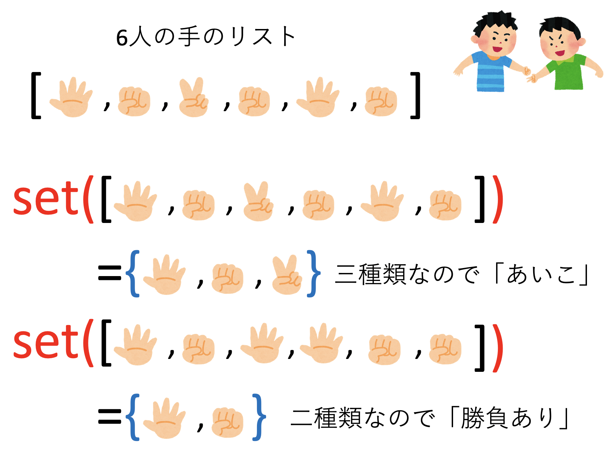
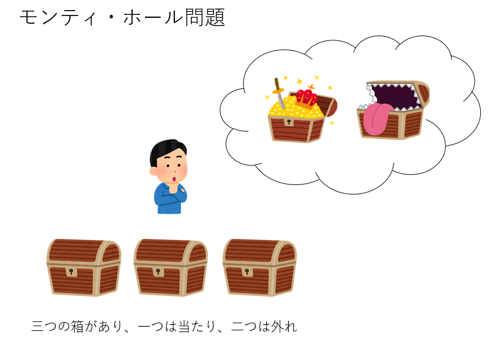
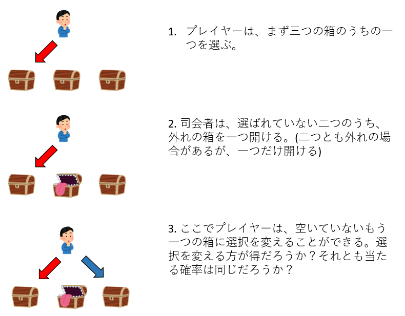
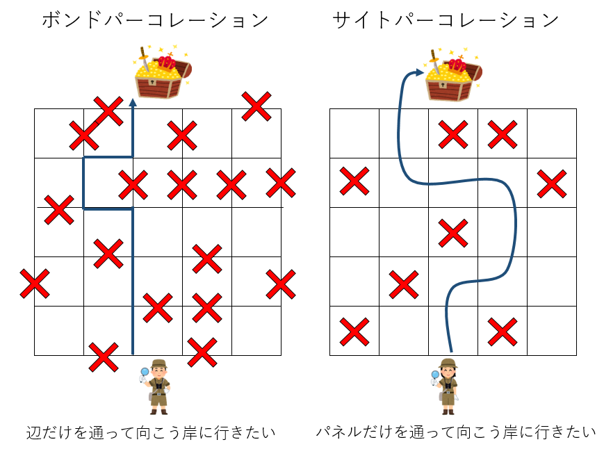
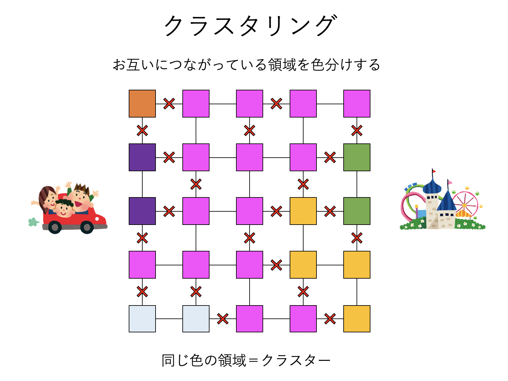
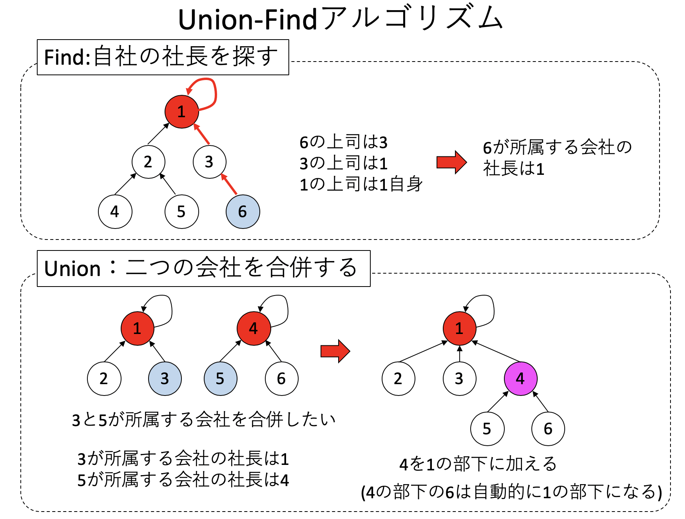

# [乱数を使ったプログラム](https://kaityo256.github.io/python_zero/random/)

* モンテカルロ法
* 疑似乱数
* モンティ・ホール問題
* パーコレーション
* 余談1：確率の難しさ
* 余談2：疑似乱数とゲーム

## モンテカルロ法

大勢で「じゃんけん」をしたとき、なかなか勝負が決まらない経験をしたことがないだろうか。じゃんけんに参加する人数が増えるほど、「あいこ」の確率が増え、勝負が決まらなくなる気がする。それでは、$N$人が参加するじゃんけんで、「あいこ」になる確率はいったいどれくらいだろうか？

もちろんこれは理論的に計算できる。しかし、特に確率の問題は、計算した答えが合っているかどうか不安になるだろう。そこで、実際に計算機でシミュレーションして「答え合わせ」をしたくなる。というわけで、このじゃんけん問題をプログラムで表現することを考えてみよう。

じゃんけんで「あいこ」になるのは、みんなのだした手がすべて同じ(1種類)か、全て異なる(3種類)かなので、出した手の種類の数を数えれば良い。したがって、こんなプログラムになるだろう。

1. $N$人が「グー」「チョキ」「パー」のどれかを1/3の確率で選ぶ
2. 選んだ$N$個の「手」が、1種類か3種類の時には「あいこ」
3. 1と2を繰り返して確率を求める

ここで問題となるのは1.の「$N$人が「グー」「チョキ」「パー」のどれかを1/3の確率で選ぶ」というところだ。そのためには「グー」「チョキ」「パー」から「ランダム」にどれかを選ぶ、という処理が必要になる。このようなランダムな事象を扱うために、Pythonには`random`というライブラリが用意されている。今回のケースでは、リストの要素をランダムに選ぶ`random.choice`という関数を使えば簡単に実装できる。

例えば、「グー」「チョキ」「パー」をそれぞれ`G`、`C`、`P`で表現しよう。この三要素を持つリストは`['G','C','P']`で表現できる。そして、

```py
import random
random.choice(['G','C','P'])
```

とすると、実行するたびに`G`、`C`、`P`のどれかがランダムに選ばれる。先ほどの`random.choice`とリストの内包表記を使うと、例えば10人のじゃんけんの手のリストは、

```py
N = 10
[random.choice(['G','C','P']) for _ in range(N)]
```

で作ることができる。実行結果は例えば

```txt
['G', 'G', 'G', 'G', 'P', 'G', 'C', 'G', 'C', 'P']
```

などとなる(実行するたびに異なる)。

さて、`set`という関数を使うと、リストのうち重複する要素を削除することができる。

```py
set(['G', 'G', 'G', 'G', 'P', 'G', 'C', 'G', 'C', 'P'])
```

上記の実行結果は以下の通り。

```txt
{'C', 'G', 'P'}
```



こうして、$N$人の「手」のリストを作り、重複する要素を削除すれば、それが「手」の種類であり、勝負がつくのは「手が2種類」の時のみなので、それ以外は「あいこ」としてカウントすれば良い。以上を愚直にコードに落とすとこんな感じになるだろう。

```py
import random

trial = 100000
N = 6
aiko = 0
for _ in range(trial):
    a = [random.choice(['G', 'C', 'P']) for _ in range(N)]
    if len(set(a)) is not 2:
        aiko += 1
print(aiko/trial)
```

6人で100000回じゃんけんをさせて、あいこになった数をカウントし、その確率を求めるものだ。実行結果は、例えば以下のようになるだろう。

```txt
0.74684
```

厳密解は

$$
1 - \frac{2^N - 2}{3^{N-1}} = \frac{181}{243} \sim 0.745
$$

なので、「合ってそうだな」ということがわかるだろう(興味がある人はこの厳密解を導出せよ)。

このように、プログラムで確率的な事象をシミュレーションして、何らかの値を求める手法を **モンテカルロ法 (Monte Carlo Method)** と呼ぶ。ここではモンテカルロ法を厳密な答えがわかっている場合の確率の確認に用いたが、複雑な事象(例えば社会現象)のシミュレーションや、数値積分などに用いることができる。今回はPythonでモンテカルロ法を実装してみよう。

## 疑似乱数

### 疑似乱数とは

いま、サイコロを何度もふって、例えば出た目の数の並びが「4, 6, 1, 2, 3, 1, 1, 2, 4, 4」だったとしよう。ここまでの情報で、「次の出目」を予想できるだろうか？「普通」に考えると「4や1が続いてて、まだ5が出ていないからそろそろ5が出るかな」などと考えたくなるが、もしいま使っているのが理想的なサイコロであるならば、次も1から6まで等確率で出現するため、どれが出やすいとか、どれが出にくいなどと予想することはできない。このように「これまでの数列の知識から、次の数を予想できない」ような数列を **乱数列** と呼び、乱数列のそれぞれの要素を **乱数(Random Number)** と呼ぶ。

計算機において乱数が必要になることは多い。例えばゲームで低確率で出る「会心の一撃」や「痛恨の一撃」を表現するのに乱数が必要だ。レアなモンスターを出現させるのも乱数が必要である。しかし、現在の計算機は決定論的に動作するため「真の乱数列」を表現するのは難しい。「真の乱数列」とは、先程定義した通り「これまでの数列から、次の数字が予想できない」ような数列のことであるのに対し、計算機で実現される乱数は **疑似乱数(Pseudorandom number)** と呼ばれる。疑似乱数列は乱数列のように見えるが、実は規則性があり、これまでの乱数から次の乱数が予想できてしまうものだ。疑似乱数列を作る方法には、線形合同法やM系列など様々な方法があるが、現在広く使われているのはメルセンヌ・ツイスター法という手法である。多くのプログラム言語が乱数生成のデフォルトアルゴリズムとしてメルセンヌ・ツイスター法を採用している。本講義では擬似乱数生成アルゴリズムについては触れないが、興味がある人は調べてみると良い。また、原子核崩壊などの物理現象を用いることで「真の乱数」を作るデバイスも発売されている。また、Xorshift法という、極めて高速かつ乱数の性質も(メルセンヌ・ツイスタほどではないものの)非常に良い手法も提案され、例えばブラウザのJavaScriptの乱数生成エンジン等で採用されている。

### Pythonにおける疑似乱数

Pythonには擬似乱数用に`random`というライブラリが用意されており、様々な関数が用意されている。そのうちよく使うものの使い方を紹介しておこう。

#### `random.randint`

例えば1から6までの整数の乱数が欲しければ、`random.randint`が使える。

以下のコードを書いて実行してみよう。これは6面サイコロを10回ふることをシミュレーションしたものだ。

```py
import random

for _ in range(5):
    print(random.randint(1,6))
```

これは実行するたびに異なる結果が得られる。例えば以下のような結果が得られる。

一回目の実行結果。

```txt
2
6
6
3
6
```

二回目の実行結果。

```txt
5
1
1
3
5
```

#### `random.seed`

先程のコードは実行するたびに異なる結果が得られた。しかし、以下のようにすると、何度実行しても同じ乱数列が得られる。

```py
import random

random.seed(1)
for _ in range(5):
    print(random.randint(1,6))
```

このコードは何度実行しても以下の結果になる。

```txt
2
5
1
3
1
```

これは`random.seed`により乱数の「種」を固定したためだ。計算機は、漸化式により乱数列を作ることが多い。漸化式は、生成した乱数を入力として次の乱数を作る方法だが、その一番最初に与える値を乱数の「種(seed)」と呼ぶ。同じ種からは同じ乱数列が生まれる。これでは乱数としては不都合であるので、「現在時刻」等を乱数の種とすることが多い。こうすると実行するたびに異なる乱数列が得られる。しかし、主にデバッグ目的などで、毎回同じ乱数の種を与えたいときもあり、`random.seed`は、そのような場合に用いる。

#### `random.random`

`random.randint`を用いると整数の乱数列が得られたが、実数の乱数列が欲しければ`random.random`を用いる。これは0から1未満のランダムな実数を返してくれる関数だ。

```py
import random
for _ in range(10):
    print(random.random())
```

例えば実行結果はこんな感じになる。

```txt
0.2293093032885165
0.7225401496925509
0.4118307989719816
0.4352123667218194
0.5182296930788952
0.6598049756657662
0.5928754652967204
0.35716459244689625
0.7115734931703437
0.9442876247500515
```

出現する可能性のある乱数の、それぞれの出現確率がすべて等しい場合、その乱数を **一様乱数** と呼ぶ。ある分布に従うような非一様な乱数が生成できると便利な場合もあるが、本講義では一様乱数のみを扱うことにする。なお、確率をきちんと定義、議論するのは面倒なので、ここでは確率についてかなりいい加減な定義を使っていることを了解されたい。

#### `random.choice`

リストが与えられた時、そのリストの要素をランダムに選びたいことがある。これはリストのサイズと`random.randint`を使って書くこともできるが、最初に紹介した`random.choice`という関数が便利なのでそれを利用しよう。

```py
import random
a = ["A","B","C"]
for _ in range(10):
    print(random.choice(a))
```

例えば実行結果は以下のようになる。

```txt
A
A
B
A
C
B
C
C
C
B
```

ちなみに`random.randint`を使うとこのようになる。

```py
import random
a = ["A","B","C"]
for _ in range(10):
    i = random.randint(0,len(a)-1)
    print(a[i])
```

0から`len(a)-1`の範囲の乱数`i`を生成し、それをインデックスとして`a[i]`にアクセスしている。

## モンテカルロ法による数値積分

今回の講義では詳細は扱わないが、モンテカルロ法は数値積分にも用いられるので、簡単に紹介しておこう。モンテカルロ法による数値積分で有名なのは、円周率の計算であろう。ダーツの要領でランダムに「矢」を投げ、当たった数で円周率を推定する方法である。以下は$n$回ダーツを投げて円周率を推定するプログラムである。

```py
from random import random

def calc_pi(n):
    r = 0
    for _ in range(n):
        x = random()
        y = random()
        if x**2 + y**2 < 1.0:
            r += 1
    return 4 * r / n

calc_pi(10000)
```

これは、実は以下のような二次元の数値積分をしていることと等価である。

$$
\pi \sim 4 \int_0^1 \int_0^1 \Theta(1-x^2-y^2) dx dy
$$

ただし$\Theta(x)$はステップ関数で、$x\geq 1$で1、そうでない場合は0となる関数である。この積分はこれは単位円の1/4の面積に対応するので、それを4倍すると円周率になるのは当たり前のように見えるが、実際の手続きとしては、0から1の一様乱数二つの二乗和が1を超えるかどうかを判定しているだけなので、それで円周率という超越数を計算できるのは面白い。

このアルゴリズムは簡単で、少ない試行回数でそこそこの精度が出るが、収束が遅いために円周率を高精度に求めるのには向かない。現在、数値積分目的には単純なモンテカルロ法はほとんど使われておらず、モンテカルロ法というと、ほぼ「マルコフ連鎖モンテカルロ法 (Markov-chain Monte Calro method, MCMC)」のことを指す。ここでは詳細については触れないが、ナイーブなモンテカルロ法に比べてマルコフ連鎖モンテカルロ法は極めて収束が早いため、「ダーツによる円周率」の問題だけを見て「モンテカルロ法は遅い」という印象は持たないで欲しい。

## モンティ・ホール問題

さて、モンテカルロ法により、確率的な事象のシミュレーションをして、何かの確率を求めてみよう。その題材として「モンティ・ホール問題」を取りあげる。モンティ・ホール問題とは、アメリカの番組の中で行われた、あるゲームに由来する。そのゲームのルールとはこういうものである。

* 三つの箱が用意され、その中に一つだけ商品が入っており、残りの二つは空である。
* プレイヤーは、そのうちの一つを選ぶ
* 司会者は、選ばれなかった二つの箱の中身を確認し、空であるほうの箱を開ける
* その上で司会者はプレイヤーに「選んだ箱を変えてよい」という
* さて、プレイヤーは選んだ箱を変えたほうが得だろうか？それとも確率は変わらないだろうか？




この問題は有名なので、答えを知っている人も多いだろう。しかし、ここは答えを全く知らないとして、シミュレーションをしよう。

まずは、司会者が選ばれなかった箱のうち一つを開け、「選んだ箱を変えてよい」と言った時に「最初に選んだ箱を変えない」戦略を考えよう。
これをKeep派と呼ぶ。Keep派は司会者の影響を受けないので、シミュレーションは簡単だ。

1. 三つの箱を用意し、どれが正解かをランダムに決める
2. プレイヤーは、三つの箱をランダムに選ぶ
3. 正解の箱と、プレイヤーが選んだ箱が一致したら、「一致した回数」を+1する。

以上、1〜3を何度も繰り返して、「一致した回数」を「試行回数」で割ったものがKeep派の正解確率である。

次に、司会者が「選んだ箱を変えて良い」と言われたら「必ず変える」戦略を考えよう。これをChange派と呼ぶ。Change派のシミュレーションは以下のようになるだろう。

1. 三つの箱を用意し、どれが正解かをランダムに決める
2. プレイヤーは、三つの箱をランダムに選ぶ
3. 司会者は、残った箱のうち「正解で無い方」をランダムに選ぶ
4. プレイヤーは「司会者が開けなかった方」を選び、それを最終決定とする

以上、1〜4を何度も繰り返し、「一致した回数」を「試行回数」で割ったものがChange派の正解確率である。

## パーコレーション

乱数を使うプログラムのもう一つの例としてパーコレーションを取り上げる。

### パーコレーションとは



札幌の市街のような、碁盤の目のような道路があるとしよう。ところがある日、大雪が降って、道がところどころ通行止めになってしまった。いま、道が通行可能な確率をpとしよう。通行可能な道だけを通って「こっち側」から「向こう側」に通過できる確率$C$を知りたい。確率$C$は確率$p$の関数となる。当然、$p$が小さければ渡れる確率は低く、大きければ渡れる確率は高くなると思われるが、どんな関数になるか想像できるだろうか？

これは **ボンド・パーコレーション(Bond Percolation)** と呼ばれるモデルとなり、十分大きなシステムでは「$p$がある値$p_c$未満ではほぼ確実に渡ることができず、$p_c$より大きければほぼ確実に渡ることができる」という振る舞いを見せる。つまり、系の振る舞いがパラメータのある一点を境に大きく変化する。このように、あるパラメータを変化させていったときに、ある点で系の性質が大きく変化することを **相転移(Phase Transigion)** と呼び、性質が変わるパラメータの境目$p_c$を **臨界点(Critical Point)** と呼ぶ。

パーコレーションは、相転移を示す最も簡単なモデルのひとつだ。身近な相転移としては、水の沸騰などが挙げられる。水を一気圧の条件で温度を徐々に挙げていくと、摂氏100度で沸騰し、水蒸気になる。水も水蒸気も水分子から構成されており、それは全く変化していない。しかし、水分子の集団としての振る舞いが大きく変化するのである。0度以下に冷やすと凍るのも相転移である。

このパーコレーションをプログラムで解析してみよう。以下、道路の交差点を「サイト」と呼ぶ。各サイトは別のサイトと道でつながっているが、その道は確率$p$で通行可能、$1-p$で通行止めになっているとする。あるサイトから別のサイトに通行可能ならば、それらのサイトは「つながっている」と定義し、「つながっているサイト」のまとまりを「クラスター」と呼ぶ。



通行可能確率$p=0$の時には、全ての道が通行止めになっているので、各サイトはすべて孤立している。逆に$p=1$の時には、全ての道が通行可能なので、全てのサイトが一つのクラスターとなる。その中間の値の時には、各サイトが複数のクラスターに分離するであろう。このように、お互いにつながっているサイトをまとめることを「クラスタリング」と呼ぶ(機械学習などで耳にするクラスタリングとは意味が異なるので注意)。このクラスタリングを行うために、Union-Findアルゴリズムを用いる。

### Union-Findアルゴリズム

あるサイトAから、あるサイトBに到達可能であったとする。サイトBからサイトCに通行可能であるならば、AからCに到達可能である。今、サイトXからサイトYに到達可能であることを「X 〜 Y」と表記すると、「〜」は同値類を作る。同値類というと難しそうだが、要するに「『友達の友達』は友達である」と定義した時に、お友達グループに分類しましょう、ということである。先程のパーコレーションならば、「お互いに到達可能なサイト」は同値類を作る。

さて、AとBがつながっており、BとCがつながっていることがわかった時、AとCがつながっている、ということをどうやって知ればよいだろうか？この問題は単純そうに見えて意外に面倒ください。次々とサイトをつなげてクラスターを作っていくとき、大きなクラスター同士が「つながった」時に、それぞれに属すサイトをすべてつなげる、という処理をしなければならない。このような処理に便利なのが「Union-Find」と呼ばれるアルゴリズムだ。

Union-Findは、Union-Find木と呼ばれる木構造を作るアルゴリズムで、その名の通り「Union」処理と「Find」の二つの処理からなる。Union-Find木は「上司」「部下」の関係を表現するようなデータ構造だ。



まず、Findは、「自分の属す会社の社長」を探す処理である。各サイトは「自分の上司」を覚えている。その上司にはさらに上司がいて・・・とたどっていくと、最終的に「自分自身が上司」となるサイトに到達する。この「自分自身が上司」となるサイトを社長としよう。例えば上の図で、6番の所属する会社の社長を探してみる。6の上司は3、3の上司は1であり、1の上司は自分自身であるため、6の所属する会社の社長は1とわかる。

次にUnionは「二つの会社の合併処理」をする。いま、先程の図で3の所属する会社と5の所属する会社を合併したいとする。しかし、3も5も平社員だ。そこでそれぞれの所属する会社の社長である1と4に相談する。相談の結果、1の会社が4を吸収合併することに決まった。それまで4の上司は自分自身だったが、新たに1を上司としてつなぎ替える。この状態で「6」の所属する会社の社長を探すと、「6の上司は4」「4の上司は1」となり、直接合併に携わらなかった6も正しく1の会社に所属していることがわかる。

課題では、このUnion-Findアルゴリズムを用いて、パーコレーションのクラスタリングを行ってみよう。

# 乱数を使ったプログラム：課題

## 課題1：モンティ・ホール問題

モンティ・ホール問題において、Keep派、Change派それぞれの「正解確率」を計算し、どちらが得かを考えてみよう。新しいノートブックを開き、`monty_hall.ipynb`という名前で保存せよ。

### 課題1-1：Keep派

まずはKeep派のシミュレーションをしよう。

#### 1. ライブラリのインポート

何はともあれ、まずはライブラリのインポートである。後で使うライブラリをまとめてインポートしておこう。

```py
from random import choice, seed
from copy import copy
```

#### 2. Keep派のアルゴリズム`keep`を実装

まずは箱の中身のリストを渡されたときに、正解の箱とプレイヤーの選ぶ箱をランダムに選び、一致するかどうかを返す関数`keep`を作ってみる。二つ目のセルに以下を入力せよ。

```py
def keep(boxes):
    answer = choice(boxes)
    first_choice = choice(boxes)
    return answer == first_choice
```

`answer`が正解の箱、`first_choice`がプレイヤーの最初の選択である。Keep派は最初の選択から箱を変えないので、これが最終決定となる。

#### 3. `keep`の動作確認

入力・実行したら、適当な箱リストを与えて`keep`を呼んでみよう。3つ目のセルに以下を入力し、実行せよ。

```py
seed(1)
boxes = [1,2,3]
for _ in range(10):
    print(keep(boxes))
```

このような結果が得られるはずである。

```sh
False
False
False
True
False
True
False
True
False
False
```

正解の箱とプレイヤーの選んだ箱が一致したら`True`、そうでなければ`False`と表示されている。

### 課題1-2：Change派

さて、先ほどとは逆に「選んだ箱を変えてよい」と言われた時に、必ず箱を変える戦略を考えよう。これをChange派と呼ぶ。

#### 4. 関数`change`の実装

4つ目のセルに、`change`を実装しよう。箱のリストを受け取り、正解`answer`と、プレイヤーが最初に選ぶ箱`first_choice`を決めるところまでは同じである。

さて、次に「司会者が開ける箱」を考える必要がある。司会者が開けるのは、プレイヤーが選んだ箱であっても、正解の箱あってもならない。ここで、最初にプレイヤーが選んだ箱が正解かどうかで処理が変わる。

* もしプレイヤーが最初に選んだ箱が正解ならば、司会者は残りの二箱のどちらを開けても良いので、ランダムに開ける。従って、プレイヤーの二回目の選択は、「残りの二箱」からランダムに選ぶことになる
* もしプレイヤーが最初に選んだ箱が答えでないのなら、残りの二箱には必ず正解が含まれる。司会者は正解ではない箱を開けるため、Change派のプレイヤーの二度目の選択は正解の箱となる

以上の処理をそのままプログラムに落とすことにしよう。以下の「ここを埋めよ」のところで、プレイヤーが二度目に選択する箱`second_choice`を決めるコードを書け。

```py
def change(boxes):
    answer = choice(boxes)
    first_choice = choice(boxes)
    rest_boxes = boxes.copy()
    rest_boxes.remove(answer)
    # ここを埋めよ
    return answer == second_choice
```

* ヒント1：`first_choice`が正解かどうかで条件分岐せよ
* ヒント2：`rest_boxes`は、「正解を除いた」箱のリストである

#### 5. `change`の動作確認

5つ目のセルで`change`関数の動作確認しよう。

```py
seed(1)
boxes = [1,2,3]
for _ in range(10):
    print(change(boxes))
```

実行するとこのような結果が得られるはずである。

```txt
True
True
True
False
False
True
True
True
False
True
```

#### 6. 確率の計算

Keep派、Change派の行動が両方シミュレートできるようになったので、それぞれの「正解確率」を計算してみよう。
6つ目のセルに以下を入力せよ。

```py
seed(1)
boxes = [1,2,3]
k = 0
c = 0
n = 10000
for _ in range(n):
    if keep(boxes):
        k += 1
    if change(boxes):
        c += 1
print("Keep  : " + str(k/n))
print("Change: " + str(c/n))
```

`n`が試行回数、`k`がKeep派の正解数、`c`がChange派の正解数であるから、`k/n`がKeep派の、`c/n`がChange派の正解確率である。どちらが正解確率が高かっただろうか？また、それはなぜか考察せよ。

## 課題2：パーコレーション

乱数を使ったシミュレーションの例として、パーコレーションを考える。`L`x`L`の碁盤の目上の道が、確率$p$で通行できて、$1-p$で通行止めになっているとする。この時、通行可能な道を通過してお互いに行き来できる場所を色分けしてみよう。

新しいノートブックを開き、`percolation.ipynb`として保存せよ。

### 1. ライブラリのインポート

最初のセルでは、いつもどおりライブラリのインポートをする。

```py
import random
from PIL import Image, ImageDraw
```

### 2. `find`関数

2つ目のセルで、自分が所属するクラスタ番号を調べる`find`関数を実装しよう。自分の番号が親の番号と一致する`i = parent[i]`まで、親をたどっていくプログラムである。

```py
def find(i, parent):
    while i != parent[i]:
        i = parent[i]
    return i
```

### 3.`union`関数

3つ目のセルで、二つのサイトを確率的につなぐ`union`関数を実装しよう。サイト`i`とサイト`j`のクラスター番号を`find`で取得し、サイト`j`の所属するクラスタの親をサイト`i`が所属するクラスタにすることで、二つのサイトをつなぐことができる。

```py
def union(i, j, parent):
    i = find(i, parent)
    j = find(j, parent)
    parent[j] = i
```

### 4. 状態の作成

`find`と`union`の実装ができたら、サイトの状態を作るのは難しくない。4つ目のセルに以下を入力せよ。

```py
def make_conf(L, p):
    parent = [i for i in range(L * L)]
    for iy in range(L-1):
        for ix in range(L-1):
            i = ix + iy * L
            j = ix+1 + iy * L
            if random.random() < p:
                union(i, j, parent)
            j = ix + (iy+1) * L
            if random.random() < p:
                union(i, j, parent)
    return parent
```

最初に「親」の情報`parent`を作成しておく。最初はすべて`parent[i] = i`、つまり自分の親が自分自身である状態にしておく。そして、右端と下端を除く全てのサイトについて「右」と「下」のサイトと確率的につなぐ処理を記述している。`if random.random() < p:`というセンテンスは「確率pでif文の中身が実行される」という処理で、確率的な処理の基本となるので覚えておくと良い。

### 5. 状態の可視化関数

5つ目のセルに、サイトの親の情報を受け取って可視化する関数`show_image`を実装しよう。

```py
def show_image(parent, L):
    size = 512
    s = size // L
    im = Image.new("RGB", (size, size), (255, 255, 255))
    colors = []
    for _ in range(L*L):
        r = random.randint(0, 255)
        g = random.randint(0, 255)
        b = random.randint(0, 255)
        colors.append((r, g, b))
    draw = ImageDraw.Draw(im)
    for iy in range(L):
        for ix in range(L):
            i = ix + iy * L
            i = find(i, parent)
            c = colors[i]
            draw.rectangle((ix*s, iy*s, ix*s+s, iy*s+s), fill=c)
    return im
```

あらかじめ、ランダムにクラスター番号と色の対応表`colors`を作っておき、それぞれのサイトのクラスター番号で色を塗ることで「同じクラスターは同じ色で塗る」を実現している。

### 6. シミュレーション

では、早速シミュレーションをしてみよう。まずは通行確率pが0、つまり全ての区間が孤立している状態を可視化してみる。6つ目のセルに以下を入力、実行せよ。

```py
L = 256
p = 0.0
sites = make_conf(L, p)
show_image(sites, L)
```

ここまで正しく実装されていれば、ノイズのような画面が表示されたはずである。

では、次に`p = 0.4`を試してみよ。お互いに通行可能な区間が同じ色で表示されるため、同じ色で塗られた領域(クラスター)が出現したはずである。

`p=0.49`と、`p=0.51`をそれぞれ何度か試し、気づいたことを報告せよ。例えば、同じ色のクラスターだけをたどって「左から右」へ到達できるだろうか？無事な道のみを通って「左から右」に通過できる確率を$P$は、通過可能確率$p$の関数であるはずだが、$P(p)$はどのような関数となるか考察せよ。

## 発展課題：コンプガチャの確率

確率の難しさは、時に「正しい」確率が人の直感に反して大きかったり小さかったりする点にある。人の直感より確率が大きい例としては「誕生日のパラドックス」が知られている。誕生日が365日均等に分布しているとして、30人のクラスで誕生日が重なる人がいる確率はどれだけだろうか？直感的には365日に対して30人なので、10%も無いように思えるが、実際には約70.6%の確率で誕生日が同じ人がいる。

逆に、人の直観より実際の確率が小さいことを「悪用」する例としては「コンプガチャ」と呼ばれる景品がある。これは「絵合わせ」もしくは「カード合わせ」と呼ばれる古典的なギャンブルであり、

* 複数種類の絵柄のあるカードがあり、お金を払うとそのどれかがランダムで手に入る
* 複数の絵柄をすべて揃えたら、景品が当たる

というものである。例えば、あるアーティストのCDを購入すると、44種類あるポスターのうちどれかがランダムにあたる特典があり、44種類のポスター全てをコンプリートしたらイベントに招待する、という事例があったとしよう。全種類揃えるのに平均で何枚CDを購入する必要があるか、すぐにわかるだろうか？これを計算してみよう。新しいPython3 ノートブックを開き、`gacha.ipynb`という名前で保存せよ。

### 1. インポート

まずは`random`をインポートしておこう。

```py
import random
```

### 2. シミュレーション

n種類のポスターを揃えるのに何枚CDが必要になるかを試してみる関数`gacha`を実装しよう。以下の「条件」と「ポスター追加処理」を埋めてコードを完成させよ。

```py
def gacha(n):
  cd = 0
  posters = []
  while 条件 < n:
    # ポスター追加処理
    cd += 1
  return cd
```

`cd`は購入したCDの枚数、`posters`は、当たったポスターのリストであり、このコードでは`n`種類のポスターを揃えるまでCDを購入し続け、揃った段階で購入したCDの枚数を返す関数である。

ヒント1：

1からnまでのランダムな数を`posters`に追加することでn種類のポスターがランダムに当たる処理を表現する。

ヒント2：

1からnまでのランダムな数は`random.randint(1, n)`で得られる。リストへの追加は`posters.append`を使う。

ヒント3：

得られたポスターの「種類」は`len(set(posters))`で得ることができる

### 3. 実行

`gacha`が完成したら、それをなんども実行して「購入CD枚数の期待値」を計算しよう。3つ目のセルに以下を入力、実行せよ。

```py
trial = 100
cd = 0
N = 44
for _ in range(TRIAL):
  cd += gacha(N)
print(cd/TRIAL)
```

CDの平均購入枚数はどれくらいであっただろうか？

### 4. 厳密解

`n`種類のコンプガチャを揃えるための試行回数の厳密解は以下で計算できる。実行し、シミュレーションと結果が合っているか確認せよ。

```py
def p(n):
    r = 0.0
    for i in range(n):
        r += n/(i+1)
    return r

p(44)
```

「44種類ある絵柄が等確率で当たり、44種類揃えたら景品を渡す」という文面に嘘がなく、確率操作などをせず全くその通りに実施するとしても、これは違法となる可能性がある。これは違法とすべきか、そうでないのか、その理由を考えよ。

## 余談：疑似乱数とゲーム

ゲームには乱数がつきものである。RPGなどでは、どの敵が現れるか、攻撃が成功するか、失敗するかなど、全てランダムに決めたい。「はぐれメタル」などのレアなモンスターに、「会心の一撃」などのレアな攻撃が当たって興奮した、などの経験があるだろう。しかし、ゲームは計算機であり、計算機における乱数は疑似乱数である以上、理論上乱数は予想可能である。例えばあるゲームでは「ゲーム機が稼働開始してからの時間」を乱数の種に使っていたため、ゲーム機の電源を落とすと敵の出現テーブルがリセットされたり、レアな敵が出たときにセーブしてリセットすると、また同じ敵が現れてしまうなどの仕様があった。これを利用してレアな敵を狩りまくり、貴重なアイテムを多数手に入れるという「技」があった(古い例で恐縮だが、例えば初代ゲームボーイのRPG「Sa・Ga2 秘宝伝説」の「はにわ狩り」等)。また、動画などを見ていて「TAS」という言葉を見かけたことはないだろうか。これは「Tool Assisted Speedrun」の略で、もともとゲームをエミュレータ上で実行し、理論上可能だが人間には不可能な速度でクリアすることを指したが、そのうちタイムアタック以外についてもTASと呼ばれるようになった。例えばTASによるRPGのタイムアタック動画では、「はぐれメタル」ばかり出て、それに「会心の一撃」ばかりあたるようなことが起きる。次にこういう動画を見るとき、一見無駄な動作が混ざっていないか注意してみてみよう。これは「乱数調整」といわれる手法である。例えばサイコロで「6」が出たら「会心の一撃」が出ることがわかっており、かつこれからのサイコロの目が「2,4,1,3,6」という順番であることもわかっている場合、戦闘の自分の番で「6」が出るように、事前にサイコロを振るのである。

疑似乱数とゲームといえば、面白いのが「質の悪い乱数」によるバグだろう。「カルドセプトサーガ」というXbox360のゲームがある。カルドセプトは、モノポリーのようなボードゲームに、マジック・ザ・ギャザリングのようなカードによるクリーチャー同士の戦いを組み合わせたようなゲームで、その戦略性から人気のあるシリーズであった。しかし「カルドセプトサーガ」は、サイコロの出目が非常に偏っており、例えば偶数と奇数が交互に出る問題があった。このようなサイコロゲームで、次の目が予想できるというのは致命的である。例えば「他のプレイヤーがサイコロで偶数の目を出すまで行動不能」という呪いがあるのだが、うまく行動することでずっと奇数の目を出し続け、相手の行動不能状態を維持し続けることができたようだ(後にパッチにより改善された)。この問題が発覚したのち、ネットで「サイコロくらい簡単だろ」と「正しい」サンプルプログラムを書いた人がいたが、それもことごとくカルドセプトサーガと同じ過ちを犯していたそうである。「ネットに書き込む前に一呼吸」を意識しよう。
