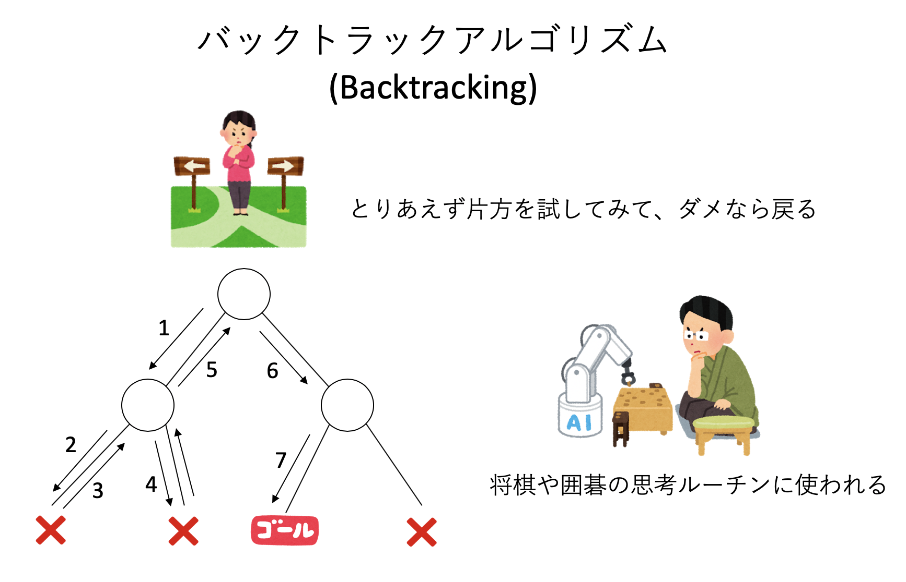
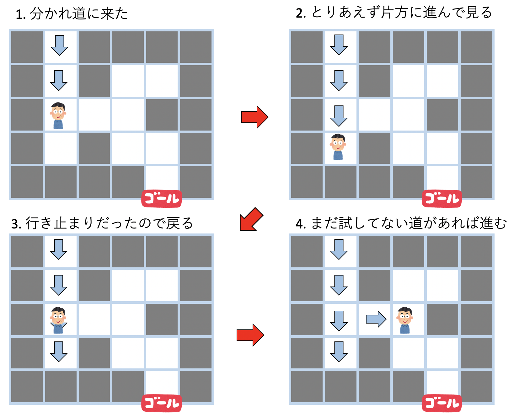
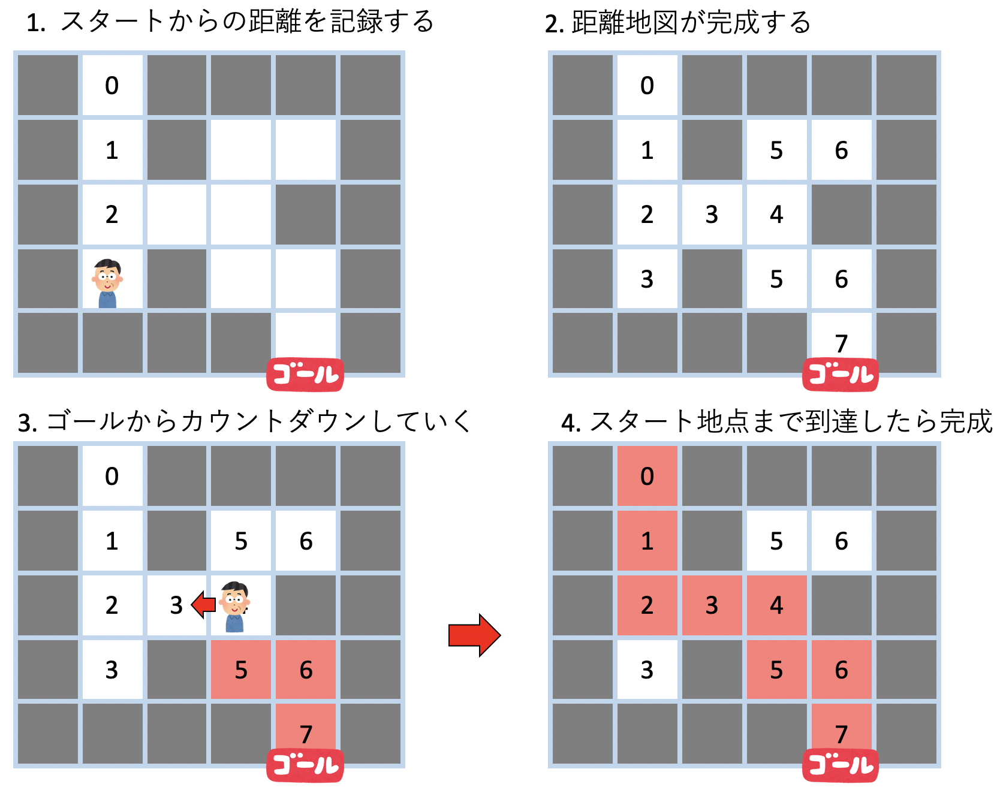

# [再帰呼び出し](https://kaityo256.github.io/python_zero/recursion/)

## 本講で学ぶこと

* 再帰呼び出しとは
* 階段の登り方問題
* 迷路

## 再帰呼び出しとは

例えばパソコンを使っているとフォルダを扱うであろう。フォルダを開くと、その中にはやはりフォルダとファイルが含まれる。この事実をもって「フォルダ」という言葉を定義しようとすると「フォルダとは、フォルダとファイルを含むものである」となる。「フォルダ」の記述に、定義したい言葉である「フォルダ」が含まれていることがわかる。このように、何かの中に、その何かそのものが現れることを **再帰(Recursion)** と呼び、何かの定義に自分自身が現れることを **再帰的定義(Recursive Definition)** と呼ぶ。


プログラムにおける再帰とは、簡単に言ってしまえば「自分自身を呼び出す関数」のことである。プログラムにおいて関数の実装は「この関数が呼び出されたらこのような処理をせよ」という、定義にほかならない。ある関数の定義に、その関数そのものが含まれるので、これは再帰的な記述になっている。このように関数が自分自身を呼び出すことを **再帰呼び出し(Recursive Call)** と呼ぶ。以下、再帰予び出しを用いるアルゴリズムやプログラムを総称して単に「再帰」と呼ぶ。

再帰は慣れると極めて強力なアルゴリズムであり、中級以上のプログラマになるためには必須のプログラミング技法である。しかし、プログラムの初学者にとって再帰はループ構造や制御構造に比べてその動作ステップをイメージしづらく、「初学者の壁」となっている。今回はそんな「再帰呼出し」を学ぶが、再帰はなんども組んでいるうちにおぼろげに感覚を掴んでくるものであって、たった一回の講義で理解することは難しい。とりあえず、以下の「再帰三カ条」だけを覚えておいて欲しい。

再帰三カ条

* 再帰とは、自分自身を呼び出す関数である
* 関数の最初に「終端条件」を記述する
* 「解きたい問題より小さな問題」に分解して自分自身を呼び出す

必ずしも上記の形に当てはまらない再帰もあるが、それはその時に学べばよい。まずは上記三カ条が再帰の基本だと覚えておけばよい。

簡単な例として、自然数nの階乗を返す関数`fact(n)`を考えてみよう。これは1からnまでの数の積だ。

$$
n! = 1 \cdot 2 \cdots n-1 \cdot n
$$

これをプログラムで計算したい。もちろん、以下のようにループを回してしまうのが簡単だ。

```py
def fact(n):
    a = 1
    for i in range(1, n+1):
        a *= i
    return a
```

しかし、ここでは再帰の考え方を学ぶためにあえて再帰で書いてみよう。

再帰プログラムの基本は「今解きたい問題よりも小さな問題の答えがすべてわかっている場合、いま解きたい問題の答えはどう記述できるだろうか？」という考え方である。

nの階乗の値、`fact(n)`の値を知りたい時、もし(n-1)の階乗の値`fact(n-1)`がわかっているとしよう。すると、欲しい値はそれにnをかけたものだ。つまり、

```py
fact(n) = n * fact(n-1)
```

である。関数のある値を得るのに、その関数自身を使っている、再帰的な記述になっているのがわかるであろう。

さて、`fact(n-1)`の値は`fact(n-2)`にn-1をかけたものであり、`fact(n-2)`は`fact(n-3)`の値にn-2をかけたもので・・・とどんんどん`fact`の中身が小さくなり、いつかは`fact(1)`になるであろう。1の階乗は1であり、ここで終了である。

以上から、階乗を求めるプログラムを再帰を使って書くとこうなる。

```py
def fact(n):
    if n == 1:
        return 1
    return n * fact(n-1)
```

これが、先ほどの「再帰三カ条」に従っていることを確認しよう。

* 再帰とは、自分自身を呼び出す関数である
  * `fact`の定義に、`fact`自身が使われている
* 関数の最初に「終端条件」を記述する
  * 引数`n`として1が指定されたら1を返して終了
* 「解きたい問題より小さな問題」に分解して自分自身を呼び出す
  * 自分が受け取った引数`n`に対して、`n-1`を引数として自身を呼び出している


実際にこの関数`fact`の動作を見てみよう。例えば`fact(3)`として呼び出すことを考える。

1. まず3は1ではないので終端条件にはマッチせず、`fact(2)`が呼ばれる
2. 同様に`fact(1)`が呼ばれる
3. `n`として1が代入されて呼ばれた`fact(1)`は、終端条件にマッチして1を返す
4. `fact(1)`を呼んだ`fact(2)`は、`fact(1)`の返り値1に2をかけた2を返す
5. `fact(2)`を呼んだ`fact(3)`は、`fact(2)`の返り値2に3をかけた6を返して値が確定


つまり、再帰関数はどんどん問題を小さくしながら自分自身を呼び出していき、どこかで「終端条件」に達すると、そこから呼び出し履歴を逆にたどりながら帰ってくる。標語的に言えば「再帰は行って返って」くる。この「問題を棚上げしながら単純化していき、どこかで終端条件に達したら、これまで棚上げにした問題を解決しながら戻ってくる」という感覚を身につけることが再帰プログラムの肝である。

## 階段の登り方問題

先程の階乗を求める問題は、あまりに簡単過ぎて再帰を使うメリットが感じられなかったであろう。そこで、もう少し複雑な問題として「階段の登り方問題」を考えよう。

いま、目の前に$n$段の階段があるとする。一度に1段、もしくは2段登るやり方を混ぜて登る時、「登り方の総数」は全部で何通りあるだろうか？


まずは$n$が小さい時の場合を考えてみよう。$n=1$の時、つまり1段しかない時には、1段で登るしかないので1通りである。2段ある場合は、1段ずつ2回で登るか、2段で一度に登るかの2通りである。ここで、1もしくは2をいくつか足して、その合計をNにするようなやり方を数えれば良い、ということに気がつくであろう。例えば$n=3$なら、

$$
\begin{aligned}
3 &= 1 + 1 + 1\\
3 &= 1 + 2 \\
3 &= 2 + 1
\end{aligned}
$$

の3通りである。$n=4$なら、

$$
\begin{aligned}
4 &= 1 + 1 + 1 + 1\\
4 &= 1 + 1 + 2 \\
4 &= 1 + 2 + 1 \\
4 &= 2 + 1 + 1 \\
4 &= 2 + 2 \\
\end{aligned}
$$

の5通りである。さて、これを一般化して、$n$段の時の登り方$F_n$はどのように求めればよいだろうか？このような場合に「再帰的」な考え方をする。

再帰プログラムの基本は「今解きたい問題よりも小さな問題の答えがすべてわかっている場合、いま解きたい問題の答えはどう記述できるだろうか？」と考えることであった。今、$n-1$段までの登り方、$F_1, F_2, \cdots F_{n-1}$が全てわかっているとしよう。その知識を使って、$F_n$の値を求められないだろうか？

最初のステップを考えよう。眼の前に$n$段の階段がある。できることは、1段登るか、2段登るかの二通りである。さて、1段登ったら、残りは$n-1$段であるから、その登り方は$F_{n-1}$通りである。2段登ったら残りは$n-2$段であるから、その登り方は$F_{n-2}$通りである。最初のステップでできることはこの二つしかなく、それらは重複しないので、階段の登り方の総数はその二通りの和である。

ここから、漸化式

$$
F_n = F_{n-1} + F_{n-2}
$$

が成り立つことがわかる。さて、左辺にも右辺にも「登り方$F$」が登場する。つまり、ある$F$を、別の引数をもった$F$自身で、再帰的に表現していることがわかる。さらに、左辺に比べて右辺は問題サイズ$n$が小さいことがわかるであろう。つまり、ある大きさ$n$をもつ問題が、それより小さいサイズの$n-1$と$n-2$という問題を解くことに帰着された。これが再帰の考え方である。すなわち、再帰アルゴリズムは本質的に**分割統治法**である。

後の課題で階段の登り方問題を実装し、それがどうやって「行って帰って」来るかを見てみよう。

## 迷路

再帰のもう少し実用的(？)な例として、迷路を解くプログラムを考えよう。迷路が与えられた時に、スタート地点からゴール地点までの経路を探索するのが目的である。

このような探索で問題となるのが、「分かれ道」の存在である。いま、分かれ道に直面したとしよう。どちらが正解かわからないので、とりあえず現在地を覚えておいて、片方の道を試し、もしその先が行き止まりなら先程覚えておいた位置まで戻ってきて、別の道を試す必要がある。もし試しに選んだ片方の道の先にまた分かれ道があったら、また現在地を覚えておいて、片方を試す、という行動を繰り返す。

このように「とりあえずあっちへ進んで、ダメなら戻る」という行動を繰り返すようなアルゴリズムを **バックトラック(backtracking)** と呼ぶ。将棋や囲碁のようなゲームで「先の手を読む」場合や、ナンプレなどのようなゲームで数字を仮り置きして矛盾したら戻ってやりなおす場合など、広く使われるアルゴリズムなので、これまでも無意識に使ったことはあるだろう。



このような「とりあえずあっちへ進んで、ダメなら戻る」というバックトラックは、再帰を使うときれいに書ける。このバックトラックを使って迷路を解くアルゴリズムを考えよう。

単にゴールにたどり着くだけなら、「矢印」を残しながら進んでいけば良い。例えばこんなアルゴリズムになる。

* 自分の進む向きに矢印を書きながら進む
* 分かれ道に来たら、とりあえずどちらかを選ぶ
* 進んだ先が行き止まりになったら、矢印を逆向きに戻る
* 戻っている時に、まだ試していない道があったらそちらを選ぶ



戻る時、つまり矢印と逆向きに進んでいる時にまだ試してない道を見つけたら必ずそこを試すのがポイントである。これにより、「戻っている時には、その後ろにある経路はすべて探索済みである」つまり、「道の見落としが無い」ということが保証される。バックトラックで迷路探索とは、要するに「見落としが無いようにしらみつぶしに探しましょう」ということを言っているに過ぎない。

このように、とりあえず進めるだけ進んで、行き止まりに行き当たったら戻ってくる、というような探索アルゴリズムを **深さ優先探索(depth-first search)** と呼ぶ。逆に、自分がいまいる地点から徐々に探索範囲を広げながら探索する方法を **幅優先探索(breadth first search)** と呼ぶ。ここでは深入りしないが、「そういう用語がある」ということだけぼんやり覚えておけば良い。

さて、単にゴールにたどり着くだけなら上記の方法で良いが、ゴールまでの経路を求めるには少し工夫が必要だ。方針としては、「スタート地点からの距離」を各部屋に記しながら進んで行く。探索が終わったら、全ての場所に「スタート地点からの距離」があるはずである。この状態でゴールから、「数字が減るように」進んでいく。分かれ道では「カウントが減る方」がスタートに至る道であるから、そちらを選び続ければ「ゴールからスタートへの道」が完成する。



課題では、指定された迷路について、「スタート地点からの距離地図」の作成、及び「距離地図が完成した後に解の経路作成」のそれぞれの処理を再帰で実装しよう。

# 再帰呼び出し：課題

## 課題1：階段の登り方問題

階段を、一度に1段、もしくは2段登るやり方を混ぜて登る時、「$n$段の階段の登り方の総数」を返す関数`kaidan(n)`を作り、その動作を可視化してみよう。新しいノートブックを開き、`kaidan.ipynb`として保存せよ。

### 課題1-1：再帰の実装

#### 1. ライブラリのインポート

直接再帰には関係ないが、後で再帰木を可視化をするために必要なライブラリをインポートしておこう。

```py
from graphviz import Digraph
```

#### 2. 再帰関数`kaidan`の実装

2つ目のセルに、`n`段の階段の登り方を返す関数`kaidan(n)`を実装せよ。

```py
def kaidan(n):
    # 終端条件
    if 条件1:
        return 値1
    if 条件2:
        return 値2
    # 再帰部分
    return 自分自身を使った式
```

実装すべきは終端条件と再帰部分である。以下を参考にせよ。

* 階段の段数が1の場合と2の場合が終端条件に該当する。それぞれどんな値を返すべきか？
* 終端条件に該当しない場合は、`kaidan(n-1)`と`kaidan(n-2)`の和を返すこと

#### 3. `kaidan`の確認

関数`kaidan`が実装できたら動作確認をしてみよう。3つ目のセルで以下を実行せよ。

```py
kaidan(3)
```

答えが3になっただろうか？また、`kaidan(4)`が5に、`kaidan(5)`が8になることを確認せよ。`kaidan(10)`の値はどうなるだろうか？

### 課題1-2：再帰木の表示

再帰プログラムの難しさは、「プログラムがどのように実行されるかが分かりづらい」という点にある。繰り返すや条件分岐はそのままたどれば良いのだが、再帰プログラムは何度も自分を呼び出し、そして呼び出し先から返ってくる。この振る舞いを可視化してみよう。

#### 4. 再帰木の可視化関数`kaidan_g`の実装

4つ目のセルに以下を実装しよう。これはグラフオブジェクト`g`を受け取り、階段の登り方がどのように呼び出されているかを可視化する関数だ。

```py
def kaidan_g(n, g, nodes, parent=None):
    index = str(len(nodes))
    nodes.append(index)
    g.node(index, str(n))

    if parent is not None:
        g.edge(index, parent)

    if n in (1, 2):
        return
    kaidan_g(n-1, g, nodes, index)
    kaidan_g(n-2, g, nodes, index)
```

#### 5. 再帰木の可視化

では、先程実装した`kaidan_g`を利用して、再帰木を可視化してみよう。5つ目のセルに以下を入力、実行せよ。

```py
n = 5
graph = Digraph()
graph.attr(size="10,10")
kaidan_g(n, graph, [])
graph
```

無事に再帰木が表示されただろうか？数字が`kaidan(n)`として呼び出された`n`の値である。`kaidan(5)`は`kaidan(4)`と`kaidan(3)`を呼び出し、`kaidan(4)`は`kaidan(3)`と`kaidan(2)`を呼び出し・・・と、再帰的に呼び出しが続いていき、`n=1`もしくは`n=2`で呼び出しが止まる(終端条件)ことがわかるであろう。

もし正しく表示されたら、1行目を`n=8`などとして、少し大きな再帰木も表示してみよ。

## 課題2：再帰による迷路の解法

再帰で迷路を解いて、その答えや探索の過程を可視化してみよう。新しいノートブックを開き、`maze.ipynb`として保存せよ。

### 課題2-1 迷路を解く

#### 1.必要なライブラリのインポート

最初のセルで、必要なライブラリをインポートしておこう。

```py
import pickle
import IPython
from PIL import Image, ImageDraw
from matplotlib import pyplot as plt
```

#### 2. 迷路データのダウンロード

次に、迷路データをダウンロードする。

```py
!wget https://kaityo256.github.io/python_zero/recursion/maze.pickle
```

これは二次元リストをPickle(漬物)という方法で保存したものだ。

#### 3. 迷路データの可視化

迷路の状態を可視化し、ファイルに保存する関数`save_image`を実装しよう。3つ目のセルに以下を実装せよ。

```py
def save_image(maze, filename = "test.png"):
    w = len(maze)
    h = len(maze[0])
    g = int(400 / w)
    white = (255, 255, 255)
    im = Image.new("RGB", (w*g, h*g), white)
    draw = ImageDraw.Draw(im)
    for ix in range(w):
        for iy in range(h):
            x = ix*g
            y = iy * g
            s = maze[ix][iy]
            color = white
            if s == '*':
                color = (0, 0, 0)
            elif s == 'S':
                color = (0, 0, 255)
            elif s == 'G':
                color = (0, 255, 0)
            elif s == '+':
                color = (255, 0, 0)
            if isinstance(maze[ix][iy], int):
                color = (128, 128, 128)
            draw.rectangle((x, y, x+g, y+g), fill=color)
    im.save(filename)
    plt.imshow(Image.open(filename))
```

インデントに注意せよ。`im.save`と`plt.imshow`の高さは`for ix in range(w)`の行と同じ高さになる。

#### 4. 迷路データの読み込み

`save_image`が正しく実装できたか確認しよう。Pickle(漬物)になっている迷路データを読み込み、表示してみる。以下を4番目のセルで実行せよ。

```py
with open('maze.pickle', 'rb') as f:
    maze = pickle.load(f)
save_image(maze)
```

左上にスタート地点(青)、右下にゴール地点(緑)がある迷路が表示されたはずだ。

#### 5. 迷路を解くルーチン

ではさっそく迷路を解く(実際には距離地図を作る)関数`solve`を書いてみよう。やるべきことは単純で、

* 進もうとした方向が壁`*`ならそこには行かない
* すでに足跡が残っている(`maze[x][y]`に数字が入っている)なら、そこは探索済みなので行かない

というのが終端条件であり、終端条件に該当しない場合は、その場所に足跡を残し、上下左右へ探索すれば良い。以上をそのまま実装すると以下のようになる。

```py
def solve(x, y, step, maze):
    if maze[x][y] == '*':
        return
    if isinstance(maze[x][y], int):
        return
    maze[x][y] = step
    solve(x+1, y, step+1, maze) # 右を探索
    # 残りを埋めよ
```

`isinstance`は、与えられたオブジェクト(変数)がどういうタイプかを調べる関数であり、`isinstance(a, int)`などとすると、オブジェクト`a`が整数であるかどうかを調べる。ここでは、迷路の指定の場所`maze[x][y]`に整数が入っているかどうかを調べている。

再帰部分については一部だけ記載されている。これを参考に再帰部分を完成させること。`solve`には現在地`(x,y)`が渡されている。`x+1`は右方向である。残りの左と上下の探索を追加せよ。

#### 6. 迷路を解く

6つ目のセルで、迷路を解くルーチンを呼び出してみよう。迷路を解いた(`solve`を呼んだ)後に迷路の状況を可視化するコードである。なお、ここで再度ファイルからデータを読み込んでいるのは、プログラムをミスしたときに`maze`というリストに余計な情報が残ってしまい、修正後も正しく実行されなくなるのを防ぐためだ。

```py
with open('maze.pickle', 'rb') as f:
    maze = pickle.load(f)
solve(1, 1, 0, maze)
save_image(maze)
```

正しく実行できていれば、すべてのセルが灰色(探索済み)になったはずである。逆に、全てのセルが灰色になっていなければ、何か間違っているのでコードを確認すること。

#### 7. 経路探索

さて、探索済みの迷路は、全ての部屋に「入り口からの距離」が書いてある。それを逆にゴールからカウントダウンしながらたどっていけば、それが答えだ。7つ目のセルに以下を実装せよ。

```py
def draw_path(x, y, count, maze):
    if not isinstance(maze[x][y], int):
        return
    if maze[x][y] != count:
        return
    maze[x][y] = '+'
    count -= 1
    draw_path(x+1, y, count, maze)
    draw_path(x-1, y, count, maze)
    draw_path(x, y+1, count, maze)
    draw_path(x, y-1, count, maze)
```

やはり再帰で書いてあるが、ゴールから「目標カウント」を減らしながら進むコードであり、

* もし足跡のある部屋でなければそこには行かない
* 目標カウントではない部屋には進まない

というのが終端条件である。終端条件に該当しなかった場合は「目標カウント」を残してカウントを減らし、「答えの経路」となるマーク(`+`)を残して、上下左右の部屋に探索に行く。

#### 8. 解の確認

では解答を表示してみよう。8つ目のセルに以下を入力、実行せよ。解答となるパスが赤く表示されたはずだ。

```py
draw_path(39, 19, maze[39][19], maze)
save_image(maze)
```

### 発展課題：迷路を解く様子の可視化

せっかくプログラムが迷路をうろうろ探索しているので、その探索の様子を可視化してみよう。なお、作成されたアニメーションをレポートに添付する必要はない。

#### 9. アニメーション用ライブラリのロード

まず、アニメーション用のライブラリをインストール、ロードする。以下は上から数えて9つ目のセルになるはずだ。

```py
!pip install apng
from apng import APNG
```

#### 10. アニメーション用のソルバ

次に、アニメーション用の探索ルーチンを書く。ほとんど`solve`と同じだが、毎ステップの状態をファイルに保存する処理が追加されている。

```py
def solve_anime(x, y, step, maze, files):
    if maze[x][y] == '*':
        return
    if isinstance(maze[x][y], int):
        return
    maze[x][y] = step
    index = len(files)
    filename = "file%03d.png" % index
    save_image(maze,filename)
    files.append(filename)
    solve_anime(x+1, y, step+1, maze, files) # 右を探索
    # 残りを埋めよ
```

#### 11. アニメーションの保存

先程読み込んだ迷路データは「探索済み」になっているため、ファイルから読み込み直して、`solve_anime`を使って探索しなおそう。

```py
with open('maze.pickle', 'rb') as f:
    maze = pickle.load(f)
files = []
solve_anime(1,1,0,maze,files)
```

上記を実行することで、探索の様子が連番のファイル(file000.png, file001.png, …)に保存され、そのファイルリストが`files`に帰ってくる。

#### 12. アニメーションの表示

得られたファイルリストを使ってアニメーションを作成しよう。以下を実行せよ。

```py
APNG.from_files(files, delay=50).save("animation.png")
IPython.display.Image("animation.png")
```

ここまで正しく組めていれば、探索の様子がアニメーションで表示されたはずである。アニメーションの様子を見て、この迷路をどのように探索しているか考察せよ。特に、探索が最後まで後回しになるパスがあるが、これはなぜか？そのような場所はどのように決まっているだろうか？

#### 13. 大きな迷路

もし時間があるなら、もう少し大きな迷路も解いてみよう。以下を順番に実行せよ。

大きな迷路ファイルのダウンロード。

```py
!wget https://kaityo256.github.io/python_zero/recursion/largemaze.pickle
```

大きな迷路のアニメーション用データの作成(数分待たされる)。

```py
with open('largemaze.pickle', 'rb') as f:
    maze = pickle.load(f)
files = []
solve_anime(1,1,0,maze,files)
```

大きな迷路のアニメーション作成(これは数秒で終わるはず)。

```py
APNG.from_files(files, delay=50).save("animation.png")
IPython.display.Image("animation.png")
```

大きな迷路のアニメーションが表示されれば成功である。

## 余談：進化するオセロAIを作った話

僕がプログラミングを始めたのは小学6年生の時だ。叔父からお下がりのPCをもらったのだが、そのPCで動くゲームがあまりなかった。そこで、親にプログラムの本を買ってもらい、そこにあるプログラムリスト(BASICだった)を打ち込んで遊んだ。簡単なゲームのようなものも作ったと思う。中学生だったか高校生だったか、さすがにパソコンが非力でできることが少なくなってきたので、当時の最新のパソコンを買ってもらった。PC-9801 RXというマシンで、結構高かったはず。このマシンでいろいろ遊んだが、特に友人たちとチームを作り、いくつかゲームを作って遊んでいた。さて、高校生の時、僕は再帰プログラムを覚えた。再帰を使えるようになると、例えばパズルを解くプログラムを組むことができる。再帰を覚えた僕は、数独や、イラストロジックを解くプログラムを組んだりして遊んだが、その中に「進化するオセロ」というものがあった。

オセロでは「なるべく端や角を取りたい」「端や角の隣は取りたくない」という戦略があるのを知っているであろう。これを数値化し、「角に石がおけたら+10点、角の両隣の場所に石をおいたら-5点」といった「得点マップ」を作り、そのマップの値を変化させることで強いオセロAIを作ることを考えた。

オセロは8x8で64個のマスがあるが、対称性で10種類に落とすことができる。10種類のマスそれぞれに得点を対応させた。10個の数字列が決まれば、得点マップができるので、オセロの思考ルーチンが決まる。つまり、オセロの思考ルーチンの強さはこの数字列で決まる。最初は乱数で作った数字列同士を戦わせ、勝った方は子供を作ることができる。子供の遺伝子は親の数字列を少し変化させる。これは、10個の数字をオセロ思考ルーチンの「遺伝子」とみなし、それぞれの思考ルーチンを生命だと思えば、勝負に勝てなくては生き残れない弱肉強食の世界を表現したことになる。ダーウィニズムに基づいた サバイバルをさせることで最適な１０個の数字列を得るという遺伝アルゴリズムになっている。もちろん当時の僕はそんな言葉は知らなかったが。とにかくプログラムを書いた僕は、夜プログラムをスタートして、朝を楽しみにしながら眠りについた。

次の日、目が覚め、ファンの音からパソコンが動きつづけていることを知り、オセロプログラムを走らせていたことを思い出す(当時のPCはファンの音がうるさかった)。 わくわくしながら結果を見ると・・・およそ強いとは思えない 数字が並んでいた。実際に戦ってみると非常に弱い。そんなはずは・・・と 思い、プログラムのログを調べてみると興味深いことがわかった。しばらく戦国の世が続いたかと思うと、しばらく勝ちつづける 強者があらわれる。しかし数連勝したあと暫定王者にのみ勝てる弱者が現れ、再び戦国の世に戻ってしまうのだ。

このプロジェクトはそのままになっていたが、ふと大学院でこれを思い出し、もう一度試してみた。高校生の時には勝ち抜き戦だったのをリーグ戦として、乱数の振り方も工夫し、「平均的に強い個体」が残るようにしたつもりだったが、やはり「ちょっと強い個体がしばらく帝国を築くのだが、しばらくすると『そいつにだけ勝てる奴』が生まれてしまい、また戦乱の世に戻る」という同じ状況になってしまった。ここでオセロのような一対一の対戦では「三すくみ」の状態があり得ると気がついた。三すくみの関係があれば、どれか一つが優勢になることはなく、「進化」が延々堂々巡りになってしまう。というわけで、素人のお遊びのようなシミュレーションであったが、このプロジェクトから学ぶことは多かった。特に、それまで漠然と「進化」という言葉に「一方通行」のイメージを持っていた僕は、その認識を改めることになった。
