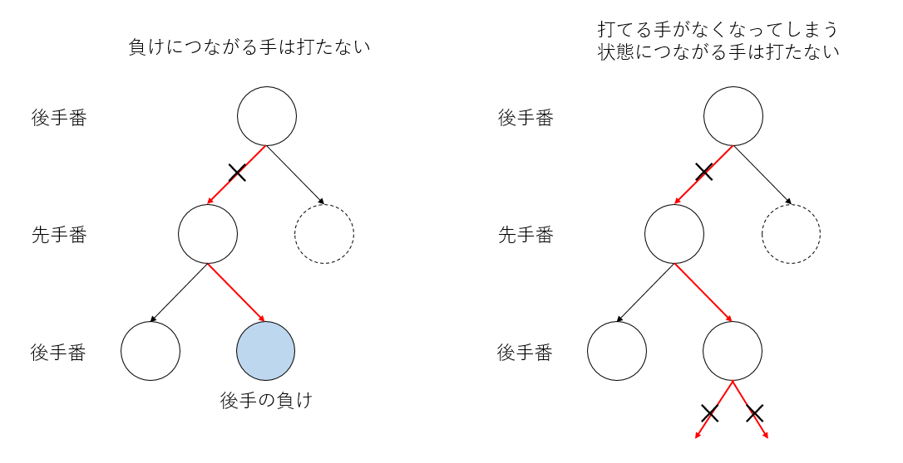

# [再帰呼び出し](https://kaityo256.github.io/python_zero/recursion/)

* 再帰呼び出しとは
* 割り箸ゲーム
* ユニットテスト
* 状態遷移図の可視化
* 木構造の編集

## 再帰呼び出しとは

再帰呼出し(recursive call)とは、関数などの手続きが、自分自身を呼び出すことである。再帰呼出しは慣れると極めて強力なアルゴリズムであり、中級以上のプログラマになるためには必須のプログラミング技法である。しかし、プログラムの初学者にとって再帰はループ構造や制御構造に比べてその動作ステップを想像することが難しい。今回は、この再帰呼び出しについて学んでみよう。

突然だが、「階段ののぼり方問題」を考える。いま、目の前に$n$段の階段があるとする。一度に1段、もしくは2段登るやり方を混ぜて登る時、「登り方の総数」は全部で何通りあるだろうか？

まずは$n$が小さい時の場合を考えてみよう。$n=1$の時、つまり1段しかない時には、1段で登るしかないので1通りである。2段ある場合は、1段ずつ2回で登るか、2段で一度に登るかの2通りである。ここで、1もしくは2をいくつか足して、その合計をNにするようなやり方を数えれば良い、ということに気がつくであろう。例えば$n=3$なら、

$$
\begin{aligned}
3 &= 1 + 1 + 1\\
3 &= 1 + 2 \\
3 &= 2 + 1
\end{aligned}
$$

の3通り。$n=4$なら、

$$
\begin{aligned}
4 &= 1 + 1 + 1 + 1\\
4 &= 1 + 1 + 2 \\
4 &= 1 + 2 + 1 \\
4 &= 2 + 1 + 1 \\
4 &= 2 + 2 \\
\end{aligned}
$$

の5通りである。さて、これを一般化して、$n$段の時の登り方$F_n$はどのように求めればよいだろうか？このような場合に「再帰的」な考え方をする。

今、$n-1$段までの登り方、$F_1, F_2, \cdots F_{n-1}$が全てわかっているとしよう。その知識を使って、$F_n$の値を求められないだろうか？

最初のステップを考えよう。眼の前に$n$段の階段がある。できることは、1段登るか、2段登るかの二通りである。さて、1段登ったら、残りは$n-1$段であるから、その登り方は$F_{n-1}$通りである。2段登ったら残りは$n-2$段であるから、その登り方は$F_{n-2}$通りである。ここから、漸化式

$$
F_n = F_{n-1} + F_{n-2}
$$

が成り立つことがわかる。さて、左辺にも右辺にも「登り方$F$」が登場する。つまり、ある$F$を、別の引数をもった$F$自身で、再帰的に表現していることがわかる。さらに、左辺に比べて右辺は問題サイズ$n$が小さいことがわかるであろう。つまり、ある大きさ$n$をもつ問題が、それより小さいサイズの$n-1$と$n-2$という問題を解くことに帰着された。これが再帰の考え方である。すなわち、再帰アルゴリズムは本質的に**分割統治法**である。

## 割りばしゲーム

「割りばし」という二人で行う指遊びがある。地方によって名前やルールは様々だが、基本ルールは以下のようなものだ。

1. じゃんけんなどで先行、後攻を決め、お互い両手の人差し指を立てる
2. 先行は、自分の好きな手で相手の好きな手を攻撃する
3. 攻撃された側は、攻撃された手の指を、攻撃した手の指の本数だけ増やす
4. この時、もし指が5本以上になったらその手は死ぬ
5. これを交互に繰り返し、両手が死んだら負け


追加ルールやバリエーションとして、以下のようなものがある。

* modルール：攻撃されたとき、「ちょうど5」でなければ死なず、指の本数は5で割った余りになる
* 分身ルール：自分の手番で、手が一本死んでいるとき、指の総数が変わらないように両手に指を分けることができる
* 自分攻撃：自分の手で自分を攻撃することを許す

特にmodルールはかなり広い範囲で採用されているようだ。うちの地域では「割りばし」と呼ばれているものの、これが決定的な名前ではないらしく、Wikipediaでは[数字を増やす遊び](https://ja.wikipedia.org/wiki/%E6%89%8B%E3%82%92%E7%94%A8%E3%81%84%E3%81%9F%E9%81%8A%E3%81%B3#%E6%95%B0%E5%AD%97%E3%82%92%E5%A2%97%E3%82%84%E3%81%99%E9%81%8A%E3%81%B3)と紹介されている。

さて、簡単のため、基本ルールだけを考えよう。死んだ手の指の本数を「5本」と数えると、お互いの指の本数は、ターン毎に必ず増加する。したがって、千日手は存在しない。また、指の本数は20本を超えることはできないため、必ず有限ターンでゲームが終わる。また、勝負が決まるのは相手の最後の手を殺した時だけなので、引き分けは存在しない。ランダム要素もないため、先手か後手のどちらかが必勝であることがわかる。

実際、このゲームは後手必勝である。このゲームを題材に、本格的な再帰プログラムを組んでみよう。

## 課題1:状態クラスの実装とユニットテスト

### コンストラクタ

まず、割りばしゲームの「状態」を表すクラスを実装しよう。このプログラムについてはクラスを作る意義はさほどないのだが、クラスの実装及びユニットテストの例としてクラスを作ることにする。余談だが、オブジェクト指向というとすぐにクラスを作ったり、無駄に継承したりさせたがるテキストが多いが、「本当にクラスが必要か」「継承が必要か」は常に考える必要がある。

割りばしゲームの状態としては、先手番であるか否か、先手番の指の本数、後手番の指の本数がある。また、「自分から遷移可能な状態」のリストも持っておこう。後で描画に必要となるので「すでにこの状態を描画したかどうか」のフラグもつけておこう。新しいノートブックを開き、以下のコードを最初のセルに入力せよ。先程作成したノートブックはゴミ箱に移動してかまわない。

```py
class State:
    def __init__(self, is_first, f, s):
        self.is_first = is_first
        self.f = [max(f), min(f)]
        self.s = [max(s), min(s)]
        self.siblings = []
        self.is_drawn = False
```

入力したら、インスタンスを作れることを確認しよう。次のセルに以下のように入力、実行し、エラーが出なければ成功である。

```py
s = State(True,[1,1],[1,1])
```

### 文字列変換メソッド

次に、状態を文字列に変換するメソッドを追加しよう。最初のセルの`State`クラスの`__init__`メソッドの後に`__str__`というメソッドを追加する。この時、`__init__`と同じインデントにすること。

```py
class State:
    def __init__(self, is_first, f, s):
        self.is_first = is_first
        self.f = [max(f), min(f)]
        self.s = [max(s), min(s)]
        self.siblings = []
        self.is_drawn = False

    def __str__(self):
        s = str(self.f) + "\n" + str(self.s)
        if self.is_first:
            return "f\n" + s
        else:
            return "s\n" + s
```

追加したらこのセルを再度実行してから、二番目のセルを以下のように修正してみよう。

```py
s = State(True,[1,1],[1,1])
print(s)
```

二番目のセルを実行すると、以下のような出力がされるはずだ。

```py
f
[1, 1]
[1, 1]
```

これは以下のように動作している。

1. `State`オブジェクト`s`が`print`に渡されると、`print`は`s`を文字列に変換するために`str(s)`を呼ぶ
2. `str(s)`は、内部で`s.__str__()`を呼んで、その値を返す
3. `s.__str__()`の返す値が`print`に渡され、それが出力される。

このような、`__str__`のようにアンダースコアが前後に二つついたメソッドを特殊メソッドと呼ぶ。ほかにはサイズを返す`__len__`や比較のためのメソッド`__eq__`などがある。

さて、実装した単位ごとに動作が意図通りになっているか確認することを「ユニットテスト」と呼ぶ。さて、先ほどの表示だけではテストとしては不十分である。ここまで実装しただけでも、

* 先手番なら「f」を、後手番なら「s」を表示する(それぞれfirst, secondの略である)。
* 先手番を上段に、後手番を下段に表示する
* 指の本数が多いほうを左に、少ないほうを右に寄せている

という機能がある。これらが正しく動作するか、それぞれチェックしよう。二つ目のセルを以下のように修正せよ。

```py
s = State(True,[1,1],[1,1])
print(s)
s2= State(False,[1,1],[1,1])
print(s2)
s3 = State(True,[3,1],[2,4])
print(s3)
```

これは、

* `s`: `str(s)`が正しく実行されるかどうか
* `s2`: 先手番、後手番の設定と表示が正しいかどうか
* `s3`: 先手番が上段、後手番が下段に表示されているか、また指の本数に関するソートが正しいか

をそれぞれ確認するテストになっている。本当は複数の項目を同時にテストするのは良くないのだが、ここは大目に見てもらおう。

以下のように表示されれば成功である。

```py
f
[1, 1]
[1, 1]
s
[1, 1]
[1, 1]
f
[3, 1]
[4, 2]
```

プログラムの初学者にとっては、プログラミングにおいて「プログラムを入力する時間」が大半を占めることだろう。しかし、慣れてくるとプログラミングの時間の大半をデバッグに費やすようになる。プログラムのできる人とできない人の生産性は軽く桁で変わってくるが、その大きな要因の一つが「上級者はバグを入れない、入れてもすぐにとる」ことである。そのためにはテストが欠かせない。最初はどこをどれくらいテストすれば良いかわからないと思うが、とりあえずしつこいくらいにテストを書くとよいだろう。そのうち「自分がどこにバグを入れやすいか」すなわち「どこをテストすべきか」の感覚がつかめてくる。

### 比較メソッド

次に、オブジェクトの比較メソッド`__eq__`を作ってみよう。比較メソッドとは`a == b`とした際に、`a`と`b`が等しいか判定するのにつかわれるメソッドだ。実は比較メソッドがなくても比較ができる。二つ目のセルの中身を以下のように書き換えよう(一度消して、新しいセルを作ってもかまわない)。

```py
s1 = State(True, [1,1],[1,1])
s2 = State(True, [1,1],[1,1])
s1 == s2
```

全く同じ状態であるにも関わらず、結果は`False`になるはずだ。これは、Pythonではオブジェクトの比較が、デフォルトでは中身ではなくオブジェクトIDの比較になるためだ。実際、さきほどの二つは中身は同じだが異なるオブジェクトなので、IDは異なる。

```py
s1 = State(True, [1,1],[1,1])
s2 = State(True, [1,1],[1,1])
print(id(s1))
print(id(s2))
```

上記を実行すると、2つの異なるIDが表示されたはずである。さて、この「IDは異なるが同じ内容を持つオブジェクト」を「等しい」と判定するために`__eq__`メソッドを実装しよう。最初のセルの`__str__`の後に以下のように追加しよう。

```py
    def params(self):
        return (self.is_first, self.f, self.s)

    def __eq__(self, other):
        return self.params() == other.params()
```

`params`は、自分の状態をタプルとして返す関数で、`__eq__`は、二つのオブジェクトの`params()`の返り値を比較して等しいかどうかを判定している。これを実装後、先ほどの二つ目のセルを再度実行してみよう。先に一つ目のセルを実行するのを忘れないように。

```py
s1 = State(True, [1,1],[1,1])
s2 = State(True, [1,1],[1,1])
s1 == s2
```

実行して、今度は`True`と出てくれば成功である。また、これにより自動的に`in`が使えるようになる。二番目のセルを以下のように修正してみよう。

```py
s1 = State(True, [1,1],[1,1])
s2 = State(True, [1,1],[1,1])
s3 = State(False, [1,1],[1,1])
a = [s1]
print(s2 in a) # => True
print(s3 in a) # => False
```

「状態」のリストが与えられたとき、そのリストに同じ状態が入っているかどうか`in`で確認できるようになった。これも後で使う。

### 次の状態の生成

せっかく状態クラスを作ったので、次の状態の生成もこのクラスにやらせよう。現在の状態に対して「先手側の手の左右」と「後手側の手の左右」を選べば、次の状態が決まる。先手側の手を`fi`、後手側の手を`si`としよう。それぞれ0と1の値をとる変数で、0が左手、1が右手である。ただし、指の本数が大きいほうを必ず左手にするように入れ替える。例えば現在先手番で、`(fi, si)==(0,0)`ならば、先手が左手で後手番の左手を攻撃したという意味になり、現在後手番で`(fi, si)==(0,1)`ならば、後手番が右手で先手番の左手を攻撃した、という意味になる。

以上を実装してみよう。`State`クラスに以下のメソッドを追加せよ。

```py
    def next_state(self, index):
        fi, si = index
        if self.f[fi] == 0 or self.s[si] == 0:
            return None
        d = self.f[fi] + self.s[si]
        f2 = self.f.copy()
        s2 = self.s.copy()
        if d >= 5:
            d = 0
        if self.is_first:
            s2[si] = d
        else:
            f2[fi] = d
        return State(not self.is_first, f2, s2)
```

このメソッドの機能は

* 現在の状態に、「先手と後手のどの手が選ばれたか」のタプルを与えたら次の状態を作って返す
* もし選ばれた手の指の本数が0なら(死んでいたら)`None`を返す
* もし攻撃の結果、指の本数が5本を超えたら0にする(その手が死ぬ)

である。

追加したら、正しく実装できたか確認してみよう。二つ目のセルに以下を入力して出力を確認せよ。`next_state`の引数はタプル`(0,0)`であるので、`s1.next_state((0,0))`と内側の括弧が二重になり、さらに`print`の括弧で三重になることに注意。

```py
s1 = State(True, [1,1],[1,1])
print(s1.next_state((0,0)))
```

以下のような出力が出てくるはずである。

```py
s
[1, 1]
[2, 1]
```

ついでに、「必ず左手が大きくなるように手を入れ替える」「5を超えると手が死ぬ」ことも確認しよう。

```py
s1 = State(True, [3,2],[3,1])
print(s1.next_state((1,0)))
```

先手番が指(3,2)、後手番が(3,1)の状態を作り、先手番の右手で後手番の左手を攻撃した状態が表示されることが期待される。結果は、

```py
s
[3, 2]
[1, 0]
```

と、現在後手番であり、先手番の手は変わらず、後手番は左手が死んだため、左右を入れ替えて左手が指一本、右手が死亡、という状態になった。なお、繰り返しとなるが、本当は複数のテストを同時にしてはいけない。AとBという機能がある場合、Aのテスト、Bのテスト、そしてAとBが両方絡むテストをすべきである。そのあたりに興味がある人は「ユニットテスト」「継続的インテグレーション」などのキーワードで調べて欲しい。

最後に、有効では無い手を入力したら`None`が変えることも確認する。

```py
s1 = State(True, [1,0],[1,1])
print(s1.next_state((1,1)))
```

これは先手の右手が死んでいるのに、右手で相手の右手を攻撃しようとしているために合法手ではない。したがって`None`が返る。

最終的に`State`クラスはこんな形になったはずである。

```py
class State:
    def __init__(self, is_first, f, s):
        self.is_first = is_first
        self.f = [max(f), min(f)]
        self.s = [max(s), min(s)]
        self.siblings = []
        self.is_drawn = False

    def __str__(self):
        s = str(self.f) + "\n" + str(self.s)
        if self.is_first:
            return "f\n" + s
        else:
            return "s\n" + s

    def params(self):
        return (self.is_first, self.f, self.s)

    def __eq__(self, other):
        return self.params() == other.params()

    def next_state(self, index):
        fi, si = index
        if self.f[fi] == 0 or self.s[si] == 0:
            return None
        d = self.f[fi] + self.s[si]
        f2 = self.f.copy()
        s2 = self.s.copy()
        if d >= 5:
            d = 0
        if self.is_first:
            s2[si] = d
        else:
            f2[fi] = d
        return State(not self.is_first, f2, s2)
```

以上で状態クラスは完成である。ここまで正しい動作が確認できていれば、確認のためのセルは削除して良い。

## 課題2:状態遷移図の可視化

### ゲーム木の作成

割りばしゲームの状態遷移図(ゲーム木)を作るには、

1. まず状態が与えられた時、その状態から遷移可能な状態を生成する
2. その状態が合法手であれば、自分にそれを追加する
3. 追加したすべての状態について、再帰的に以上を繰り返す

という処理をすれば良い。

ただし、異なるパスで同じ状態に遷移する可能性があり、それらを「同じノード」としてまとめたいため、それをハッシュで実装する。具体的には、生成された状態の文字列をキーとしてハッシュに登録し、ハッシュに登録済みの状態ならその状態を、そうでなければ登録する、という処理を加える。以上を実現する以下の関数を二つ目のセルに入力せよ(二つ目のセルが残っていたらまず削除すること)。

```py
def move(parent, is_first, nodes):
    for i in [(0, 0), (0, 1), (1, 0), (1, 1)]:
        child = parent.next_state(i)
        if child is None:
            continue
        if child in parent.siblings:
            continue
        s = str(child)
        child = nodes.get(s, child)
        nodes[s] = child
        parent.siblings.append(child)
        move(child, not is_first, nodes)
```

やっていることは以下の通り。

1. 現在の状態から遷移可能な4状態を生成する
2. それぞれが合法手であるか確認し、合法手でなければスキップ
3. もしすでに自分に追加されている状態ならスキップ
4. すでにハッシュ登録済みかチェック、登録済みなら登録した状態を取得、そうでないなら今作成した状態を登録する
5. 親に作成したノードを追加して、そのノードを親として再帰

次に、`move`に最初の状態を与えて、ゲーム木の「根(root)」を作って返す関数を作る。三つ目のセルに以下の関数を入力せよ。

```py
def make_tree():
    nodes = {}
    root = State(True, [1, 1], [1, 1])
    nodes[str(root)] = root
    move(root, True, nodes)
    return root
```

ここまで入力したら、4つ目のセルに以下を入力して実行し、エラーがでないことを確認せよ。

```py
root = make_tree()
print(root)
```

最初の状態が以下のように表示されるはずである。

```py
f
[1, 1]
[1, 1]
```

動作確認が終わったら、4つ目のセルは消してかまわない。

### ゲーム木の可視化

先ほど`root = make_tree()`で作成した`root`は子ノードがぶら下がっており、さらに子ノードには孫ノードが・・・と木構造を作っている。これをGraphvizで可視化しよう。

まず、新しいセルを作り、それを「上ボタン」で一番上まで移動させよう。そこに`import`文を書く。

```py
from graphviz import Digraph
import IPython
```

書いたら実行しておこう。

次に、一番下に新しいセルを作る。5番目のセルになるはずだ。そこに以下のプログラムを入力せよ。

```py
def make_graph(node, g):
    if node.is_drawn:
        return
    node.is_drawn = True
    ns = str(node)
    if max(node.f) == 0:
        g.node(ns, color="#FF9999", style="filled")
    elif max(node.s) == 0:
        g.node(ns, color="#9999FF", style="filled")
    else:
        g.node(ns)
    for n in node.siblings:
        g.edge(ns, str(n))
        make_graph(n, g)
```

ここまでで上から

1. import文
2. `State`クラスの宣言
3. `move`関数
4. `make_tree`関数
5. `make_graph`関数

の5つのセルができているはずだ。それぞれが実行されていることを確認した後、さらに新しいセル(6番目)に、以下を入力して実行せよ。

```py
root = make_tree()
g = Digraph(format="png")
make_graph(root, g)
g.render("tree")
IPython.display.Image("tree.png")
```

ゲーム木が表示されれば完成である。大きすぎて見づらい場合は、右クリックから「新しいタブで画像を開く」を選ぶと見やすいかもしれない。青が先手勝利、赤が後手勝利である。

## 課題2: 木構造の編集

さて、無事にゲーム木(しつこいが正確には木構造ではなく有向グラフである)が表示されたが、そのグラフを見ても何がなんだかわからないであろう。そこで、このゲームが後手必勝であることをプログラムで確認してみよう。

まず、引き分けがないのだから、負けにつながる手を打たなければ勝てるはずである。先手に勝ち筋がある場合、当然先手はその手を打つ。したがって、後手は「先手に勝ち筋があるような状態につながる手」を打ってはならない。そこで、そこにつながる手を自分の子ノードリストから削除しよう。また、そうして削除していった結果、打てる手がなくなってしまうノードが出てくる(その状態になった時点で敗北確定)。このようなノードにつながる手も打ってはならないので、それも枝刈する。



以上を実装するためには、木をたどっていって、

* もし先手番が勝っていたら`True`を返す(勝ちが決まっているので、ここは末端ノードである)。
* もし現在後手番で、自分から直接つながる先手番に勝ちがあるなら(Trueが返ってきたら)そのノードを削除する。
* もし削除した結果、子ノードがひとつもなくなったら、自分は「負けにつながる手」なのでTrueを返す

という処理をしてやれば良い。現在、

1. import文
2. `State`クラスの宣言
3. `move`関数
4. `make_tree`関数
5. `make_graph`関数
6. グラフの可視化実行

という6つのセルがあるはずだが、その5つ目と6つ目の間に新たにセルを作り(5つ目のセルにフォーカスを置いて「+ コード」を追加すれば良い)、以下を実装せよ。

```py
def prune(node):
    if max(node.s) == 0:
        return True
    if node.is_first:
        for n in node.siblings:
            if prune(n):
                return True
        return False
    if not node.is_first:
        sib = node.siblings.copy()
        for n in sib:
            if prune(n):
                node.siblings.remove(n)
        if not node.siblings:
            return True
    return False
```

先程のアルゴリズムの通りに実装しただけだが、再帰に慣れていないと理解しづらいかもしれない。もしわからなくても「そういうものだ」と思って今はスルーしてかまわない。これを7つ目のセルを以下のように修正して実行せよ。

```py
root = make_tree()
prune(root)
g = Digraph(format="png")
make_graph(root, g)
g.render("tree")
IPython.display.Image("tree.png")
```

二行目に`prune(root)`を追加した。正しく実装できてれば、後手必勝の遷移図が出てきたはずである。これを見ると、先手がどのような手を打とうとも、後手が最善手を打つと、必ず後手勝利になることがわかる。

### 課題2A

隣の人と実際にこの図に従って「割りばし」ゲームをやってみて、どのようにしても後手必勝であることを確認せよ。

## 余談：エレファントな解法

チェス、将棋、囲碁、オセロといった「ゲーム」は、局面によって打てる「手」が決まっており、これを「合法手」と呼ぶ。何か「手」を打つと局面が変化し、また合法手も変化する。今、局面によって平均で4種類の合法手があり、勝負がつくまでに10手程度かかるゲームがあるとする。最終局面の数は4の10乗で、およそ100万通りである。もし勝負がつくまでに40手かかるとすると、4の40乗でおよそ一兆通りになる。このように、ゲームの状態数は、手の数に対して指数関数的に増えていく。このように、問題サイズに対して状態数が指数関数的に増えることを **組み合わせ爆発** と呼ぶ。組み合わせ爆発を題材にした、日本科学未来館の[フカシギの数え方](https://www.youtube.com/watch?v=Q4gTV4r0zRs)という動画、通称「フカシギおねえさん」は面白いので是非一度見てみられたい。

一般に組み合わせ爆発を起こすと計算機を使っても手も足もでないことが多いのだが、うまく「大きいけど有限」に問題を落とすことができると、計算機で「読み切る」ことができる。その有名な例が四色問題であろう。四色問題とは「二次元の地図に対して、隣り合う領域を同じ色に塗らないという条件を満たしつつ全ての領域に色を塗るのに四色あれば足りるか」という命題である。簡単な地図を描くことで三色では足りないことがわかり、また六色あれば足りることの証明は容易である。五色で足りる証明(証明はかなり面倒だ)も提案されたが、四色で足りることの数学的な証明は長らくされなかった。四色問題が提起されてからおよそ100年後の1976年、アッペルとハーケンは、四色問題問題を「大きいが有限」の問題に帰着させ、その上でスパコンで力任せに「四色で足りる」ことを証明した。雑な言い方をすれば「この地図すべてを四色で塗ることができれば、いかなる地図も四色で塗ることができる」という「基礎地図(正確には不可避集合)」をすべてリストアップし、その「基礎地図」がすべて四色で塗り分けられることを示す、という方法である。

似たような「証明」に、「9×9の数独について、解が一意であるためには最低ヒントが17個必要である」という定理もある。これも、「すべての可能な数独の問題」に対して、それぞれに「すべての16ヒント問題」を作り、それが全て解が一意でないことをスパコンで力任せに確認することで証明された。このように「大きいが有限」の問題に帰着させて計算機で力任せに解いてしまうことを「エレファントな証明」と呼ぶ。数学の美しい証明を「エレガントな証明」と呼ぶことの対比である。

果たして「エレファントな証明」は人類を賢くしているのか？というのは難しい問題であり、現在もよく議論になる。例えばオセロも6×6マスまでは完全に解析されており(後手必勝である)、その知識を使えば、後手番なら絶対に負けない思考ルーチンを作ることができるのだが、果たしてそれは「思考」ルーチンといえるのだろうか？このような問題は、例えば[中国語の部屋](https://ja.wikipedia.org/wiki/%E4%B8%AD%E5%9B%BD%E8%AA%9E%E3%81%AE%E9%83%A8%E5%B1%8B)という思考実験で問題提起されている。

私個人の意見としては、「エレファント」であろうと証明は証明だし、人類の知識を増やしたことは間違いないと考えている。ただし、それが「人類を賢くしたか」は別問題である。今後、「計算機が何か答えを出し、なぜかはわからないがそれが正しいように見える」ことが増えるであろう(天気予報が典型例だ)。このような「計算機の知性」と人類はどう向き合うべきか、は難しい問題である。
