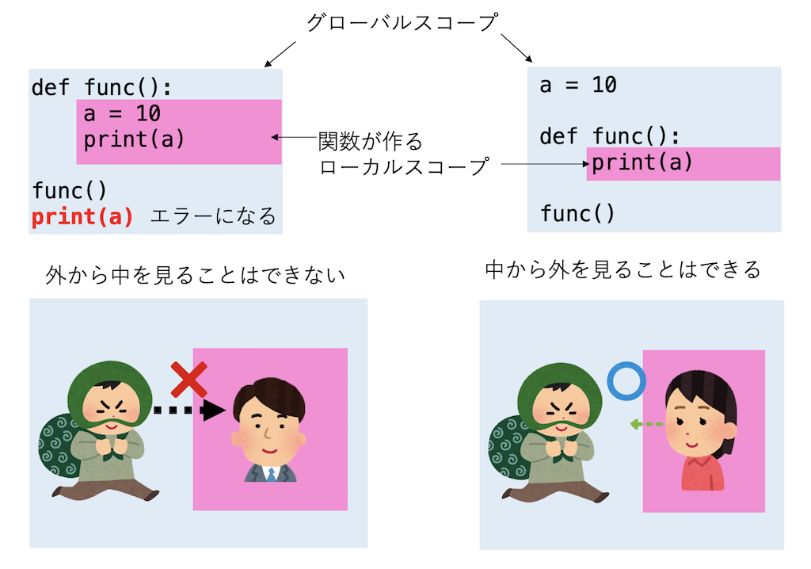

# 関数とスコープ

## 本講で学ぶこと

* while文
* ループのスキップと脱出
* 関数
* スコープ

## While文

「10回繰り返したい」という場合にはfor文が使えるが、「ある条件が満たされている限り繰り返したい」という場合もあるだろう。そんな、事前にループの回転数がわからない場合に使えるのがwhile文である。while文は以下のような構文になる。

```py
while 条件:
    処理
```

例えば、ある変数が正である限り1をひきながら表示するプログラムは以下のようになる。

```py
a = 10
while a > 0:
    print(a)
    a -= 1
```

Pythonでは、整数は0で無い限り「真」、「0」は「偽」として扱われるため、以下のように書くこともできる。

```py
a = 10
while a:
    print(a)
    a -= 1
```

## ループのスキップと脱出

`for`や`while`といった「ループを作る構文」を使っていると、ある条件を満たした時にループをスキップしたり、ループから脱出したくなることがある。それぞれ`continue`、`break`で実現できる。

### `continue`

例えば、0から9までの数字を表示するループを考えてみよう。

```py
for i in range(10):
    print(i)
```

実行すると、0から9まで表示される。これを、「偶数の時だけ表示する」ようにしたい。そのまま書くと以下のようになるだろう。

```py
for i in range(10):
    if i%2 == 0:
        print(i)
```

同じ処理を、「奇数の時だけループをスキップする」という形でも書ける。

```py
for i in range(10):
    if not i%2==0:
        continue
    print(i)
```

`continue`は、「以下の処理をスキップして、次のループに飛べ」という指示文である。やりたい処理を`if`文で囲むべきか、やりたくない処理を`continue`で飛ばすべきかは場合による。


上記の左では、ある条件が満たされた時に「何かやりたい処理」を実行しているが、右図では条件が満たされなかったらループをスキップして、スキップされなかった場合に「何かやりたい処理」を実行している。どちらも全く同じ処理を行うが、左は「for文が作るブロック」の中の「if文が作るブロック」が大きいのに対し、右では「if文が作るブロック」が小さくなり、「何かやりたい処理」が「for文の作るブロック」に移動している。

このように、処理の冒頭で条件をチェックし、`continue`したり`return`したりすることを**ガード節**と呼ぶ。まるでガードマンが入り口の前に立ち、不要な来訪者を追い払う様に似ているからと思われる。人間の頭はネストした構造を正しく把握するのにコストがかかるため、一般に構造のネストは浅い方が良く、深いブロックは小さい方が望ましい。ガード節はそのような深くて大きいネスト構造を防ぐ基本的なテクニックの一つである。

### `break`

ある条件が満たされたら、ループを終了したい場合は、`break`を使う。例えば、所持金5万円からスタートし、確率1/2で所持金が1万円増えるか減るかするギャンブルをしたとしよう。所持金が0になったら負け、10になったら勝ちで、いずれも終了とする。そのようなコードは、たとえば以下のように書ける。

```py
import random
  
money = 5

while True:
    money += random.randint(0, 1) * 2 - 1
    if money == 0:
        print("Lose")
        break
    if money == 10:
        print("Win")
        break
```

`random.randint(0, 1)`は、確率1/2で0か1を返す乱数であり、2倍して1を引くことで、+1か-1を返すようにしている。所持金`money`にそれを加算し、0になったら「Lose」と表示して終了、10になったら「Win」と表示して終了している。

ここでは`while True:`でループ構造を作っている。`while 条件:`は、条件が満たされている限りループする、というものであった。その条件に`True`を設定しているので、ループの条件は常に真であり、無限にループが回る。このようなループを **無限ループ** (infinite loop) と呼ぶ。無限ループを抜けるには、`break`もしくは関数からの`return`、プログラムを終了させる`exit()`などを使うしかない。もし適切な終了条件を設定せずにループを無限ループにしてしまった場合は、コンソールプログラムならCtrl+Cを入力、Google Colab上ならば実行中のセルの四角いボタンを押せば停止できる。

なお、先程と同じプログラムは、`break`を使わずに`while`の条件を工夫することでも実現できる。

```py
import random
  
money = 5

while 0 < money < 10:
    money += random.randint(0, 1)*2-1

if money == 0:
    print("Lose")
else:
    print("Win")
```

`money`が1から9の間にある場合のみループを実行し、この条件を満たさなくなったら`while`文を終了するコードである。最終的に`money`が0になったか`10`になったかを確認し、「Lose」や「Win」を表示している。先程のコードよりも、このループがどのような条件で実行されるべきかがわかりやすくなっているのがわかるであろう。

さきほどの例では`money`が1から9の間にある条件を`0 < money < 10`と書いたが、よりPythonらしく書くなら`range`を使って

```py
while money in range(1,10):
    money += random.randint(0, 1)*2-1
```

と書くこともできる。`range(x,y)`はx以上y未満の数字の範囲を表す。

一般に、等価な制御構造の書き方は複数存在する。例えば終了条件を`while`の条件に含めるべきか、`break`で脱出すべきかは場合による。こういった「良いコード」の書き方に興味のある人は「リーダブルコード」という古典的な名著があるので参照されたい。

## 関数

Pythonでは、よく使う処理を **関数** (function) という形で定義し、何度も利用することができる。

```py
def sayhello():
    print("Hello!")
```

関数は「def 関数名(引数):」という形で定義する。関数定義の右側にある「コロン」を忘れないように。Pythonはコロンの後にインデントによりブロックを作る言語である。

定義した関数は後から何度でも呼ぶこともできる。

```py
sayhello() #=> "Hello!"
```

関数にインプットを与えることもできる。このインプットを**引数** (argument)と呼ぶ。引数は「ひきすう」と読む。「いんすう」と間違える人が多いので注意。

```py
def say(s):
    print(s)
```

```py
say("Bye!") #=> Bye!
```

関数を実行した結果、値を返すこともできる。返す値は`return`文で指定する。

```py
def add(a, b):
    return a + b
```

```py
add(3, 4) #=> 7
```

関数が返した値を変数に代入することもできる。

```py
a = add(1, 2)
print(a) #=> 3
```

次回学ぶ「タプル」を用いると、複数の値を一度に返すこともできる。

```py
def func(i):
    return i, i + 1

a, b = func(5)  # a = 5, b = 6が代入される。
```

## スコープ

Pythonはコードブロックをインデントで表現する言語であり、`if`や`for`、`while`などがブロックを作ることは既に学んだ。同様に、関数もブロックを作るが、その関数が作るブロック内で宣言された変数の有効範囲は、そのブロック内に制限される。この変数の有効範囲のことを **スコープ(scope)** と呼ぶ。

最初に述べたように、プログラムの文法やライブラリの使い方の詳細については覚える必要はなく「なんとなくそういうものがあったなぁ」と覚えておくだけでよい。なぜなら、やりかたを忘れてしまっても、例えば関数の定義の仕方を忘れてしまっても、「Python 関数」で検索すればすぐにやり方はわかるからだ。しかし、「スコープ」については、ここである程度しっかり理解しておいた方が良い。将来スコープによる「変数の名前解決がらみ」で問題を起こした時、そうと知らなければ「これはスコープの問題だ」と認識することができないため、適切な検索ワードも思いつかず、自力では解決できなくなるからだ。

例えば以下のようなコードを見てみよう。

```py
def func():
    a = 10
    print(a)

func()
print(a)
```

関数`func`内で、変数`a`に10を代入し、その値を表示されている。その後、関数`func`を実行すると10が表示され、確かに`a`に10が入っていることがわかるが、その後で`a`を表示しようとすると`NameError: name 'a' is not defined`、つまり「変数`a`なんて知らないよ」というエラーが出てしまう。このように、関数内で宣言された変数は**ローカル変数**と呼ばれ、その有効範囲は関数内に制限される。特に、ローカル変数が住むスコープを**ローカルスコープ**と呼ぶ。

逆に、関数の外で宣言された変数は、関数の中からも見ることができる。

```py
a = 10

def func():
    print(a)

func()
```

このコードは問題なく実行され、10が表示される。関数の外、つまりインデントがなく、地面に「ベタ」についている場所で宣言された変数を**グローバル変数**と呼ぶ。グローバル変数は**グローバルスコープ**に住んでいる。

実はPythonには、ここで挙げた「ローカルスコープ」「グローバルスコープ」の他に、「関数内関数のスコープ」「ビルトインスコープ」というものもあるのだが、本書では取り上げない。

この「ローカルスコープ」と「グローバルスコープ」についてとりあえず知っておくべきことは

* ローカルからグローバルは見える
* グローバルからローカルは見えない

の二点である。



スコープには直感に反する振る舞いがいくつかあるのだが、ここでは一つだけ将来ハマりそうな例として、ローカルスコープからグローバル変数の参照と代入の問題について紹介する。こんなコードを考えよう。

```py
a = 10

def func():
    a = 20
    print(a)

func()
print(a)
```

このコードは

* 最初にグローバル変数`a`に10が代入され、
* 内部で変数`a`に20を代入して表示する関数`func`を実行し、
* 最後に`a`の変数の値を表示する

というプログラムである。どんな結果になるか想像できるだろうか？

実はこのコードでは、関数`func`を実行しても、グローバル変数の値は変更されない。これは`a=20`が、関数`func`内のローカル変数の宣言とみなされるからだ。ここで出てきた`func`や`a`といった「関数名」や「変数名」を 識別子 **(identifier)** と呼ぶ。また、ある識別子がどのスコープに属すものであるかを調べる仕組みを **名前解決(Name Resolution)** と呼ぶ。


さて、多くの場合においてこれは意図する動作ではないであろう。ローカルスコープからグローバル変数を修正したい場合、ローカルスコープ内で`global`宣言をする。

```py
a = 10

def func():
    global a  # 変数aがグローバル変数であることを宣言する
    a = 20
    print(a)  # => 20

func()
print(a)  # => 20
```

実行すると、関数内でグローバル変数`a`の値を書き換えることができたことがわかる。

しかし、このようなコードはバグの元であり、推奨されない。一般にはグローバル変数を使うことそのものが推奨されず、それに伴って`global`宣言の利用も非推奨である。Pythonには、コードが「ちゃんと」書かれているか確認するツールがいくつかあるが、そのうちの一つであるPylintを使うと、先ほどのコードは「global宣言を使っているよ」と怒られる。慣れるまでは「グローバル変数はなるべく使わない」「グローバル変数をいじっていておかしくなったらスコープを疑う」ということを覚えておくと良い。

さて、名前解決の仕組みはプログラミング言語ごとに異なるため、ある言語の内容をそのまま別の言語で書き直した時に思うような動作にならない時がある。例えば、Pythonは`if`文が作るブロックはスコープを作らないが、C言語はスコープを作る。例えば以下のコードはC言語ではエラーになる。

```c
if (true){
  int a = 10; //変数aはこのif文のみで有効
}
if (true){
  printf("%d\n",a); // 変数aはここから見えないのでエラー
}
```

Pythonの同等なコードはエラーにならない。

```py
if True:
    a = 10 # このif文はスコープを作らない
if True:
    print(a) # ここから変数aが見える
```

繰り返しになるが、プログラミング言語には「スコープ」という概念があり、変数がどのスコープに属すか決める仕組みは言語ごとに異なる、ということは覚えておいて欲しい。名前解決がらみで問題が起きた時に、そもそも「スコープ」という単語を知らないと、問題解決が難しくなるからだ。

## 関数とスコープ：課題

### 課題1-1：ロジスティック写像

関数と繰り返しを使い、ロジスティック写像を可視化してみよう。ロジスティック写像は

$$
n_{i+1} = a n_i (1- n_i)
$$

という漸化式で定められる写像である。$n_i$は、ある生物の$i$世代目の個体密度(環境が許す最大の個体数に対する現在の個体数の割合)、$a$が環境の快適度を表し、大きい方が生物は増えやすい。もし、これが定常状態であれば、$n_{i+1} = n_i = n$が成り立つから、

$$
n = 1 - \frac{1}{a}
$$

に落ち着くはずである。この振る舞いを確認してみよう。新しいノートブックを開き、`logistic.ipynb`と名前を付けよう。

#### 1. インポート

まずは後で使うライブラリをインポートしておこう。

```py
import matplotlib.pyplot as plt
```

#### 2. 関数`logistic`の実装

パラメタ$a$を受け取って、個体数$n$の収束を調べる関数`logistic`を実装しよう。

```py
def logistic(a):
    n = 0.1
    for i in range(1000):
        n = a * n * (1.0 - n)
        if i > 990:
            print(n)
```

これは、初期値を$n=0.1$として、$n \leftarrow a n(1-n)$という写像を1000回繰り返し、最後の10回だけ$n$を表示する関数だ。

#### 3. 関数`logistic`の動作確認

３つ目のセルで、関数`logistic`を実行してみよう。

まずは、$a=1.5$を代入してみよう。

```py
logistic(1.5)
```

結果が、予想される定常解$n = 1 - 1/a$になっているか確認せよ。$a=2.0$ではどうか。また、$a=3.1$を代入すると、定常解に収束しないはずである。何が起きるか確認せよ。

### 課題1-2：ロジスティック写像の可視化

ロジスティック写像は、$r$が小さいうちは定常解に収束するが、ある値を超えると個体数が振動することがわかった。では、どのような振る舞いをするのか、可視化してみよう。

#### 4. 関数`logistic_plot`の実装

ある範囲の$a$を受け取って個体数の振動を調べる関数`logistic_plot`を実装しよう。4つ目のセルに以下を入力せよ。

```py
def logistic_plot(start, end, x, y):
    for i in range(1000):
        a = (end - start) * i / 1000 + start
        n = 0.1
        for j in range(1000):
            n = a * n * (1.0 - n)
            if j > 900:
                x.append(a)
                y.append(n)
```

#### 5. 関数`plot`の実装

`logistic_plot`の結果を受け取って、グラフに描画する関数`plot`を実装しよう。5つ目のセルに以下を入力せよ。

```py
def plot(start, end):
    x, y = [], []
    logistic_plot(start, end, x, y)
    plt.scatter(x, y, s=0.1)
```

#### 6. 定常状態の表示

では、まずは定常状態に落ち着く領域$1 < a < 3$を描画してみよう。6つ目のセルで以下を実行せよ。

```py
plot(1.0, 3.0)
```

#### 7. 振動状態の表示

$a>3$では、個体数が定常状態にならない。それを見てみよう。7つ目のセルで以下を実行せよ。

```py
plot(1.0, 4.0)
```

どんなグラフが現れただろうか？

また、興味のある人は$3.54 < a < 3.58$の領域を拡大してみよう。次のセル(8つ目)で以下を実行せよ。

```py
plt.ylim([0.335,0.39])
plot(3.54, 3.58)
```

どんなグラフが現れただろうか？拡大前のグラフと見比べて見よ。

### 課題2：コラッツ問題

while文と関数を使ってプログラムを作ってみよう。題材としてコラッツ問題(Collatz problem)を取り上げる。コラッツ問題とは、以下のようなものである。

* 何か正の整数を考えよ
* それが偶数なら2で割れ
* それが奇数なら3倍して1を足せ
* 以上の処理を数字が1になるまでずっと繰り返せ

たとえば「5」を考えよう。これは奇数なので3倍して1を足すと「16」になる。
これは偶数だから2で割って「8」、さらに2で割って「4」「2」「１」となる。

コラッツ問題とは「上記の手続きを繰り返した場合、すべての整数について有限回の手続きで1になるか？」というものであり、未だに解決されていない。この問題をプログラムで確認してみよう。新しいノートブックを開き、`collatz.ipynb`と名前を付けておこう。

#### 1. インポート

まずは最初のセルで、可視化に使うライブラリをインポートしておこう。

```py
from graphviz import Digraph
from PIL import Image
```

#### 2. 関数`collatz`の実装

与えられた数字に対して、

* 偶数なら2で割る
* 奇数なら3倍して1を足す

という処理を、

* その数字が1になるまで

繰り返しながら表示する関数`collatz`を作りたい。以下の「条件1」「条件2」を埋めて関数を完成させよ。

```py
def collatz(i):
    print(i)
    while (条件1):
        if (条件2):
            i = i // 2
        else:
            i = i * 3 + 1
        print(i)
```

インデントに注意。最初の`print`と二番目の`print`はインデントの位置が異なる。

* ヒント1：「整数`i`の値が`a`ではない」という条件は`i != a`と表現できる。
* ヒント2：整数`i`を数`N`で割った余りは`i % N`で求められる。
* ヒント3：「整数`i`が0に等しい」という条件は`i == 0`と表現できる。

#### 3. 関数`collatz`の動作確認

3つ目のセルで、`collatz`関数を呼び出し、所望の動作になっているか確認せよ。例えば初期値として「3」を代入し、以下の数列が得られるだろうか？

```py
collatz(3)
```

```sh
3
10
5
16
8
4
2
1
```

もし正しい結果が得られたら、いろいろな数字を入れて、すべて最終的に1になることを確認せよ。収束するまでの手続きが長い数を探せ。例えば27を入れたらどうなるだろうか。

#### 4. 関数`collatz_graph`の実装

コラッツ数列を可視化するための関数`collatz_graph`を実装しよう。条件1、条件2は先程と同じものを入力せよ。

```py
def collatz_graph(i, edges):
    while (条件1):
        j = i
        if (条件2):
            i = i // 2
        else:
            i = i * 3 + 1
        edges.add((j, i))
```

#### 5. グラフの作成

5つ目のセルに以下を入力、実行せよ。

```py
def make_graph(n):
    g = Digraph(format='png')
    edges = set()
    for i in range(1, n+1):
        collatz_graph(i, edges)
    for i, j in edges:
        g.edge(str(i), str(j))
    g.attr(size="10,10")
    g.render("test")
    return Image.open("test.png")
```

これは、1から`n`までの数についてコラッツ数列を作りつつ、すでに出現した数字になったら、そこに「つなぐ」ことでグラフにする関数である。

#### 6. グラフの表示

実際にコラッツ数列のグラフ表示をさせてみよう。以下を入力、実行せよ。

```py
make_graph(3)
```

ここまで正しく入力されていれば、何か木構造のグラフが表示されたはずである。コラッツ予想とは、このグラフがいかなる場合も木構造、つまりループ構造が無いことを主張するものである。グラフの表示に成功したら、いろんな数字を`make_graph`に入れて実行してみよ。20ぐらいがちょうどよいと思うが、27に挑戦してもよい。なお、図のサイズが小さすぎる場合は、

```py
    g.attr(size="20,20")
```

とすると、生成されるイメージが大きくなるため見やすくなる。

### 発展課題：拡張コラッツ問題

コラッツ予想には様々な変種がある。例えば、

* 何か正の整数を考えよ
* それが偶数なら2で割れ
* それが奇数なら3倍して **3** を足せ
* 以上の処理を数字が **1か3** になるまでずっと繰り返せ

というものである。これもやはり有限回の手順で止まるらしい(こちらも未解決問題)。これを確認してみよう。

課題2で作成した`collatz.ipynb`をコピーして使おう。「ファイル」メニューから「ドライブで探す」をクリックせよ。「マイドライブ」の「Colab Notebooks」に「collatz.ipynb」があるはずである。それを右クリックし「コピーを作成」を選ぶと「collatz.ipynbのコピー」というファイルが作成されるので、それを右クリックして「名前を変更」を選び、「collatz2.ipynb」という名前にしよう。「collatz2.ipynb」が作成されたら、右クリック→「アプリで開く」→「Colaboratory」を選ぶことで開くことができる。

「collatz2.ipynb」がGoogle Colabで開かれたら、「ランタイム」メニューの「すべてのセルを実行」を選び、すべてのセルを実行済みにしよう。その後、

* 数字が1か3になったら終了とする
* 奇数だったら3倍して3を足す

となるように関数`collatz_graph`を修正せよ。

* ヒント：「条件XかつY」は、`if X and Y:`で、「条件XもしくはY」は、`if X or Y:`で表現できる。

修正したら、すべてのセルを実行してから、例えば`make_graph(5)`を実行せよ。`make_graph(50)`ではどうなるだろうか。1に収束する数字と3に収束する数字があるはずだ。1に収束するのはどういう数字かについて考察せよ。

## 余談：数論について

コラッツ予想に代表されるような、「整数がこの条件を満たすか？」のような問いを扱うのが整数論(数論)である。一般に数論は「問いを理解するのは易しいが、その解決は極めて難しい」という性質を持つ。ガウスの「数学は科学の女王であり、数論は数学の女王である」という言葉は有名だ。数論の中でも特に有名なのは「フェルマーの最終定理」であろう。これは「三以上の自然数nについて、$x^n + y^n = z^n$を満たす自然数の組$(x,y,z)$は存在しない」という定理である。フェルマーはフランスの弁護士であったが、余暇に行った数学で大きな功績を残し、「数論の父」とも呼ばれる。彼は趣味でディオファントスの著作「算術」の注釈本を読み、その余白に有名な注釈を書き込んだ。その多くは後に証明、もしくは反証されたが、一つだけ証明も反証もされずに残ったのが「フェルマーの最終定理」である。フェルマーが「フェルマーの最終定理」を記述した横に「私はこの定理の驚くべき証明を手に入れたが、ここに書くには余白が足りない」と書いたのは有名である。アンドリュー・ワイルズは、7年の間、秘密裏にこの問題に取り組み、1995年に解決した。フェルマーによる提唱から証明に至るまで、実に360年かかっている。数論の面白さは、整数しか扱わないにもかかわらず、そこに幾何や解析がからんでくることである。

数論は入門しやすく、一方で極めて奥が深いため、その難しさ、美しさに魅せられて人生を捧げる人も多い。2011年5月にコラッツの弟子が「コラッツ予想を解決した」という論文を投稿した。しかし、すぐに証明の不備が見つかり、6月に撤回された。その[論文](https://preprint.math.uni-hamburg.de/public/papers/hbam/hbam2011-09.pdf)には、

> The reasoning on p. 11, that "The set of all vertices (2n,l) in all levels will contain all even numbers 2n ≧ 6 exactly once." has turned out to be incomplete. Thus, the statement “that the collatz conjecture is true” has to be withdrawn, at least temporarily.(11ページにある証明は不完全であることがわかった。したがって、『コラッツ予想は真である』という主張は、今のところは撤回する)

とある。最後の「at least temporarily (今のところは)」に悔しさがにじむ。サイモン・シンは、こうした数学の未解決問題へ取り憑かれることを熱病に例えた。フェルマーの最終定理に取り憑かれるフェルマー熱、ポアンカレ予想に取り憑かれるポアンカレ熱などが有名だが、この二つは近年解決した。しかし、コラッツ予想は未解決であり、今後もコラッツ熱の感染者を生み続けるのであろう。

このような数学の話に興味のある人は「数学を作った人々 (E. T. Bell著、田中 勇、銀林 浩 訳)」をおすすめする。数学という、一種無味乾燥にも思える学問の構築の裏に、様々な人間ドラマがあったことを知れば、数学を学ぶ楽しさも増えるに違いない。
