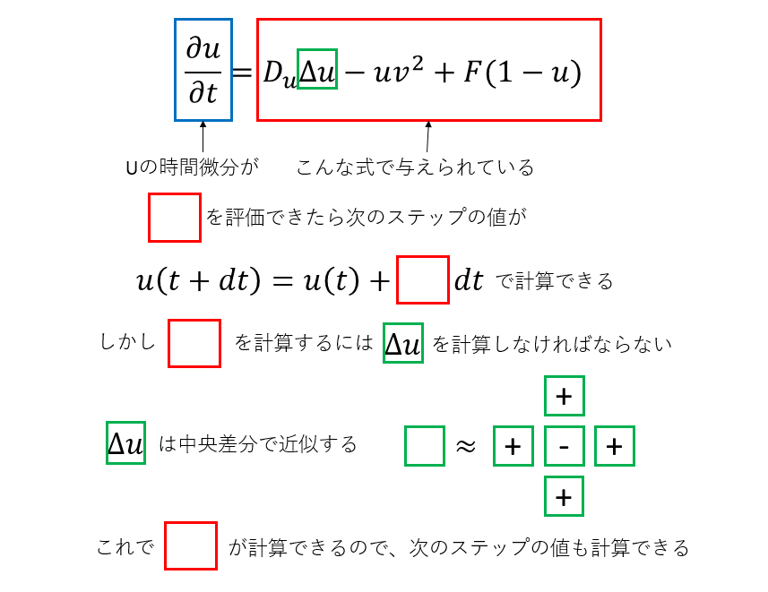

# [数値シミュレーション](https://kaityo256.github.io/python_zero/simulation/)

* 弾道計算1: 抵抗なし
* 弾道計算2: 抵抗あり
* 反応拡散方程式(Gray-Scott Model)

## はじめに

互いに重力で引き合う二つの星の軌道の形が楕円となることは知っているであろう。ではなぜ楕円となるか、答えられるだろうか？様々な答えはあろうが、一つの答えは「距離の逆二乗に比例する力で互いに引き合う二つの物質の運動方程式を解くと、その軌道が楕円となるから」である。さて、運動方程式とはなんだったか覚えているだろうか。最も簡単な運動方程式は$F=ma$である。これは、物質にかかる加速度と力が比例し、その比例係数が物質の質量であることを主張する。さて、加速度とは何か？それは速度の時間変化である。したがって、先ほどの運動方程式は、より正確に書くと

$$
m \frac{d v}{dt} = F
$$

となる。さらに速度とは、単位時間当たりの位置の変化分であった。したがって、それもちゃんと書くと、

$$
\begin{aligned}
\frac{d v}{dt} &= \frac{F}{m} \\
\frac{d r}{dt} &= v
\end{aligned}
$$

これが運動方程式である。すなわち、運動方程式とは時間に関する連立常微分方程式である。上記の式は一次元で書いたが、これを三次元の式にして、さらに二つの物質の間に距離の二乗に反比例する力を仮定すると、互いに重力で引き合う二つの星の運動を表す方程式となる。これを解くと、軌道が楕円になることや、面積速度一定則、調和の法則など、いわゆるケプラーの三法則が導かれる。

物理学とは、この宇宙を記述する学問である。そして(なぜかはわからないが)この宇宙は微分方程式で記述されている(らしい)。したがって、物理学とは、微分方程式を解く学問である。幸か不幸か、ほとんどの微分方程式は解析的に解くことができない。しかし、方程式さえわかれば、それを数値的に解くことは可能である。何かの現象に着目し、それを記述する方程式を支配方程式(Governing Equation)と呼ぶ。支配方程式を数値的に解いて、その振る舞いを調べることを数値シミュレーションと呼ぶ。というわけで、今回は数値シミュレーションをやってみよう。

## 弾道計算1: 抵抗無し

ものを斜め上に投げると、どの角度で投げると最も遠くに飛ぶだろうか。ただし空気抵抗は無視するものとする。答えが投げる強さ(初速)に依らず45度であることは知っているであろう。では逆に、初速と的までの距離が決まっているときに、何度で投げれば的に当てることができるだろうか？例えば初速100m/sで、500m先にある的に当てたいときの角度は？空気抵抗を無視すれば、二次方程式を解くだけだが、すぐに暗算するのは難しいであろう。この「重力下で物に初速を与えて飛ばす」という設定は、物理としてはかなり簡単な部類に入るが、戦争においては極めて重要な問題設定であった。例えば敵までの距離がわかっているときに、迫撃砲の角度を何度にすればよいかを「すぐに」決めなくてはならない。当然だが戦闘中にいちいち方程式を解く暇はなく、実際には空気的もあるために距離と角度の関係は難しい。そこで、あらかじめ弾の種類と距離の応じて「射表」と呼ばれる距離と角度の関係表を作っておいた。実際に射出して着弾距離を調べることももちろん行われたが、数値計算も行われた。最初期の電子計算機であるENIACは、もともと砲撃の射表の作成のために作られたものだ。ENIACは微分方程式を解くことができ、これが本格的な数値シミュレーションの始まりである。ENIACはその後「マンハッタン計画」にも用いられたことからもわかるように、計算機は軍事利用と深い関係にあり、スーパーコンピュータは半ば「兵器」として扱われた。強力な計算機を保有することが軍事的に優位に立つのに必要であり、実は現在もその名残が様々なところにみられるのだが、それはさておく。

さて、いま皆さんの目の前にあるのは、ちょっと前のスーパーコンピュータなみの計算能力を持つ計算機である。それを使って、簡単なシミュレーションをしてみよう。まずは空気抵抗がない場合である。

以下のプログラムを三つのセルに分けて入力し、実行せよ。

```py
import matplotlib.pyplot as plt
import numpy as np
from math import pi, cos, sin
```

```py
def run(theta):
  x, y = 0.0, 0.0
  vx, vy = cos(theta), sin(theta)
  ax, ay = [], []
  g = 1.0
  dt = 0.01
  while y >= 0.0:
    x += vx * dt
    y += vy * dt
    vy -= g * dt
    ax.append(x)
    ay.append(y)
  nx = np.array(ax)
  ny = np.array(ay)
  return nx, ny
```

```py
nx, ny = run(pi*0.25)
plt.plot(nx,ny)
plt.legend()
plt.show()
```

### 課題1

TODO: pi/4が最も飛ぶことを確認させる

## 弾道計算2: 抵抗あり

## 反応拡散方程式(グレイ・スコット模型)

先ほどまでは弾道計算を行った。飛翔体の計算は奥が深いのだが、結果がやや地味なのは否めない。せっかくシミュレーションをするので、もう少し結果が派手な計算をしてみよう。そのような例として、反応拡散系(Diffusion-Reaction System)を取り上げる。

等モルの塩酸と水酸化ナトリウムを混ぜると、食塩水ができることは知っているであろう。この反応は一方的であり、混ざって食塩ができておしまいである。しかし、ある種類の化合物を混ぜて反応させると、ある物質ができたり消えたりを繰り返すことがある。最も有名な例はBZ反応(ベロウゾフ・ジャボチンスキー反応, Belousov-Zhabotinsky Reaction)であろう。これは、ある溶液を混ぜると、その後しばらく溶液の色が周期的に変動する現象である。非常に雑に説明すると、反応を記述する方程式が時間の二階微分方程式になり、振動解が出てくるのがこの現象の本質である。

さて、BZ反応は時間的に変動する現象であるが、これが「拡散(Diffusion)」と結びつくと、時間的な変動が空間的に伝播していく。これにより複雑な模様ができあがる。化学反応(Reaction)と拡散(Diffusion)が組み合わさった現象であるから反応拡散系(Diffusion-Reaction System)と呼ばれる。反応拡散系は様々な例が知られているが、筆者の趣味でグレイ・スコットモデル(Gray-Scott model)を取り上げる。

グレイ・スコットモデルは、以下のような連立偏微分方程式で記述される。

$$
\begin{aligned}
\frac{\partial u}{\partial t} &= D_u \nabla^2 u - uv^2 + F(1-u) \\
\frac{\partial v}{\partial t} &= D_v \nabla^2 v + uv^2 - (F+k)v
\end{aligned}
$$

右辺の第一項が拡散項、その後ろにあるのが反応を記述する力学系である。三次元を考えることもできるが、ここでは二次元空間を考える。

### 差分化

さて、この式を計算機で扱えるように離散化しよう。離散化とは、本来連続である時間や空間を「小さな単位」に分解して近似することだ。例えばテレビは、画像をピクセルに分解して表現しており(空間の離散化)、また1秒間に30フレームを表示している(時間の離散化)。このように、時間も空間も十分小さい単位に区切って表現すれば、もとの連続空間での微分方程式の解の性質を精度よく表現できると考えられる。

例えば、ある関数$f(t)$の時間微分を離散化で近似したいとする。時間の離散単位(時間ステップ)を$h$とし、テイラー展開で一次までとると、

$$
\begin{aligned}
f(t + h) &= f(t) + f'(t)h + O(h^2) \\
&\sim f(t) + f'(t)h
\end{aligned}
$$

となる。つまり、時刻$t$における$f(t)$の値と、その微係数$f'(t)$がわかっていれば、時刻$t+h$における値$f(t+h)$は、$f(t) + f'(t)h$で近似できる、という意味である。これは時間微分に関してテイラー展開の一次で近似しているので、そのまま一次近似と呼ばれる。また、別名をオイラー法と呼ぶ。このように、時間や空間を離散化し、微分を離散単位で近似することを **差分化** と呼ぶ。

次に空間を離散化しよう。今は二次元空間を考えているが、まずは一次元の世界$f(x)$を考える。微分方程式に二階微分が含まれているので、二階微分を近似したい。そのために、$f(x+h)$と$f(x-h)$をそれぞれ二次までテイラー展開してみよう。

$$
\begin{aligned}
f(x + h) &= f(x) + f'(x)h + \frac{h^2}{2} f''(x) + O(h^3) \\
f(x - h) &= f(x) - f'(x)h + \frac{h^2}{2} f''(x) + O(h^3) 
\end{aligned}
$$

両辺足すと$f'(x)$の項が消えるので、整理して

$$
f''(x) = \frac{f(x+h) - 2 f(x) + f(x-h)}{2h}
$$

を得る。これを **中央差分** と呼ぶ。

全く同様にして、二変数関数の二階微分(ラプラシアン)は、以下のように表現できる。

先ほどの微分方程式は、時間に関して一階微分、空間に関して二階微分であったので、これで必要な式がそろった。$u$、$v$を二次元配列として保持し、適当な初期条件を与える。ある時刻において$(ix,iy)$において、物理量$u$の値が`u[ix][iy]`で与えられているとしよう。この点におけるラプラシアン$\nabla^2 u$の値は

```py
def laplacian(ix, iy, u):
    ts = 0.0
    ts += u[ix-1, iy]
    ts += u[ix+1, iy]
    ts += u[ix, iy-1]
    ts += u[ix, iy+1]
    ts -= 4.0*u[ix, iy]
    return ts
```

で与えられる。他の項は「現時刻のその場所の値」で計算可能なので、これで次のステップの値が求まる。



## 余談：パーソナルスーパーコンピュータ

パソコンとは「パーソナルコンピュータ」の略、つまり「個人向け計算機」という意味だ。もともと計算機は貴重品かつ大型であり、組織に一つしかないものだった。それが徐々に小型化し、オフィスに一つ(オフコン)になり、さらに個人で独占して利用できるものになった。パソコンが普及するにつれて、もともと「組織に一つ」しかないような巨大な計算機は「スーパーコンピュータ(スパコン)」と呼ばれ、パソコンと区別されるようになった。スパコンは、安くて一億、高ければ数十、数百億円といったその価格もさることながら、その維持も大変である。計算するのには莫大な電気が必要で、かつ使った電気はすべて熱となるからそれを冷却するシステムも必要である。したがって、本来「パソコン」と「スパコン」は相容れない概念のはずだが、スパコンを個人で所有することでその二つを悪魔合体させ、「パーソナルスーパーコンピュータ」という狂った概念を生み出した人がいる。桑原邦郎氏である。彼は流体力学を専門とする研究者で、親から受け継いだ莫大な財産をすべてスパコンに突っ込んだ。自宅に計算流体力学研究所という研究所を作り、そこにスパコンを購入して運用した。最盛期は七台のスパコンがフル稼働し、電気代だけで月に2000万円かかったという。1980年代後半から1990年代にかけて、計算流体力学を専門とする人はほとんど彼のパーソナルスパコンにお世話になったと思われる。自動車メーカも技術者を派遣していたそうだ。また、米国の諜報機関が「軍事目的に使っているのではないか」と疑ったとのエピソードもある。彼は親から受け継いだ莫大な遺産をすべてスパコンに突っ込み、それを惜しげもなくいろんな人に使わせた。

それから紆余曲折あって、計算流体力学研究所はスパコンを手放し、技術コンサルやパソコンの組み立て、販売をする会社となった。私が大学院に進学した際に与えられたパソコンは、この計算流体力学研究所で購入したAlpha21164のマシンであった。指導教員の「せっかくだから組み立てさせてもらったら？」の言葉に甘え、目黒に行ってアルバイトのお兄さんと一緒に自分の研究に使うマシンを組み立てた。そこに社長である桑原氏が様子を見にやってきた。僕が物工の学生と知ると、興味をもっていろいろ聞いてきた。僕はまさか目の前の社長さんが元物工の助手だったなんて知らなかったので「物工のご出身なんですか？どこの研究室ですか？」と的外れな質問をした。彼はただ笑って何も答えなかったのを思い出す。その時は青二才で何もわからなかった私だが、スパコンを使って研究をするようになった今なら、彼からいろいろ興味深い話が聞けたのではないかと残念に思う。桑原氏は2008年、その豪快な生涯を閉じた。「親の遺産をもっとも有効に学術に活かした」と評されている。
