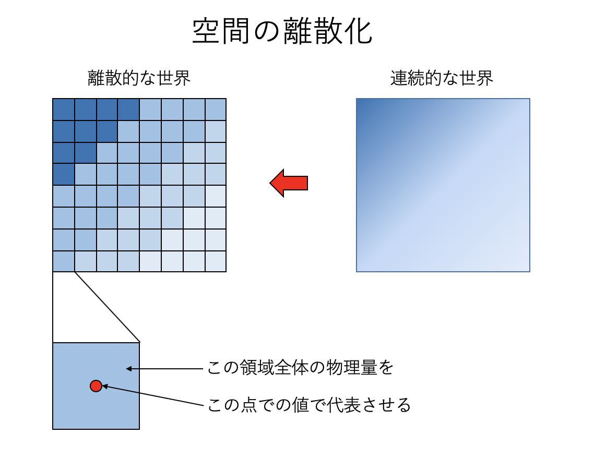
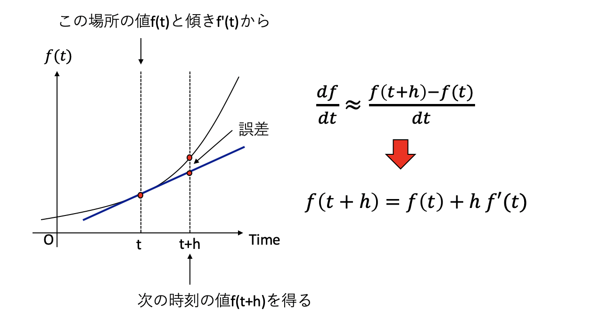
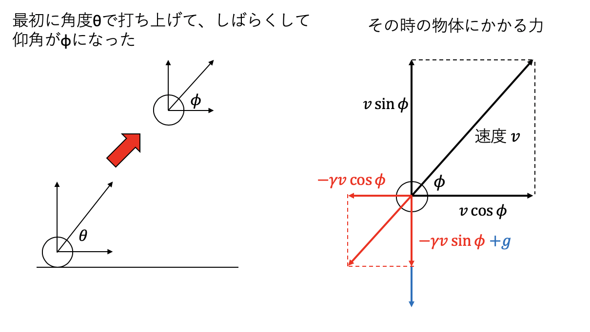
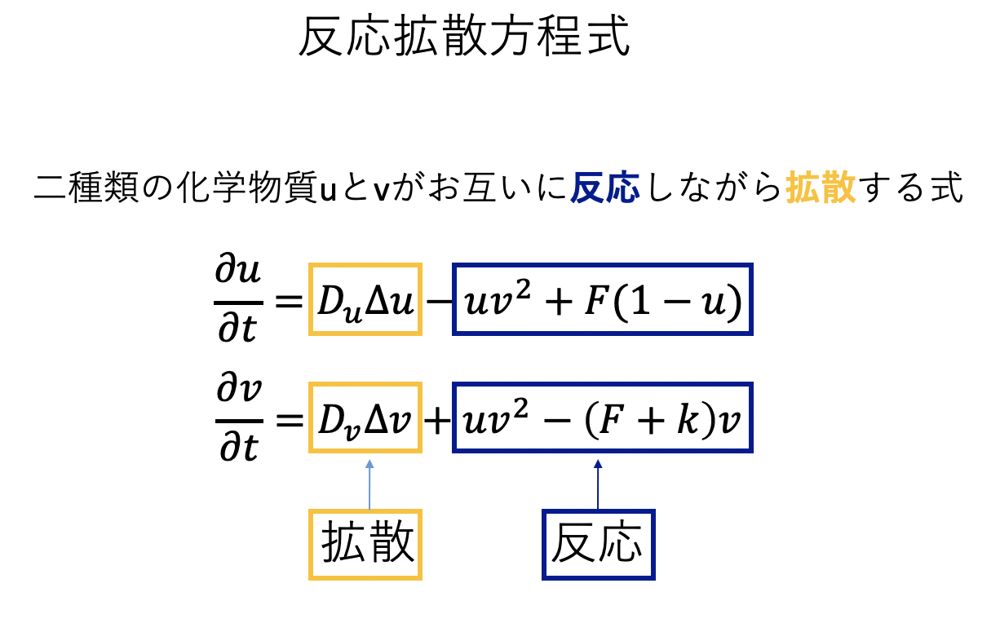
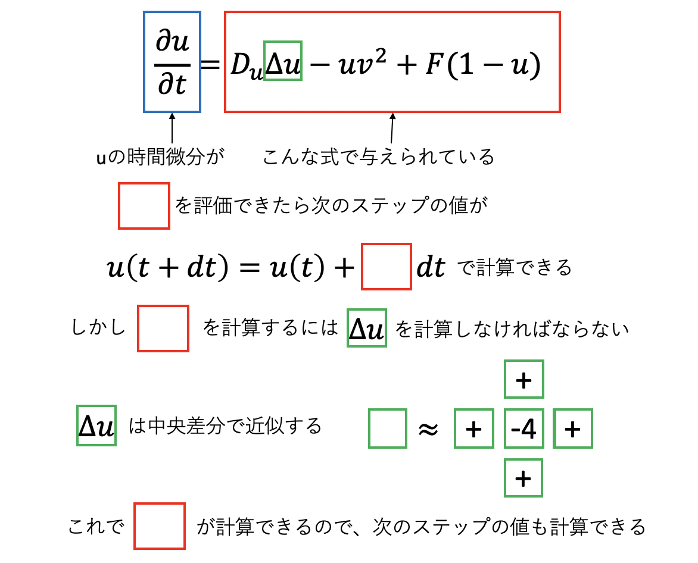

# [数値シミュレーション](https://kaityo256.github.io/python_zero/simulation/)

* 空気抵抗がない場合の弾道計算
* 空気抵抗がある場合の弾道計算
* 反応拡散方程式(Gray-Scott Model)
* 余談：パーソナルスーパーコンピュータ

## 数値シミュレーションとは

物理学とは、我々が存在するこの宇宙を記述する学問である。そして(なぜかはわからないが)この宇宙は微分方程式で記述されている(らしい)。したがって、物理学とは、微分方程式を解く学問である。幸か不幸か、ほとんどの微分方程式は解析的に解くことができない。しかし、方程式さえわかれば、それを数値的に解くことは可能である。何かの現象に着目し、それを記述する方程式を **支配方程式(Governing Equation)** と呼ぶ。この支配方程式を、数値的に解くことでその振る舞いを調べることを **数値シミュレーション(Numerical Simulation)** と呼ぶ。

さて、この世界の空間や時間は(たぶん)連続的であるのに対し、コンピュータは原則として離散的な値しか扱うことができない。数値シミュレーションとはこの世界の出来事をコンピュータの中に再現することであるから、計算するにあたって連続的な値を離散的な値に変換する必要がある。例えば、パソコンやスマホで動画を見ることがあるだろう。動画は、我々が目にする世界のように、空間的にも時間的にも連続的に見えるが、実際には時間方向は静止画像を高速にコマ送りすることで連続的に見せており、静止画像も拡大するとピクセル単位で離散化されている。



このように、連続的な値をコンピュータで扱うために離散的な値にすることを **離散化(discretization)** と呼ぶ。以下では、時間や空間を離散化することで微分方程式を計算機が扱いやすい形にして、その振る舞いを数値シミュレーションで解析してみよう。

## 運動方程式

互いに重力で引き合う二つの星の軌道の形が楕円となることは知っているであろう。ではなぜ楕円となるか、答えられるだろうか？様々な答えはあろうが、一つの答えは「距離の逆二乗に比例する力で互いに引き合う二つの物質の運動方程式を解くと、その軌道が楕円となるから」である。さて、運動方程式とはなんだったか覚えているだろうか。最も簡単な運動方程式は$F=ma$である。これは、物質にかかる加速度と力が比例し、その比例係数が物質の質量であることを主張する。さて、加速度とは何か？それは速度の時間変化である。したがって、先ほどの運動方程式は、より正確に書くと

$$
m \frac{d v}{dt} = F
$$

となる。さらに速度とは、単位時間当たりの位置の変化分であった。したがって、それもちゃんと書くと、

$$
\begin{aligned}
\frac{d v}{dt} &= \frac{F}{m} \\
\frac{d r}{dt} &= v
\end{aligned}
$$

これが運動方程式である。すなわち、運動方程式とは時間に関する連立常微分方程式である。上記の式は一次元で書いたが、これを三次元の式にして、さらに二つの物質の間に距離の二乗に反比例する力を仮定すると、宇宙空間内で互いに重力で引き合う二つの星の運動を表す方程式となる。これを解くと、軌道が楕円になることや、面積速度一定則、調和の法則など、いわゆるケプラーの三法則が導かれる。 自然科学において **法則(law)** とは、実験や観測などで再現可能な自然の振る舞いである。物理学とは、より基本的な原理から、観測事実である「法則」を導き、説明しようとする営みである。

### 空気抵抗がない場合の弾道計算

ものを斜め上に投げた時、最も遠くに飛ばすにはどんな角度で投げればよいだろうか。ただし空気抵抗は無視するものとする。答えが投げる強さ(初速)に依らず45度であることは知っているであろう。では逆に、初速と的までの距離が決まっているときに、何度で投げれば的に当てることができるだろうか？例えば初速100m/sで、500m先にある的に当てたいときの角度は？空気抵抗を無視すれば、二次方程式を解くだけだが、すぐに暗算するのは難しいであろう。この「重力下で物に初速を与えて飛ばして目的の場所に落とす」という設定は、戦争においては極めて重要な問題設定であった。例えば敵までの距離がわかっているときに、迫撃砲の角度を何度にすればよいかを「すぐに」決めなくてはならない。当然だが戦闘中にいちいち方程式を解く暇はなく、実際には空気抵抗もあるために距離と角度の関係は難しい。そこで、あらかじめ弾の種類と距離の応じて「射表」と呼ばれる距離と角度の関係表を作っていた。実際に射出して着弾距離を調べることももちろん行われたが、数値計算も行われた。最初期の電子計算機であるENIACは、もともと砲撃の射表の作成のために作られたものだ。ENIACは微分方程式を解くことができ、これが本格的な数値シミュレーションの始まりである。ENIACはその後「マンハッタン計画」にも用いられたことからもわかるように、計算機は軍事利用と深い関係にあり、スーパーコンピュータは半ば「兵器」として扱われた。強力な計算機を保有することは軍事的に優位に立つのに必要であり、実は現在もその名残が様々なところにみられるのだが、それはさておく。

さて、いま皆さんの目の前にあるのは、ちょっと前のスーパーコンピュータなみの計算能力を持つ計算機である。それを使って、簡単なシミュレーションをしてみよう。まずは空気抵抗がない場合である。二次元の場合を考えよう。速度ベクトルを$\vec{v} = (v_x, v_y)$、位置ベクトルを$\vec{r} = (r_x, r_y)$とし、運動方程式をそれぞれの要素について書き下すと以下のようになる。

$$
\begin{aligned}
\dot{v_x} &= 0 \\
\dot{v_y} &= - g \\
\dot{r_x} &= v_x \\
\dot{r_y} &= v_y
\end{aligned}
$$

さて、この式は厳密に解けるのだが、その厳密解を知らないものとし、シミュレーションで近似的に解を求めることにする。求めたいものは重力下で角度$\theta$で物体を投げた時の物体の軌道である。まず、数値計算で扱いやすいように、時間を離散化しよう。

今、ある量$f(t)$の時間微分$f'(t)$が与えられているとしよう。時間に関する離散化とは、ある小さな時間刻みを$h$に対して、$f(t)$の値からなんとかして$f(t+h)$の値を推定することである。時間微分$f'(t)$がわかっているので、厳密な表式は積分で与えられる。

$$
f(t+h) = f(t) + \int_t^{t+h} f'(t) dt
$$

この式の意味は時刻$t$において$f(t)$の値である時、それに$t$から$t+h$までの時間変化$f'(t)$をすべて積算したものを加えると$f(t+h)$の値になります、ということであり、なんら難しいことは言っていない。

さて、一般にはこの積分を求積することはできないので、なんらかの近似をする。最も単純な近似は、時間刻み$h$が小さいので、その間は$f'(t)$が時間変化しないものとみなすことだろう。すると、$f'(t)$を積分の外に出すことができるので、

$$
f(t+h) \sim f(t) + h f'(t)
$$

と近似することができる。$f(t+h)$を$t$の周りでテイラー展開して、一次までとると、

$$
\begin{aligned}
f(t + h) &= f(t) + f'(t)h + O(h^2) \\
\end{aligned}
$$

となることから、先程の近似は$h$の一次まで正しい。これを一次近似と呼ぶ。この式は、右辺、すなわち時刻$t$における$f(t)$の値と、その微係数$f'(t)$がわかっていれば、左辺、すなわち時刻$t+h$における値$f(t+h)$は、$f(t) + f'(t)h$で近似できる、ということを主張する。このように、微分を離散単位で近似することを差分化と呼び、差分化により微分方程式を扱う手法を **差分法(Finite difference method)** と呼ぶ。特に、一次近似の差分法を **オイラー法 (Euler's method)** と呼ぶ。



先の運動方程式に一次の差分化を適用すると、

$$
\begin{aligned}
v_x(t+h) &= v_x(t) \\
v_y(t+h) &= v_y(t) - g h\\
r_x(t+h) &= r_x(t) + v_x(t) h \\
r_y(t+h) &= r_y(t) + v_y(t) h\\
\end{aligned}
$$

となる。この計算を一度行うことで、時刻$t$の物理量から時刻$t+h$の物理量が得られる。あとはこれを繰り返せば(時間刻み$h$の精度で)任意の時刻の位置と速度がわかることになる。

厳密解も求めておこう。

まず、運動方程式から速度に関する部分を抜き出すと以下のようになる。

$$
\begin{aligned}
\dot{v_x} &= 0 \\
\dot{v_y} &= - g
\end{aligned}
$$

これは簡単に求積できる。初期条件として、仰角$\theta$、速度$1$で投げたとすると、$v_x(0) = \cos \theta, v_y(0) = \sin \theta$であるから、

$$
\begin{aligned}
v_x(t) &= \cos \theta \\
v_y(t) &= -gt + \sin \theta
\end{aligned}
$$

となる。これをさらに時間積分したものが座標であるから、初期位置が $\vec{r}(0) = (0,0)$ であったとすると、

$$
\begin{aligned}
r_x(t) &= t \cos \theta \\
v_y &= -\frac{g t^2}{2} + t \sin \theta
\end{aligned}
$$

これが求めたい軌道であった。

### 空気抵抗がある場合の弾道計算

先程は空気抵抗が無い場合を考えた。次は空気抵抗がある場合を考えよう。一口に空気抵抗と言っても様々な要因があるのだが、ここは単純に「速度に比例して向きと反対向きにひっぱられる力」がかかっていると考えよう。このような力は「ストークス抵抗」と呼ばれ、流体の粘性が極めて高いか、物体の運動が非常に遅い時にしか成り立たないのだが、ここでは深入りしない。

速度$v$で運動する物体に対して、その速度とは逆向きに$\gamma v$の力がかかるとしよう。$\gamma$は比例係数であり、ここでは速度に依存しない定数とする。物体の速度ベクトルが地面となす角度が$\phi$である時、物体にかかる力を$x$軸、$y$軸に分解するとこんな感じになる。



この図をもとに、速度に関係する運動方程式を書き下すとこうなる。

$$
\begin{aligned}
\dot{v_x} &= - \gamma v \cos \phi \\
\dot{v_y} &= - \gamma v \sin \phi - g \\
\end{aligned}
$$

さて、三角関数の定義から

$$
\begin{aligned}
\cos \phi &= \frac{v_x}{v}\\
\sin \phi &= \frac{v_y}{v}\\
\end{aligned}
$$

である。これを代入すると、最終的に以下の運動方程式を得る。

$$
\begin{aligned}
\dot{r_x} &= v_x \\
\dot{r_y} &= v_y \\
\dot{v_x} &= -  \gamma v_x \\
\dot{v_y} &= -  \gamma v_y - g
\end{aligned}
$$

課題では、この式を実装してみよう。

なお、空気抵抗がある場合も厳密解を得ることができる。

まず、速度に関する運動方程式は以下で与えられていた。

$$
\begin{aligned}
\dot{v_x} &= -  \gamma v_x \\
\dot{v_y} &= -  \gamma v_y - g
\end{aligned}
$$

これはそのまま求積することができる。簡単のため、初速を仰角$\theta$、速度$1$だったとすると、$v_x(0) = \cos \theta, v_y(0) = \sin \theta$であることから、解は以下のように求まる。

$$
\begin{aligned}
v_x(t) &= \mathrm{e}^{-\gamma t} \cos{\theta} \\
v_y(t) &= \mathrm{e}^{-\gamma t} \sin{\theta} - \frac{g}{\gamma}(1 - \mathrm{e}^{-\gamma t} )
\end{aligned}
$$

このような式を得たら、必ず$t=0$で初期条件と一致するか、$t\rightarrow \infty$の場合にどうなるかを確認すること。特に、十分時間が経過した後は$v_x \rightarrow 0, v_y \rightarrow -g/\gamma$という一定値に収束することがわかる。重力下で抵抗がある場合、最終的に速度が一定に落ち着くが、その落ち着いた速度を **終端速度 (terminal verlocity)** と呼ぶ。

さて、速度が求まったので、これを積分すれば任意の時刻による位置も求めることができる。初期位置が $\vec{r}(0) = (0,0)$ であったとすると、

$$
\begin{aligned}
r_x(t) &=  \frac{(1 - \mathrm{e}^{-\gamma t})\cos{\theta} }{\gamma} \\
r_y(t) &= \frac{(1 - \mathrm{e}^{-\gamma t})\sin{\theta} }{\gamma} + \frac{g (1 -  \mathrm{e}^{-\gamma t} - \gamma t)}{\gamma^2}
\end{aligned}
$$

これが空気抵抗がある場合の位置の厳密な軌道である。

## 反応拡散方程式(グレイ・スコット模型)

先程はニュートンの運動方程式を数値的に解くことで弾道計算を行った。この時、時間のみ離散化し、空間は連続のままだった。次は時間と同時に空間も離散化してみよう。そんな系の例として反応拡散系(Diffusion-Reaction System)を取り上げる。

等モルの塩酸と水酸化ナトリウムを混ぜると、食塩水ができることは知っているであろう。この反応は一方通行であり、混ざって食塩ができておしまいである。しかし、ある種類の化合物を混ぜて反応させると、ある物質ができたり消えたりを繰り返すことがある。最も有名な例はBZ反応(ベロウゾフ・ジャボチンスキー反応, Belousov-Zhabotinsky Reaction)であろう。これは、ある溶液を混ぜると、その後しばらく溶液の色が周期的に変動する現象である。非常に雑に説明すると、反応を記述する方程式が時間の二階微分方程式になり、振動解が出てくるのがこの現象の本質である。


さて、BZ反応は時間的に変動する現象であるが、これが「拡散(Diffusion)」と結びつくと、時間的な変動が空間的に伝播していく。これにより複雑な模様ができあがる。化学反応(Reaction)と拡散(Diffusion)が組み合わさった現象であるから反応拡散系(Diffusion-Reaction System)と呼ばれる。反応拡散系は様々な例が知られているが、筆者の趣味でグレイ・スコットモデル(Gray-Scott model)を取り上げる。

グレイ・スコットモデルは、以下のような連立偏微分方程式で記述される。

$$
\begin{aligned}
\frac{\partial u}{\partial t} &= D_u \Delta u - uv^2 + F(1-u) \\
\frac{\partial v}{\partial t} &= D_v \Delta v + uv^2 - (F+k)v
\end{aligned}
$$

右辺の第一項が拡散項、その後ろにあるのが反応を記述する力学系である。三次元を考えることもできるが、ここでは二次元空間を考える。



まず、空間を差分化して扱うことにしよう。本来連続的な空間を、グリッドに分割することで離散的な表現に落とす。

$\Delta$はラプラシアンと呼ばれる二階微分演算子で、二次元なら以下で定義される。

$$
\Delta \equiv \frac{\partial^2}{\partial x^2} + \frac{\partial^2}{\partial y^2}
$$

今は二次元空間を考えているが、まずは一次元の世界$f(x)$を考える。微分方程式に二階微分が含まれているので、二階微分を近似したい。そのために、$f(x+h)$と$f(x-h)$をそれぞれ二次までテイラー展開してみよう。

$$
\begin{aligned}
f(x + h) &= f(x) + f'(x)h + \frac{h^2}{2} f''(x) + O(h^3) \\
f(x - h) &= f(x) - f'(x)h + \frac{h^2}{2} f''(x) + O(h^3)
\end{aligned}
$$

両辺足すと$f'(x)$の項が消えるので、整理して

$$
f''(x) = \frac{f(x+h) - 2 f(x) + f(x-h)}{h^2}
$$

を得る。全く同様にして、二変数関数の二階微分(ラプラシアン)は、以下のように表現できる。

$$
\Delta f(x,y) \sim \frac{f(x+h,y)+f(x-h,y)+f(x,y+h)+f(x,y-h)-4f(x,y)}{h^2}
$$

簡単のため、$h=1$としよう。空間の離散化により$f(m, n)$の値を二次元配列`s[m][n]`で表現する。すると、位置$(m,n)$におけるラプラシアンは、この配列`s`を用いて

`s[m+1][n] + s[m-1][n] + s[m][n+1] + s[m][n-1] - 4 * s[m][n]`

と表現できる。これは、前後左右のセルの値の合計から、自分の値の4倍を引いたものであり、自分が「まわりの平均」よりも大きい時に負、小さい時に正となる。このように、ラプラシアンは「なるべくまわりに合わせよう、全体を平均化しよう」という働きをする。



もともとの式のうち、時間微分は一次の差分を取ることで計算する。その時間発展にはラプラシアンという空間微分が含まれているが、それについては中央差分で近似した。これで数値計算に必要な式がすべて揃った。

# 数値シミュレーション:課題

## 課題1:運動方程式

簡単な数値シミュレーションの例として、ニュートンの運動方程式を数値的に解いてみよう。新しいPython3ノートブックを開き、`newton.ipynb`という名前で保存せよ。

### 課題1-1:抵抗の無い弾道計算(シミュレーション)

#### 1. ライブラリのインポート

最初のセルでライブラリのインポートをしよう。

```py
import matplotlib.pyplot as plt
from math import pi, cos, sin, exp
```

#### 2. 数値シミュレーションの実装

差分化された運動方程式は以下の通りである。

$$
\begin{aligned}
r_x(t+h) &= r_x(t) + v_x(t) h \\
r_y(t+h) &= r_y(t) + v_y(t) h\\
v_x(t+h) &= v_x(t) \\
v_y(t+h) &= v_y(t) - g h\\
\end{aligned}
$$

これをもとに、以下のプログラムを完成させよ。

```py
def throw(theta):
  rx, ry = 0.0, 0.0
  vx, vy = cos(theta), sin(theta)
  ax, ay = [], []
  g = 1.0
  h = 0.02
  while ry >= 0.0:
    rx += vx * h
    ry += vy * h
    # 速度の更新部分を実装せよ
    ax.append(rx)
    ay.append(ry)
  return ax, ay
```

これは、ステップごとに位置ベクトルをリストに保存し、最後に返す関数である。

#### 3. 結果の表示

3つ目のセルで、シミュレーションの結果を可視化しよう。

```py
ax, ay = throw(pi*0.25)
plt.plot(ax,ay, label="Simulation")
plt.legend()
plt.show()
```

`throw`により計算された位置ベクトルをプロットしている。いわゆる「放物線」が表示されたら成功である。

### 課題1-2:抵抗の無い弾道計算(厳密解との比較)

先程の運動方程式は厳密に解くことができる。

$$
\begin{aligned}
v_x(t) &= \cos{\theta} \\
v_y(t) &= \sin{\theta} - g t\\
r_x(t) &= t \cos{\theta} \\
r_y(t) &= t \sin{\theta} - \frac{g t^2}{2}
\end{aligned}
$$

数値計算において厳密解がある場合は、必ず厳密解と比較すべきである。シミュレーション結果と厳密解を比較してみよう。

#### 4. 厳密解を返す関数`exact`の実装

厳密解を返す関数を作ってみよう。4つ目のセルに以下を実装せよ。

```py
def exact(theta):
  rx, ry = 0.0, 0.0
  ex, ey = [], []
  t = 0.0
  g = 1.0
  h = 0.02
  while ry >= 0.0:
    t += h
    rx = t * cos(theta)
    ry = t * sin(theta) - g * t**2/2.0
    ex.append(rx)
    ey.append(ry)
  return ex, ey  
```

数値計算で計算した離散的な時刻それぞれにおける厳密解をリストに追加し、最後に関数の返り値として返している。

#### 5. 厳密解との比較

シミュレーション結果と厳密解の比較をしてみよう。5つ目のセルに以下を実装せよ。

```py
nx, ny = throw(pi*0.25)
plt.plot(nx,ny, label="Simulation")
ex, ey = exact(pi*0.25)
plt.plot(ex,ey, label="Exact")
plt.legend()
plt.show()
```

二つの線が表示されたはずである。比較してどうなっているだろうか？
次に、`throw`の時間刻み`h`の値を`0.02`から`0.001`にして、結果がどう変わるか比較せよ。

### 課題1-2:空気抵抗がある場合(シミュレーション)

#### 6. 数値シミュレーションの実装

空気抵抗がある場合の運動方程式は以下の通りである。

$$
\begin{aligned}
\dot{r_x} &= v_x \\
\dot{r_y} &= v_y \\
\dot{v_x} &= -  \gamma v_x \\
\dot{v_y} &= -  \gamma v_y - g
\end{aligned}
$$

これをもとに、6つ目のセルに空気抵抗がある場合の数値シミュレーションのプログラムを書け。

```py
def throw_r(theta):
  rx, ry = 0.0, 0.0
  vx, vy = cos(theta), sin(theta)
  bx, by = [], []
  g = 1.0
  h = 0.01
  gamma = 0.5
  while ry >= 0.0:
    bx += vx * h
    by += vy * h
    # 残りの速度の更新部分を実装せよ
    bx.append(rx)
    by.append(ry)
  return bx, by
```

#### 7. 結果の可視化

```py
ax, ay = throw(pi*0.25)
plt.plot(ax, ay, label="Without resistance")
bx, by = throw_r(pi*0.25)
plt.plot(bx, by, label="With resistance")
plt.legend()
plt.show()
```

空気抵抗の無い場合と比べて、どのような変化があっただろうか？

#### 8. 空気抵抗がある場合の最適仰角

空気抵抗がある場合に、最も遠くまで飛ぶ角度はどのあたりか確認せよ。5つ目のセルを以下のように修正し、「A」と「B」のどちらが遠くまで飛ぶかを比較しながら、最も遠くまで飛ぶ角度を探してみよ。

```py
nx, ny = run_r(pi*0.25)
plt.plot(nx,ny, label="A")
nx2, ny2 = run_r(pi*0.24)
plt.plot(nx2,ny2, label="B")
plt.legend()
plt.show()
```

### 任意課題：空気抵抗がある場合の厳密解との比較

空気抵抗がある場合の軌道の厳密解は以下の通りである。

$$
\begin{aligned}
r_x(t) &=  \frac{(1 - \mathrm{e}^{-\gamma t})\cos{\theta} }{\gamma} \\
r_y(t) &= \frac{(1 - \mathrm{e}^{-\gamma t})\sin{\theta} }{\gamma} + \frac{g (1 -  \mathrm{e}^{-\gamma t} - \gamma t)}{\gamma^2}
\end{aligned}
$$

これを用いて、数値計算の結果と厳密解を比較せよ。

## 課題2:反応拡散方程式

反応拡散方程式の一つである、グレイ・スコットモデルのシミュレーションをしてみよう。新しいノートブックを開き`gs.ipynb`として保存せよ。

### 課題2-1: ラプラシアンの実装

#### 1. ライブラリのインポート

最初のセルでライブラリのインポートをしよう。

```py
import matplotlib.pyplot as plt
import numpy as np
from numba import jit
from matplotlib import animation, rc
```

#### 2. ラプラシアンの実装

二次元配列`s[m][n]`の、位置$(m,n)$におけるラプラシアンは、

`s[m+1][n] + s[m-1][n] + s[m][n+1] + s[m][n-1] - 4 * s[m][n]`

と表現できる。これを用いて、二次元配列`s`と位置`m,n`を受け取って、その位置でのラプラシアンの値を返す関数`laplacian`を実装したい。以下はそれを途中まで実装したものだ。

```py
@jit
def laplacian(m, n, s):
    ts = 0.0
    ts += s[m+1][n]
    ts += s[m-1][n]
    ts += s[m][n+1]
    ts += s[m][n-1]
    # ここを埋めよ
    return ts
```

上記がラプラシアンの値となるように、未完成の部分を完成させよ。

なお、関数定義の前に`@jit`とあるのは、「この関数をJITコンパイルせよ」という指示(デコレータ)である。JITはJust in Timeの略で、実行時にコードをコンパイルすることでコードの実行を加速する。ここではJIT、デコレータともに詳細には触れない。

#### 3. ラプラシアンのテスト

`laplacian`を実装したらテストしてみよう。三つ目のセルに`laplacian`に食わせるテスト用のNumPy二次元配列を作成する。

```py
a = np.arange(9).reshape(3,3)
a
```

実行すると以下のような表示になるはずである。

```py
array([[0, 1, 2],
       [3, 4, 5],
       [6, 7, 8]])
```

さて、中央に着目しよう。中央の値は4であり、1,3,5,7に囲まれている。周りの4つの数字の平均は4であり、中央の値と一致するため、この地点でのラプラシアンの値は0になるはずである。確認してみよう。三つ目のセルを以下のように書き換えよ。

```py
a = np.arange(9).reshape(3,3)
laplacian(1,1,a)
```

これは、`a`という配列の`(1,1)`地点におけるラプラシアンの中央差分の値を求めよ、という意味である。実行結果として`0.0`が返ってくれば正しい。

これだけではテストとして不安なので、値を少しずらしてみよう。三つ目のテスト用セルを以下のように修正して実行せよ。

```py
a = np.arange(9).reshape(3,3)
a[0,1] = 0
a
```

まず、入力するリストが以下のような形になる。

```py
[[0 0 2]
 [3 4 5]
 [6 7 8]]
```

4の上が1であったのが0になった。したがって、中央は平均よりも高い値になっているから、ラプラシアンは負になるはずである。実際に計算してみよう。

```py
a = np.arange(9).reshape(3,3)
a[0,1] = 0
laplacian(1,1,a)
```

上記の実行結果が`-1`になれば正しく計算されている。

### 課題2-2: シミュレーションコードの実装

#### 4. 1ステップ進める関数`calc`の実装

二つの配列を受け取り、1ステップだけ時間を進める関数`calc`を実装しよう。以下を4つ目のセルに入力せよ。

```py
@jit
def calc(u, v, u2, v2):
    (L, _) = u.shape
    dt = 0.2
    F = 0.04
    k = 0.06075
    lu = np.zeros((L, L))
    lv = np.zeros((L, L))
    for ix in range(1, L-1):
        for iy in range(1, L-1):
            lu[ix, iy] = 0.1 * laplacian(ix, iy, u)
            lv[ix, iy] = 0.05 * laplacian(ix, iy, v)
    cu = -v*v*u + F*(1.0 - u)
    cv = v*v*u - (F+k)*v
    u2[:] = u + (lu+cu) * dt
    v2[:] = v + (lv+cv) * dt
```

最初の`@jit`デコレータを忘れないこと。

#### 5. シミュレーションの実行をする関数`simulation`の実装

1ステップ時間を進める関数が書けたら、それを何度も呼び出すことで時間発展をさせよう。また、初期条件として模様の「種」を作る。5つ目のセルに以下を入力せよ。

```py
@jit
def simulation():
    L = 64
    LOOP = 10000
    u = np.zeros((L, L))
    u2 = np.zeros((L, L))
    v = np.zeros((L, L))
    v2 = np.zeros((L, L))
    h = L//2
    u[h-6:h+6, h-6:h+6] = 0.9
    v[h-3:h+3, h-3:h+3] = 0.7
    for i in range(LOOP):
        calc(u, v, u2, v2)
        u, u2, v, v2 = u2, u, v2, v
    return v
```

これも、最初の行の`@jit`を忘れないこと。

#### 6. 結果の可視化

6つ目のセルで、シミュレーション結果を可視化しよう。以下を実行せよ。

```py
v = simulation()
plt.imshow(v)
```

ここまで正しく入力されていれば、不思議な模様が現れたはずである。

### 任意課題：アニメーション

せっかくの時間発展シミュレーションなので、時間発展の様子をアニメーションで見てみよう。

#### 5. `simulation`関数の修正

`simulation`で、最後の結果だけではなく、途中の経過もまとめてリストで返すようにしよう。

```py
@jit
def simulation():
    L = 64
    LOOP = 10000
    u = np.zeros((L, L))
    u2 = np.zeros((L, L))
    v = np.zeros((L, L))
    v2 = np.zeros((L, L))
    h = L//2
    u[h-6:h+6, h-6:h+6] = 0.9
    v[h-3:h+3, h-3:h+3] = 0.7
    r = [] # この行を追加
    for i in range(LOOP):
        calc(u, v, u2, v2)
        u, u2, v, v2 = u2, u, v2, v
        if i % 100 == 0:     # このif文を追加
          r.append(v.copy()) #
    return r # vでなくrを返すよう修正
```

#### 6. 計算の可視化

6つ目のセルを以下のように書き換え、実行しよう。

```py
imgs = simulation()
fig = plt.figure()
im = plt.imshow(imgs[-1])
```

先程と同じ模様が出てくれば正しく計算できている。

#### 7. アニメーションの作成

7つ目のセルに、以下を入力、実行せよ。

```py
def update(i):
  im.set_array(imgs[i])

ani = animation.FuncAnimation(fig, update, interval=50, frames=len(imgs))
rc('animation', html='jshtml')
ani
```

アニメーションが表示されたら成功である。時間があれば、サイズ(`L`)とループ数(`LOOP`)を二倍にして実行してみよ。

## 余談：パーソナルスーパーコンピュータ

パソコンとは「パーソナルコンピュータ」の略、つまり「個人向け計算機」という意味だ。もともと計算機は貴重品かつ大型であり、組織に一つしかないものだった。それが徐々に小型化し、オフィスに一つ(オフコン)になり、さらに個人で独占して利用できるものになった。パソコンが普及するにつれて、もともと「組織に一つ」しかないような巨大な計算機は「スーパーコンピュータ(スパコン)」と呼ばれ、パソコンと区別されるようになった。スパコンは、安くて一億、高ければ数十、数百億円といったその価格もさることながら、その維持も大変である。計算するのには莫大な電気が必要で、かつ使った電気はすべて熱となるからそれを冷却するシステムも必要である。したがって、本来「パソコン」と「スパコン」は相容れない概念のはずだが、スパコンを個人で所有することでその二つを悪魔合体させ、「パーソナルスーパーコンピュータ」という狂った概念を生み出した人がいる。桑原邦郎氏である。彼は流体力学を専門とする研究者で、親から受け継いだ莫大な財産をすべてスパコンに突っ込んだ。東京大学工学部物理工学科の助手、宇宙科学研究所の助教授を経て、自宅に計算流体力学研究所という研究所を作り、そこにスパコンを購入して運用した。最盛期は七台のスパコンがフル稼働し、電気代だけで月に2000万円かかったという。1980年代後半から1990年代にかけて、計算流体力学を専門とする人はほとんど彼のパーソナルスパコンにお世話になったと思われる。自動車メーカも技術者を派遣していたそうだ。また、米国の諜報機関が「軍事目的に使っているのではないか」と疑ったとのエピソードもある。彼は親から受け継いだ莫大な遺産をすべてスパコンに突っ込み、それを惜しげもなくいろんな人に使わせた。

それから紆余曲折あって、計算流体力学研究所はスパコンを手放し、技術コンサルやパソコンの組み立て、販売をする会社となった。私が大学院に進学した際に与えられたパソコンは、この計算流体力学研究所で購入したAlpha21164のマシンであった。指導教員の「せっかくだから組み立てさせてもらったら？」の言葉に甘え、目黒に行ってアルバイトのお兄さんと一緒に自分の研究に使うマシンを組み立てた。そこに社長である桑原氏が様子を見にやってきた。僕が物工の学生と知ると、興味をもっていろいろ聞いてきた。僕はまさか目の前の社長さんが元物工の助手だったなんて知らなかったので「物工のご出身なんですか？どこの研究室ですか？」と的外れな質問をした。彼はただ笑って何も答えなかったのを思い出す。その時は青二才で何もわからなかった私だが、スパコンを使って研究をするようになった今なら、彼からいろいろ興味深い話が聞けたのではないかと残念に思う。桑原氏は2008年、その豪快な生涯を閉じた。「親の遺産をもっとも有効に学術に活かした」と評されている。
