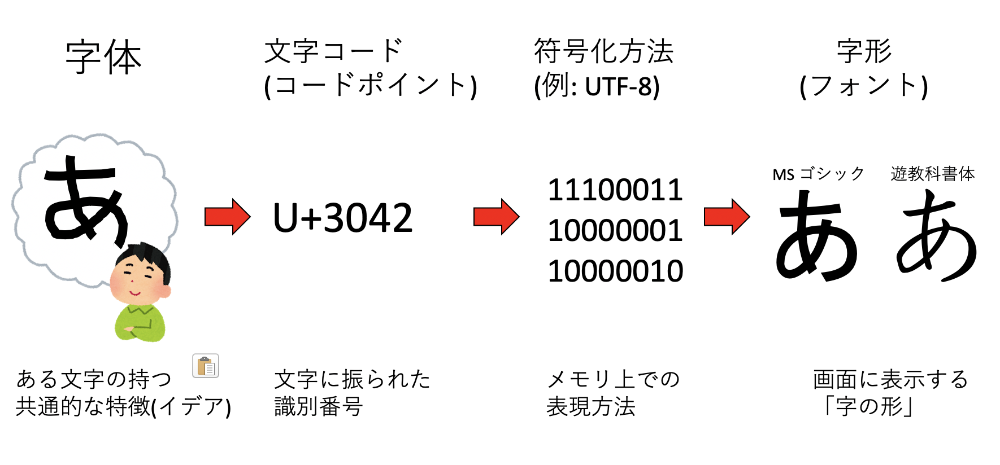
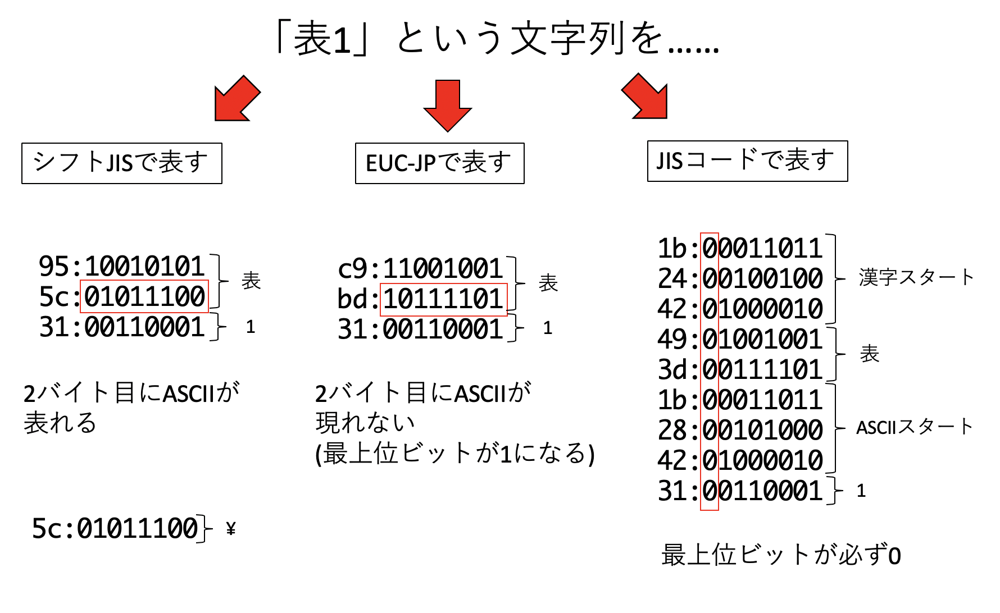
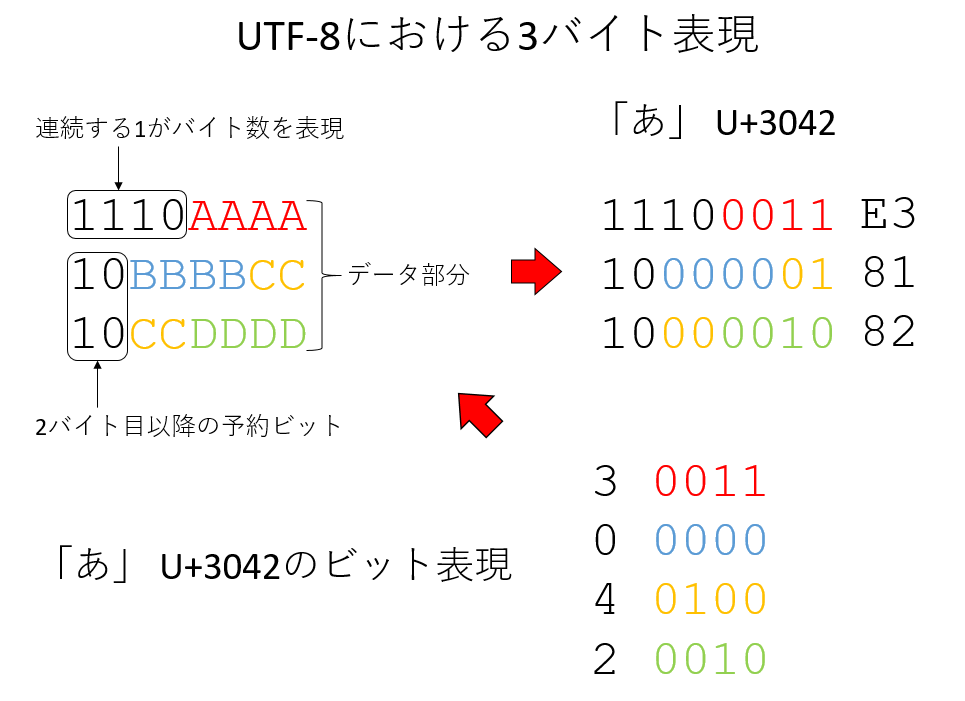
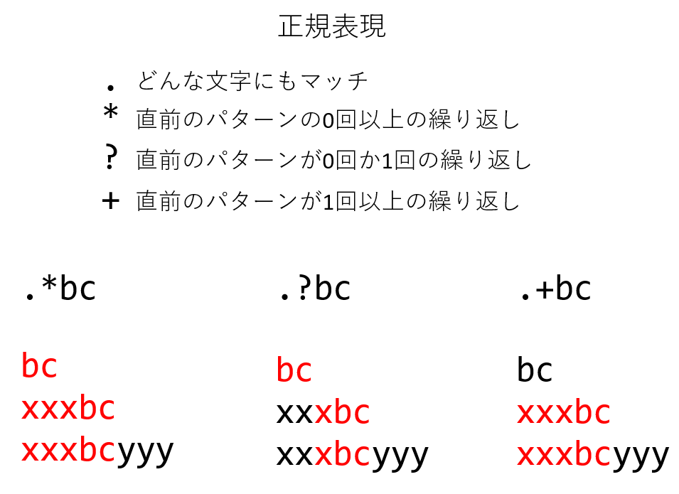
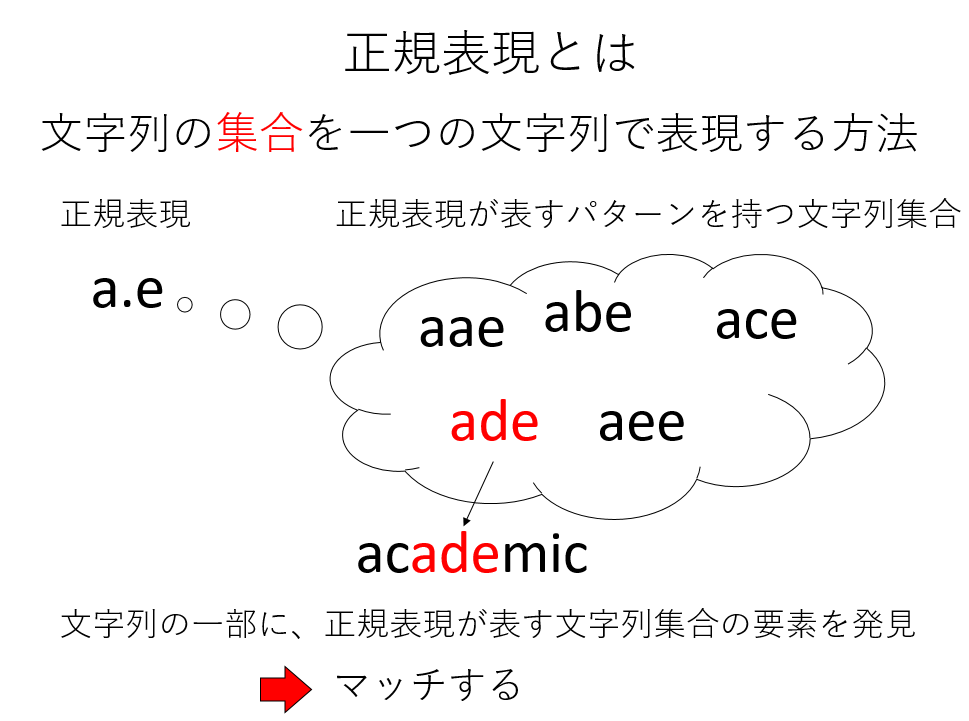

# 文字列処理

## 本講で学ぶこと

* 文字列処理
* 辞書
* 正規表現
* 形態素解析
* ワードクラウド

## 文字列と文字コード

### 文字とはなにか

今回は文字列処理を扱う。文字列処理とは文字列を何か処理することであり、文字列とは文字の列であるから、文字列処理のためには、「そもそも文字とは何か」を知らなければならない。プログラムの世界において「文字とは何か？」は極めて非自明で難しい問題であり、筆者もきちんと説明できる自信がない。ここでの説明は必ずしも実際の歴史に沿っていないことに注意されたい。

例えば今、画面上に「あ」というひらがなが表示されているとしよう。計算機が扱えるのは数字だけである。したがって、メモリ上になんらかの数字が格納されており、それを処理することで画面に対応する文字が表示される仕組みがある。以前、「型」とはメモリ上のデータをどのように表現するかを約束する役割があると学んだ。例えば`test`という文字列は、メモリ上では「0x74 65 73 74」という4バイトの文字列として表現される。このように、アルファベットや数字は、7ビットの数字で表現される。7ビットの情報が表現できるのは$2^7$個、すなわち128個までである。アルファベットの大文字小文字、数字、記号などはこれで収めることができる。これらを**ASCII (American Standard Code for Information Interchange、アスキー)** 文字、ASCII文字に対応する「数字」を **ASCIIコード (ASCII code)** と呼ぶ。メモリに格納されるのはアスキーコードである。

さて、計算機で日本語、すなわちひらがなやカタカナ、漢字を表示したい、というニーズがある。どうすればよいだろうか？そのためには、なんらかの方法で文字に数字を割り当てなければならない。そして、割り当てた数字をメモリに格納する必要がある。さらに、文字を表示するためには、「どの文字がどんな形をしているか」を計算機が知っていなければならない。以上の概念をまとめてみよう。



まず、我々が「あ」文字を思い浮かべる時、もしかしたら自分の思い浮かべている「あ」と他人の思い浮かべている「あ」の形は違うかもしれない。しかし、紙に書かれた「あ」を見れば、よほど汚い字でなければ誰もが「あ」であると認識するであろう。このように「ある文字の持つ共通的な特徴」を **字体 (glyph)** と呼ぶ。言ってみれば字体は「字のイデア」である。

次に、その字体になんらかの番号を振る必要がある。日本語はひらがな、カタカナ、漢字と多くの文字を持つので、使う番号の種類も多くなる。例えばUnicodeでは、日本語の「あ」に3042番という番号を与え、これを「U+3042」と表記する。これを **文字コード(character code)** 、もしくは **コードポイント(code point)** と呼ぶ。

コードポイントが決まったら、それをどのようにメモリに格納するかを決めなくてはいけない。これを **符号化(encoding)** と呼ぶ。文字コードと符号化方法が一体化している場合もあるが、Unicodeにおいては、UTF-8、UTF-16、UTF-32と、異なる符号化方法が用意されている。昨今のマシンの1バイトは8ビットであり、8ビットで表現できるのは256種類であるが、当然ながら日本語は256種類に入り切らないので、必然的に複数のバイト列を用いて日本語を表現することになる。例えば「あ」は、UTF-8を用いると「E3 81 82」の3バイトで表現される。

最後に、メモリに格納された文字情報をディスプレイに表示するためには、文字の形を知っている必要がある。これを字形もしくは **書体(font)** と呼ぶ。例えば計算機には多数のフォントが用意されており、「MS ゴシック」の「あ」と「遊教科書体」の「あ」は、字体は同じだが字形が異なる。

### 文字コード

日本語を表現する文字コードは、大きく分けて「JIS、シフトJIS、EUC」が存在していたが、現在はUnicode(UTF-8)に統一されつつあり、将来は文字コードの知識は不要になるかもしれない。しかし、まだUnicode以外の文字コードを使った文書がある。例えば今回扱う「青空文庫」の文字コードはシフトJISである。歴史的な意味もあるので、ここで少し文字コードについて触れておくのも良いであろう。

まず、シフトJISはMicrosoft等が規定した文字コードで、MS-DOS、そしてWindowsで採用されている。日本語を2バイトで表現するため、「2バイト文字」と呼ばれることが多い。ASCII文字と日本語が混在する文書においてもエスケープ文字を挿入しないで済むなどの利点があるが、2バイト文字の2バイト目に重要な記号(円記号もしくはバックスラッシュ)が出現することがあり、これがディレクトリの区切りやエスケープ文字と解釈されて誤動作を起こすことがあった。特に「表」という文字は、シフトJISでは`0x955c`となるが、この`5c`が円記号ないしバックスラッシュと同じアスキーコードであるため、よく文字化けの原因となった。

EUC-JPはExtended UNIX Code Packed Format for Japaneseの略であり、その名の通りUNIXで広く使われた。こちらは日本語文字の範囲が0x80 - 0xFFの範囲にある。これはビットで表現すると、最上位ビットが必ず1になっていることから、最上位ビットが0となるアスキー文字と区別がしやすかった。ただし、半角カナはシフトJISでは1バイトで表現できたが、EUC-JPでは2バイトを要し、漢字の中には3バイト必要とするものもあった。

JISコードは、正式には「ISO-2022-JP」と呼ばれ、電子メール等のために広く使われた文字コードである。こちらは、文字列を表すバイト列の最上位ビットが必ず0になる、という特徴を持っている。太古の昔、インターネットを流れる「文字列」は、最上位ビットが0でなければならない、というルールがあった。インターネットは情報を「リレー」することで世界中のどことでも通信が可能となるネットワークだが、その途中で「8ビット目を落とす」マシンがあったらしい(筆者はよく知らない)。そのため、8ビット目が0でない文字コードを使うと文字化けの原因となるため、「電子メールはISO-2022-JPを使わなければならない」というルールがあった。



このように、日本語ですら様々な文字の符号化方式があり、文字コードは混乱していた。他にも世界でそれぞれ独自のコードがあり、それらを切り替えながら表示する必要があった。特に、複数種類の文字コードが混在する文書の表示には問題があった。そこで、「世界で統一した符号化方法を作ろう」という動きが出てくるのは自然であろう。これが「ユニコード(Unicode)」である。文字コードは無限に面倒事があり、厳密な話をするのが難しいので、以下はざっくりした話だと承知されたい。まず、文字を表現するためには、「文字に背番号をつける」「背番号をつけた後で、それをどのようなバイナリに落とすか、エンコード方法を指定する」の2ステップを踏む必要がある。

ユニコードは、まず文字に背番号をつける。この背番号をコードポイントと呼ぶ。例えばひらがなの「あ」のコードポイントは3042であり、これを「U+3042」と表記する。

次に、この数字をどのようなバイナリ列に表すか(エンコード方法)だが、ここではUTF-8を例に取ろう。UTF-8では、よく使われる日本語は3バイトで表現される。UTF-8では、一番最初に「この文字を何バイトで表現するか」を、連続するビット列で表現する。例えば3バイトならば「1110」というビット列である。その後、2バイト目以降は頭の「10」が予約されており、それ以降が文字を表現するビットとなる。つまり、ビット構造としては以下のようになっている。

```txt
1110AAAA
10BBBBCC
10CCDDDD
```

AAAABBBBCCCCDDDDは、ユニコード4桁のビット表現である。例えばひらがなの「あ」は「U+3042」だが、その4つの数字をそれぞれビット表現すると、

```txt
0011
0000
0100
0010
```

これを先ほどのAAAABBBBCCCCDDDDにはめ込むと、「E3 81 82」となり、これがひらがなの「あ」、コードポイントU+3042をUTF-8で符号化したものとなる。ユニコードの符号化方法には、他にもUTF-16やUTF-32などがあるが、仕様はともかく、そのあたりの事情は入り組んでいるのでここでは深入りしない。



## 辞書

Pythonにはリストという、複数の要素をまとめるデータ構造があった。リストは、要素をインデックスと呼ばれる数字でアクセスする。すなわち、リストは「数字」と「要素」を結びつけるデータ構造であると言える。それに対して、数字以外の何かと要素を結びつけるデータ構造が **ハッシュ(hash)** である。スクリプト言語ではリストに加えて、ハッシュ、もしくは連想配列というデータ構造がデフォルトで用意されていることが多い。ハッシュはPythonでは **辞書(dictionary)** と呼ばれる。リストは、要素が順番に並んでおり、要素はインデックスでアクセスできた。それに対して、辞書は **キー(key)** と呼ばれるもので要素にアクセスする。数字、文字列の他、タプルなど様々ななものをキーにできる(キーはイミュータブルでなければならないという制約があるが、ここでは触れない)。また、リストと同様になんでも要素にできる。

### 辞書型の使い方

辞書型は中カッコ`{}`で初期化する。

```py
d = {}
```

辞書は例えば「文字列」と「整数」を結びつけることができる。

```py
d["Apple"] = 158
```

結びつけたデータは、キーを入力することで取得することができる。

```py
print(d["Apple"]) # => 158
```

初期化時にキーと要素を指定することができる。この時「キー: 値」という形で与える。

```py
d = {"Apple": 158, "Banana" : 198, "Orange" : 100}
```

数字でもタプルでもなんでもキーにすることができる。また、なんでも要素にすることができる。

```py
d[1] = "one"
d[(1,2)] = (2,4)
```

辞書に対して`for`文を回すと、キーを取得することができる。

```py
for k in d:
    print(k)
```

```txt
key
1
(1,2)
```

このキー`k`を使って、`d[k]`とすれば要素を取得することもできる。

```py
for k in d:
    print(d[k])
```

```txt
data
one
(2, 4)
```

キーと要素を両方同時に取得するには、`items()`を用いる

```py
for k,v in d.items():
    print(k,v)
```

```txt
key data
1 one
(1, 2) (2, 4)
```

### defaultdict

辞書は、「存在しないキー」を指定するとエラーになる。

```py
d["new"]
```

```txt
KeyError: 'new'
```

しかし、「存在しないキー」を指定した時に、デフォルトの値があると便利なことがある。そういう場合に使うのが`collections.defaultdict`だ。以下のようにインポートして使う。

```py
from collections import defaultdict
```

例えば、デフォルトの値として「0」を持つような辞書を作るには以下のようにする。

```py
d = defaultdict(int)
```

`defaultdict`には、「実行時に初期化する関数」を渡すことで辞書型を作るのだが、ここでは詳細は触れない。デフォルトの値として「0」を持つ辞書型を作れると、例えば「出現するものの頻度をカウントする」ことが簡単にできる。例を挙げよう。

```py
from collections import defaultdict
d = defaultdict(int)
s = "すもももももももものうち"
for c in list(s):
    d[c] += 1
for k, v in d.items():
    print(k, v)
```

```txt
す 1
も 8
の 1
う 1
ち 1
```

辞書を使って単語や何かの頻度を数えるというシチュエーションにはわりと出会うので、覚えておくと役に立つことが年に数回くらいあることだろう。

## 正規表現

正規表現(Regular expression)という言葉を聞いたことがあるだろうか。もしかしたら、身近にちょっと「つよめ」のプログラマがいて、正規表現で文字列の置換をしているのを見たことがあるかもしれない。例えば、Vim等を使っており、「#」で始まる行を削除するのに、慣れたプログラマなら以下を実行する。

```vim
:%g/^#/d
```

他にも、以下のような文章があったとしよう。

```py
text = '隴西《ろうさい》の李徴《りちょう》は博学｜才穎《さいえい》、天宝の末年、若くして名を虎榜《こぼう》に連ね、ついで江南尉《こうなんい》に補せられたが、性、狷介《けんかい》、自《みずか》ら恃《たの》むところ頗《すこぶ》る厚く、賤吏《せんり》に甘んずるを潔《いさぎよ》しとしなかった。'
```

これは中島敦という作家の「山月記」という小説の冒頭だが、途中で「《...》」という形でルビが降ってある。これをテキストから削除したいとしよう。ナイーブに実装するなら

* 文字を一文字ずつ処理し
* 《と》に囲まれた状態であるかを判定し
  * 囲まれた状態ならスキップ
  * 囲まれていなければ表示する

といったアルゴリズムになるだろう。例えばプログラムは以下のようになる。

```py
in_bracket = False
for s in list(text):
    if in_bracket:
        if s == '》':
            in_bracket = False
        continue
    if s == '《':
        in_bracket = True
        continue
    print(s, end="")
print()
```

しかし、正規表現を用いると以下のように簡単に実現できる。

```py
import re
print(re.sub(r'《.*?》', '', text))
```

以下が実行結果だ。

> 隴西の李徴は博学｜才穎、天宝の末年、若くして名を虎榜に連ね、ついで江南尉に補せられたが、性、狷介、自ら恃むところ> 頗る厚く、賤吏に甘んずるを潔しとしなかった。

これらに出てきた呪文のような文字列「`^#`」や「`《.*?》`」が正規表現である。文字列処理をする上で、正規表現は欠かせない。正規表現を使えるとちょっとかっこいい(※個人の感想です)ので、ぜひマスターしよう。

正規表現には、 **マッチ(match)** という概念がある。文字列をパターンとして与え、入力文字列の中でそのパターンにマッチする場所を探す、というのが正規表現の基本動作となる。例えば、文字列そのものは、同じ文字列にマッチする。マッチする場所を探すには、`re`モジュールの`search`を用いる。

```py
text = 'hanamogera'
m = re.search(r'moge', text)
```

上記の例は、「hanamogera」という文字列から、「moge」という文字列を探せ、という命令である。正規表現を表す文字列の頭には`r`をつけるが、ここでは深入りしないので、そういうものだと思っていて欲しい。`search`はマッチした場合、Matchオブジェクトを返すが、その`span()`メソッドによりマッチした場所がわかる。

```py
m.span() # => (4, 8)
```

`span()`はマッチした場所をタプルとして返すため、それを使って部分文字列を抜き出すことができる。

```py
s, e = m.span()
text[s:e] # => 'moge'
```

もしくは単に、`group()`でマッチした文字列を取り出すこともできる。

```py
m.group() # => 'moge'
```

`group()`を用いると、グループ化させた場合、それぞれのグループにアクセスできるのだが、ここでは詳細には立ち入らない。

さて、より柔軟なパターン検索のために、正規表現には様々な特殊な文字、 **メタ文字(metacharacter)** が用意されている。まずよく使うのが「どのような一文字にでもマッチする」メタ文字、「`.`」である。例えば「`.bc`」というパターンは、「`abc`」という文字列にも「`xbc`」という文字列にもマッチする。

次によく使うのが、繰り返しを表す「`*?+`」だ。それぞれ以下のような意味を持つ。

* `*` 直前のパターンが0回以上繰り返す場合にマッチ
* `?` 直前のパターンが0回か1回だけの場合にマッチ
* `+` 直前のパターンが1回以上繰り返すマッチ

正規表現にはこれらのメタ文字が頻出するため、一見「呪文」のように見えるが、ゆっくり読み解いていけば難しくはない。いくつか例を挙げよう。

* 「`.*bc`」: なんでも良いが、何か文字が0個以上あり、その後「bc」という文字列が続くような文字列。
  * `bc` → `bc`にマッチ
  * `xxxbc` → `xxxbc`にマッチ
  * `xxxbcyyy` → `xxxbc`にマッチ
* 「`.?bc`」：なんでも良いが、何か文字が0個か1個あり、その後「bc」という文字列が続くような文字列。
  * `bc` → `bc`にマッチ
  * `xxxbc` → `xbc`にマッチ
  * `xxxbcyyy` → `xbc`にマッチ
* 「`.+bc`」：なんでも良いが、何か文字が1個以上、その後「bc」という文字列が続くような文字列。
  * `bc` → マッチしない
  * `xxxbc` → `xxxbc`にマッチ
  * `xxxbcyyy` → `xxxbc`にマッチ



他によく使うメタ文字は「行頭」と「行末」を表す`^`と`$`である。例を挙げよう。

* `^#.*`: 文頭に「#」があり、それ以後は何があっても良いような文字列。
  * `#hoge fuga` →  `#hoge fuga`にマッチ
  * `hoge #fuga` → 文頭に`#`が無いのでマッチしない
* `fuga$`: 文末に`fuga`があるような文字列
  * `hoge fuga` → `fuga`にマッチ
  * `fuga hoge` → マッチしない

正規表現には他にも様々なメタ文字や機能が存在するがここでは深入りしない。興味を持ったら調べてみて欲しい。



正規表現とは、一言でいえば「あるパターンを持つ文字列の集合を、一つの文字列で表現する手段」のことである。ここで、正規表現について覚える必要は全くない。ただ、正規表現で表された文字列が、多数の文字列を含む文字列集合を表現しており、その文字列集合の一つを発見した時に「マッチする」と呼ぶ、とぼんやり覚えておけばよい。

正規表現がよく使われるのは置換である。特定の文字列にマッチした場合、マッチした部分を別の文字列に置換したい、ということがよくある。この時、`re`モジュールの`sub`を用いる。`sub`は、置換したい文字列のパターン、置換文字列、入力文字列を与える。最初の例を見てみよう。

```py
import re
text = '隴西《ろうさい》の李徴《りちょう》は博学｜才穎《さいえい》、天宝の末年、若くして名を虎榜《こぼう》に連ね、ついで江南尉《こうなんい》に補せられたが、性、狷介《けんかい》、自《みずか》ら恃《たの》むところ頗《すこぶ》る厚く、賤吏《せんり》に甘んずるを潔《いさぎよ》しとしなかった。'
print(re.sub(r'《.*?》','',text))
```

これは、「《と》に囲まれた文字列」にマッチし、それを空文字列''に置換、すなわち削除することで、ルビの情報を削除している。ただし、`《.*》`とすると最初の《から最後の》までマッチしてしまうので、`?`をつけて最短マッチを指定している。

## ワードクラウド

文字列処理を利用し、ワードクラウドを作ってみよう。ワードクラウドとはタグクラウドとも呼ばれ、文中の出現頻度の高い単語を強調して表示しつつ、多くの単語を詰め込んで、重要なキーワードをわかりやすく可視化する手法である。例えば、本書の最初の「Pythonの概要とGoogle Colabの使い方」の文章から単語を取り出してワードクラウドを作るとこんな感じになる。


単語を羅列しているだけなのだが、重要な単語が大きく強調されており、なんとなく文章のキーワードが読み取れる気がしてくるであろう。本書では、青空文庫からテキストを取得してワードクラウドを作成してみよう。

## 文字列処理：課題

### 課題1：形態素解析

ウェブから情報を取得し、形態素解析をしてみよう。形態素解析とは、与えられた文章を意味を持つ言葉の最小単位(形態素)に分解することだ。ここでは「[青空文庫](https://www.aozora.gr.jp/)」からテキストを取得し、そのテキストを解析してみる。青空文庫は著作権が消滅した作品か、著者が許諾している作品のテキストをウェブ上に公開している電子図書館である。

具体的な作業は以下の通りである。

* 青空文庫から、zipファイルをダウンロードする
* zipファイルを展開し、文字コードを変換する
* MeCabを使って形態素解析し、一般名詞のみを取り出す
* 一般名詞の頻度分布を取得し、利用頻度トップ10を出力する

このようにウェブから何か情報を抽出する技術を **ウェブスクレイピング (Web scraping)**と呼ぶ。今回の作業は、ウェブスクレイピングのうちもっとも単純なものである。

**注意**：ウェブスクレイピングは、相手のサーバに負担がかからないように注意しながら行うこと。例えば「指定のパス以下のファイルをすべて取得する」といった作業は厳禁である。また、利用規約によってそもそもウェブスクレイピングが禁止されているサービスもある(例えばTwitterなど)。その場合はサービスが提供しているAPIを通じて情報を取得することが多い。

新しいノートブックを開き、`aozora.ipynb`として保存し、以下の課題を実行せよ。

#### 1. aptitudeのインストール

まず、Debianのパッケージ管理ソフトウェアであるaptitudeをインストールする。最初のセルに以下を入力、実行せよ。冒頭の「!」を忘れないこと。

```py
!apt install aptitude
```

最後に「Processing triggers for libc-bin ...」などと表示され、実行が終了したら完了である。

#### 2. MeCabのインストール

次に、先程インストールしたaptitudeを使ってMeCabと必要なライブラリをインストールする。最後の`-y`を忘れないように。

```py
!aptitude install git make curl xz-utils file -y
!aptitude install mecab libmecab-dev mecab-ipadic-utf8 -y
```

出力の最後に

```txt
done!
Setting up mecab-jumandic (7.0-20130310-4) ...
```

などと表示されれば完了である。

#### 3. MeCabのPythonバインディングのインストール

最後に、MeCabのPythonバインディングをインストールする。

```py
!pip install mecab-python3==0.7
```

最新版は不具合があるようなので、バージョン0.7を指定してインストールする。

```txt
Successfully installed mecab-python3-0.7
```

と表示されれば完了である。

#### 4. MeCabのインポート

先程まででインストールしたライブラリを早速importしてみよう。

```py
import MeCab
```

これを実行してエラーがでなければインストールに成功している。

#### 5. 形態素解析のテスト

次のセルに以下を入力してみよう。

```py
m = MeCab.Tagger()
print(m.parse("すもももももももものうち"))
```

品詞情報が出力されれば形態素解析に成功している。

### 課題2：青空文庫からのデータ取得

青空文庫のデータを取得して解析する。同じノートブックに続けてプログラムを書くこと。

#### 6. ライブラリのインポート

追加で必要なライブラリをインポートしよう。

```py
from collections import defaultdict
import re
import io
import urllib.request
from zipfile import ZipFile
```

#### 7. ウェブからデータ取得する関数

次のセルに、ウェブからデータを取得する関数`load_from_url`を以下のように実装せよ。

```py
def load_from_url(url):
    data = urllib.request.urlopen(url).read()
    zipdata = ZipFile(io.BytesIO(data))
    filename = zipdata.namelist()[0]
    text = zipdata.read(filename).decode("shift-jis")
    text = re.sub(r'［.*?］', '', text)
    text = re.sub(r'《.*?》', '', text)
    return text
```

ファイルをダウンロードし、zipを展開してから正規表現による文字列処理を行っている。ここで、正規表現に入力するカギカッコは、それぞれ`［］`全角の角カッコと、`《》`全角の二重山括弧であることに注意。どちらも日本語入力モードで`「`や`」`を変換すると候補に出てくると思われる。ここで出てくる正規表現の意味は、「全角の角カッコや二重山括弧に囲まれた文字列を削除せよ」である。それぞれ注釈やルビに対応する。

#### 8. 青空文庫からのデータ取得テスト

`load_from_url`を実装して実行したら、以下を入力、実行せよ。

```py
URL = "https://www.aozora.gr.jp/cards/000119/files/624_ruby_5668.zip"
text = load_from_url(URL)
text.split()[0]
```

以下のようにタイトルが出力されれば成功である。

`山月記`

これは、中島敦という作家の「山月記」という小説である。

#### 9. 出現頻度解析をする関数

ではいよいよ形態素解析をしてみよう。といってもMeCabを使えば楽勝である。MeCabを使って、文中に出現する名詞の出現頻度トップ10を抽出してみよう。以下を入力せよ。

```py
def show_top10(text):
    m = MeCab.Tagger()
    node = m.parseToNode(text)
    dic = defaultdict(int)
    while node:
        a = node.feature.split(",")
        key = node.surface
        if a[0] == u"名詞" and a[1] == u"一般" and key != "":
            dic[key] += 1
        node = node.next
    for k, v in sorted(dic.items(), key=lambda x: -x[1])[0:10]:
        print(k + ":" + str(v))
```

#### 10. 出現頻度解析の実行

テキストをダウンロードし、形態素解析をしてみよう。以下を入力、実行せよ。

```py
URL = "https://www.aozora.gr.jp/cards/000119/files/624_ruby_5668.zip"
text = load_from_url(URL)
show_top10(text)
```

文章に使われている一般名詞の頻度トップ10が、回数とともに出力されたはずである。

### 課題2：ワードクラウド

先程得られた青空文庫の単語リストを使って、青空文庫のワードクラウドを作ってみよう。

#### 11. フォントのインストール

日本語表示に使うフォント(IPAゴシック)をインストールする。

```py
!apt-get -y install fonts-ipafont-gothic
```

```txt
Processing triggers for fontconfig (2.12.6-0ubuntu2) ...
```

と表示されれば成功である。

#### 12. ライブラリのインポート

必要な追加ライブラリをインポートする。

```py
import IPython
from wordcloud import WordCloud
```

#### 13. 名詞を抽出する関数

WordCloundに入力するデータは、半角空白で区切られた文字列である。そこで、与えられた文章を解析して、一般名詞だけを空白文字列を区切り文字としてつないだ文字列を返す関数、`get_words`を実装しよう。`return w`のインデント位置(`while`と同じ高さ)に気をつけよ。

```py
def get_words(text):
    w = ""
    m = MeCab.Tagger()
    node = m.parseToNode(text)
    while node:
        a = node.feature.split(",")
        if a[0] == u"名詞" and a[1] == u"一般":
            w += node.surface + " "
        node = node.next
    return w
```

#### 14. ワードクラウドの作成

ではいよいよワードクラウドを作ろう。以下を入力、実行せよ。上から14番目のセルになるはずである。

```py
URL = "https://www.aozora.gr.jp/cards/000119/files/624_ruby_5668.zip"
text = load_from_url(URL)
words = get_words(text)
fpath='/usr/share/fonts/opentype/ipafont-gothic/ipagp.ttf'
wc = WordCloud(background_color="white", width=480, height=320, font_path=fpath)
wc.generate(words)
wc.to_file("wc.png")
IPython.display.Image("wc.png")
```

日本語表示のため、フォントの場所を指定してやる必要があることに注意。しかし、あとは`WordCloud`が勝手にやってくれる。実際にワードクラウドが出力されれば成功である。

### 発展課題：自分の好きな小説でワードクラウド

青空文庫で好きな小説を探し、ワードクラウドを作成して、その感想を述べよ。

「小説名　青空文庫」で検索し、出てきたページの下の方にある「図書カード」のリンクをたどると、「ファイルのダウンロード」の箇所に「テキストファイル(ルビあり)」というzipファイルがあるはずである。ブラウザによるが、右クリックで「リンクのアドレスをコピー」できるはずなので、それをURLに指定してやってみよ。

例えば中島敦の「名人伝」ならば、

```py
URL = "https://www.aozora.gr.jp/cards/000119/files/621_ruby_661.zip"
```

として実行してみよう。実行の度に結果は変わるが、おそらく中央に大きく「名人」と表示されたことと思う。

どうしても小説が思いつかない場合は、以下から選んで良い。

* 「[学問のすすめ](https://www.aozora.gr.jp/cards/000296/card47061.html)」(福沢 諭吉)
  * [`https://www.aozora.gr.jp/cards/000296/files/47061_ruby_28378.zip`](https://www.aozora.gr.jp/cards/000296/files/47061_ruby_28378.zip)
* 「[走れメロス](https://www.aozora.gr.jp/cards/000035/card1567.html)」(太宰治)
  * [`https://www.aozora.gr.jp/cards/000035/files/1567_ruby_4948.zip`](https://www.aozora.gr.jp/cards/000035/files/1567_ruby_4948.zip)
* 「[吾輩は猫である](https://www.aozora.gr.jp/cards/000148/card789.html)」(夏目 漱石)
  * [`https://www.aozora.gr.jp/cards/000148/files/789_ruby_5639.zip`](https://www.aozora.gr.jp/cards/000148/files/789_ruby_5639.zip)

レポートには、自分が選んだ小説の作者とタイトル、そして出てきたワードクラウドを貼り付け、簡単な感想を書くこと。

## 余談：国際化は難しい

スマホアプリを作って公開したら人気が出たとしよう。せっかくだから全世界に展開したい。その時に直面するのが国際化対応である。英語でInternationalizationと呼ぶが、20文字と長いので中間の18文字を略して「I18N」と呼ぶ。少しでも経験のある人は「I18Nは悪夢だ」と思うであろう。まず、文字コードはどうするのか？日本語だけでも文字コードは何種類もあるのだ。面倒だからUnicodeしかサポートしない？よろしい。でも地獄はここからだ。

有名なところでは、アラビア語は「右から左」に文字を書く。メニューなどが左寄せになっている場合、アラビア語に対応するためには「右寄せ」にしなければならない。Twitterにアカウントを持っている人は`https://twitter.com/home?lang=ar`にアクセスしてみよ。左右が反転するのがわかるだろう。

数詞も頭が痛い問題だ。英語には単数、複数の区別があることは知っているであろう。例えばある検索条件で何個ファイルを見つけたかを表示したい場合、

```py
if files == 1:
    print("Found a file.")
else:
    print(f"Found {files} files.")
```

などと書きたくなる。しかし、たとえはポーランド語の数詞はもっとややこしい。ポーランド語で「a file」は「pilk」だ。ではGoogle翻訳で「英語」から「ポーランド語」の翻訳にして、

```txt
a file.
2 files.
5 files.
22 files.
25 files.
```

を翻訳してみよ。

```txt
plik.
2 pliki.
5 plików.
22 pliki.
25 plików.
```

となるはずだ。ここから「31 files.」や「32 files.」はどうなるか予想できるだろうか？101や102は？今コンピュータで日本語が使えるのも先人たちの血のにじむような努力あってのことだ。「○○はおかしい」「○○は非合理的だ」などと思ってはならない。国際化とは、まず世界の多様性を認めることからスタートしなければならない。

参考：[ぼくたちのかんがえたさいきょうのi18n国家](https://qiita.com/yugui/items/55f2529c5a731badeff7)