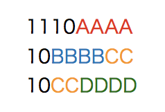

# 文字列処理

## 本講で学ぶこと

* 文字列処理
* 辞書
* 正規表現
* 形態素解析
* ワードクラウド

## 文字列と文字コードについて

本稿では文字列処理を扱う。文字列処理とは文字列を何か処理することであり、文字列とは文字の列であるから、文字列処理のためには、「そもそも文字とは何か」を知らなければならない。プログラムの世界において「文字とは何か？」は極めて非自明な問題であり、筆者もきちんと説明できる自信がない。ここでの説明は必ずしも実際の文字コードの歴史に沿っていないことに注意されたい。

「型」の項目で、「型」とはメモリ上のデータをどのように表現するかを約束する役割があると学んだ。例えば`test`という文字列は、メモリ上では「0x74 65 73 74」という4バイトの文字列として表現される。このように、アルファベットや数字は、7ビットの数字で表現される。7ビットの情報が表現できるのは2^7個、すなわち128個までである。アルファベットの大文字小文字、数字、記号などはこれで収めることができる。これらをASCII (American Standard Code for Information Interchange、アスキー)文字と呼ぶ。

さて、計算機で日本語、すなわちひらがなやカタカナ、漢字を表示したい、というニーズがある。どうすればよいだろうか？そのためには、なんらかの方法で文字に数字を割り当てなければならない。昨今のマシンの1バイトは8ビットであり、8ビットで表現できるのは256種類であるが、当然ながら日本語は256種類に入り切らないので、必然的に複数のバイト列を用いて日本語を表現することになる。

日本語を表現する文字コードは、大きく分けて「JIS、シフトJIS、EUC」が存在していたが、現在はUnicode(UTF-8)に統一されつつあり、将来は文字コードの知識は不要になるかもしれない。しかし、まだUnicode以外の文字コードを使った文書がある(例えば本稿で扱う「青空文庫」の文字コードもシフトJISである)し、歴史的な意味もあるので、ここで少し文字コードについて学んでおくのも良いであろう。

まず、シフトJISはMicrosoft等が規定した文字コードで、日本語を2バイトで表現する。「二バイト文字」と呼ばれる所以である。MS-DOS、そしてWindowsで採用されている。ASCII文字と日本語が混在する文書においてもエスケープ文字を挿入しないで済むなどの利点があるが、2バイト文字の2バイト目に重要な記号(円記号もしくはバックスラッシュ)が出現することがあり、これがディレクトリの区切りやエスケープ文字と解釈されて誤動作を起こすことがあった。特に「表」という文字は、シフトJISでは「0x95 5c」となるが、この「5c」が円記号ないしバックスラッシュと同じアスキーコードであるため、よく文字化けの原因となった。

EUC-JPはExtended UNIX Code Packed Format for Japaneseの略であり、その名の通りUNIXで広く使われた。こちらは日本語文字の範囲が0x80 - 0xFFの範囲にある。これはビットで表現すると、最上位ビットが1になっていることから、最上位ビットが0となるアスキー文字と区別がしやすかった。ただし、半角カナはシフトJISでは1バイトで表現できたが、EUC-JPでは2バイトを要し、漢字の中には3バイト必要とするものもあった。

JISコードは、正式には「ISO-2022-JP」と呼ばれ、電子メール等のために広く使われた文字コードである。こちらは、文字列を表すバイト列の最上位ビットが必ず0になる、という特徴を持っている。太古の昔、インターネットを流れる「文字列」は、最上位ビットが0でなければならない、というルールがあった。インターネットは情報を「リレー」することで世界中のどこにでも通信が可能となるネットワークだが、その途中で「8ビット目を落とす」マシンがあったらしい(筆者はよく知らない)。そのため、8ビットが0でない文字コードを使うと文字化けの原因となるため、「電子メールはISO-2022-JPを使わなければならない」というルールがあった。


このように、日本語ですら様々な文字の符号化方式があり、文字コードは混乱していた。他にも世界でそれぞれ独自のコードがあり、それらを切り替えながら表示する必要があった。特に、複数種類の文字コードが混在する文書の表示には問題があった。そこで、「世界で統一した符号化方法を作ろう」という動きが出てくるのは自然であろう。これが「ユニコード(Unicode)」である。

文字コードは無限に面倒事があり、厳密な話をするのが難しいので、以下はざっくりした話だと承知されたい。まず、文字を表現するためには、「文字に背番号をつける」「背番号をつけた後で、それをどのようなバイナリに落とすか、エンコード方法を指定する」の2ステップを踏む必要がある。

ユニコードは、まず文字に背番号をつける。この背番号をコードポイントと呼ぶ。例えばひらがなの「あ」のコードポイントは3042であり、これを「U+3042」と表記する。

次に、この数字をどのようなバイナリ列に表すか(エンコード方法)だが、ここではUTF-8を例に取ろう。UTF-8では、よく使われる日本語は3バイトで表現される。UTF-8では、一番最初に「この文字を何バイトで表現するか」を、連続するビット列で表現する。例えば3バイトならば「1110」というビット列である。その後、2バイト目以降は頭の「10」が予約されており、それ以降が文字を表現するビットとなる。つまり、ビット構造としては以下のようになっている。



AAAABBBBCCCCDDDDは、ユニコード4桁のビット表現である。例えばひらがなの「あ」は「U+3042」なので、それぞれをビットにバラしてはめ込むと、


TODO: この二つの図を一枚にマージ

となる。これは16進数になおすと「E3 81 82」となり、これが「あ」をUTF-8で符号化したものとなる。ユニコードの符号化方法には、他にもUTF-16やUTF-32などがあるが、仕様はともかく、そのあたりの事情は入り組んでいるのでここでは深入りしない。

## 辞書

TODO: 辞書の説明

TODO: defaultdictの導入

## 正規表現

正規表現(Regular expression)という言葉を聞いたことがあるだろうか。もしかしたら、身近にちょっと「つよめ」のプログラマがいて、正規表現で文字列の置換をしているのを見たことがあるかもしれない。例えば、Vim等を使っており、「#」で始まる行を削除するのに、慣れたプログラマなら以下を実行する。

```vim
:%g/^#/d
```

他にも、以下のような文章があったとしよう。

```py
text = '隴西《ろうさい》の李徴《りちょう》は博学｜才穎《さいえい》、天宝の末年、若くして名を虎榜《こぼう》に連ね、ついで江南尉《こうなんい》に補せられたが、性、狷介《けんかい》、自《みずか》ら恃《たの》むところ頗《すこぶ》る厚く、賤吏《せんり》に甘んずるを潔《いさぎよ》しとしなかった。'
```

これは中島敦という作家の「山月記」という小説の冒頭だが、途中で「《...》」という形でルビが降ってある。これをテキストから削除したいとしよう。ナイーブに実装するなら

* 「《」という文字列を見つけ、その場所を覚えておく
* その状態で「》」という文字列を見つけたら、先程覚えた場所からここまでの文字列を削除する
* 上記を繰り返す

といったプログラムになろう。しかし、正規表現を用いると以下のようにコマンド一発で実現できる。

```py
import re
print(re.sub(r'《.+?》','',text))
```

以下が実行結果だ。

> 隴西の李徴は博学｜才穎、天宝の末年、若くして名を虎榜に連ね、ついで江南尉に補せられたが、性、狷介、自ら恃むところ> 頗る厚く、賤吏に甘んずるを潔しとしなかった。

これらに出てきた呪文のような文字列「`^#`」や「`《.+?》`」が正規表現である。文字列処理をする上で、正規表現は欠かせない。正規表現を使えるとちょっとかっこいい(※個人の感想です)ので、ぜひマスターしよう。

正規表現は、「マッチ」という概念がある。文字列をパターンとして与え、入力文字列の中でそのパターンにマッチする場所を探す、というのが正規表現の基本動作となる。

例えば、文字列そのものは、同じ文字列にマッチする。マッチする場所を探すには、`re`モジュールの`search`を用いる。

```py
text = 'hanamogera'
m = re.search(r'moge', text)
```

上記の例は、「hanamogera」という文字列から、「moge」という文字列を探せ、という命令である。正規表現を表す文字列の頭には`r`をつけるが、ここでは深入りしないので、そういうものだと思っていて欲しい。`search`はマッチした場合、Matchオブジェクトを返すが、その`span()`メソッドによりマッチした場所がわかる。

```py
m.span() #=> (4, 8)
```

`span()`はマッチした場所をタプルとして返すため、それを使って部分文字列を抜き出すことができる。

```py
s, e = m.span()
text[s:e] #=> 'moge'
```

もしくは単に、`group()`でマッチした文字列を取り出すこともできる。

```py
m.group() #=> 'moge'
```

`group()`を用いると、グループ化させた場合、それぞれのグループにアクセスできるのだが、ここでは詳細には立ち入らない。

さて、より柔軟なパターン検索のために、正規表現には様々な特殊な文字、メタ文字がある。まずよく使うのが「どのような一文字にでもマッチする」メタ文字、「`.`」である。

例えば「`.bc`」というパターンは、「`abc`」という文字列にも「`xbc`」という文字列にもマッチする。

次によく使うのが、繰り返しを表す「`*?+`」だ。それぞれ以下のような意味を持つ。

* `*` 直前のパターンが0回以上繰り返す場合にマッチ
* `?` 直前のパターンが0回か1回だけの場合にマッチ
* `+` 直前のパターンが1回以上マッチする場合

正規表現にはこれらのメタ文字が頻出するため、一見「呪文」のように見えるが、ゆっくり読み解いていけば難しくはない。

いくつか例を挙げよう。

* 「`.*bc`」: なんでも良いが、何か文字が0個以上あり、その後「bc」という文字列が続くような文字列。
  * `bc` => `bc`にマッチ
  * `xxxbc` => `xxxbc`にマッチ
  * `xxxbcyyy` => `xxxbc`にマッチ
* 「`.?bc`」：なんでも良いが、何か文字が0個か1個あり、その後「bc」という文字列が続くような文字列。
  * `bc` => `bc`にマッチ
  * `xxxbc` => `xbc`にマッチ
  * `xxxbcyyy` => `xxxbc`にマッチ
* 「`.+bc`」：なんでも良いが、何か文字が1個以上、その後「bc」という文字列が続くような文字列。
  * `bc` => マッチしない
  * `xxxbc` => `xxxbc`にマッチ
  * `xxxbcyyy` => `xxxbc`にマッチ

TODO: 上記三つの例を図解すること

他によく使うメタ文字は「行頭」と「行末」を表す`^`と`$`である。例を挙げよう。

* `^#.*`: 文頭に「#」があり、それ以後は何があっても良いような文字列。
  * `#hoge fuga` =>  `#hoge fuga`にマッチ
  * `hoge #fuga` => 文頭に`#`が無いのでマッチしない
* `fuga$`: 文末に`fuga`があるような文字列
  * `hoge fuga` => `fuga`にマッチ
  * `fuga hoge` => マッチしない

正規表現には他にも様々なメタ文字や機能が存在するが、ここでは深入りしない。興味を持ったら各自調べてみること。

正規表現がよく使われるのは置換である。特定の文字列にマッチした場合、マッチした部分を別の文字列に置換したい、ということがよくある。この時、`re`モジュールの`sub`を用いる。`sub`は、置換したい文字列のパターン、置換文字列、入力文字列を与える。最初の例を見てみよう。

```py
import re
text = '隴西《ろうさい》の李徴《りちょう》は博学｜才穎《さいえい》、天宝の末年、若くして名を虎榜《こぼう》に連ね、ついで江南尉《こうなんい》に補せられたが、性、狷介《けんかい》、自《みずか》ら恃《たの》むところ頗《すこぶ》る厚く、賤吏《せんり》に甘んずるを潔《いさぎよ》しとしなかった。'
print(re.sub(r'《.+?》','',text))
```

これは、「《と》に囲まれた文字列」にマッチし、それを空文字列''に置換、すなわち削除することで、ルビの情報を削除している。

## ワードクラウド

形態素解析を利用してワードクラウドを作ってみよう。ワードクラウドとはタグクラウドとも呼ばれ、文中の出現頻度の高い単語を強調して表示しつつ、多くの単語を詰め込んで、重要なキーワードをわかりやすく可視化する手法である。例えば、本講義の最初の「Pythonの概要とGoogle Colabの使い方」の文章から単語を取り出してワードクラウドを作るとこんな感じになる。


単語を羅列しているだけなのだが、重要な単語が大きく強調されており、なんとなく文章のキーワードが読み取れる気がしてくるであろう。本講義では、青空文庫からテキストを取得し、形態素解析を行ってワードクラウドを作成する。

# 文字列処理：課題

## 課題1：形態素解析

ウェブから情報を取得し、解析してみよう。ここでは「[青空文庫](https://www.aozora.gr.jp/)」からテキストを取得し、そのテキストを解析してみる。青空文庫は著作権が消滅した作品か、著者が許諾している作品のテキストをウェブ上に公開している電子図書館である。

具体的な作業は以下の通りである。

* 青空文庫から、zipファイルをダウンロードする
* zipファイルを展開し、文字コードを変換する
* MeCabを使って形態素解析し、一般名詞のみを取り出す
* 一般名詞の頻度分布を取得し、利用頻度トップ10を出力する

このようにウェブから何か情報を抽出する技術を **ウェブスクレイピング (Web scraping)**と呼ぶ。今回の作業は、ウェブスクレイピングのうちもっとも単純なものである。

**注意**：ウェブスクレイピングは、相手のサーバに負担がかからないように注意しながら行うこと。例えば「指定のパス以下のファイルをすべて取得する」といった作業は厳禁である。また、利用規約によってそもそもウェブスクレイピングが禁止されているサービスもある(例えばTwitterなど)。その場合はサービスが提供しているAPIを通じて情報を取得することが多い。

### 課題1-1：MeCabのインストール

MeCabをインストールし、実行確認しよう。以下、数字がセルの番号に対応している。

#### 1. aptitudeのインストール

まず、Debianのパッケージ管理ソフトウェアであるaptitudeをインストールする。新しいPython3ノートブックを開き、最初のセルに以下を入力、実行せよ。冒頭の「!」を忘れないこと。

```py
!apt install aptitude
```

最後に「Processing triggers for libc-bin (2.27-3ubuntu1) ...」などと表示され、実行が終了したら完了である。

#### 2. MeCabのインストール

次に、先程インストールしたaptitudeを使ってMeCabと必要なライブラリをインストールする。最後の`-y`を忘れないように。

```py
!aptitude install mecab libmecab-dev mecab-ipadic-utf8 git make curl xz-utils file -y
```

出力の最後に

```sh
done!
Setting up mecab-jumandic (7.0-20130310-4) ...
```

などと表示されれば完了である。

#### 3. MeCabのPythonバインディングのインストール

最後に、MeCabのPythonバインディングをインストールする。

```sh
!pip install mecab-python3==0.7
```

最新版は不具合があるようなので、バージョン0.7を指定してインストールする。

```sh
Successfully installed mecab-python3-0.7
```

と表示されれば完了である。

#### 4. MeCabのインポート

先程まででインストールしたライブラリを早速importしてみよう。

```py
import MeCab
```

これを実行してエラーがでなければインストールに成功している。

#### 5. 形態素解析のテスト

次のセルに以下を入力してみよう。

```py
m = MeCab.Tagger()
print(m.parse ("すもももももももものうち"))
```

以下のような実行結果が得られれば形態素解析に成功である。

```txt
すもも   名詞,一般,*,*,*,*,すもも,スモモ,スモモ
も      助詞,係助詞,*,*,*,*,も,モ,モ
もも    名詞,一般,*,*,*,*,もも,モモ,モモ
も      助詞,係助詞,*,*,*,*,も,モ,モ
もも    名詞,一般,*,*,*,*,もも,モモ,モモ
の      助詞,連体化,*,*,*,*,の,ノ,ノ
うち    名詞,非自立,副詞可能,*,*,*,うち,ウチ,ウチ
EOS
```

### 課題1-2：青空文庫からのデータ取得

ノートブックの上のメニューから「編集」「すべてのセルを選択」を実行し、その後「編集」「選択したセルを削除」を実行することで、全てのセルを削除せよ。この状態でもMeCabはインストールされたままである。

#### 1. ライブラリのインポート

「+コード」をクリックして現れた最初のセルに、以下を入力、実行せよ。

```py
from collections import defaultdict
import re
import io
import urllib.request
from zipfile import ZipFile
import MeCab
```

#### 2. ウェブからデータ取得する関数

次のセルに、ウェブからデータを取得する関数`load_from_url`を以下のように実装せよ。

```py
def load_from_url(url):
    data = urllib.request.urlopen(url).read()
    zipdata = ZipFile(io.BytesIO(data))
    filename = zipdata.namelist()[0]
    text = zipdata.read(filename).decode("shift-jis")
    text = re.sub(r'［.+?］', '', text)
    text = re.sub(r'《.+?》', '', text)
    return text
```

ファイルをダウンロードし、zipを展開してから正規表現による文字列処理を行っている。ここで、正規表現に入力するカギカッコは、それぞれ`［］`全角の角カッコと、`《》`全角の二重山括弧であることに注意。どちらも日本語入力モードで`「`や`」`を変換すると候補に出てくると思われる。ここで出てくる正規表現の意味は、「全角の角カッコや二重山括弧に囲まれた文字列を削除せよ」である。それぞれ注釈やルビに対応する。

#### 3. 青空文庫からのデータ取得

`load_from_url`を実装して実行したら、以下を入力、実行せよ。

```py
URL = "https://www.aozora.gr.jp/cards/000119/files/624_ruby_5668.zip"
text = load_from_url(URL)
text.split()[0]
```

以下のようにタイトルが出力されれば成功である。

`山月記`

これは、中島敦という作家の「山月記」という小説である。

#### 4. 出現頻度解析をする関数

ではいよいよ形態素解析をしてみよう。といってもMeCabを使えば楽勝である。MeCabを使って、文中に出現する名詞の出現頻度トップ10を抽出してみよう。四つ目のセルに以下を入力せよ。

```py
def show_top10(text):
    m = MeCab.Tagger()
    node = m.parseToNode(text)
    dic = defaultdict(int)
    while node:
        a = node.feature.split(",")
        key = node.surface
        if a[0] == u"名詞" and a[1] == u"一般":
            dic[key] += 1
        node = node.next
    for k, v in sorted(dic.items(), key=lambda x: -x[1])[0:10]:
        print(k + ":" + str(v))
```

#### 5. 出現頻度解析の実行

テキストをダウンロードし、形態素解析をしてみよう。五つ目のセルに以下を入力、実行せよ。

```py
URL = "https://www.aozora.gr.jp/cards/000119/files/624_ruby_5668.zip"
text = load_from_url(URL)
show_top10(text)
```

文章に使われている一般名詞の頻度トップ10が、回数とともに出力されたはずである。

#### 6. 別の作品の解析

別の作品も見てみよう。同じく中島敦の「名人伝」で同様な解析をしてみよう。六つ目のセルに以下を入力せよ。五つ目のセルの内容をコピペして、URLのみ修正すると楽である。

```py
URL = "https://www.aozora.gr.jp/cards/000119/files/621_ruby_661.zip"
text = load_from_url(URL)
show_top10(text)
```

読んだことがなくても、なんとなくどんな作品なのかがわかるであろう。

## 課題2：ワードクラウド

### 課題2-1：ワードクラウドの表示

先程得られた単語リストを使って、青空文庫のワードクラウドを作ってみよう。

まずは新しいPython3ノートブックを開く。この時、先程作成したノートブックを別のタブで開いておくといろいろ楽になる。

#### 1. ライブラリのインストール

最初のセルに以下を入力、実行すること、

```py
!apt install aptitude
!aptitude install mecab libmecab-dev mecab-ipadic-utf8 git make curl xz-utils file -y
!pip install mecab-python3==0.7
!apt-get -y install fonts-ipafont-gothic
```

形態素解析エンジンであるMeCabの他に、日本語表示のためのフォント(IPAゴシック)のインストールが追加されている。

#### 2. ライブラリのインポート

無事にインストールされたら、次のセルで必要なモジュールをインポートしよう。

```py
import io
import re
import urllib.request
from zipfile import ZipFile

import IPython
import MeCab
from wordcloud import WordCloud
```

正しくインストールされていれば、エラーなくインポートできるはずだ。

#### 3. ウェブからデータ取得する関数

三つ目のセルに、URLを指定してZipファイルをダウンロード、展開し、不要な部分を削除する`load_from_url`を実装しよう。先程書いたものと全く同じなので、コピペしてかまわない。

```py
def load_from_url(url):
    data = urllib.request.urlopen(url).read()
    zipdata = ZipFile(io.BytesIO(data))
    filename = zipdata.namelist()[0]
    text = zipdata.read(filename).decode("shift-jis")
    text = re.sub(r'［.+?］', '', text)
    text = re.sub(r'《.+?》', '', text)
    return text
```

#### 4. 名詞を抽出する関数

WordCloundに食わせるデータは、半角空白で区切られた文字列である。そこで、与えられた文章を解析して、一般名詞だけを空白文字列を区切り文字としてつないだ文字列を返す関数、`get_words`を実装しよう。

```py
def get_words(text):
    w = ""
    m = MeCab.Tagger()
    node = m.parseToNode(text)
    while node:
        a = node.feature.split(",")
        if a[0] == u"名詞" and a[1] == u"一般":
            w += node.surface + " "
        node = node.next
    return w
```

#### 5. ダウンロードの確認

5つ目のセルで、ダウンロードがうまくいくことを確認しよう。

```py
URL = "https://www.aozora.gr.jp/cards/000119/files/624_ruby_5668.zip"
text = load_from_url(URL)
text.split()[0]
```

「山月記」という文字列が出力されれば、ここまでは正しく実装されている。

#### 6. ワードクラウドの作成

ではいよいよワードクラウドを作ろう。六つ目のセルに以下を入力、実行せよ。

```py
fpath='/usr/share/fonts/opentype/ipafont-gothic/ipagp.ttf'
words = get_words(text)
wc = WordCloud(background_color="white", width=480, height=320, font_path=fpath)
wc.generate(words)
wc.to_file("wc.png")
IPython.display.Image("wc.png")
```

日本語表示のため、フォントの場所を指定してやる必要があることに注意。しかし、あとは`WordCloud`が勝手にやってくれる。実際にワードクラウドが出力されただろうか。

出力されたら、次は「名人伝」でやってみよう。5つ目のセルのURLを

```py
URL = "https://www.aozora.gr.jp/cards/000119/files/621_ruby_661.zip"
```

として実行し、「名人伝」と表示されて正しくデータが取れたことを確認してから、また6つ目のセルを実行してみよう。実行の度に結果は代わるが、おそらくまんなかに大きく「名人」と表示されたことと思う。

### 課題2-2：自由課題

青空文庫で好きな小説を探し、ワードクラウドを作成して、その感想を述べよ。

「小説名　青空文庫」で検索し、出てきたページの下の方にある「図書カード」のリンクをたどると、「ファイルのダウンロード」の箇所に「テキストファイル(ルビあり)」というzipファイルがあるはずである。ブラウザによるが、右クリックで「リンクのアドレスをコピー」できるはずなので、それをURLに指定してやってみよ。

どうしても小説が思いつかない場合は、以下から選んで良い。

* 「[学問のすすめ](https://www.aozora.gr.jp/cards/000296/card47061.html)」(福沢 諭吉) [https://www.aozora.gr.jp/cards/000296/files/47061_ruby_28378.zip](https://www.aozora.gr.jp/cards/000296/files/47061_ruby_28378.zip)
* 「[走れメロス](https://www.aozora.gr.jp/cards/000035/card1567.html)」(太宰治) [https://www.aozora.gr.jp/cards/000035/files/1567_ruby_4948.zip](https://www.aozora.gr.jp/cards/000035/files/1567_ruby_4948.zip)
* 「[吾輩は猫である](https://www.aozora.gr.jp/cards/000148/card789.html)」(夏目 漱石) [https://www.aozora.gr.jp/cards/000148/files/789_ruby_5639.zip](https://www.aozora.gr.jp/cards/000148/files/789_ruby_5639.zip)

## 余談：機械がやるべきこと、やるべきでないこと

今でこそ「面倒な単純作業は人間ではなく機械にやらせるべき」という考えが(たぶん)浸透しているが、昔は計算機は非常に高価であり、その計算時間は貴重な資源であった。アセンブリを機械語、つまり数字の羅列に変換するのを「アセンブル」と呼ぶが、それを人間が手で行うことを「ハンドアセンブル」と言う。計算機が使われ始めた当初は、もちろんアセンブラなどなかったから、みんなハンドアセンブルをしていた。さて、世界で初めてアセンブラを作ったと思われているのはドナルド・ギリース(Donald B. Gillies)である。1950年代、ギリースは、フォン・ノイマンの学生だった時、アセンブリを機械語に自動で翻訳するプログラムを書いていた。ギリースがアセンブラを書いているのをフォン・ノイマンが見つけたときのことを、ダグラス・ジョーンズという人が以下のように[紹介](https://groups.google.com/forum/#!msg/alt.folklore.computers/2fdmW2PU8dU/OJ_-6BjoP0YJ)している。

> John Von Neumann's reaction was extremely negative.  Gillies quotes his boss as having said "We do not use a valuable scientific computing instrument to do clerical work!" (I wish I could reproduce Gillies' imitation of Von Neumann's Hungarian accent, he was very good at it!)

(適当な訳)

>ノイマンの反応は極めてネガティブだった。ギリースはボス(ノイマンのこと)の口真似をしながらこう言った「我々は貴重な科学計算機をそのようなつまらない仕事に使うべきでない！」 (ギリースの口真似を再現できたらと思う。彼はフォン・ノイマンのハンガリー訛りの英語の真似がすごく上手いんだ)

現在、「AIが人間を超える(シンギュラリティ)」とか「AIにより人間の仕事が奪われる」とかいった、一種の終末思想が盛んに喧伝されている。私はAIの専門家ではないので、将来どうなるかはわからない。しかし、AIは人間が作るものである。自動車ができたら、運転手という職業ができたように、「AIが人間の可能性を奪う」という「引き算の考え」よりは、「AIと人間の組み合わせで新たな可能性が生まれる」と「足し算の考え」でポジティブに考えたい。おそらくそのほうが生産的であろう。
