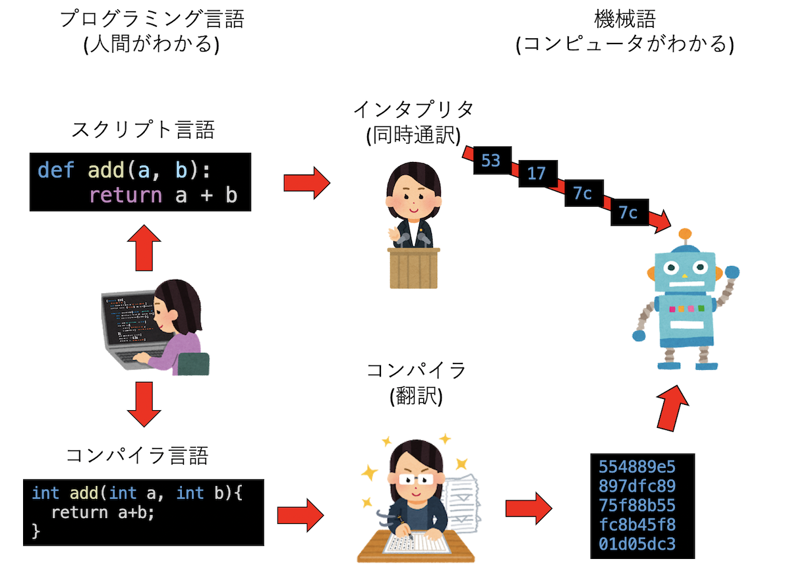
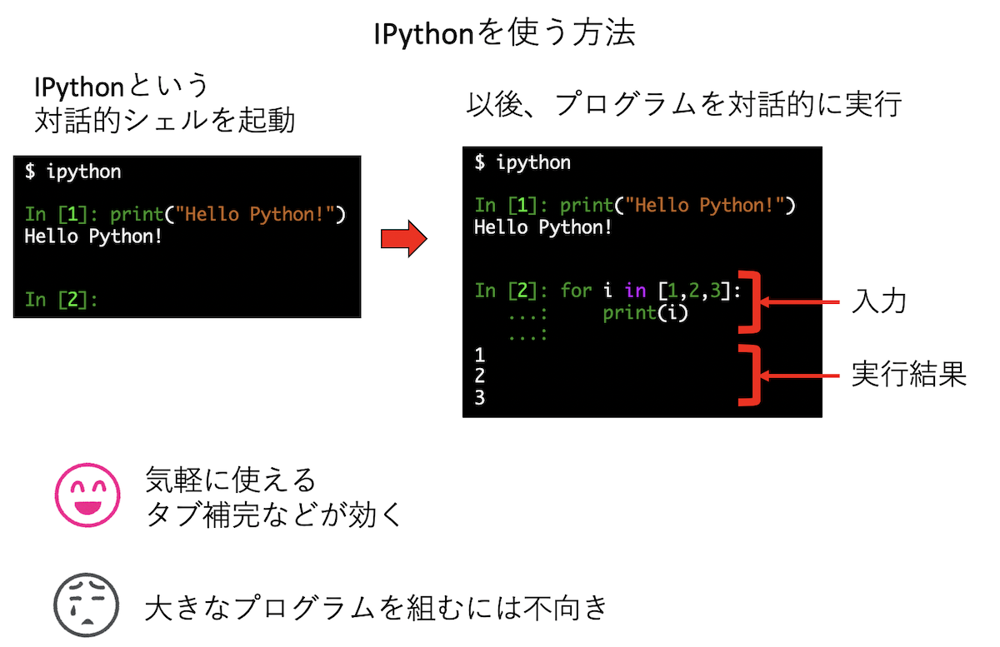
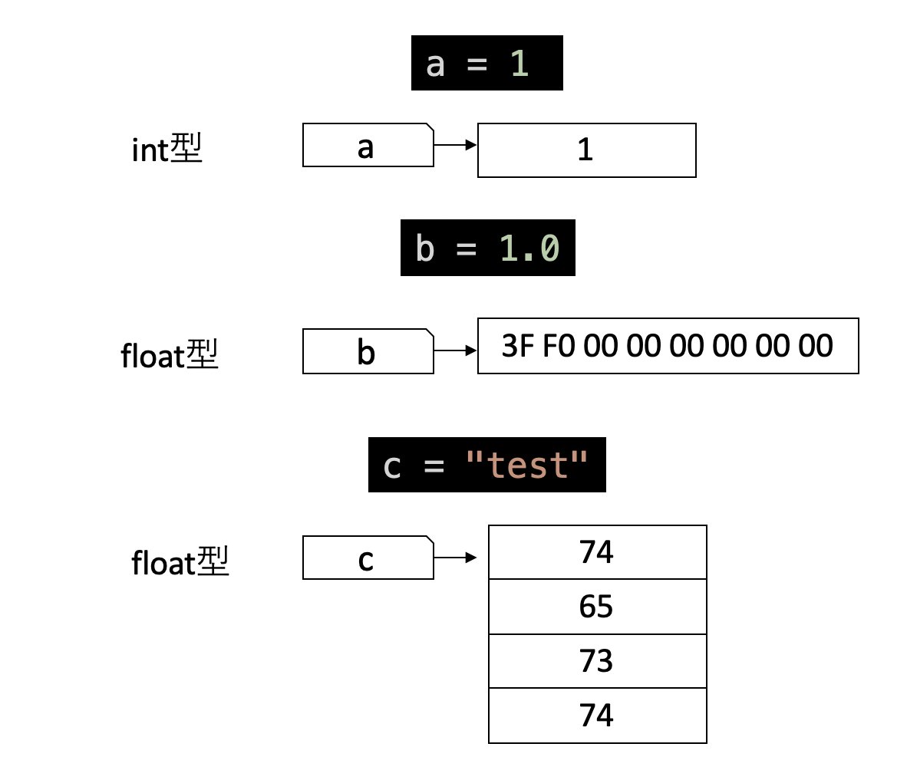
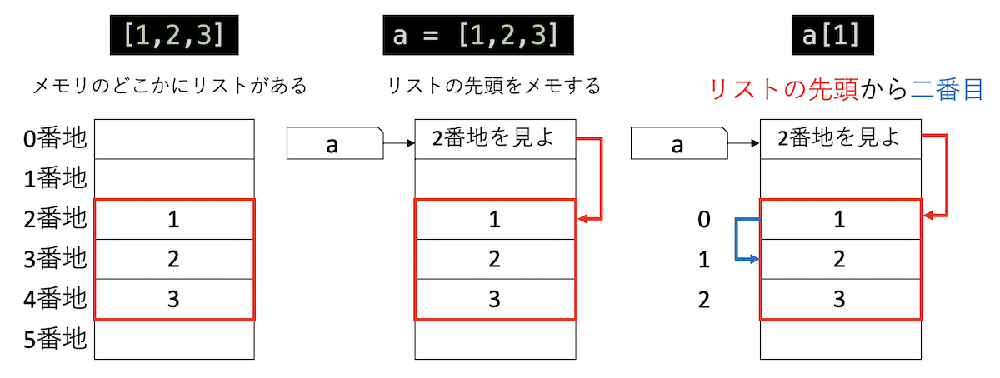
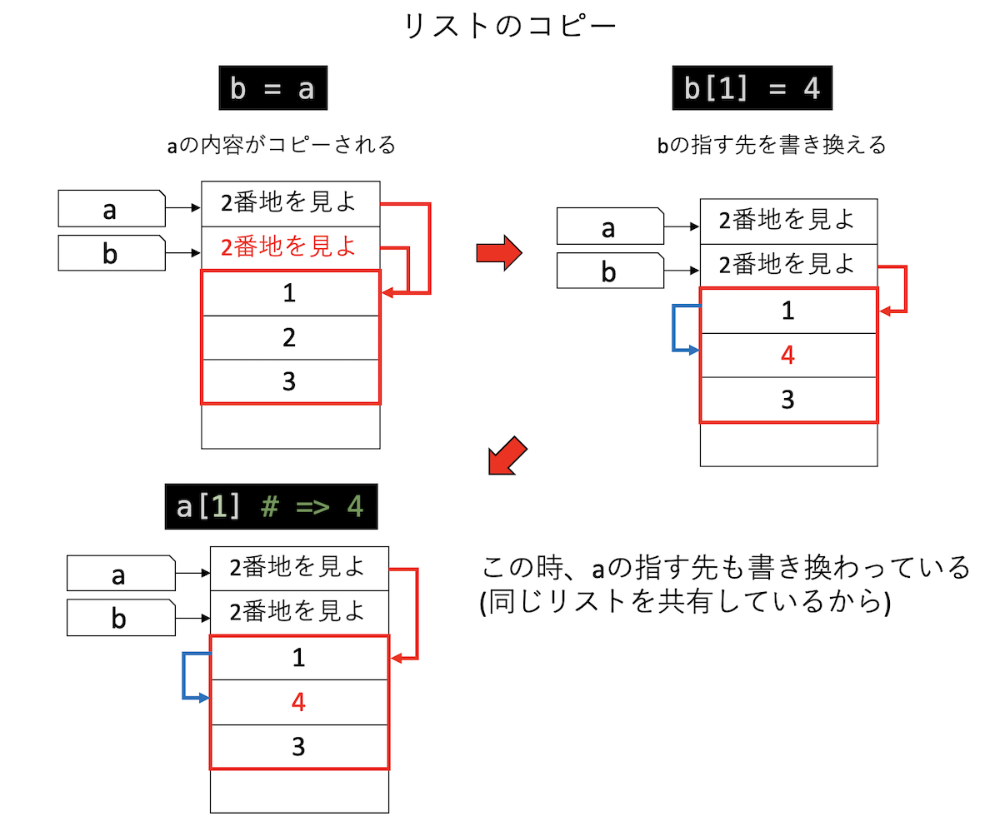

# Pythonとは

## 本稿の目的

* プログラミング言語とはなにかを学ぶ
* 変数と参照の概念について学ぶ

## プログラミング言語について

Pythonとはプログラミング言語の一つである。プログラミング言語とは、人間がコンピュータに指示をするための言葉であり、非常に多くの種類がある。その中でもPythonは、昨今の機械学習ブームもあり、非常に人気のある言語の一つとなっている。ここでは、プログラミング言語とは何か、それがなぜ必要か、実際にプログラミング言語がどのように実行されているのか見てみよう。

コンピュータは「機械語(マシン語)」という言葉しか解さない。機械語は数字の羅列であり、昔はそれを人間が手で書いていたのだが、それは大変なので「もう少し人間からわかりやすい言葉から機械語に翻訳しよう」という試みが生まれた。これがプログラミング言語である。

この時、人間の書いたプログラムをその都度翻訳しながらコンピュータに教えるインタプリタ方式と、機械語に全て翻訳してから一気にコンピュータにわたすコンパイル方式があり、前者を「スクリプト言語」後者を「コンパイラ言語」と呼ぶ。



## 余談：スクリプト言語とコンパイラ言語

ここでは「スクリプト言語」と「コンパイラ言語」について分けて紹介したが、実際にはその区別は絶対ではない。現在、ほとんどのスクリプト言語は一度「中間コード」と呼ばれる言語に「コンパイル」され、中間コードを仮想マシン上で動かすことで動作の高速化を図っている。また、Javaはプログラムをコンパイルしてから実行する形式のためにユーザからは「コンパイル言語」のように見えるが、実際にはPythonと同様にプログラムを中間コードに変換し、それを「Java 仮想マシン (JVM)」上で動作させている。Java仮想マシンは中間コードを実行する際に、インタプリタのように実行する場合と、部分的に機械語に変換しながら実行する場合(JIT方式と呼ばれる)がある。さらに、Javaのプログラムをそのまま機械語に変換する処理系もある。

また、C言語やC++言語は通常「コンパイラ言語」に分類され、GCCなどの処理系ではプログラムはそのまま機械語に変換されるが、clangやclang++は一度プログラムをLLVM IRという中間コードに変換し、それを機械語に変換している。

スクリプト言語とコンパイラ言語に限らず、「プログラミング言語の分類」は極めて難しく、「関数型言語」「手続き型言語」の厳密な区別しようとしたり、「ある言語はオブジェクト指向言語かどうか」、もっと言えば「オブジェクト指向らしさとは何か」などのテーマは議論が白熱するわりに得るものが少ないので、雑談程度にとどめておいたほうが良いと思う。ただし、「自分が考える素敵な○○指向言語」を突き詰めて、「オレオレ言語」まで作ってしまうのは素晴らしいことなのでどんどんやれば良い。言語を自作しなくても、既存の言語処理系を作るのも面白そうである(筆者はまだやったことはないが)。有名なのはRui Ueyamaさんの[低レイヤを知りたい人のための
Cコンパイラ作成入門](https://www.sigbus.info/compilerbook/)などであろう。また、Lispの処理系自作もよく見かける。あくまで個人的な意見だが、プログラマは結局のところ「作ったもの」が全てだと思うので、議論に熱を上げるより手を動かしてほしい。

## ライブラリについて

さて、スクリプト言語は同時通訳で、コンパイラ言語は事前翻訳である。なんとなく同時通訳で情報を処理するより、事前に全て翻訳しておいた方が実行が早そうな気がするであろう。スクリプト言語よりもコンパイラ言語の方が「同時通訳」というオーバーヘッドがなく、さらにコードの最適化に時間をかけられることもあって、「一般論としては」同じことをするならコンパイラ言語の方が早い。しかし、現実はさほど単純ではない。

通常、スクリプト言語は、豊富なライブラリを持つ。ライブラリとは、よく使う機能をパッケージ化したものだ。ライブラリは、その言語そのもので書かれたものもあるが、時間がかかる処理についてはCやFortranなどの言語で記述され、事前にコンパイルされている。特に数値計算ライブラリは高度に最適化されていることが多く、よほどのことがなければ自分でCやFortranで書くより、Pythonからライブラリを呼び出した方が高速に実行できる。また、速度が不要である場合でも、Pythonからライブラリを呼び出して書いた方が、Cなどのコンパイラ言語で書くより早く開発できることが多い。

よくプログラミング言語の優劣について聞かれるのだが、個人的な印象でいえば文法などはあまり重要でないと感じる。極論すれば、言語の優劣はライブラリの豊富さで決まる。Pythonには強力なライブラリが豊富にある。ある目的のために複数のライブラリを束ねたものをフレームワークと呼ぶ。Pythonには機械学習のフレームワークが多数存在し、機械学習を行うプログラミング言語のデファクトスタンダードとなっている。

いずれにせよ、「とりあえずPythonを使って何かしたい」場合、Pythonの細かい文法を気にするより「当面はライブラリの使い方を学ぶ」と割り切った方が生産的だと思う。

## Pythonのインストール

Pythonには最初からよくつかうライブラリが同封されており、標準ライブラリと呼ばれている。しかし、多くの場合は標準に含まれていないライブラリを使いたくなるであろう。その時、ライブラリを管理するツールがパッケージマネージャである。歴史的な事情で、Pythonには多数のパッケージマネージャが乱立している。実はもうベストプラクティスがあるのかもしれないが、筆者はそれを知らない。ただし、これまでプログラムをあまり組んだことがなく、かつWindowsにPython環境をインストールするならAnacondaが良いと思われる。以下、Anacondaのインストールの仕方を説明しておく。

TODO: Anacondaのインストール方法

## Pythonの実行方法

Pythonにはいくつかの実行方法がある。ここではPythonを使う方法、IPythonを使う方法、Jupyter Notebookを使う方法を紹介する。

### Pythonを使う方法


プログラムをファイルに保存し、それをPythonに渡して実行する方法である。別途エディタでプログラムを編集、保存し、コマンドラインでPythonを実行する。

```sh
$ python test.py
Hello Python!
```

スクリプト言語の基本的な使い方であり、Vim、Emacs、VS Codeなど、多くのエディタがPythonに対応しているため、そのような強力なエディタを使っていれば快適な開発環境が得られる。Pycharmという、Python専用のIDE(統合開発環境)もあるので、好きなものを使ってほしい。

LinuxやMacのように標準でコマンドラインが使いやすい環境なら良いが、コマンドラインが貧弱なWindowsではやや厳しいものがある(最近ではWSLやPowerShellなどもあるが・・・)。エディタや開発環境によってはコマンドラインを開かずに実行できる場合もあるが、その場合でも一度はコマンドラインで実行し、何が起きているかわかってからコマンドラインを使わない実行に移った方が良いと思う。

### IPythonを使う方法



IPythonとはPythonの対話的シェルである。コマンドから`ipython`と実行すると入力待ちになり、そこで対話的にプログラムを入力、実行ができる。タブ補完が効いたり、コードの色がついて見やすくなったりするため、ちょっとしたプログラムを試したりするのに便利である。エディタや統合環境を使ったり、Jupyter Notebookを使う場合でも、この方法を覚えておいて損はない。

### Jupyter Notebookを使う方法


コマンドラインから`jupyter notebook`を入力するか、WindowsでAnacondaを使っているなら「Anaconda Navigator」で「Jupyter notebook」の「Launch」を押すと、Jupyter Notebookが起動する。

こちらはプログラムだけではなく、画像やノートも貼り付けることができ、「プログラムを埋め込むことができる実験ノート」として使える。ノートは保存し、後で開くことも、プログラムを編集して再度実行することもできる。プログラムのタブ補完も効く。Google Colabolatoryも、ブラウザからJupyter Notebookが使えるサービスである。

初めてPythonを触るならばJupyter Notebookを使うのが良いと思う。ただし、例えばセル間でグローバル変数を共有したり、「セルの並び順」ではなく「セルを実行した順」にプログラムが実行されるため、書き方が悪いと混乱しやすいかもしれない。とりあえずJupyter Notebookを使いつつ、エディタによる開発に移行するか、併用するのが良いと思う。

## Pythonの基本文法

### 変数について

Pythonに限らず、プログラミング言語には「変数(Variable)」という概念が出てくる。変数は簡単なように見えて、意外に理解が難しい概念である。例え話を多用するととっつきやすが、後で混乱するもとなので、ここでは変数の実装に近いところから説明する。ただし、簡略化してあり、実装そのものではないので注意して欲しい。

計算機とは、メモリにあるデータをCPUで処理して、またメモリに書き戻す機械である。メモリには「番地」という通し番号がついており、例えば足し算なら「0番地と1番地のデータを読み込んで足してから2番地に書き込め」といったことを指示する。しかし、いちいちどの値がどこにあるか番地で覚えるのは面倒だ。そこで変数というラベルを使うことにする。

以下のプログラムを見てみよう。

```py
a = 10
```

これは、`a`という変数を用意し、そこに`10`という値を代入せよ、という意味だ。実際には、メモリ上に`a`というラベルを貼り、そこに`10`を書き込む、という処理をする。同様に`b = 20`とすると、`b`というラベルが作られ、そこに`20`が書き込まれる。

```py
a = 10
b = 20
```

`print`という命令を使うと、その値を確認することができる。

```py
print(a) # => 10
```

今後、`# =>`という記号は、「左を実行すると、右の結果が得られるよ」という意味だと約束する。

また、Jupyter Notebookでは、変数名だけを含む、もしくはセルの最後に変数名だけを含むセルを実行すると、その値を確認することができる。

```py
a #=> 10
```

さて、この状態で`c = a + b`を実行してみよう。まず、右の`a+b`が評価される。その結果得られた値`30`を`c`の指す場所に書きこもうとするが、まだ`c`という変数は作られていないので、まず`c`の場所が作られてからそこに値が書き込まれる。

同様に、`a = a + b`を実行した場合、`a`の場所はすでに存在するので、その値が更新される。


このようにPythonでは、代入文があった時、その左辺にある変数が未定義なら作成され、定義済みなら値を更新するので覚えておこう。

### 変数の型について

変数とは、メモリにつけられた「ラベル」である。メモリには整数しか保存できないが、プログラムでは小数点を含む数や文字列なども表現したい。そこで、「このメモリの値をどう解釈するか」を指定する必要がでてくる。これが「型(Type)」である。全ての変数には型がある。



例えば、`1`が代入された変数は「整数」の型を持っている。変数の型は`type`という命令で知ることができる。

```py
a = 1
type(a) # => int
```

小数点を含む数字は浮動小数点数(float型)になる。

```py
b = 1.0
type(b) # => float
```

ダブルクォーテーション`" "`やシングルクォーテーションマーク`' '`で囲まれた文字は「文字列」として扱われる。

```py
c = "test"
type(c) # => str
```

例えば文字列の場合、メモリに`0x74`という数値があった場合、それをアルファベット小文字の`t`と解釈しましょう、という約束を決めておく。変数`c`の`str`という型は、`c`が指す先のメモリを「文字列として解釈する」という意味を持つ。すると、今`c`が指している「0x74 65 73 74」という数値列が`test`という文字列として解釈される。

同様に、例えば「1.0」という浮動小数点数は、メモリ上では「0x3FF0000000000000」という8バイトの数字で表現されている。これをある約束(IEEE754という規格)に従って解釈すると「1.0」という数値となる。

同じ型同士の演算は原則としてその型になる。

```py
type(1+2) # => int
type(1.0+2.0) # => float
```

整数型と浮動小数点数型の演算結果は浮動小数点数型になる。

```py
print(1+1.0) # => 2.0
type(1+1.0) # => float
```

Pythonでは、整数の割り算だけ注意を要する。Pythonでは、整数同士の割り算で、たとえ割り切れる場合でも、値は浮動小数点数になる。

```py
4 / 2 # => 2.0
```

割り算のあまりを切り捨てた整数値が欲しければ`//`と、`/`記号を二つ続けた演算子を用いる。

```py
5/2 # => 2
```

文字列同士は足し算ができる。

```py
"Hello " + "World!" # => "Hello World!"
```

文字列と数値の演算はできない。

```py
"1" + 2  # => Type Error
```

`int`や`float`で囲むと文字列から整数や浮動小数点数に変換できるので、演算も可能になる。

```py
int("1") # => 1
int("1") + 2 # => 3
float("1") + 2 # => 3.0
```

### 基本のデータ構造

プログラムをする際、複数の値をまとめて扱いたいときがある。Pythonには、複数の値をまとめて扱うのに便利な型として、リスト(list)、タプル(tuple)、辞書(dict)という三つを用意している。ここではまずリスト型だけ説明する。

複数の変数や値をカンマ`,`で区切り、前後を`[`と`]`で囲むとリストになる。

```py
a = [1,2,3]
type(a) # => list
```

リストに含まれるものを**要素**と呼ぶ。

リストにはどんなものでも入れることができる。例えば、変数や文字列、異なる型の値、別のリストも入れることができる。

```py
[1, 1.0, "test"] # 異なる型が混じったリスト
[1, a, b] # 変数を入れたリスト
[1, [2,3],[4,5]] # 要素としてリストを含むリスト
```

要素にインデックスと呼ばれる通し番号がついており、`[要素番号]`によりアクセスできる。要素番号は0はじまりなので、一番目の要素の要素番号が0、二番目が1になることに注意。

```py
a = [1,2,3]
a[1] # => 2
```

また、インデックスアクセスによりリストの値を書き換えることもできる。

```py
a[1] = 4
a # => [1, 4, 3]
```

さて、ここでリストの実現方法を見ておこう。リストはメモリに要素を並べた状態で保存されている(実際はちょっと違うが、説明のため簡略化している)。変数にリストを代入すると、変数はリストの先頭を指すラベルとなる。`a[1]`などのインデックスによるアクセスは「`a`が指すリストの先頭から2番目の要素を返せ」という指示になる。



リストがメモリ上にどう表現されているかは、通常は意識しなくて良いが、リストのコピーをする時には注意が必要だ。`b = a`という代入文は、「`a`の値を`b`にコピーしなさい」という意味となる。ただし、`a`がリストである時、`a`が保持するのはリストの先頭の場所であるので、`b`にも同じ場所がコピーされる。したがって、その後`b`を通じてリストを修正すると`a`の指す先も修正される(同じリストを共有しているため)。

```py
a = [1,2,3]
b = a
b[1] = 4
a[1] #=> 4
```



「変数の指す先がコピーされる」とおぼえておくと、整数をコピーした時に、コピー先を修正してもコピー元が影響を受けないのは理解しやすいであろう。

```py
a = 10
b = a
b = 20
a # => 10
```

